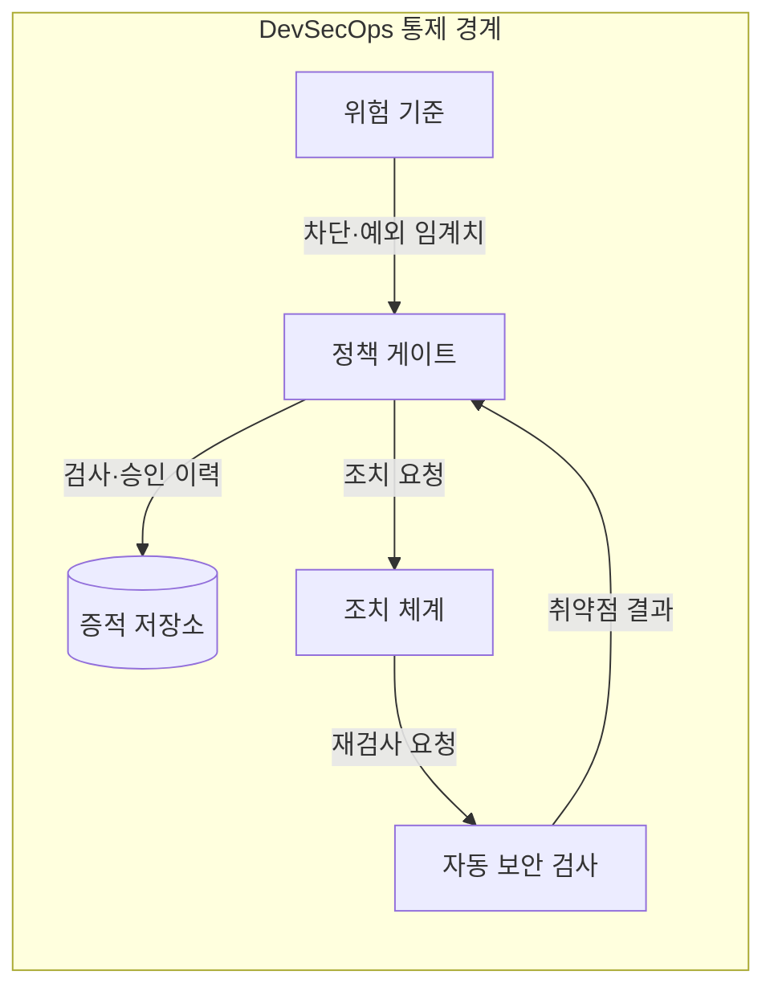
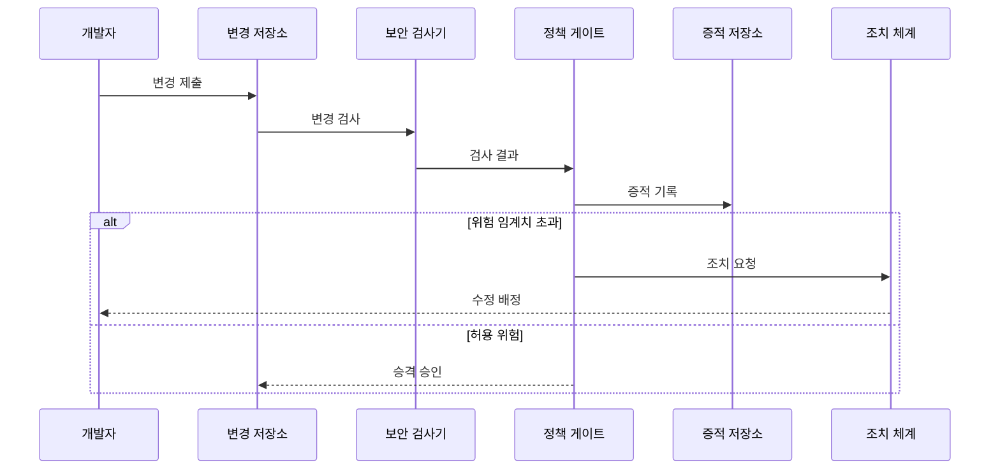

---
sidebar:
  order: 57
  label: "057. DevSecOps"
  badge:
    text: "기출 · 70%"
    variant: note
title: "DevSecOps"
date: "2026-07-25T00:35:00+09:00"
tags:
  - "notes-software"
weight: 57
extra:
  question_no: "057"
  source_status: "기출"
  source_history: "128회, 134회, 135회"
  priority: 70
  priority_note: "128·134·135회 반복, 보안 내재화 핵심"
---

## 미리 알고가기

- **개발·보안·운영(Development, Security, and Operations, DevSecOps)**: ‘데브섹옵스’로 읽고 Development·Security·Operations를 결합한 관례 명칭이며 세 역할이 소프트웨어 수명주기의 보안 책임과 통제를 공동 운영하는 방식
- **쉬프트 레프트(Shift Left)**: ‘쉬프트 레프트’로 읽고 생명주기 도표의 앞 단계를 왼쪽에 두는 관례에서 나온 표현이며 설계·코딩 단계에서 보안 결함을 찾아 수정 범위를 줄이는 접근
- **정적 애플리케이션 보안 테스트(Static Application Security Testing, SAST)**: ‘새스트’로 읽고 영문 머리글자를 딴 표기이며 프로그램 실행 없이 소스의 취약한 데이터 흐름·규칙 위반 탐지
- **소프트웨어 구성 분석(Software Composition Analysis, SCA)**: ‘에스시에이’로 읽고 영문 머리글자를 딴 표기이며 외부 구성요소의 버전·취약점·라이선스 의무 식별
- **동적 애플리케이션 보안 테스트(Dynamic Application Security Testing, DAST)**: ‘대스트’로 읽고 영문 머리글자를 딴 표기이며 실행 중인 시스템에 외부 요청을 보내 취약 동작 탐지
- **정책 게이트(Policy Gate)**: 취약점 위험과 예외 기준으로 변경의 진행·차단·승인을 판정하는 통제 지점
- **소프트웨어 자재 명세서(Software Bill of Materials, SBOM)**: ‘에스봄’으로 읽고 Software Bill of Materials의 머리글자를 딴 표기이며 배포 산출물의 구성요소·버전·공급자를 기록
- **비밀값 검사(Secret Scanning)**: 소스·설정에 잘못 포함된 비밀번호·키·토큰을 찾아 자격 증명 노출을 방지하는 자동 검사
- **취약점·영향·악용 가능성(Vulnerability·Impact·Exploitability)**: 취약점은 보안 약점, 영향은 성공한 공격의 피해, 악용 가능성은 공격자가 실제 이용할 수 있는 정도로서 정책 게이트의 위험 판정 입력
- **오탐(False Positive)**: 실제 취약점이 아닌 항목을 검사기가 위험으로 잘못 보고해 불필요한 차단과 게이트 우회를 유발하는 결과
- **증적 저장소(Evidence Repository)**: 산출물 버전·SBOM·검사 결과·승인·예외 이력을 연결해 감사와 재검증 근거를 보관하는 저장소
- **조치 기한·예외 만료(Remediation Deadline·Exception Expiry)**: 조치 기한은 취약점을 수정할 시점이고 예외 만료는 임시 허용이 끝나는 날짜로서 위험 수용이 무기한 유지되지 않게 함
- **후행 독립 보안 점검(Independent Post-development Security Review)**: 완성된 시스템의 업무·공격 맥락을 보안 전문가가 별도로 분석해 자동 규칙이 놓친 연계 공격을 찾는 점검
- **과도한 권한(Excessive Privilege)**: 클라우드 주체나 자원이 업무에 필요한 범위를 넘는 접근 권한을 보유해 침해 시 피해 범위를 키우는 상태

## Ⅰ. 개요

- **정의/개념**: 개발 수명주기에 보안 검사·정책을 내재화
- **배경/필요성**: 후행 보안 발견이 수정을 늘려 조기 검사 필요

### 쉽게 이해하기 (학습용)

- 완성품만 검사하지 않고 설계·조립·출고 단계마다 맞는 안전 검사를 수행한다

## Ⅱ. 특징

- 보안 요구·위협을 개발 작업·검증 조건에 연결한다.
- 반복 가능한 정적·동적 보안 검사를 자동화한다.
- 검사·승인 이력을 산출물 보안 증적으로 보존한다.
- 위험별 조치 기한·예외 책임으로 게이트 우회 억제한다.

### 쉽게 이해하기 (학습용)

- 모든 경고를 똑같이 차단하지 않고 실제 위험에 따라 수리 기한이나 책임 있는 예외를 정한다

## Ⅲ. 아키텍처 및 구성요소

| 설계 요소 | 설명 |
|:---|:---|
| 위험 기준 | 차단 임계치·예외 책임·만료 조건 |
| 자동 보안 검사 | 코드·의존성·비밀값·실행 동작 분석 |
| 정책 게이트 | 실제 위험으로 진행·차단·예외 판정 |
| 증적 저장소 | 산출물·SBOM·검사·승인 이력 연결 |
| 조치 체계 | 소유자·우선순위·기한·재검사 관리 |

> 요약: 위험 기준이 검사·게이트·조치·증적 연결

### 쉽게 이해하기 (학습용)

- 검사 결과를 위험 기준표로 판정하고 수리 담당·기한과 승인 기록을 같은 제품 번호에 연결한다

## Ⅳ. 원리 및 절차 흐름도

| 절차 | 설명 |
|:---|:---|
| 변경 제출 | 코드·의존성·설정 변경을 저장소에 반영 |
| 변경 검사 | SAST·SCA·비밀값 검사를 실행 |
| 검사 결과 | 취약점·영향·악용 가능성을 전달 |
| 증적 기록 | 산출물 버전에 검사·승인 이력 연결 |
| 조치 요청 | 임계치 초과 취약점의 진행 차단 |
| 수정 배정 | 소유자와 조치 기한을 지정 |
| 승격 승인 | 허용 위험이면 다음 단계 진행 허용 |

> 요약: 검사 결과를 증적화하고 위험으로 승격 판정

### 쉽게 이해하기 (학습용)

- 변경을 검사해 위험하면 담당자에게 수리를 맡기고 허용할 때만 다음 단계로 보낸다

## Ⅴ. 종류 및 비교

| 판단 기준 | DevSecOps 자동 통제 | 후행 독립 보안 점검 |
|:---|:---|:---|
| 핵심 특징 | 변경마다 자동 보안 검사·위험 게이트 | 완성 시스템의 독립 보안 점검 |
| 적용 기준 | 코드·의존성·설정의 반복 검사 | 자동화 어려운 맥락 기반 검증 |
| 주요 위험 | 오탐·게이트 우회 | 늦은 결함 발견·릴리스 지연 |

> 요약: 반복 규칙은 자동화하고 공격 맥락은 독립 점검

### 쉽게 이해하기 (학습용)

- 기계는 반복 규칙을 계속 검사하고 전문가는 규칙만으로 찾기 어려운 공격 연결을 확인한다

## Ⅵ. 실무 사례

1. 빌드 산출물은 SBOM 취약점 임계치 초과 시 차단
2. 클라우드 배포는 과도한 권한을 차단하고 예외 만료일 기록

### 쉽게 이해하기 (학습용)

- 제품 부품표에서 위험한 버전이 발견되면 안전한 버전으로 바꿀 때까지 출고를 멈춘다
- 클라우드 설정에 필요 이상의 권한이 있으면 차단하고 불가피한 예외도 종료 날짜를 남긴다

## Ⅶ. 결론

- 반복 통제는 위험 기반 게이트, 공격 연계는 독립 점검

### 쉽게 이해하기 (학습용)

- 반복 경고는 위험 기준으로 자동 처리하고 공격 흐름의 연결은 전문가가 따로 확인한다
