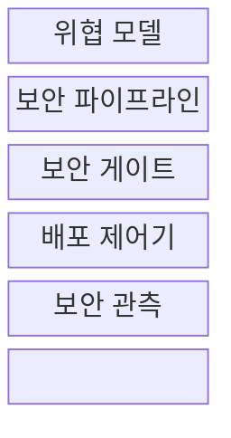
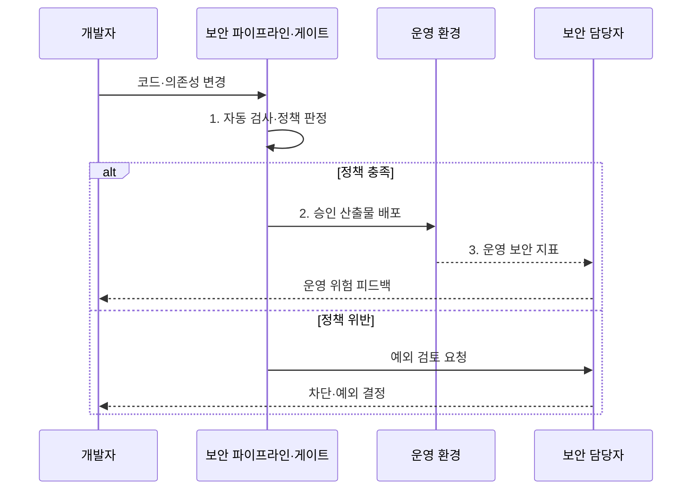

---
sidebar:
  order: 57
  label: "057. DevSecOps"
  badge:
    text: "기출 · 70%"
    variant: note
title: "DevSecOps"
date: "2026-08-02T23:07:00+09:00"
tags:
  - "notes-software"
weight: 57
extra:
  question_no: "057"
  source_status: "기출"
  source_history: "128회, 134회, 135회"
  priority: 70
  priority_note: "128·134·135회 반복, 보안 내재화 핵심"
---

## Ⅰ. 개요

핵심 용어

- **개발·보안·운영(Development, Security and Operations, DevSecOps)**: 개발 수명주기 전반에 보안을 공동 책임과 자동화된 통제로 내재화하는 방식이다.
- **보안 내재화(Security by Design)**: 보안을 별도 사후 점검이 아니라 설계와 구현의 기본 조건으로 포함하는 원칙이다.

- 정의/개념: 개발·운영 흐름에 보안 책임과 자동 검증을 내재화하는 **보안 통합 운영 방식**
- 배경/필요성: 출시 직전 점검의 **취약점 발견·수정 지연** 해소

#### 한줄 요약

- 완성품만 마지막에 검사하지 않고 설계와 제작 단계마다 보안 검사를 끼워 넣는 방식이다.

## Ⅱ. 특징

핵심 용어

- **시프트 레프트(Shift Left)**: 보안 검증을 개발 수명주기의 앞단인 설계·코딩 단계로 이동하는 전략이다.
- **정책 코드화(Policy as Code)**: 보안·규정 준수 기준을 실행 가능한 코드로 선언하고 자동 판정하는 방식이다.
- **감사 추적(Audit Trail)**: 어떤 정책·검사 결과·승인으로 변경이 진행되었는지 단계별로 연결한 기록이다.
- **공동 책임(Shared Responsibility)**: 개발·보안·운영이 제품 위험의 발견·처리·운영 결과를 함께 소유하는 원칙이다.

- 설계·코딩 단계로 검증을 옮기는 **시프트 레프트**
- 정책 코드화의 **자동 차단·감사 추적**
- 개발·보안·운영의 **공동 책임**

#### 한줄 요약

- 문제를 만든 직후 자동으로 알려 주고, 정해진 보안 기준을 통과한 변경만 다음 단계로 보낸다.

## Ⅲ. 구조 및 구성요소

핵심 용어

- **위협 모델링(Threat Modeling)**: 자산·공격 경로·위협·대응책을 설계 단계에서 식별하는 활동이다.
- **보안 게이트(Security Gate)**: 자동 검사 결과와 정책을 근거로 배포 진행·차단·예외를 판정하는 통제 지점이다.
- **비밀정보 검사(Secret Scanning)**: 소스와 이력에 포함된 비밀번호·토큰·개인키를 탐지하는 검사이다.
- **보안 파이프라인·보안 관측**: 파이프라인은 소스·의존성·비밀을 자동 검사하고, 보안 관측은 운영 취약 행위와 공격 징후를 수집한다.

| 구성요소 | 책임 |
|:---|:---|
| 위협 모델 | **자산·공격 경로** 와 보안 요구 도출 |
| 보안 파이프라인 | **소스·의존성** 과 비밀정보 검사 |
| 보안 게이트 | **위험도 차단·예외 승인** 판정 |
| 배포 제어기 | **승인 산출물** 의 운영 반영 |
| 보안 관측 | **실행 취약점·운영 위험** 을 개발에 환류 |

#### 한줄 요약

- 위험 지도, 자동 검사선, 보안문, 배포 담당, 운영 감시로 구성된다.

## Ⅳ. 흐름도

핵심 용어

- **정적 애플리케이션 보안 테스트(Static Application Security Testing, SAST)**: 실행하지 않은 소스·바이트코드의 취약 패턴을 분석하는 테스트이다.
- **소프트웨어 구성 분석(Software Composition Analysis, SCA)**: 오픈소스 구성요소의 알려진 취약점과 라이선스를 식별하는 분석이다.

**동작 원리**

- **1. 자동 검사·정책 판정**: SAST·SCA·비밀정보 검사 결과를 보안 기준과 비교
- **2. 승인 산출물 배포**: 보안 기준 충족 버전을 운영에 반영
- **3. 운영 보안 지표**: 취약 행위·공격 징후 수집

> 요약: 자동 검사가 정책 위반을 배포 전에 차단하고 운영 위험을 개발에 환류

#### 한줄 요약

- 자동 검사가 위험을 찾으면 위치와 이유를 알려 작업을 멈추고, 기준을 통과한 제품만 운영으로 보낸다.

## Ⅴ. 종류 및 비교

핵심 용어

- **동적 애플리케이션 보안 테스트(Dynamic Application Security Testing, DAST)**: 실행 중인 애플리케이션의 외부 인터페이스를 공격 관점에서 검사한다.
- **대화형 애플리케이션 보안 테스트(Interactive Application Security Testing, IAST)**: 실행 중 내부 계측 정보와 테스트 입력을 결합해 취약점을 탐지한다.
- **소프트웨어 구성 분석(Software Composition Analysis, SCA)**: 패키지의 취약점·라이선스·출처를 분석한다.

| 보안 검사 방식 | SAST | DAST | SCA | IAST |
|:---|:---|:---|:---|:---|
| 적용 기준 | 개발 중 **소스 취약점 탐지** | 시험 중 **실행 취약점 검증** | 도입 전 **오픈소스 위험 확인** | 시험 중 **내부 실행 경로 추적** |
| 핵심 특징 | 코드 흐름의 **내부 분석** | 외부 요청의 **동적 공격 시험** | 패키지의 **취약점·라이선스 식별** | 계측 정보와 **테스트 입력 결합** |
| 한계 | 오탐·**실행 환경 미반영** | 코드 위치·**원인 추적 한계** | 자체 코드·**실행 경로 미판별** | 계측의 **성능 부하·환경 의존** |

> 요약: 소스·실행·구성요소의 서로 다른 보안 근거를 결합

#### 한줄 요약

- SAST는 설계도를, DAST는 작동 중인 제품을, SCA는 사용한 부품 목록을 검사한다.

## Ⅵ. 실무 고려사항 및 대책

핵심 용어

- **오탐(False Positive)**: 실제 취약점이 아닌 대상을 검사 도구가 위험으로 잘못 판정한 결과이다.
- **예외 만료(Exception Expiration)**: 일시 허용한 보안 위험을 정해진 날짜에 다시 검토하거나 차단하는 통제이다.
- **소프트웨어 자재 명세서(Software Bill of Materials, SBOM)**: 소프트웨어를 구성하는 패키지·버전·의존성 목록이다.
- **위험별 검사·증분 분석**: 변경한 코드·의존성과 위험 등급에 맞는 검사를 선택해 전체 재검사 비용을 줄이는 방식이다.
- **오탐 기준선(False-positive Baseline)**: 검토를 거쳐 오탐으로 확정한 결과를 반복 경보에서 제외하되 변경 시 재평가하는 기록이다.
- **공통 위험 식별자·소유자**: 여러 보안 도구의 같은 위험을 하나로 연결하는 값과 처리 책임자이다.
- **보완 통제·잔존 위험(Compensating Control·Residual Risk)**: 직접 수정 전 위험을 줄이는 대체 통제와 적용 후에도 남아 있는 위험이다.
- **서명 검증·신뢰 저장소**: 패키지·이미지의 출처와 무결성을 확인하고 승인한 구성요소만 제공하는 공급망 통제이다.
- **런타임 위험(Runtime Risk)**: 실제 운영 환경의 구성·호출·공격 조건에서 드러나는 취약성과 영향이다.

| 문제 | 대책 | 효과 |
|:---|:---|:---|
| 모든 변경에 전체 검사를 적용해 병합이 지연됨 | **위험별 검사·증분 분석** 과 오탐 기준선 | **보안 검사 우회·병합 지연** 감소 |
| 보안 도구별 결과와 담당자가 분리됨 | **공통 위험 식별자·소유자** 로 추적 통합 | **책임·처리 상태** 명확화 |
| 승인한 보안 예외가 만료 없이 유지됨 | **보완 통제·예외 만료** 와 책임자 지정 | **잔존 위험** 회수 |
| 외부 패키지의 구성과 출처를 알 수 없음 | **SBOM·서명 검증** 과 신뢰 저장소 | **공급망 위변조** 방지 |
| 운영 경보가 원인 코드와 담당자에 연결되지 않음 | 경보를 **소스 변경·소유자** 와 연결 | **런타임 위험** 개선 |

#### 한줄 요약

- 코드에 위험한 명령이나 키가 있으면 합치지 않고, 배포 이미지의 모든 부품과 출처도 확인한다.

## Ⅶ. 결론

핵심 용어

- **조기 차단(Early Prevention)**: 소스와 의존성의 위험을 배포 이전 단계에서 탐지해 진행을 막는 통제이다.
- **런타임 검증(Runtime Validation)**: 실제 실행 환경에서 외부 공격과 내부 실행 경로의 취약성을 확인하는 활동이다.

- 변경 위험은 **SAST·SCA** 로 조기 차단하고 운영 노출은 **DAST·IAST** 로 검증

#### 한줄 요약

- 만들 때의 검사와 작동할 때의 검사를 함께 써야 개발부터 운영까지 보안 공백을 줄일 수 있다.
