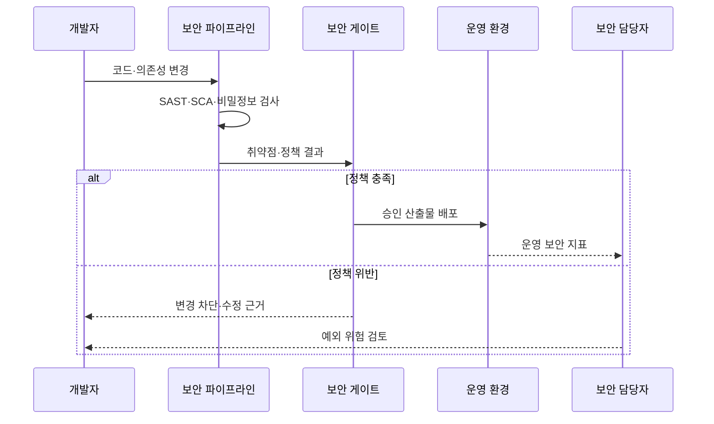

---
sidebar:
  order: 57
  label: "057. DevSecOps"
  badge:
    text: "기출 · 70%"
    variant: note
title: "DevSecOps"
date: "2026-07-27T23:59:59+09:00"
tags:
  - "notes-software"
weight: 57
extra:
  question_no: "057"
  source_status: "기출"
  source_history: "128회, 134회, 135회"
  priority: 70
  priority_note: "128·134·135회 반복, 보안 내재화 핵심"
---

## 미리 알고가기

- **개발·보안·운영(Development, Security and Operations, DevSecOps)**: ‘데브섹옵스’로 읽고 세 영역의 영문 명칭을 결합한 표기이며, 개발 수명주기 전반에 보안을 공동 책임으로 내재화함
- **시프트 레프트(Shift Left)**: 보안 검증을 개발 수명주기의 앞단인 설계·코딩 단계로 이동하는 전략
- **정적 애플리케이션 보안 테스트(Static Application Security Testing, SAST)**: ‘새스트’로 읽고 영문 머리글자를 딴 약어이며, 실행하지 않은 소스·바이트코드의 취약 패턴을 분석함
- **동적 애플리케이션 보안 테스트(Dynamic Application Security Testing, DAST)**: ‘대스트’로 읽고 영문 머리글자를 딴 약어이며, 실행 중인 애플리케이션의 외부 인터페이스를 공격 관점에서 검사함
- **소프트웨어 구성 분석(Software Composition Analysis, SCA)**: ‘에스시에이’로 읽고 영문 머리글자를 딴 약어이며, 오픈소스 구성요소의 취약점·라이선스를 식별함
- **소프트웨어 자재 명세서(Software Bill of Materials, SBOM)**: ‘에스봄’으로 읽고 영문 머리글자를 딴 약어이며, 소프트웨어를 구성하는 패키지·버전·의존성 목록을 제공함
- **대화형 애플리케이션 보안 테스트(Interactive Application Security Testing, IAST)**: ‘아이애스트’로 읽고 영문 머리글자를 딴 약어이며, 실행 중 내부 계측 정보와 테스트 입력을 결합해 취약점을 탐지함
- **비밀정보 검사(Secret Scanning)**: 소스·이력에 포함된 비밀번호·토큰·개인키를 탐지하는 검사
- **정책 코드화(Policy as Code)**: 보안·규정 준수 기준을 기계가 실행할 수 있는 코드로 선언하고 자동 판정하는 방식
- **위협 모델링(Threat Modeling)**: 자산·공격 경로·위협·대응책을 설계 단계에서 식별하는 활동

## Ⅰ. 개요

- **정의/개념**: 개발·운영 흐름에 **보안 책임·자동 검증을 내재화**
- **기존 한계**: 출시 직전 보안 점검의 **취약점 발견·수정 지연**

### 쉽게 이해하기 (학습용)

- 완성품만 마지막에 검사하지 않고 설계와 제작 단계마다 보안 검사를 끼워 넣는 방식이다.

## Ⅱ. 특징

- 설계·코딩 단계의 **보안 조기 검증**
- 정책 코드화의 **자동 차단·감사 추적**
- 개발·보안·운영의 **공동 책임**

### 쉽게 이해하기 (학습용)

- 문제를 만든 직후 자동으로 알려 주고, 정해진 보안 기준을 통과한 변경만 다음 단계로 보낸다.

## Ⅲ. 아키텍처 및 구성요소

| 구성요소 | 책임 |
|:---|:---|
| 위협 모델 | 자산·공격 경로의 **보안 요구 도출** |
| 보안 파이프라인 | **소스·의존성·비밀정보 검사** |
| 보안 게이트 | 위험도 기반 **차단·예외 승인** |
| 배포 제어기 | 승인 산출물의 **운영 반영** |
| 보안 관측 | 실행 취약점의 **탐지·피드백** |

> 요약: 설계부터 운영까지 자동 보안 검증과 피드백 연결

### 쉽게 이해하기 (학습용)

- 설계 도면의 위험을 먼저 찾고 제작 중 자동 검사하며, 운영 중 발견한 공격 신호를 다시 개발 작업으로 돌려보낸다.

## Ⅳ. 원리 및 절차 흐름

| 절차 | 설명 |
|:---|:---|
| 코드·의존성 변경 | 보안 검사의 **입력 변경 제출** |
| 자동 보안 검사 | **취약 코드·구성요소·비밀정보** 탐지 |
| 정책 결과 제출 | 위험도와 **허용 기준 비교** |
| 승인 산출물 배포 | 통과 버전의 **운영 반영** |
| 변경 차단 | 위반 위치와 **수정 근거 제공** |
| 예외 위험 검토 | 불가피한 위험의 **승인·만료 관리** |

> 요약: 자동 검사가 정책 위반 변경을 배포 전에 차단

### 쉽게 이해하기 (학습용)

- 자동 검사가 위험을 찾으면 위치와 이유를 알려 작업을 멈추고, 기준을 통과한 제품만 운영으로 보낸다.

## Ⅴ. 종류 및 비교

| 보안 검사 방식 | SAST | DAST | SCA |
|:---|:---|:---|:---|
| 적용 기준 | 개발 중 **소스 취약점 탐지** | 시험 중 **실행 취약점 검증** | 도입 전 **오픈소스 위험 확인** |
| 핵심 특징 | 코드 흐름의 **내부 분석** | 외부 요청의 **동적 공격 시험** | 패키지의 **취약점·라이선스 식별** |
| 한계 | 오탐·**실행 환경 미반영** | 코드 위치·**원인 추적 한계** | 자체 코드·**실행 경로 미판별** |

> 요약: 소스·실행·구성요소의 서로 다른 보안 근거를 결합

### 쉽게 이해하기 (학습용)

- SAST는 설계도를, DAST는 작동 중인 제품을, SCA는 사용한 부품 목록을 검사한다.

## Ⅵ. 실무 사례

1. 병합 요청에서 **SAST·비밀정보 검사** 위반 시 병합 차단
2. 컨테이너 배포 전 **SCA·SBOM 서명**으로 공급망 검증

### 쉽게 이해하기 (학습용)

- 코드에 위험한 명령이나 키가 있으면 합치지 않고, 배포 이미지의 모든 부품과 출처도 확인한다.

## Ⅶ. 결론

- 조기 예방은 **SAST·SCA**, 실행 검증은 **DAST·관측**

### 쉽게 이해하기 (학습용)

- 만들 때의 검사와 작동할 때의 검사를 함께 써야 개발부터 운영까지 보안 공백을 줄일 수 있다.
