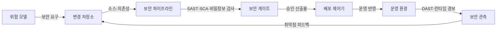
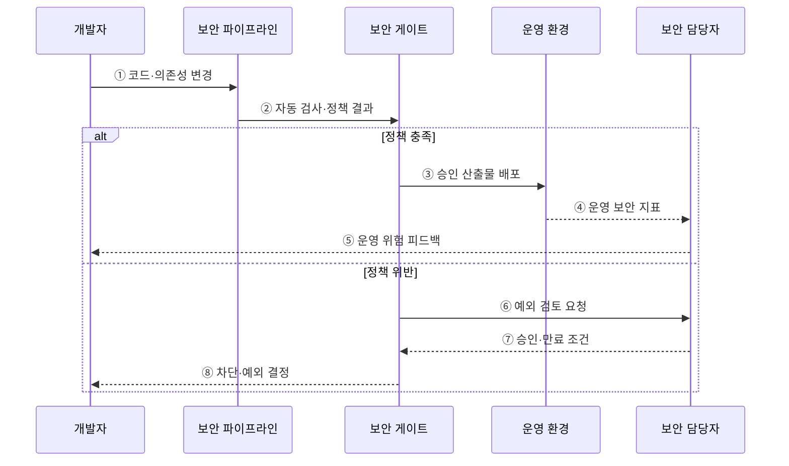

---
sidebar:
  order: 57
  label: "057. DevSecOps"
  badge:
    text: "기출 · 70%"
    variant: note
title: "DevSecOps"
date: "2026-07-27T23:59:59+09:00"
tags:
  - "notes-software"
weight: 57
extra:
  question_no: "057"
  source_status: "기출"
  source_history: "128회, 134회, 135회"
  priority: 70
  priority_note: "128·134·135회 반복, 보안 내재화 핵심"
---

## 미리 알고가기

- **개발·보안·운영(Development, Security and Operations, DevSecOps)**: 개발 수명주기 전반에 보안을 공동 책임과 자동화된 통제로 내재화하는 방식
- **시프트 레프트(Shift Left)**: 보안 검증을 개발 수명주기의 앞단인 설계·코딩 단계로 이동하는 전략
- **정적 애플리케이션 보안 테스트(Static Application Security Testing, SAST)**: 프로그램을 실행하지 않고 소스·바이트코드의 취약 패턴을 분석하는 테스트
- **동적 애플리케이션 보안 테스트(Dynamic Application Security Testing, DAST)**: 실행 중인 애플리케이션의 외부 인터페이스를 공격 관점에서 검사하는 테스트
- **소프트웨어 구성 분석(Software Composition Analysis, SCA)**: 오픈소스 구성요소의 알려진 취약점과 라이선스를 식별하는 분석
- **소프트웨어 자재 명세서(Software Bill of Materials, SBOM)**: 소프트웨어를 구성하는 패키지·버전·의존성 목록
- **대화형 애플리케이션 보안 테스트(Interactive Application Security Testing, IAST)**: 실행 중 내부 계측 정보와 테스트 입력을 결합해 취약점을 탐지하는 테스트
- **비밀정보 검사(Secret Scanning)**: 소스·이력에 포함된 비밀번호·토큰·개인키를 탐지하는 검사
- **정책 코드화(Policy as Code)**: 보안·규정 준수 기준을 기계가 실행할 수 있는 코드로 선언하고 자동 판정하는 방식
- **위협 모델링(Threat Modeling)**: 자산·공격 경로·위협·대응책을 설계 단계에서 식별하는 활동
- **오탐(False Positive)**: 실제 취약점이 아닌 대상을 검사 도구가 위험으로 잘못 판정한 결과
- **예외 만료(Exception Expiration)**: 일시적으로 허용한 보안 위험을 정해진 날짜에 다시 검토하거나 차단하는 통제

## Ⅰ. 개요

- 정의/개념: 개발·운영 흐름에 **보안 책임·자동 검증을 내재화**
- 기존 한계: 출시 직전 보안 점검의 **취약점 발견·수정 지연**

### 쉽게 이해하기 (학습용)

- 완성품만 마지막에 검사하지 않고 설계와 제작 단계마다 보안 검사를 끼워 넣는 방식이다.

## Ⅱ. 특징

- 설계·코딩 단계의 **보안 조기 검증**
- 정책 코드화의 **자동 차단·감사 추적**
- 개발·보안·운영의 **공동 책임**

### 쉽게 이해하기 (학습용)

- 문제를 만든 직후 자동으로 알려 주고, 정해진 보안 기준을 통과한 변경만 다음 단계로 보낸다.

## Ⅲ. 아키텍처 및 구성요소

**도표안 A — 구조도**

**도표안 B — sequenceDiagram**

| 구성요소 | 책임 |
|:---|:---|
| 위협 모델 | 자산·공격 경로의 보안 요구 도출 |
| 보안 파이프라인 | 소스·의존성·비밀정보 검사 |
| 보안 게이트 | 위험도 기반 차단·예외 승인 |
| 배포 제어기 | 승인 산출물의 운영 반영 |
| 보안 관측 | 실행 취약점의 탐지·피드백 |

**동작 원리**

- ① 개발자가 코드·의존성 변경을 보안 파이프라인에 제출한다.
- ② 파이프라인이 SAST·SCA·비밀정보 검사를 실행하고 정책 결과를 제출한다.
- ③ 기준을 충족하면 보안 게이트가 승인 산출물을 운영에 배포한다.
- ④ 운영 환경의 취약 행위와 공격 지표를 보안 담당자에게 전달한다.
- ⑤ 보안 담당자가 운영 위험을 다음 개발 변경에 피드백한다.
- ⑥ 정책 위반 중 즉시 수정하기 어려운 항목은 예외 검토를 요청한다.
- ⑦ 보안 담당자가 위험 수용 여부와 보완책·만료일을 반환한다.
- ⑧ 보안 게이트가 개발자에게 차단 또는 조건부 예외 결정을 알린다.

> 요약: 자동 검사가 정책 위반을 배포 전에 차단하고 운영 위험을 개발에 환류한다.

### 쉽게 이해하기 (학습용)

- 자동 검사가 위험을 찾으면 위치와 이유를 알려 작업을 멈추고, 기준을 통과한 제품만 운영으로 보낸다.

## Ⅳ. 종류 및 비교

| 보안 검사 방식 | SAST | DAST | SCA |
|:---|:---|:---|:---|
| 적용 기준 | 개발 중 **소스 취약점 탐지** | 시험 중 **실행 취약점 검증** | 도입 전 **오픈소스 위험 확인** |
| 핵심 특징 | 코드 흐름의 **내부 분석** | 외부 요청의 **동적 공격 시험** | 패키지의 **취약점·라이선스 식별** |
| 한계 | 오탐·**실행 환경 미반영** | 코드 위치·**원인 추적 한계** | 자체 코드·**실행 경로 미판별** |

> 요약: 소스·실행·구성요소의 서로 다른 보안 근거를 결합

### 쉽게 이해하기 (학습용)

- SAST는 설계도를, DAST는 작동 중인 제품을, SCA는 사용한 부품 목록을 검사한다.

## Ⅴ. 실무 고려사항 및 대책

| 고려사항 | 문제점 | 대책 |
|:---|:---|:---|
| 검사 과잉 | 오탐과 긴 실행 시간으로 개발자가 통제를 우회 | 변경 위험별 검사·증분 분석과 오탐 기준선 관리 |
| 도구 분절 | 같은 취약점이 중복 보고되고 책임 불명확 | 공통 위험 식별자·소유자·단일 추적 흐름 통합 |
| 무기한 예외 | 알려진 위험이 운영에 영구 잔존 | 보완 통제·책임자·예외 만료일을 필수화 |
| 공급망 위험 | 빌드 도구·의존성·산출물 위변조 | SBOM·서명·출처 검증과 신뢰 저장소 사용 |
| 운영 피드백 단절 | 런타임 공격이 코드 개선으로 이어지지 않음 | 경보를 소스 변경·서비스 소유자와 자동 연결 |

> 적용 사례: 병합 요청에서 SAST·비밀정보 검사 위반 시 기준선 병합을 차단한다.

### 쉽게 이해하기 (학습용)

- 코드에 위험한 명령이나 키가 있으면 합치지 않고, 배포 이미지의 모든 부품과 출처도 확인한다.

## Ⅵ. 결론

- DevSecOps는 보안을 개발·운영의 공동 책임과 자동 통제로 내재화한다.
- 설계·소스·의존성·실행 환경의 서로 다른 위험 근거를 연결한다.

### 쉽게 이해하기 (학습용)

- 만들 때의 검사와 작동할 때의 검사를 함께 써야 개발부터 운영까지 보안 공백을 줄일 수 있다.
