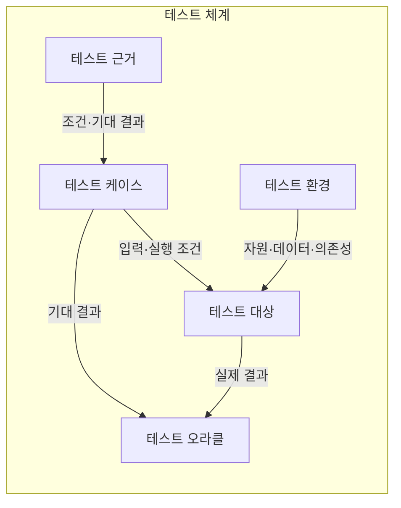
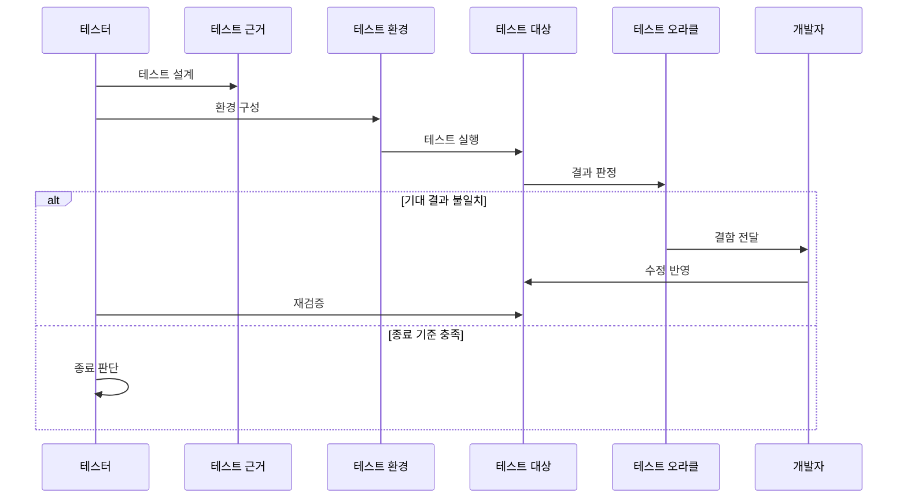

---
sidebar:
  order: 58
  label: "058. 소프트웨어 테스트 — 단위·통합·시스템·인수 (Software Testing)"
  badge:
    text: "기출 · 50%"
    variant: note
title: "소프트웨어 테스트 — 단위·통합·시스템·인수 (Software Testing)"
date: "2026-07-25T17:50:00+09:00"
tags:
  - "notes-software"
weight: 58
extra:
  question_no: "058"
  source_status: "기출"
  source_history: "120회"
  priority: 50
  priority_note: "120회 기출, 테스트 단계·목적 구분"
---

## 미리 알고가기

- **소프트웨어 테스트(Software Testing)**: 실제 결과를 요구사항과 기대 결과에 비교해 결함과 충족 여부를 판정하는 활동
- **단위 테스트(Unit Testing)**: 함수·클래스 같은 작은 코드 단위를 격리해 내부 동작을 검증하는 테스트
- **통합 테스트(Integration Testing)**: 모듈·서비스·외부 시스템 사이의 인터페이스와 데이터 교환을 검증하는 테스트
- **시스템 테스트(System Testing)**: 통합된 전체 시스템이 기능·성능·보안 요구를 충족하는지 검증하는 테스트
- **인수 테스트(Acceptance Testing)**: 사용자나 고객이 시스템의 업무 요구와 인수 조건 충족 여부를 확인하는 테스트
- **테스트 근거(Test Basis)**: 테스트 조건과 기대 결과를 도출하는 요구사항·설계·위험 정보
- **테스트 케이스(Test Case)**: 입력·실행 조건·기대 결과를 묶어 무엇을 어떻게 확인할지 명세한 항목
- **테스트 환경(Test Environment)**: 테스트 대상이 실행되도록 자원·데이터·외부 의존성을 재현한 조건
- **테스트 오라클(Test Oracle)**: 실행 결과의 성공·실패를 판정할 기대값이나 규칙
- **회귀 테스트(Regression Testing)**: 변경이 기존 정상 기능에 새 결함을 만들었는지 다시 확인하는 테스트
- **추적성(Traceability)**: 요구사항·테스트 케이스·결함의 연결을 기록해 검사 범위와 누락 여부를 확인하는 성질
- **테스트 레벨(Test Level)**: 단위·통합·시스템·인수처럼 테스트 대상을 코드에서 업무까지 구분한 단계
- **경계값 테스트(Boundary Value Testing)**: 입력 범위의 최솟값·최댓값과 그 주변에서 오류가 나는지 확인하는 테스트
- **종료 기준(Exit Criteria)**: 요구 충족률·잔여 결함·위험이 합의한 수준에 도달했는지 판단하는 조건
- **잔여 위험(Residual Risk)**: 테스트와 수정 뒤에도 남아 있어 인수 여부를 결정해야 하는 실패 가능성과 영향

## Ⅰ. 개요

- **정의/개념**: 실제·기대 결과 비교로 결함·요구 충족 판정
- **배경/필요성**: 전수 검증 불가로 위험 기반 시험 범위 필요

### 쉽게 이해하기 (학습용)

- 나사 하나부터 부품 연결·완제품·사용 목적까지 범위를 넓혀 문제를 찾는 과정이다

## Ⅱ. 특징

- 결함 존재는 보이지만 결함 부재는 증명할 수 없다.
- 전수 테스트 대신 위험·변경 영향으로 범위를 우선한다.
- 낮은 레벨은 원인을 격리하고 높은 레벨은 연결을 검증한다.
- 요구·케이스·결함 추적성이 범위·종료 판단을 뒷받침한다.

### 쉽게 이해하기 (학습용)

- 모든 경우를 검사할 수 없으므로 위험한 곳부터 확인하고 결과를 원래 요구와 연결한다

## Ⅲ. 아키텍처 및 구성요소

| 설계 요소 | 설명 |
|:---|:---|
| 테스트 근거 | 요구·설계·위험에서 조건 도출 |
| 테스트 케이스 | 입력·조건·기대 결과를 명세 |
| 테스트 대상 | 코드·인터페이스·시스템 범위 |
| 테스트 환경 | 자원·데이터·외부 의존성 재현 |
| 테스트 오라클 | 기대·실제 결과로 성공·실패 판정 |

> 요약: 근거·케이스·환경이 오라클 판정을 구성

### 쉽게 이해하기 (학습용)

- 무엇을 검사할지, 어떤 조건에서 실행할지, 정답이 무엇인지 함께 정해야 결과를 판단할 수 있음

## Ⅳ. 원리 및 절차 흐름도

| 절차 | 설명 |
|:---|:---|
| 테스트 설계 | 위험·근거로 조건·오라클 정의 |
| 환경 구성 | 자원·데이터·외부 의존성 준비 |
| 테스트 실행 | 케이스 입력으로 대상 동작 수행 |
| 결과 판정 | 실제 결과를 오라클과 비교 |
| 결함 전달 | 불일치 재현 정보와 영향 범위 전달 |
| 수정 반영 | 결함 원인을 고쳐 대상 버전 갱신 |
| 재검증 | 수정 확인과 영향 영역 회귀 수행 |
| 종료 판단 | 충족률·잔여 결함·위험으로 종료 결정 |

> 요약: 결함 수정·회귀 후 잔여 위험으로 종료 판단

### 쉽게 이해하기 (학습용)

- 예상 답과 다르면 고쳐 다시 검사하고 남은 위험을 받아들일 수 있을 때 끝냄

## Ⅴ. 종류 및 비교

| 판단 기준 | 단위 테스트 | 통합 테스트 | 시스템 테스트 | 인수 테스트 |
|:---|:---|:---|:---|:---|
| 핵심 특징 | 코드 단위의 내부 논리 검증 | 연동 계약·데이터 교환 검증 | 전체 시스템 요구 검증 | 사용자 업무·인수 조건 검증 |
| 적용 기준 | 변경이 코드 단위에 닫힐 때 | 변경이 연동 경계를 지날 때 | 릴리스 품질 판정이 필요할 때 | 사용자 인수 판단이 필요할 때 |
| 주요 위험 | 연동 결함 누락 | 환경·대역 구성 비용 | 결함 원인 격리 난도 | 대표 사용자·시나리오 누락 |

> 요약: 변경 영향 경계에 따라 테스트 레벨 확장

### 쉽게 이해하기 (학습용)

- 나사 하나, 부품 연결, 완제품 전체, 실제 사용 목적을 서로 다른 검사로 확인한다

## Ⅵ. 실무 사례

1. 요금 계산 함수는 경계값별 결과를 단위 테스트
2. 결제 대행 연동은 응답 코드·재시도를 통합 테스트
3. 전자상거래 시스템은 성능·보안 정책을 시스템 테스트
4. 환불 업무는 사용자 시나리오로 인수 테스트

### 쉽게 이해하기 (학습용)

- 요금 계산은 가장 작고 큰 입력에서도 기대 금액이 나오는지 확인한다
- 결제 대행사는 실패 응답과 재시도가 서비스 사이에서 약속대로 오가는지 확인한다
- 전자상거래 전체는 동시 사용자 처리와 보안 규칙을 함께 확인한다
- 환불 담당자가 실제 순서대로 처리해 업무 요구를 충족하는지 확인한다

## Ⅶ. 결론

- 변경 영향 경계로 테스트 레벨을 정하고 잔여 위험으로 종료

### 쉽게 이해하기 (학습용)

- 고친 범위가 넓을수록 검사 범위도 넓히고 남은 위험을 받아들일지 확인한다
