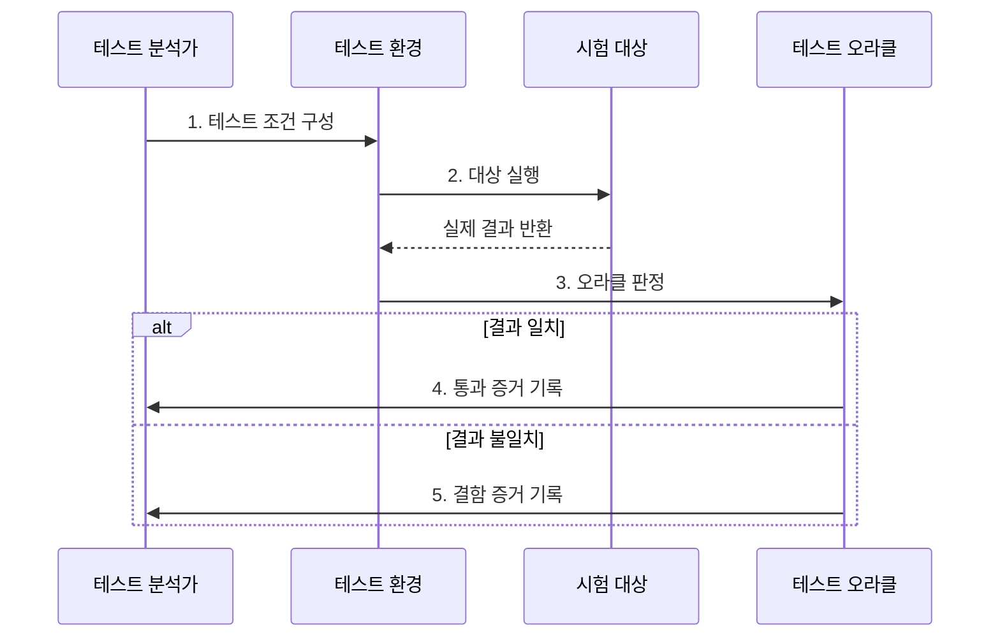

---
sidebar:
  order: 58
  label: "058. 소프트웨어 테스트: 단위·통합·시스템·인수 (Software Testing)"
  badge:
    text: "기출 · 50%"
    variant: note
title: "소프트웨어 테스트: 단위·통합·시스템·인수 (Software Testing)"
date: "2026-08-02T23:08:00+09:00"
tags:
  - "notes-software"
weight: 58
extra:
  question_no: "058"
  source_status: "기출"
  source_history: "120회"
  priority: 50
  priority_note: "120회 기출, 테스트 단계·목적 구분"
---

## Ⅰ. 개요

핵심 용어

- **소프트웨어 테스트(Software Testing)**: 실행 결과와 기대 결과를 비교해 결함을 발견하고 품질 근거를 제공하는 활동이다.
- **검증(Verification)**: 개발 산출물이 명세와 설계에 맞게 만들어졌는지 확인하는 활동이다.
- **확인(Validation)**: 완성된 시스템이 사용자 요구와 사용 목적을 충족하는지 확인하는 활동이다.

- 정의/개념: 실행 결과를 기대 결과와 비교해 **결함·품질 근거**를 도출하는 품질 확인 활동
- 배경/필요성: 개발자 단독 확인으로 **연동·업무 결함 누락**
- 품질 판단: 산출물의 명세 적합성은 **검증**, 사용 목적 충족은 **확인**

#### 한줄 요약

- 작은 부품부터 완성 제품과 고객 요구까지 검사 범위를 넓혀 가며 서로 다른 결함을 찾는 활동이다.

## Ⅱ. 특징

핵심 용어

- **기대 결과(Expected Result)**: 입력과 사전 조건에 대해 시스템이 보여야 할 올바른 동작이나 값이다.
- **회귀 테스트(Regression Testing)**: 변경 후 기존 기능이 손상되지 않았는지 이전 테스트를 다시 실행하는 활동이다.

- 단계별 **검증 대상·책임 분리**
- 기대 결과 기반의 **합격·실패 판정**
- 변경 후 회귀 시험의 **기존 기능 보호**

#### 한줄 요약

- 같은 시험을 크게 반복하는 것이 아니라 코드, 연결, 전체 시스템, 사용자 요구마다 다른 질문을 확인한다.

## Ⅲ. 구조 및 구성요소

핵심 용어

- **테스트 케이스(Test Case)**: 입력·사전 조건·기대 결과와 실행 절차를 묶은 검증 항목이다.
- **테스트 픽스처(Test Fixture)**: 테스트를 같은 조건에서 반복하도록 준비한 데이터·객체·환경 상태이다.
- **테스트 오라클(Test Oracle)**: 시험 결과가 옳은지 판단할 기대 결과·규칙·참조값이다.

| 구성요소 | 책임 |
|:---|:---|
| 테스트 근거 | **요구·설계의 검증 조건** 제공 |
| 테스트 케이스 | **입력·기대 결과**와 절차 정의 |
| 테스트 픽스처 | 반복 가능한 **데이터·환경 상태** 구성 |
| 테스트 실행기 | **대상 실행·실제 결과** 수집 |
| 결과·결함 저장소 | **증거·재현 조건** 추적 |

#### 한줄 요약

- 출제 기준, 시험 문제, 같은 시험장, 실행 도구, 결과 기록으로 구성된다.

## Ⅳ. 흐름도

핵심 용어

- **재현 조건(Reproduction Condition)**: 같은 결함을 다시 발생시키는 입력·데이터·환경·실행 순서이다.
- **결함 증거(Defect Evidence)**: 실제 결과와 기대 결과의 차이 및 영향을 입증하는 기록이다.

**동작 원리**

- **1. 테스트 조건 구성**: 요구에서 입력·기대 결과 도출
- **2. 대상 실행**: 재현 가능한 사전 상태에서 결과 수집
- **3. 오라클 판정**: 실제·기대 결과의 일치 여부 비교
- **4. 통과 증거 기록**: 검증한 요구와 결과 연결
- **5. 결함 증거 기록**: 실패 조건·영향·재현 정보 보존

> 요약: 요구에서 도출한 기대 결과와 실제 결과의 차이를 품질 근거로 기록

#### 한줄 요약

- 같은 조건에서 문제를 풀게 한 뒤 정답표와 비교하고, 틀렸다면 다시 재현할 수 있는 조건까지 기록한다.

## Ⅴ. 종류 및 비교

핵심 용어

- **단위 테스트(Unit Testing)**: 함수·클래스·모듈 등 최소 코드 단위의 내부 동작을 격리해 검증한다.
- **통합 테스트(Integration Testing)**: 결합된 모듈·서비스 사이의 인터페이스와 데이터 흐름을 검증한다.
- **시스템 테스트(System Testing)**: 완성된 전체 시스템의 기능·성능·보안 등 요구사항을 검증한다.
- **인수 테스트(Acceptance Testing)**: 사용자·발주자의 업무·계약 기준 충족 여부를 검증해 수용을 결정한다.

| 테스트 단계 | 단위 테스트 | 통합 테스트 | 시스템 테스트 | 인수 테스트 |
|:---|:---|:---|:---|:---|
| 적용 기준 | 코드의 **개별 로직 검증** | 모듈의 **연동 검증** | 제품의 **전체 요구 검증** | 고객의 **업무 수용 판단** |
| 핵심 특징 | 의존 격리·**빠른 피드백** | 인터페이스·**데이터 흐름 확인** | 운영 유사 환경의 **종단 시험** | 업무 시나리오의 **수용 기준 판정** |
| 한계 | 실제 연동·**환경 결함 누락** | 전체 업무·**비기능 검증 한계** | 실행 비용·**원인 격리 어려움** | 범위 합의·**사용자 일정 의존** |

> 요약: 코드에서 사용자 수용까지 검증 범위와 책임 확대

#### 한줄 요약

- 부품 하나, 부품 연결, 완성 제품, 고객 사용 순으로 시험 범위를 넓혀 각 단계의 결함을 찾는다.

## Ⅵ. 실무 고려사항 및 대책

핵심 용어

- **테스트 더블(Test Double)**: 실제 의존 대상을 대신해 입력·출력·상호작용을 통제하는 대체 객체의 상위 개념이다.
- **위험 기반 테스트(Risk-based Testing)**: 결함 가능성과 영향이 큰 영역에 시험 우선순위와 자원을 배분하는 방식이다.
- **경계값 분석(Boundary Value Analysis)**: 입력 범위의 최소·최대와 그 주변에서 결함이 많다는 점을 이용한 설계 기법이다.

| 문제 | 대책 | 효과 |
|:---|:---|:---|
| 단위 시험에 편중돼 연동·업무 결함이 누락됨 | 위험별 **통합·시스템 시험**과 인수 시험 조합 | **연동·업무 결함** 탐지 |
| 기대 결과와 허용 오차가 명확하지 않음 | **테스트 오라클·허용 범위** 명시 | **객관적 판정** 확보 |
| 실행마다 데이터와 환경 상태가 달라짐 | **독립 픽스처·격리 데이터** 구성 | **시험 재현성** 확보 |
| 테스트 더블만 검증해 실제 계약과 달라짐 | **실제 계약·핵심 통합 시험** 병행 | **구현 불일치** 탐지 |
| 변경마다 전체 회귀 시험을 실행해 지연됨 | **영향·위험 기반 선별**과 전체 회귀 병행 | **피드백 시간** 통제 |
| 입력 범위 끝부분의 계산 결함이 누락됨 | **경계값 분석·단위 테스트** 적용 | **경계 결함** 탐지 |

#### 한줄 요약

- 계산 함수는 최소·최대 금액을 넣어 보고, 주문과 결제 서비스는 실제 요청·응답 계약이 맞는지 확인한다.

## Ⅶ. 결론

핵심 용어

- **검증 범위(Test Scope)**: 단위 로직부터 연동, 전체 시스템, 업무 수용까지 시험이 다루는 대상의 경계이다.
- **수용 기준(Acceptance Criteria)**: 사용자가 시스템을 받아들일 수 있는지 판단하는 업무·계약 조건이다.

- 로직 결함은 **단위**, 연동은 **통합**, 비기능은 시스템, 업무 수용은 인수 테스트 선택

#### 한줄 요약

- 내부 코드와 연결을 먼저 확인한 뒤 전체 제품이 요구와 실제 업무를 만족하는지 판단한다.
