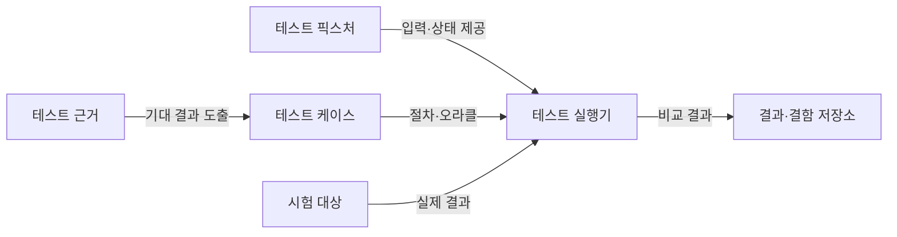
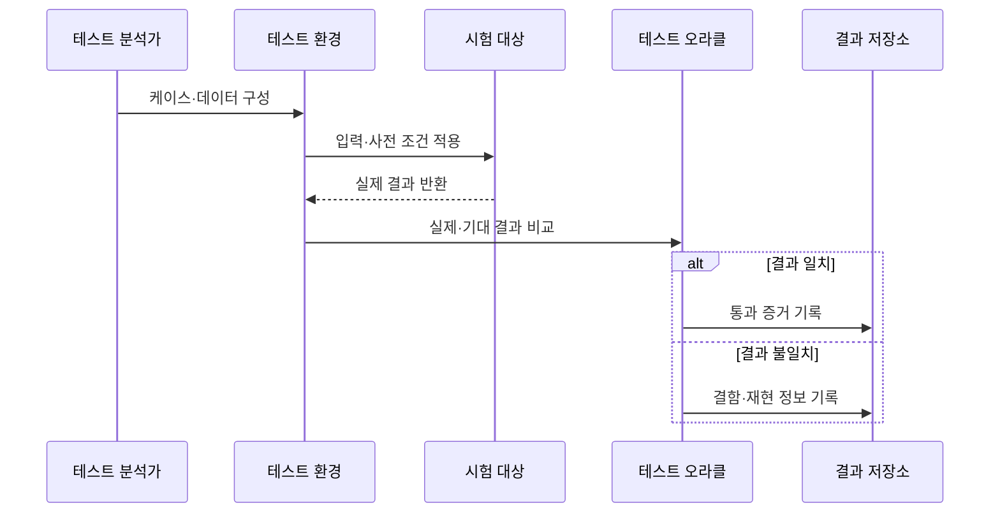

---
sidebar:
  order: 58
  label: "058. 소프트웨어 테스트 — 단위·통합·시스템·인수 (Software Testing)"
  badge:
    text: "기출 · 50%"
    variant: note
title: "소프트웨어 테스트 — 단위·통합·시스템·인수 (Software Testing)"
date: "2026-07-27T23:59:59+09:00"
tags:
  - "notes-software"
weight: 58
extra:
  question_no: "058"
  source_status: "기출"
  source_history: "120회"
  priority: 50
  priority_note: "120회 기출, 테스트 단계·목적 구분"
---

## 미리 알고가기

- **소프트웨어 테스트(Software Testing)**: 실행 결과와 기대 결과를 비교해 결함을 발견하고 품질 수준에 대한 근거를 제공하는 활동
- **검증(Verification)**: 개발 산출물이 명세와 설계에 맞게 만들어졌는지 확인하는 활동
- **확인(Validation)**: 완성된 시스템이 사용자 요구와 사용 목적을 충족하는지 확인하는 활동
- **단위 테스트(Unit Testing)**: 함수·클래스·모듈 등 최소 코드 단위의 내부 동작을 격리해 검증함
- **통합 테스트(Integration Testing)**: 결합된 모듈·서비스 사이의 인터페이스와 데이터 흐름을 검증함
- **시스템 테스트(System Testing)**: 완성된 전체 시스템의 기능·성능·보안 등 요구사항을 검증함
- **인수 테스트(Acceptance Testing)**: 사용자·발주자의 업무·계약 기준 충족 여부를 검증해 수용을 결정함
- **테스트 더블(Test Double)**: 실제 의존 대상을 대신해 입력·출력·상호작용을 통제하는 스텁·목·페이크의 상위 개념
- **회귀 테스트(Regression Testing)**: 변경 후 기존 기능이 손상되지 않았는지 이전 테스트를 다시 실행하는 활동
- **테스트 오라클(Test Oracle)**: 시험 결과가 옳은지 판단할 기대 결과·규칙·참조값

## Ⅰ. 개요

- **정의/개념**: 실행 결과를 기준과 비교해 **결함·품질 근거를 도출**
- **기존 한계**: 개발자 확인만으로는 **연동·업무 결함 누락**

### 쉽게 이해하기 (학습용)

- 작은 부품부터 완성 제품과 고객 요구까지 검사 범위를 넓혀 가며 서로 다른 결함을 찾는 활동이다.

## Ⅱ. 특징

- 단계별 **검증 대상·책임 분리**
- 기대 결과 기반의 **합격·실패 판정**
- 변경 후 회귀 시험의 **기존 기능 보호**

### 쉽게 이해하기 (학습용)

- 같은 시험을 크게 반복하는 것이 아니라 코드, 연결, 전체 시스템, 사용자 요구마다 다른 질문을 확인한다.

## Ⅲ. 아키텍처 및 구성요소

| 구성요소 | 책임 |
|:---|:---|
| 테스트 근거 | 요구·설계의 **검증 조건 제공** |
| 테스트 케이스 | 입력·절차·**기대 결과 정의** |
| 테스트 픽스처 | 반복 가능한 **데이터·환경 구성** |
| 테스트 실행기 | 대상 실행과 **실제 결과 수집** |
| 결과·결함 저장소 | 실패 증거의 **추적·관리** |

> 요약: 테스트 근거에서 도출한 기대 결과와 실제 결과를 비교

### 쉽게 이해하기 (학습용)

- 시험 문제와 정답표를 준비하고 같은 환경에서 제품을 실행해 실제 답과 비교한 뒤 틀린 기록을 남긴다.

## Ⅳ. 원리 및 절차 흐름

| 절차 | 설명 |
|:---|:---|
| 케이스·데이터 구성 | 요구 기반 **입력·기대 결과 정의** |
| 사전 조건 적용 | 재현 가능한 **환경·상태 준비** |
| 실제 결과 반환 | 시험 대상의 **출력·상태 수집** |
| 결과 비교 | 오라클로 **합격·실패 판정** |
| 통과 증거 기록 | 요구사항의 **검증 근거 보존** |
| 결함 정보 기록 | 실패의 **재현 조건·영향 추적** |

> 요약: 기대 결과와 실제 결과의 차이를 결함 근거로 기록

### 쉽게 이해하기 (학습용)

- 같은 조건에서 문제를 풀게 한 뒤 정답표와 비교하고, 틀렸다면 다시 재현할 수 있는 조건까지 기록한다.

## Ⅴ. 종류 및 비교

| 테스트 단계 | 단위 테스트 | 통합 테스트 | 시스템 테스트 | 인수 테스트 |
|:---|:---|:---|:---|:---|
| 적용 기준 | 코드의 **개별 로직 검증** | 모듈의 **연동 검증** | 제품의 **전체 요구 검증** | 고객의 **업무 수용 판단** |
| 핵심 특징 | 의존 격리·**빠른 피드백** | 인터페이스·**데이터 흐름 확인** | 운영 유사 환경의 **종단 시험** | 업무 시나리오의 **수용 기준 판정** |
| 한계 | 실제 연동·**환경 결함 누락** | 전체 업무·**비기능 검증 한계** | 실행 비용·**원인 격리 어려움** | 범위 합의·**사용자 일정 의존** |

> 요약: 코드에서 사용자 수용까지 검증 범위와 책임 확대

### 쉽게 이해하기 (학습용)

- 부품 하나, 부품 연결, 완성 제품, 고객 사용 순으로 시험 범위를 넓혀 각 단계의 결함을 찾는다.

## Ⅵ. 실무 사례

1. 결제 금액 함수는 **경계값 단위 테스트**로 계산 검증
2. 주문 서비스는 **결제 API 통합 테스트**로 연동 검증

### 쉽게 이해하기 (학습용)

- 계산 함수는 최소·최대 금액을 넣어 보고, 주문과 결제 서비스는 실제 요청·응답 계약이 맞는지 확인한다.

## Ⅶ. 결론

- 코드 결함은 **단위·통합**, 제품 수용은 **시스템·인수**로 검증

### 쉽게 이해하기 (학습용)

- 내부 코드와 연결을 먼저 확인한 뒤 전체 제품이 요구와 실제 업무를 만족하는지 판단한다.
