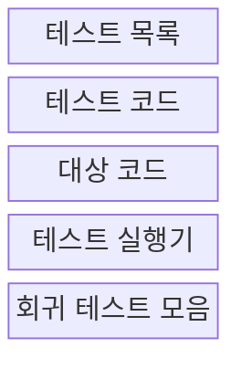
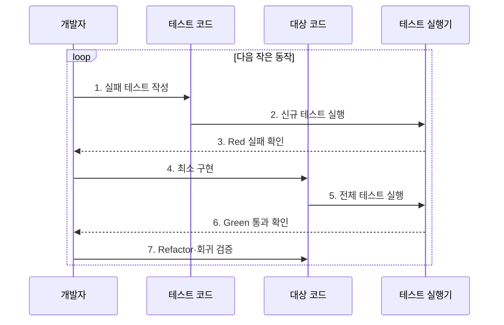

---
sidebar:
  order: 59
  label: "059. 테스트 주도 개발 TDD (Test-Driven Development)"
  badge:
    text: "기출 · 50%"
    variant: note
title: "테스트 주도 개발 TDD (Test-Driven Development)"
date: "2026-07-27T23:59:59+09:00"
tags:
  - "notes-software"
weight: 59
extra:
  question_no: "059"
  source_status: "기출"
  source_history: "129회"
  priority: 50
  priority_note: "129회 기출, 테스트 우선 개발 순환"
---

## 미리 알고가기

- **테스트 주도 개발(Test-Driven Development, TDD)**: 실패 테스트를 먼저 작성하고 최소 구현과 리팩터링을 반복하는 개발 방식
- **레드-그린-리팩터(Red-Green-Refactor)**: 실패 테스트 확인, 최소 구현으로 통과, 동작을 유지한 구조 개선의 TDD 반복 주기
- **리팩터링(Refactoring)**: 외부 동작을 바꾸지 않고 중복·복잡도·명칭 등 코드 내부 구조를 개선하는 활동
- **단위 테스트(Unit Test)**: 함수·클래스 등 작은 코드 단위를 격리해 빠르게 검증하는 테스트
- **테스트 더블(Test Double)**: 실제 의존 대상을 대신해 입력·출력·상호작용을 통제하는 대체 객체
- **목 객체(Mock Object)**: 예상 호출·인자·횟수 등 객체 간 상호작용을 검증하는 테스트 더블
- **스텁(Stub)**: 시험에 필요한 고정 응답을 반환하도록 만든 테스트 더블
- **회귀 테스트(Regression Test)**: 변경 후 기존 동작의 손상 여부를 다시 확인하는 테스트
- **결정적 로직(Deterministic Logic)**: 같은 입력과 상태에서 항상 같은 결과를 내는 로직
- **테스트 가능성(Testability)**: 대상을 격리·제어·관찰해 자동 시험하기 쉬운 정도
- **취약한 테스트(Brittle Test)**: 실제 동작은 옳아도 내부 구현이 조금 바뀌었다는 이유만으로 자주 실패하는 테스트

## Ⅰ. 개요

- 정의/개념: **실패 테스트·최소 구현·구조 개선**의 반복 개발
- 배경/필요성: 구현 후 시험의 **요구 누락·결함 발견 지연** 해소

### 쉽게 이해하기 (학습용)

- 먼저 채점 문제를 만들고 최소 답으로 통과한 뒤 정답은 유지하면서 풀이 구조를 다듬는 방식이다.

## Ⅱ. 특징

- 테스트 우선의 **실행 가능한 요구 명세**
- 작은 구현 단위의 **빠른 결함 피드백**
- 회귀 보호 아래 **지속적 리팩터링**

### 쉽게 이해하기 (학습용)

- 한 번에 작은 동작만 추가하므로 방금 바꾼 부분에서 문제 원인을 찾고 안전하게 구조를 개선할 수 있다.

## Ⅲ. 구조 및 구성요소

| 구성요소 | 책임 |
|:---|:---|
| 테스트 목록 | 구현할 작은 동작 우선순위 |
| 테스트 코드 | 입력·출력의 기대 동작 명세 |
| 대상 코드 | 현재 시험을 위한 최소 구현 |
| 테스트 실행기 | 실패·통과 즉시 판정 |
| 회귀 테스트 모음 | 기존 동작 자동 재검증 |

### 쉽게 이해하기 (학습용)

- 할 일 목록, 시험 문제, 답안, 채점기, 누적 문제집으로 구성된다.

## Ⅳ. 흐름도

| 구성요소 | 책임 |
|:---|:---|
| 테스트 목록 | 구현할 작은 동작 우선순위 |
| 테스트 코드 | 입력·출력의 기대 동작 명세 |
| 대상 코드 | 현재 테스트를 위한 최소 동작 구현 |
| 테스트 실행기 | 실패·통과의 즉시 자동 판정 |
| 회귀 테스트 모음 | 기존 동작의 자동 재검증 |

**동작 원리**

- **1. 실패 테스트 작성**: 다음 작은 동작 명세
- **2. 신규 테스트 실행**: 구현 전 결과 확인
- **3. Red 실패 확인**: 의도한 이유로 실패 판정
- **4. 최소 구현**: 현재 시험을 통과할 코드 작성
- **5. 전체 테스트 실행**: 신규·기존 회귀 시험 수행
- **6. Green 통과 확인**: 요구 동작 구현 판정
- **7. Refactor·회귀 검증**: 구조 개선 후 동작 보존

> 요약: 실패 확인·최소 구현·구조 개선을 작은 동작마다 반복한다.

### 쉽게 이해하기 (학습용)

- 문제가 제대로 틀리는지 확인하고 최소 답을 작성해 통과한 뒤 모든 답을 유지하면서 풀이를 정리한다.

## Ⅴ. 종류 및 비교

| 개발 방식 | TDD | 구현 후 테스트 |
|:---|:---|:---|
| 적용 기준 | 명확한 규칙·**작은 단위 로직** | 탐색적 구현·**외부 연동 중심** |
| 핵심 특징 | 테스트가 **설계·구현을 선도** | 구현 뒤 **검증 항목 도출** |
| 한계 | 테스트 결합·**과도한 단위화** | 결함 발견 지연·**수정 범위 확대** |

> 요약: 결정적 단위 로직은 TDD, 탐색·연동은 보완 시험 활용

### 쉽게 이해하기 (학습용)

- 결과가 분명한 작은 규칙은 문제부터 만들기 좋고, 미지의 연동은 먼저 탐색한 뒤 시험을 보강하기 쉽다.

## Ⅵ. 실무 고려사항 및 대책

| 고려사항 | 대책 | 효과 |
|:---|:---|:---|
| 실패 이유 미확인 | 의도한 실패 이유·메시지 확인 | 잘못된 Red 방지 |
| 구현 결합 테스트 | 공개 동작 검증·내부 호출 검증 축소 | 리팩터링 내성 |
| 과도한 목 객체 | 경계만 대체·통합·계약 시험 병행 | 실제 협력 검증 |
| 큰 반복 단위 | 작은 관찰 가능 동작만 추가 | 원인 격리 |
| 리팩터 생략 | Green 직후 구조 개선 수행 | 중복·복잡도 감소 |

> 적용 사례: 할인 계산기는 경계값 실패 테스트부터 규칙을 구현한다.

### 쉽게 이해하기 (학습용)

- 할인 한도와 주문 상태 규칙을 시험 문제로 먼저 고정한 뒤 이를 통과하는 최소 코드를 작성한다.

## Ⅶ. 결론

- **규칙 결정성·격리 가능성**이 높으면 TDD를 적용한다.

### 쉽게 이해하기 (학습용)

- 작은 내부 규칙은 테스트가 설계를 이끌게 하고, 실제 시스템 연결은 별도 통합 시험으로 확인한다.
