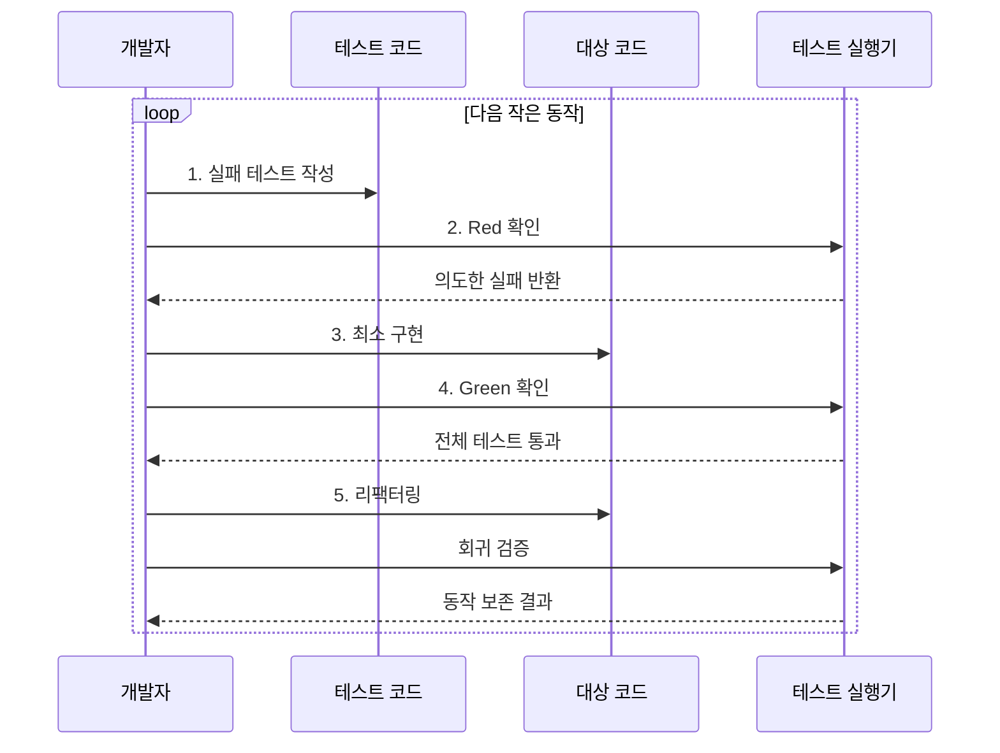

---
sidebar:
  order: 59
  label: "059. 테스트 주도 개발 TDD (Test-Driven Development)"
  badge:
    text: "기출 · 50%"
    variant: note
title: "테스트 주도 개발 TDD (Test-Driven Development)"
date: "2026-08-02T23:09:00+09:00"
tags:
  - "notes-software"
weight: 59
extra:
  question_no: "059"
  source_status: "기출"
  source_history: "129회"
  priority: 50
  priority_note: "129회 기출, 테스트 우선 개발 순환"
---

## Ⅰ. 개요

핵심 용어

- **테스트 주도 개발(Test-Driven Development, TDD)**: 실패 테스트를 먼저 작성하고 최소 구현과 리팩터링을 반복하는 개발 방식이다.
- **단위 테스트(Unit Test)**: 함수·클래스 등 작은 코드 단위를 격리해 빠르게 검증하는 테스트이다.

- 정의/개념: 실패 **단위 테스트** 를 먼저 작성하고 최소 구현·리팩터링을 반복하는 개발 방식
- 배경/필요성: 구현 후 시험의 **요구 누락·결함 발견 지연** 해소

#### 한줄 요약

- 먼저 채점 문제를 만들고 최소 답으로 통과한 뒤 정답은 유지하면서 풀이 구조를 다듬는 방식이다.

## Ⅱ. 특징

핵심 용어

- **실행 가능한 명세(Executable Specification)**: 요구 동작을 자동 실행하고 통과 여부를 판정할 수 있게 표현한 테스트이다.
- **회귀 테스트(Regression Test)**: 변경 후 기존 동작의 손상 여부를 다시 확인하는 테스트이다.
- **리팩터링(Refactoring)**: 외부 동작을 바꾸지 않고 코드 내부 구조를 개선하는 활동이다.

- 테스트 우선의 **실행 가능한 요구 명세**
- 작은 구현 단위의 **빠른 결함 피드백**
- 회귀 보호 아래 **지속적 리팩터링**

#### 한줄 요약

- 한 번에 작은 동작만 추가하므로 방금 바꾼 부분에서 문제 원인을 찾고 안전하게 구조를 개선할 수 있다.

## Ⅲ. 구조 및 구성요소

핵심 용어

- **테스트 목록(Test List)**: 구현할 작은 동작과 우선순위를 관리하는 작업 목록이다.
- **최소 구현(Minimal Implementation)**: 현재 실패 테스트를 통과하는 데 필요한 만큼만 작성한 코드이다.
- **테스트 실행기(Test Runner)**: 테스트를 자동 실행하고 실패·통과 결과를 즉시 제공하는 도구이다.
- **테스트 코드·대상 코드**: 테스트 코드는 입력과 기대 동작을 실행 가능한 명세로 표현하고, 대상 코드는 그 동작을 구현한다.
- **회귀 테스트 모음(Regression Suite)**: 기존 동작을 보호하도록 누적해 변경마다 다시 실행하는 자동 테스트 집합이다.

| 구성요소 | 책임 |
|:---|:---|
| 테스트 목록 | 구현할 **작은 동작·우선순위** 관리 |
| 테스트 코드 | **입력·기대 동작** 명세 |
| 대상 코드 | 현재 시험을 위한 **최소 구현** |
| 테스트 실행기 | **실패·통과** 즉시 판정 |
| 회귀 테스트 모음 | 기존 **동작의 자동 재검증** |

#### 한줄 요약

- 할 일 목록, 시험 문제, 답안, 채점기, 누적 문제집으로 구성된다.

## Ⅳ. 흐름도

핵심 용어

- **레드-그린-리팩터(Red-Green-Refactor)**: 실패 확인, 최소 구현으로 통과, 동작을 유지한 구조 개선의 반복 주기이다.
- **레드(Red)**: 구현 전 테스트가 의도한 이유로 실패하는 상태이다.
- **그린(Green)**: 최소 구현 후 신규·기존 테스트가 모두 통과하는 상태이다.

**동작 원리**

- **1. 실패 테스트 작성**: 다음 작은 동작 명세
- **2. Red 확인**: 구현 전 의도한 이유로 실패 판정
- **3. 최소 구현**: 현재 테스트를 통과할 코드 작성
- **4. Green 확인**: 신규·기존 회귀 테스트 통과 판정
- **5. 리팩터링**: 외부 동작을 유지하며 내부 구조 개선

> 요약: 실패 확인·최소 구현·구조 개선을 작은 동작마다 반복

#### 한줄 요약

- 문제가 제대로 틀리는지 확인하고 최소 답을 작성해 통과한 뒤 모든 답을 유지하면서 풀이를 정리한다.

## Ⅴ. 종류 및 비교

핵심 용어

- **결정적 로직(Deterministic Logic)**: 같은 입력과 상태에서 항상 같은 결과를 내는 로직이다.
- **탐색적 구현(Exploratory Implementation)**: 요구나 해법의 불확실성을 줄이기 위해 먼저 만들어 보며 학습하는 구현 방식이다.

| 개발 방식 | TDD | 구현 후 테스트 |
|:---|:---|:---|
| 적용 기준 | 명확한 규칙·**작은 단위 로직** | 탐색적 구현·**외부 연동 중심** |
| 핵심 특징 | 테스트가 **설계·구현을 선도** | 구현 뒤 **검증 항목 도출** |
| 한계 | 테스트 결합·**과도한 단위화** | 결함 발견 지연·**수정 범위 확대** |

> 요약: 결정적 단위 로직은 TDD, 탐색·연동은 보완 시험 활용

#### 한줄 요약

- 결과가 분명한 작은 규칙은 문제부터 만들기 좋고, 미지의 연동은 먼저 탐색한 뒤 시험을 보강하기 쉽다.

## Ⅵ. 실무 고려사항 및 대책

핵심 용어

- **취약한 테스트(Brittle Test)**: 외부 동작은 같아도 내부 구현 변경만으로 자주 실패하는 테스트이다.
- **목 객체(Mock Object)**: 예상 호출·인자·횟수 등 객체 간 상호작용을 검증하는 테스트 더블이다.
- **스텁(Stub)**: 시험에 필요한 고정 응답을 반환하도록 만든 테스트 더블이다.
- **테스트 가능성(Testability)**: 대상을 격리·제어·관찰해 자동 시험하기 쉬운 정도이다.
- **의도한 실패 이유·메시지**: 아직 구현하지 않은 요구 때문에 테스트가 실패했음을 확인하는 원인과 진단 정보이다.
- **공개 동작·리팩터링 내성**: 호출자에게 보이는 입력·출력 계약을 검증해 내부 구조 변경에도 불필요하게 실패하지 않는 성질이다.
- **예외 경로(Exception Path)**: 외부 오류·잘못된 입력·시간 초과처럼 정상 처리와 다른 실패 흐름이다.
- **의존성 분리·관찰 가능 출력**: 외부 협력 대상을 교체 가능하게 나누고 결과·상태 변화를 시험이 확인할 수 있게 드러내는 설계이다.

| 문제 | 대책 | 효과 |
|:---|:---|:---|
| 실패 원인을 확인하지 않고 구현을 시작함 | **의도한 실패 이유·메시지** 확인 | 잘못된 **Red 판정** 방지 |
| 내부 호출에 결합된 취약한 테스트가 누적됨 | **공개 동작 검증** 과 내부 호출 검증 축소 | **리팩터링 내성** 확보 |
| 모든 협력 객체를 목 객체로 대체함 | 경계만 **목 객체·테스트 더블** 로 두고 통합 시험 병행 | **실제 협력 동작** 검증 |
| 외부 오류 응답을 반복 재현하기 어려움 | 경계에 **스텁·고정 응답** 적용 | **예외 경로** 재현 |
| 큰 객체를 격리·제어·관찰하기 어려움 | **의존성 분리·관찰 가능 출력** 설계 | **테스트 가능성** 향상 |
| Green 뒤 리팩터링을 생략해 중복이 누적됨 | **통과 직후 구조 개선** 수행 | **중복·복잡도** 감소 |

#### 한줄 요약

- 할인 한도와 주문 상태 규칙을 시험 문제로 먼저 고정한 뒤 이를 통과하는 최소 코드를 작성한다.

## Ⅶ. 결론

핵심 용어

- **격리 가능한 규칙(Isolatable Rule)**: 외부 시스템 없이 입력과 결과를 독립적으로 검증할 수 있는 업무 로직이다.
- **통합 시험(Integration Test)**: 실제 시스템 경계와 협력 대상 사이의 계약과 상호작용을 검증하는 시험이다.

- 결정적·격리 가능한 규칙은 **TDD**, 탐색·외부 연동은 **구현 후 통합 시험** 선택

#### 한줄 요약

- 작은 내부 규칙은 테스트가 설계를 이끌게 하고, 실제 시스템 연결은 별도 통합 시험으로 확인한다.
