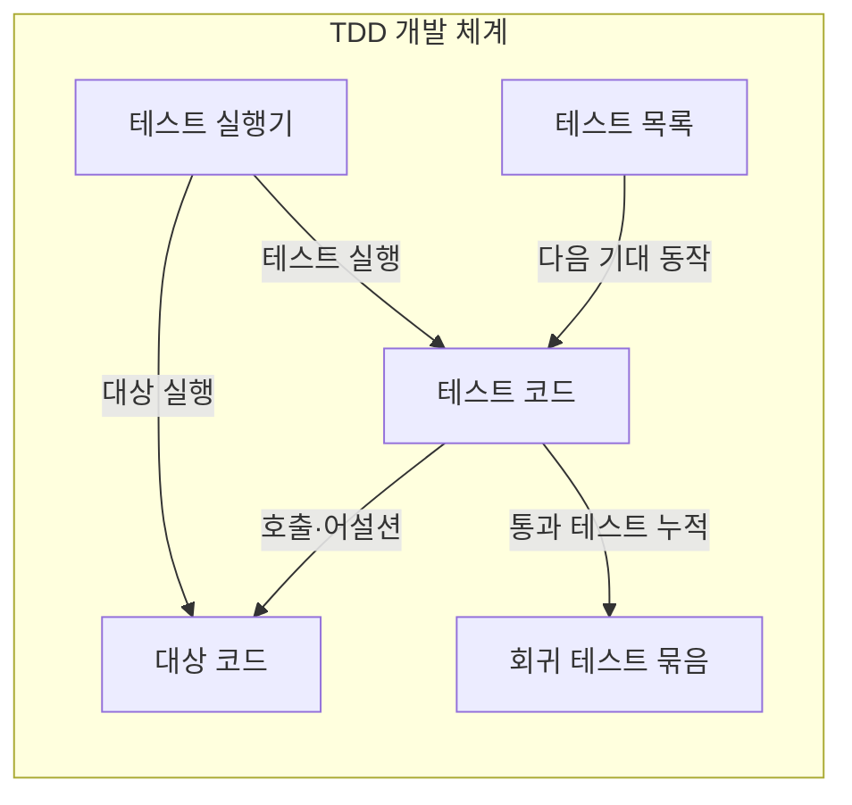
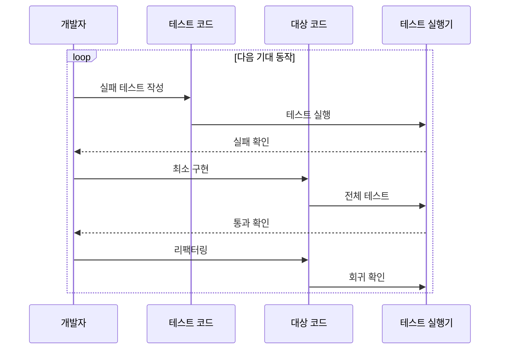

---
sidebar:
  order: 59
  label: "059. 테스트 주도 개발 TDD (Test-Driven Development)"
  badge:
    text: "기출 · 50%"
    variant: note
title: "테스트 주도 개발 TDD (Test-Driven Development)"
date: "2026-07-25T17:51:00+09:00"
tags:
  - "notes-software"
weight: 59
extra:
  question_no: "059"
  source_status: "기출"
  source_history: "129회"
  priority: 50
  priority_note: "129회 기출, 테스트 우선 개발 순환"
---

## 미리 알고가기

- **테스트 주도 개발(Test-Driven Development, TDD)**: 실패하는 자동 테스트를 먼저 만들고 최소 구현과 구조 개선을 반복하는 개발 방식
- **레드·그린·리팩터(Red·Green·Refactor)**: 테스트 실패 확인, 통과하는 최소 구현, 외부 동작을 보존한 구조 개선을 반복하는 주기
- **어설션(Assertion)**: 실행한 코드의 실제 결과가 기대값이나 조건과 일치하는지 판정하는 명령
- **테스트 대역(Test Double)**: 지연이 크거나 제어 불가능한 외부 의존성 대신 정해진 응답을 제공하는 객체
- **회귀 테스트 묶음(Regression Test Suite)**: 새 변경이 기존 동작을 깨뜨렸는지 반복 확인하는 자동 테스트 모음
- **리팩터링(Refactoring)**: 외부에서 관찰되는 동작은 유지하면서 코드 내부 구조를 개선하는 작업
- **테스트 목록(Test List)**: 앞으로 구현할 작은 기대 동작과 실행 예를 우선순위대로 적은 작업 목록
- **테스트 코드(Test Code)**: 대상 코드를 호출하고 어설션으로 기대 동작 충족 여부를 자동 판정하는 코드
- **대상 코드(System Under Test Code)**: 현재 실패 테스트가 요구하는 동작을 구현하고 리팩터링하는 실제 제품 코드
- **테스트 실행기(Test Runner)**: 새 테스트와 회귀 테스트 묶음을 실행해 통과·실패 결과를 개발자에게 보고하는 도구
- **테스트 결합(Test Coupling)**: 테스트가 내부 구현 세부에 의존해 동작이 같아도 구조 변경만으로 실패하는 상태
- **결정적 로직(Deterministic Logic)**: 같은 입력과 상태에서 항상 같은 결과가 나와 TDD의 즉각적인 자동 판정에 적합한 로직
- **상태 전이(State Transition)**: 현재 상태와 사건에 따라 다음 상태가 정해지는 변화로, 주문이 허용된 순서로만 바뀌는지 시험하는 대상

## Ⅰ. 개요

- **정의/개념**: 실패 테스트→구현→리팩터링 반복
- **배경/필요성**: 늦은 결함 발견으로 테스트 우선 개발 필요

### 쉽게 이해하기 (학습용)

- 작은 채점 문제를 먼저 만들고 최소 답안으로 통과한 뒤 답안 구조를 정리한다

## Ⅱ. 특징

- 구현 전 기대 동작·인터페이스를 실행 예로 구체화한다.
- 한 주기에 한 동작만 추가해 실패 원인을 격리한다.
- 통과 테스트를 지키며 내부 구조를 리팩터링한다.
- 과도한 테스트 대역은 실제 연동 결함을 숨긴다.

### 쉽게 이해하기 (학습용)

- 한 번에 한 문제만 추가해 틀리면 방금 바꾼 답에서 원인을 찾고 통과하면 구조를 정리한다

## Ⅲ. 아키텍처 및 구성요소

| 설계 요소 | 설명 |
|:---|:---|
| 테스트 목록 | 구현할 작은 동작·예의 우선순위 |
| 테스트 코드 | 입력·호출·어설션으로 기대 동작 표현 |
| 대상 코드 | 현재 테스트가 요구하는 최소 동작 구현 |
| 테스트 실행기 | 새·기존 테스트 실행 결과 보고 |
| 회귀 테스트 묶음 | 통과한 기대 동작을 자동 재검증 |

> 요약: 테스트 코드가 대상 동작을 이끌고 회귀로 보존

### 쉽게 이해하기 (학습용)

- 할 일 목록에서 문제 하나를 선택해 채점기로 답안을 검사하고 통과한 문제를 계속 다시 확인한다

## Ⅳ. 원리 및 절차 흐름도

| 절차 | 설명 |
|:---|:---|
| 실패 테스트 작성 | 다음 기대 동작을 어설션으로 표현 |
| 테스트 실행 | 새 테스트와 대상 코드를 함께 실행 |
| 실패 확인 | 구현 부재로 정확히 실패하는지 검증 |
| 최소 구현 | 전체 테스트를 통과할 최소 코드 작성 |
| 전체 테스트 | 새·기존 테스트를 모두 실행 |
| 통과 확인 | 모든 기대 동작의 충족 여부 판정 |
| 리팩터링 | 외부 동작을 유지하며 내부 구조 개선 |
| 회귀 확인 | 구조 개선 후 전체 테스트 재실행 |

> 요약: 실패·최소 구현·리팩터링을 짧게 반복

### 쉽게 이해하기 (학습용)

- 문제를 먼저 틀리는지 확인하고 최소 답으로 통과한 뒤 모든 답을 다시 채점하며 구조를 정리한다

## Ⅴ. 종류 및 비교

| 판단 기준 | TDD | 사후 테스트 방식 |
|:---|:---|:---|
| 핵심 특징 | 실패 테스트부터 설계·구현 반복 | 구현 후 검증 항목 도출 |
| 적용 기준 | 빠르고 결정적인 핵심 로직 | 탐색적 시제품·느린 외부 연동 |
| 주요 위험 | 테스트 결합·과도한 대역 | 늦은 결함 발견·넓은 수정 범위 |

> 요약: 결정형 로직은 TDD, 탐색·외부 연동은 사후 테스트

### 쉽게 이해하기 (학습용)

- 정답이 분명하면 문제부터 만들고 빠르게 바뀌는 시제품이나 외부 연결은 만든 뒤 확인한다

## Ⅵ. 실무 사례

1. 세금 계산기는 과세·반올림 실패 예부터 구현
2. 주문 상태 전이는 허용·거부 시나리오부터 구현

### 쉽게 이해하기 (학습용)

- 세금과 반올림의 기대 금액을 먼저 적고 그 사례를 통과하는 계산식을 만듦
- 주문 상태가 바뀔 수 있는 경우와 거부할 경우를 먼저 적고 전이 코드를 맞춤

## Ⅶ. 결론

- 빠른 결정형 로직은 TDD, 외부 연동은 통합 테스트

### 쉽게 이해하기 (학습용)

- 바로 채점할 규칙은 문제부터 만들고 느린 외부 시스템 연결은 따로 묶어 검사한다
