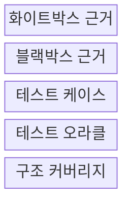
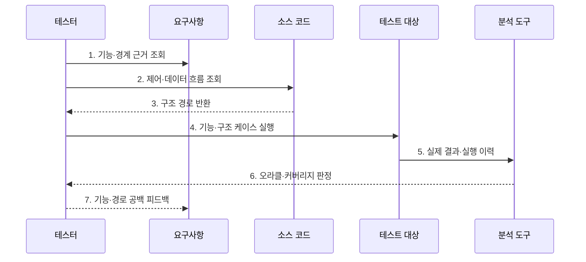

---
sidebar:
  order: 60
  label: "060. 화이트박스·블랙박스 테스트 (White-box Black-box Testing)"
  badge:
    text: "미출제 · 50%"
    variant: note
title: "화이트박스·블랙박스 테스트 (White-box Black-box Testing)"
date: "2026-07-25T17:52:00+09:00"
tags:
  - "notes-software"
weight: 60
extra:
  question_no: "060"
  source_status: "미출제"
  source_history: ""
  priority: 50
  priority_note: "내부·외부 관점 테스트 선택 기준"
---

## 미리 알고가기

- **화이트박스·블랙박스 테스트(White-box and Black-box Testing)**: 같은 소프트웨어를 코드 내부 구조와 외부 명세라는 서로 다른 근거로 검증하는 두 방식
- **테스트 근거(Test Basis)**: 테스트 조건과 기대 결과를 도출하는 요구사항·설계·코드 구조 같은 정보
- **구조 커버리지(Structural Coverage)**: 테스트가 구문·분기·조건 같은 코드 구조를 실행한 비율
- **동등 분할·경계값 분석(Equivalence Partitioning and Boundary Value Analysis)**: 비슷하게 처리될 입력을 묶고 오류가 잦은 범위 경계를 검사하는 블랙박스 설계 기법
- **테스트 오라클(Test Oracle)**: 실제 실행 결과의 성공·실패를 판정할 기대 결과나 규칙
- **제어 흐름(Control Flow)**: 조건·분기에 따라 실행할 구문과 경로가 달라지는 코드의 진행 관계
- **데이터 흐름(Data Flow)**: 변수가 정의되고 사용되며 소멸하는 경로로, 화이트박스 테스트가 잘못된 값 전달을 찾는 근거
- **상태 전이(State Transition)**: 현재 상태와 입력 사건에 따라 다음 상태가 정해지는 변화로, 블랙박스 테스트가 요구 동작을 검증하는 대상
- **테스트 케이스(Test Case)**: 입력·사전 조건·기대 결과를 묶어 기능 또는 코드 경로를 검사하도록 명세한 항목
- **커버리지 도구(Coverage Tool)**: 테스트 실행 이력을 수집해 구문·분기·조건이 실행된 비율과 미실행 경로를 표시하는 도구
- **보상 분기(Compensation Branch)**: 결제 실패처럼 완료되지 않은 작업의 영향을 되돌리는 내부 실행 경로
- **커버리지 맹신(Coverage Fallacy)**: 높은 구조 커버리지를 결함 부재나 요구 충족의 증거로 잘못 해석하는 오류

## Ⅰ. 개요

- 정의/개념: 코드 구조·외부 명세 기반 결함 검출
- **배경/필요성**: 결과·경로 단독 검증 한계로 병행 시험 필요

### 쉽게 이해하기 (학습용)

- 버튼이 설명서대로 작동하는지 보고 뚜껑을 열어 정해 둔 내부 길도 움직이는지 확인한다.

## Ⅱ. 특징

- **화이트박스**로 제어·데이터 흐름 검증
- **블랙박스**로 입력·경계·상태 전이 검증
- **상호 보완**으로 명세 누락·숨은 경로 탐지

### 쉽게 이해하기 (학습용)

- 겉 동작 검사는 빠진 기능을 찾고 내부 검사는 지나가지 않은 길을 찾아 빈틈을 채운다.

## Ⅲ. 구조 및 구성요소

| 구성요소 | 책임 |
|:---|:---|
| 화이트박스 근거 | 제어·데이터 흐름 제공 |
| 블랙박스 근거 | 요구·인터페이스·상태 전이 제공 |
| 테스트 케이스 | 입력·조건·기대 결과 명세 |
| 테스트 오라클 | 기능 성공·실패 판정 |
| 구조 커버리지 | 구문·분기·조건 실행 비율 측정 |

### 쉽게 이해하기 (학습용)

- 내부 길 지도, 사용 설명서, 시험표, 정답표, 경로 계기판으로 구성된다.

## Ⅳ. 흐름도

**동작 원리**

- **1. 기능·경계 근거 조회**: 요구·상태 전이 확인
- **2. 제어·데이터 흐름 조회**: 소스 구조 분석
- **3. 구조 경로 반환**: 위험 분기·변수 경로 도출
- **4. 기능·구조 케이스 실행**: 두 근거를 같은 대상에 적용
- **5. 실제 결과·실행 이력**: 기능·경로 자료 수집
- **6. 오라클·커버리지 판정**: 결과·미실행 구조 확인
- **7. 기능·경로 공백 피드백**: 다음 시험 보강

> 요약: 외부 기능 결과와 내부 실행 경로의 공백을 서로 다른 근거로 보강한다.

### 쉽게 이해하기 (학습용)

- 빈틈이 기능인지 내부 길인지 나눠 검사표를 실행하고 빠진 곳을 채운다.

## Ⅴ. 종류 및 비교

| 비교 항목 | 화이트박스 테스트 | 블랙박스 테스트 |
|:---|:---|:---|
| 적용 기준 | 내부 경로 실패 영향이 클 때 | 요구 불일치 영향이 클 때 |
| 핵심 특징 | 코드 구조·실행 경로 기반 검증 | 외부 명세·입출력 기반 검증 |
| 한계 | 명세 누락 탐지 한계 | 숨은 경로 탐지 한계 |

> 요약: 내부 경로는 화이트, 요구 동작은 블랙 우선

### 쉽게 이해하기 (학습용)

- 끊긴 길은 화이트박스가 찾고 기능 누락은 블랙박스가 잘 찾는다.

## Ⅵ. 실무 고려사항 및 대책

| 고려사항 | 대책 | 효과 |
|:---|:---|:---|
| 커버리지 맹신 | 의미 있는 단언·블랙박스 시험 병행 | 요구 결과 검증 |
| 명세 오류 | 업무 규칙 검토·독립 오라클 확보 | 기대 결과 정확성 |
| 경로 폭발 | 위험·복잡도·변경 영향으로 선별 | 시험 수 통제 |
| 내부 결합 | 중요 제어·데이터 위험만 고정 | 리팩터링 보호 |
| 사각지대 분리 | 요구·코드·케이스·결함 추적 | 기능·구조 연결 |

> 적용 사례: 결제 금액 경계는 블랙박스로, 실패 보상 분기는 화이트박스로 검증한다.

### 쉽게 이해하기 (학습용)

- 끝값이 맞는지 확인하고 실패했을 때 돈을 돌려주는 내부 길도 살펴본다.

## Ⅶ. 결론

- **요구 불일치·경로 위험**에 맞춰 두 방식을 조합한다.

### 쉽게 이해하기 (학습용)

- 겉 기능은 설명서 기준으로, 내부 길은 코드를 보며 함께 검사한다.
