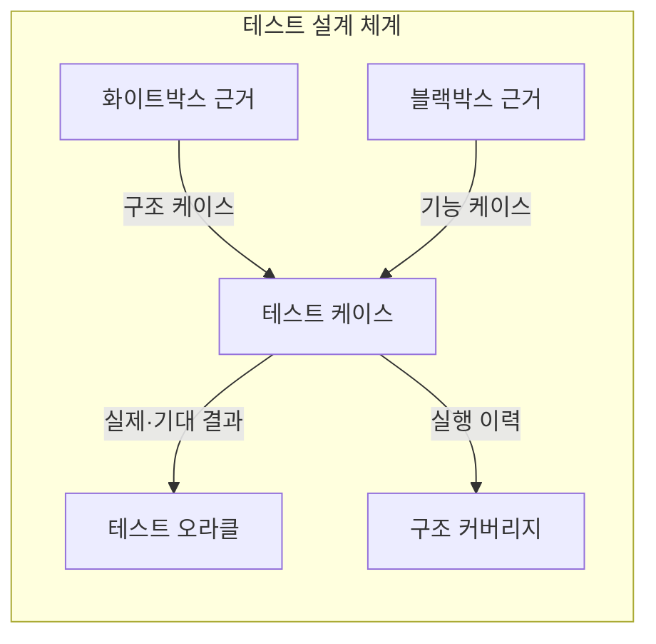
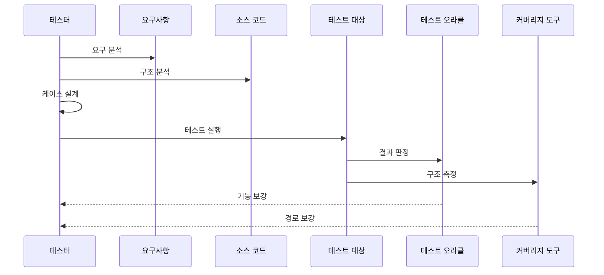

---
sidebar:
  order: 60
  label: "060. 화이트박스·블랙박스 테스트 (White-box Black-box Testing)"
  badge:
    text: "미출제 · 50%"
    variant: note
title: "화이트박스·블랙박스 테스트 (White-box Black-box Testing)"
date: "2026-07-25T17:52:00+09:00"
tags:
  - "notes-software"
weight: 60
extra:
  question_no: "060"
  source_status: "미출제"
  source_history: ""
  priority: 50
  priority_note: "내부·외부 관점 테스트 선택 기준"
---

## 미리 알고가기

- **화이트박스·블랙박스 테스트(White-box and Black-box Testing)**: 같은 소프트웨어를 코드 내부 구조와 외부 명세라는 서로 다른 근거로 검증하는 두 방식
- **테스트 근거(Test Basis)**: 테스트 조건과 기대 결과를 도출하는 요구사항·설계·코드 구조 같은 정보
- **구조 커버리지(Structural Coverage)**: 테스트가 구문·분기·조건 같은 코드 구조를 실행한 비율
- **동등 분할·경계값 분석(Equivalence Partitioning and Boundary Value Analysis)**: 비슷하게 처리될 입력을 묶고 오류가 잦은 범위 경계를 검사하는 블랙박스 설계 기법
- **테스트 오라클(Test Oracle)**: 실제 실행 결과의 성공·실패를 판정할 기대 결과나 규칙
- **제어 흐름(Control Flow)**: 조건·분기에 따라 실행할 구문과 경로가 달라지는 코드의 진행 관계
- **데이터 흐름(Data Flow)**: 변수가 정의되고 사용되며 소멸하는 경로로, 화이트박스 테스트가 잘못된 값 전달을 찾는 근거
- **상태 전이(State Transition)**: 현재 상태와 입력 사건에 따라 다음 상태가 정해지는 변화로, 블랙박스 테스트가 요구 동작을 검증하는 대상
- **테스트 케이스(Test Case)**: 입력·사전 조건·기대 결과를 묶어 기능 또는 코드 경로를 검사하도록 명세한 항목
- **커버리지 도구(Coverage Tool)**: 테스트 실행 이력을 수집해 구문·분기·조건이 실행된 비율과 미실행 경로를 표시하는 도구
- **보상 분기(Compensation Branch)**: 결제 실패처럼 완료되지 않은 작업의 영향을 되돌리는 내부 실행 경로

## Ⅰ. 개요

- **정의/개념**: 코드 구조·외부 명세 기반 결함 검출
- **배경/필요성**: 결과·경로 단독 검증 한계로 병행 시험 필요

### 쉽게 이해하기 (학습용)

- 버튼이 설명서대로 작동하는지 보고 뚜껑을 열어 정해 둔 내부 길도 움직이는지 확인한다

## Ⅱ. 특징

- 화이트박스는 제어·데이터 흐름의 미실행 영역을 찾는다.
- 블랙박스는 입력·경계·상태 전이의 요구 동작을 검증한다.
- 두 방식은 명세 누락과 숨은 경로를 서로 보완한다.
- 변경 범위·결함 영향으로 두 방식의 검증 깊이를 나눈다.

### 쉽게 이해하기 (학습용)

- 겉 동작 검사는 빠진 기능을 찾고 내부 검사는 지나가지 않은 길을 찾아 빈틈을 채움

## Ⅲ. 아키텍처 및 구성요소

| 설계 요소 | 설명 |
|:---|:---|
| 화이트박스 근거 | 소스의 제어·데이터 흐름 |
| 블랙박스 근거 | 요구사항·인터페이스·상태 전이 |
| 테스트 케이스 | 입력·사전 조건·기대 결과 명세 |
| 테스트 오라클 | 실제·기대 결과로 기능 성공 판정 |
| 구조 커버리지 | 구문·분기·조건 실행 비율 측정 |

> 요약: 명세·구조가 케이스와 두 판정 기준을 구성

### 쉽게 이해하기 (학습용)

- 설명서와 도면으로 검사표를 만들고 정답과 방문 기록으로 확인한다

## Ⅳ. 원리 및 절차 흐름도

| 절차 | 설명 |
|:---|:---|
| 요구 분석 | 기능 규칙·입력 경계·상태 전이 도출 |
| 구조 분석 | 제어·데이터 흐름과 미실행 위험 도출 |
| 케이스 설계 | 기능 케이스와 구조 케이스 구성 |
| 테스트 실행 | 같은 대상에 두 관점의 입력 실행 |
| 결과 판정 | 실제 결과를 요구 기대값과 비교 |
| 구조 측정 | 실행 이력으로 구조 커버리지 계산 |
| 기능 보강 | 기능 결함·명세 누락에 케이스 추가 |
| 경로 보강 | 미실행 분기·조건에 케이스 추가 |

> 요약: 기능 결과와 실행 경로의 공백을 각각 보강

### 쉽게 이해하기 (학습용)

- 빈틈이 기능인지 길인지 정해 검사표를 실행하고 빠진 곳을 채움

## Ⅴ. 종류 및 비교

| 판단 기준 | 화이트박스 테스트 | 블랙박스 테스트 |
|:---|:---|:---|
| 핵심 특징 | 코드 구조·실행 경로 기반 검증 | 외부 명세·입출력 기반 검증 |
| 적용 기준 | 내부 경로 실패 영향이 클 때 | 요구 불일치 영향이 클 때 |
| 주요 위험 | 명세 누락 탐지 한계 | 숨은 경로 탐지 한계 |

> 요약: 내부 경로는 화이트, 요구 동작은 블랙 우선

### 쉽게 이해하기 (학습용)

- 끊긴 길은 화이트박스가 찾고 기능 누락은 블랙박스가 잘 찾음

## Ⅵ. 실무 사례

1. 결제 금액 경계는 블랙박스, 보상 분기는 화이트박스

### 쉽게 이해하기 (학습용)

- 끝값이 맞는지 확인하고 실패했을 때 돈을 돌려주는 내부 길도 살펴봄

## Ⅶ. 결론

- 요구 불일치는 블랙박스, 내부 경로 위험은 화이트박스 우선

### 쉽게 이해하기 (학습용)

- 겉 기능이 걱정되면 설명서 기준으로, 내부 길이 걱정되면 코드를 보며 검사한다
