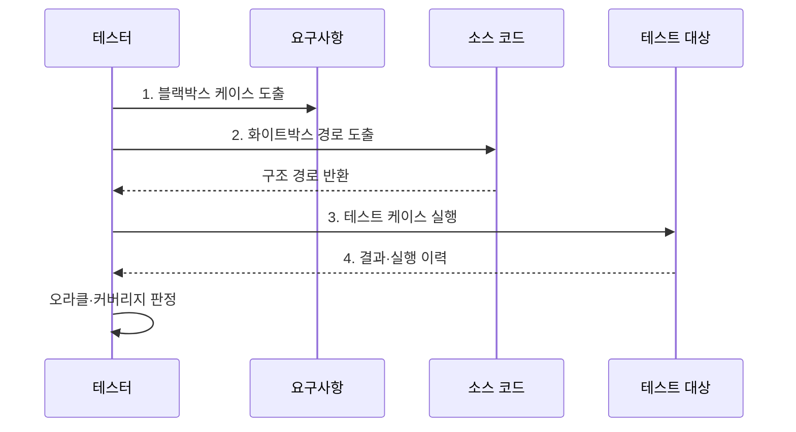

---
sidebar:
  order: 60
  label: "060. 화이트박스·블랙박스 테스트 (White-box Black-box Testing)"
  badge:
    text: "미출 · 50%"
    variant: note
title: "화이트박스·블랙박스 테스트 (White-box Black-box Testing)"
date: "2026-08-02T23:10:00+09:00"
tags:
  - "notes-software"
weight: 60
extra:
  question_no: "060"
  source_status: "미출"
  source_history: ""
  priority: 50
  priority_note: "내부·외부 관점 테스트 선택 기준"
---

## Ⅰ. 개요

핵심 용어

- **화이트박스·블랙박스 테스트(White-box and Black-box Testing)**: 같은 소프트웨어를 코드 내부 구조와 외부 명세라는 서로 다른 근거로 검증하는 두 방식이다.
- **테스트 근거(Test Basis)**: 테스트 조건과 기대 결과를 도출하는 요구사항·설계·코드 구조 같은 정보이다.

- 정의/개념: 코드 구조나 외부 명세를 기준으로 결함을 찾는 **시험 방식**
- 배경/필요성: 외부 결과만으로는 **미실행 경로**, 코드 구조만으로는 **요구 누락** 판단 불가

#### 한줄 요약

- 버튼이 설명서대로 작동하는지 보고 뚜껑을 열어 정해 둔 내부 길도 움직이는지 확인한다.

## Ⅱ. 특징

핵심 용어

- **제어 흐름(Control Flow)**: 조건과 분기에 따라 실행할 구문과 경로가 달라지는 코드의 진행 관계이다.
- **데이터 흐름(Data Flow)**: 변수가 정의·사용·소멸하는 경로를 나타내는 관계이다.
- **상태 전이(State Transition)**: 현재 상태와 입력 사건에 따라 다음 상태가 정해지는 변화이다.

- **화이트박스**로 제어·데이터 흐름 검증
- **블랙박스**로 입력·경계·상태 전이 검증
- **상호 보완**으로 명세 누락·숨은 경로 탐지

#### 한줄 요약

- 겉 동작 검사는 빠진 기능을 찾고 내부 검사는 지나가지 않은 길을 찾아 빈틈을 채운다.

## Ⅲ. 구조 및 구성요소

핵심 용어

- **테스트 케이스(Test Case)**: 입력·사전 조건·기대 결과를 묶어 기능이나 코드 경로를 검사하도록 명세한 항목이다.
- **테스트 오라클(Test Oracle)**: 실제 실행 결과의 성공·실패를 판정할 기대 결과나 규칙이다.
- **구조 커버리지(Structural Coverage)**: 테스트가 구문·분기·조건 같은 코드 구조를 실행한 비율이다.

| 구성요소 | 책임 |
|:---|:---|
| 화이트박스 근거 | **제어·데이터 흐름** 제공 |
| 블랙박스 근거 | **요구·상태 전이**와 인터페이스 제공 |
| 테스트 케이스 | **입력·기대 결과**와 조건 명세 |
| 테스트 오라클 | **기능 성공·실패** 판정 |
| 구조 커버리지 | **구문·분기 실행 비율** 측정 |

#### 한줄 요약

- 내부 길 지도, 사용 설명서, 시험표, 정답표, 경로 계기판으로 구성된다.

## Ⅳ. 흐름도

핵심 용어

- **블랙박스 케이스(Black-box Case)**: 요구·입력 경계·상태 전이를 근거로 외부 동작을 검증하는 항목이다.
- **화이트박스 경로(White-box Path)**: 제어·데이터 흐름을 근거로 내부 실행 경로를 검증하는 항목이다.

**동작 원리**

- **1. 블랙박스 케이스 도출**: 요구·경계·상태 전이 기반
- **2. 화이트박스 경로 도출**: 제어·데이터 흐름 기반
- **3. 테스트 케이스 실행**: 두 근거를 같은 대상에 적용
- **4. 결과·실행 이력**: 기능 결과와 경로 자료 수집

> 요약: 외부 기능 결과와 내부 실행 경로의 공백을 서로 다른 근거로 보강

#### 한줄 요약

- 빈틈이 기능인지 내부 길인지 나눠 검사표를 실행하고 빠진 곳을 채운다.

## Ⅴ. 종류 및 비교

핵심 용어

- **화이트박스 테스트(White-box Testing)**: 코드 구조와 실행 경로를 근거로 내부 결함을 찾는 방식이다.
- **블랙박스 테스트(Black-box Testing)**: 외부 명세와 입출력을 근거로 요구 불일치를 찾는 방식이다.

| 비교 항목 | 화이트박스 테스트 | 블랙박스 테스트 |
|:---|:---|:---|
| 적용 기준 | 내부 **경로 실패 영향**이 클 때 | **요구 불일치 영향**이 클 때 |
| 핵심 특징 | **코드 구조·실행 경로** 기반 검증 | **외부 명세·입출력** 기반 검증 |
| 한계 | **명세 누락** 탐지 한계 | **숨은 경로** 탐지 한계 |

> 요약: 내부 경로는 화이트, 요구 동작은 블랙 우선

#### 한줄 요약

- 끊긴 길은 화이트박스가 찾고 기능 누락은 블랙박스가 잘 찾는다.

## Ⅵ. 실무 고려사항 및 대책

핵심 용어

- **커버리지 맹신(Coverage Fallacy)**: 높은 구조 커버리지를 결함 부재나 요구 충족의 증거로 잘못 해석하는 오류이다.
- **동등 분할·경계값 분석(Equivalence Partitioning and Boundary Value Analysis)**: 비슷한 입력을 묶고 오류가 잦은 범위 경계를 검사하는 기법이다.
- **커버리지 도구(Coverage Tool)**: 실행 이력을 수집해 구조별 실행 비율과 미실행 경로를 표시하는 도구이다.
- **보상 분기(Compensation Branch)**: 완료되지 않은 작업의 영향을 되돌리는 내부 실행 경로이다.

| 문제 | 대책 | 효과 |
|:---|:---|:---|
| 높은 커버리지를 결함 부재로 오해함 | **의미 있는 단언·블랙박스 시험** 병행 | **커버리지 맹신** 방지 |
| 요구 명세가 틀려 기대 결과도 왜곡됨 | **업무 규칙 검토·독립 오라클** 확보 | **기대 결과 정확성** 향상 |
| 모든 입력과 실행 경로의 조합이 폭증함 | **동등 분할·경계값 분석**으로 입력 선별 | **테스트 수** 통제 |
| 내부 구현에 결합된 경로 시험이 누적됨 | 중요 **제어·데이터 위험**만 고정 | **리팩터링 내성** 확보 |
| 요구와 코드의 시험 사각지대를 따로 관리함 | **요구·코드 추적성**으로 케이스 연결 | **기능·구조 공백** 식별 |
| 실패 보상 분기의 미실행 여부를 알 수 없음 | **커버리지 도구·보상 분기** 점검 | **숨은 경로 결함** 탐지 |

#### 한줄 요약

- 끝값이 맞는지 확인하고 실패했을 때 돈을 돌려주는 내부 길도 살펴본다.

## Ⅶ. 결론

핵심 용어

- **요구 위험(Requirement Risk)**: 외부 명세의 누락이나 잘못된 기대 결과로 기능이 업무 요구를 충족하지 못할 위험이다.
- **경로 위험(Path Risk)**: 중요한 내부 분기나 데이터 흐름이 실행되지 않거나 잘못 처리될 위험이다.

- 요구·입력 경계 위험은 **블랙박스**, 제어·데이터 경로 위험은 **화이트박스** 선택

#### 한줄 요약

- 겉 기능은 설명서 기준으로, 내부 길은 코드를 보며 함께 검사한다.
