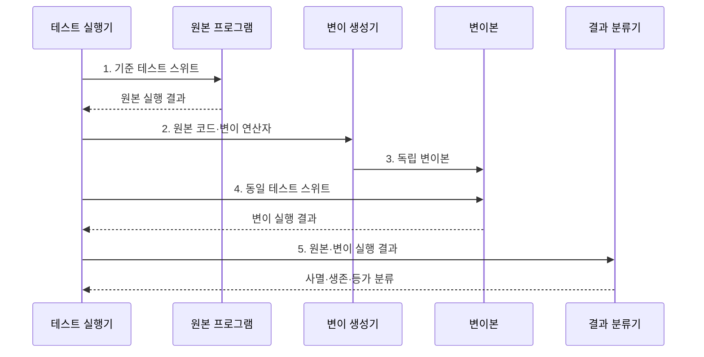

---
sidebar:
  order: 61
  label: "061. 뮤테이션 테스트 (Mutation Testing)"
  badge:
    text: "미출제 · 50%"
    variant: note
title: "뮤테이션 테스트 (Mutation Testing)"
date: "2026-07-30T23:14:08+09:00"
tags:
  - "notes-software"
weight: 61
extra:
  question_no: "061"
  source_status: "미출제"
  source_history: ""
  priority: 50
  priority_note: "뮤테이션은 테스트 탐지력 검증 기법"
---

## 미리 알고가기

- **뮤테이션 테스트(Mutation Testing)**: 코드에 작은 결함을 의도적으로 넣고 기존 테스트의 실패 여부로 결함 탐지력을 평가하는 기법
- **변이본(Mutant)**: 원본 코드에 연산자 교체나 조건 반전 같은 변경 하나를 적용해 만든 프로그램
- **변이 연산자(Mutation Operator)**: 산술·관계·논리 연산자나 구문을 정해진 규칙으로 바꾸는 코드 변환 규칙
- **사멸·생존(Killed and Survived)**: 변이본 때문에 테스트가 실패하면 사멸, 계속 통과하면 생존으로 분류하는 상태
- **등가 변이(Equivalent Mutant)**: 코드는 달라도 관찰 가능한 동작이 원본과 같아 어떤 테스트로도 사멸시킬 수 없는 변이본
- **변이 점수(Mutation Score, MS)**: 전체 변이본 $M$에서 등가 변이 $E$를 제외하고 테스트가 사멸시킨 변이 $K$의 비율인 $MS=K/(M-E)\times100$으로 테스트 결함 탐지력을 나타낸다.
- **변이 점수 기호(MS·K·M·E)**: 엠에스는 점수, 케이는 사멸 수, 엠은 전체 수, 이는 등가 수를 나타내며 비등가 변이 대비 사멸 비율을 표기한다.
- **테스트 스위트(Test Suite)**: 원본과 모든 변이본에 같은 입력과 검증식을 실행해 동작 차이를 찾는 테스트 모음
- **구조 커버리지(Structural Coverage)**: 테스트가 구문·분기·조건 같은 코드 구조를 실행한 비율로, 뮤테이션 점수와 달리 실행 범위를 측정
- **검증식(Assertion)**: 실제 실행 결과가 기대값이나 조건과 일치하는지 판정해 변이본을 사멸시키는 명령
- **변이 생성기(Mutant Generator)**: 원본 코드에 변이 연산자를 하나씩 적용해 독립 변이본을 만드는 도구
- **결과 분류기(Result Classifier)**: 변이 실행 결과를 사멸·생존·등가로 구분하고 변이 점수를 집계하는 구성요소
- **선택적 뮤테이션(Selective Mutation)**: 결함 위험이 큰 코드와 대표 변이 연산자만 골라 실행 비용을 줄이는 방식

## Ⅰ. 개요

- 정의/개념: 인위적 코드 결함으로 테스트 탐지력을 재는 **시험 기법**
- 배경/필요성: 실행 커버리지로 알 수 없는 **결함 탐지력** 평가

### 쉽게 이해하기 (학습용)

- 믿을 만한지 보려고 모의 사고를 내고 경보가 울리는지 확인하는 검사이다.

## Ⅱ. 특징

- **단일 변경**: 변이본마다 코드 변경 하나만 적용
- **기준 검증**: 원본 통과 후 사멸 여부 판정
- **원인 분류**: 생존 원인과 실행 비용 함께 분석

### 쉽게 이해하기 (학습용)

- 숫자나 기호를 하나씩 바꿔 채점기가 오답을 놓치는 이유를 찾는 방식이다.

## Ⅲ. 구조 및 구성요소

| 구성요소 | 책임 |
|:---|:---|
| 원본 프로그램 | **정상 실행·변이 생성 기준** 제공 |
| 변이 연산자 | **구문 변경 규칙** 제공 |
| 변이본 집합 | **독립 변이본** 실행 대상 관리 |
| 테스트 스위트 | 동일 **입력·검증식** 실행 |
| 결과 분류기 | **사멸·생존·등가** 상태와 점수 관리 |

### 쉽게 이해하기 (학습용)

- 원본을 바꾸는 규칙과 검사 도구가 복사본의 오류 탐지 여부를 판정한다.

## Ⅳ. 흐름도

**동작 원리**

- **1. 기준 테스트 스위트**: 기존 테스트의 정상 통과 확인
- **2. 원본 코드·변이 연산자**: 결함을 모사할 구문 변경 선택
- **3. 독립 변이본**: 변경 하나만 포함해 생존 원인 격리
- **4. 동일 테스트 스위트**: 원본과 같은 입력·검증식 실행
- **5. 원본·변이 실행 결과**: 동작 차이로 사멸·생존·등가 판정

$$MS=\frac{K}{M-E}\times100$$

> 요약: 비등가 생존 변이에 입력·검증식 보강

### 쉽게 이해하기 (학습용)

- 바꾼 복사본을 검사하고 들키지 않은 변경의 원인을 찾아 검증을 보강한다.

## Ⅴ. 종류 및 비교

| 판단 기준 | 뮤테이션 테스트 | 구조 커버리지 |
|:---|:---|:---|
| 적용 기준 | **검증식의 결함 탐지력** 확인 | **미실행 코드 구조** 식별 |
| 핵심 특징 | 결함 주입 후 **사멸·생존** 판정 | 실행된 **구문·분기 비율** 측정 |
| 한계 | **등가 변이·반복 실행** 비용 | 실행만으로 **결함 탐지력** 오판 |

> 요약: 뮤테이션은 탐지력, 커버리지는 실행 범위 측정

### 쉽게 이해하기 (학습용)

- 쪽수를 세는 것은 커버리지이고 일부러 넣은 오답을 찾는 것은 뮤테이션이다.

## Ⅵ. 실무 고려사항 및 대책

| 고려사항 | 대책 | 효과 |
|:---|:---|:---|
| 모든 변이에 전체 테스트를 반복해 실행 시간 증가 | **선택적 뮤테이션**으로 고위험 코드 우선 실행 | **반복 실행 시간** 단축 |
| 등가 변이를 분모에 포함해 변이 점수 왜곡 | **자동 후보 제거·수동 검토** | **변이 점수 신뢰성** 확보 |
| 반환값만 검증해 상태·상호작용 변이 생존 | **결과·상태·상호작용 검증식** 추가 | **생존 변이 탐지력** 향상 |
| 일반 연산자가 불가능한 도메인 상태를 생성 | **도메인 결함 기반 변이 연산자** 선택 | **보강 대상 유효성** 확보 |
| 점수 목표가 저위험 테스트 추가를 유도 | **고위험 생존 변이** 중심 평가 | **테스트 보강 효과** 확보 |

> 적용 사례: 요금 계산기는 반올림·한도 변이가 생존하면 경계 입력과 검증식을 보강

### 쉽게 이해하기 (학습용)

- 코드 기호를 하나 바꿔 통과하면 계산 결과를 확인하는 정답표를 구체화한다.

## Ⅶ. 결론

- **결함 위험·실행 비용**을 보고 변이 시험 범위를 결정

### 쉽게 이해하기 (학습용)

- 영향이 큰 계산에만 모의 오류를 넣고 검사가 놓친 실제 차이만 보강한다.
