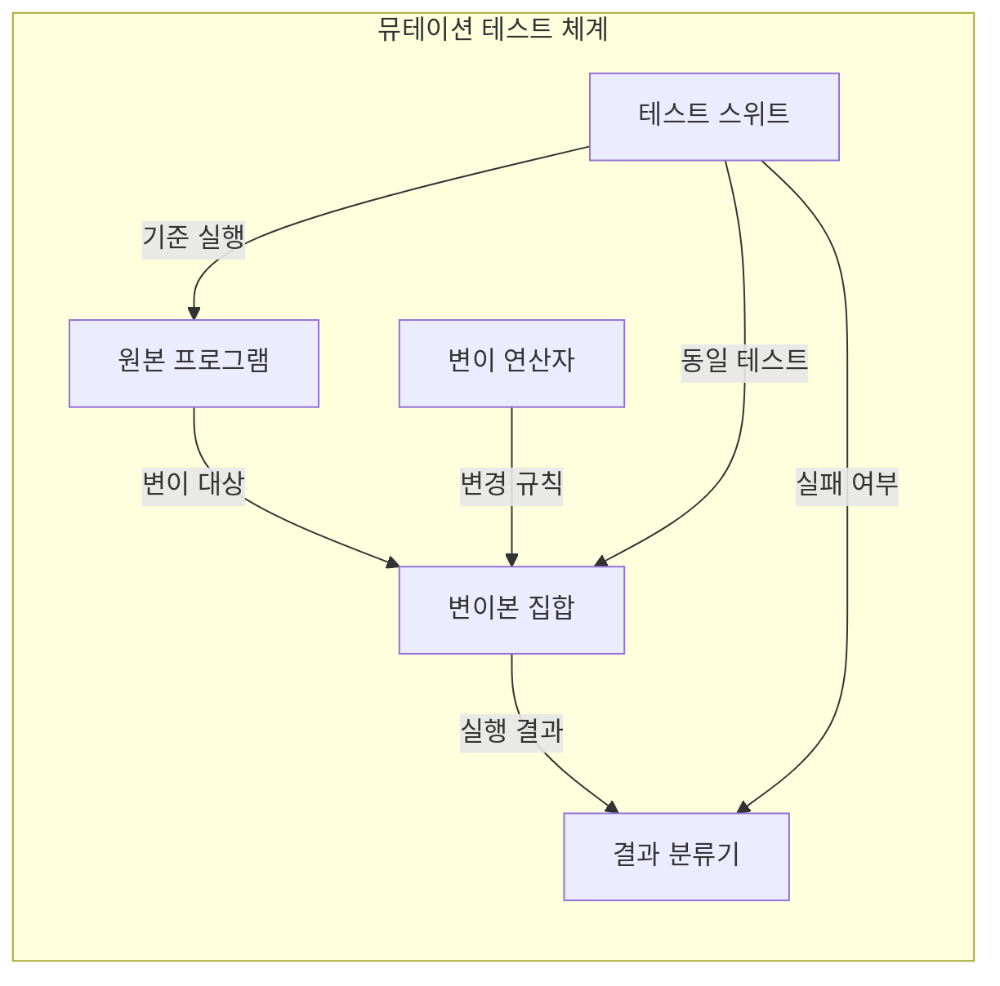
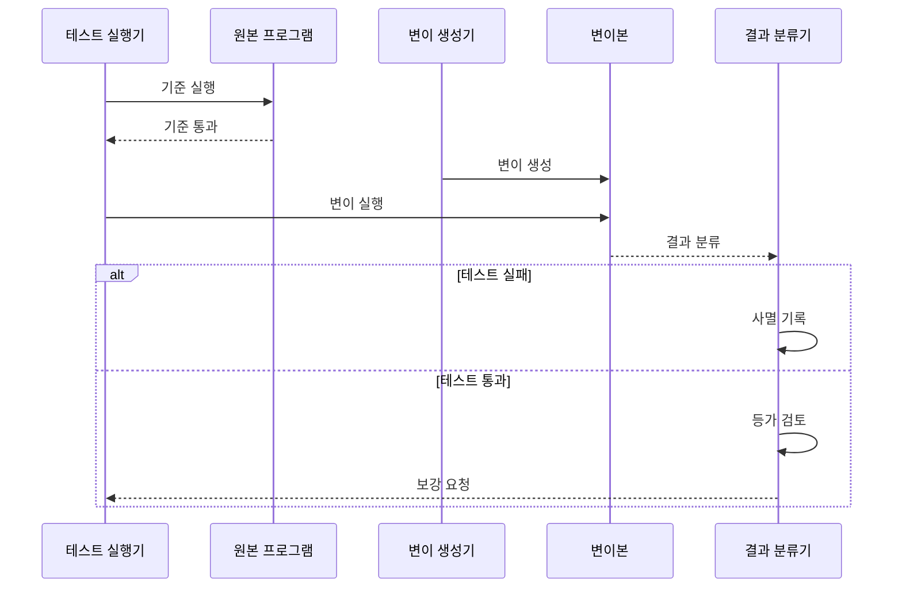

---
sidebar:
  order: 61
  label: "061. 뮤테이션 테스트 (Mutation Testing)"
  badge:
    text: "미출제 · 50%"
    variant: note
title: "뮤테이션 테스트 (Mutation Testing)"
date: "2026-07-25T17:53:00+09:00"
tags:
  - "notes-software"
weight: 61
extra:
  question_no: "061"
  source_status: "미출제"
  source_history: ""
  priority: 50
  priority_note: "뮤테이션은 테스트 탐지력 검증 기법"
---

## 미리 알고가기

- **뮤테이션 테스트(Mutation Testing)**: 코드에 작은 결함을 의도적으로 넣고 기존 테스트의 실패 여부로 결함 탐지력을 평가하는 기법
- **변이본(Mutant)**: 원본 코드에 연산자 교체나 조건 반전 같은 변경 하나를 적용해 만든 프로그램
- **변이 연산자(Mutation Operator)**: 산술·관계·논리 연산자나 구문을 정해진 규칙으로 바꾸는 코드 변환 규칙
- **사멸·생존(Killed and Survived)**: 변이본 때문에 테스트가 실패하면 사멸, 계속 통과하면 생존으로 분류하는 상태
- **등가 변이(Equivalent Mutant)**: 코드는 달라도 관찰 가능한 동작이 원본과 같아 어떤 테스트로도 사멸시킬 수 없는 변이본
- **변이 점수(Mutation Score, MS)**: $MS=K/(M-E)\times100$은 ‘엠에스는 케이를 엠 마이너스 이로 나눈 뒤 백을 곱함’으로 읽고 Mutation Score·Killed·Mutant·Equivalent의 머리글자를 쓴 표기로, 전체 변이본 $M$에서 등가 변이 $E$를 제외한 사멸 변이 $K$의 백분율로 테스트 탐지력을 나타냄
- **테스트 스위트(Test Suite)**: 원본과 모든 변이본에 같은 입력과 검증식을 실행해 동작 차이를 찾는 테스트 모음
- **구조 커버리지(Structural Coverage)**: 테스트가 구문·분기·조건 같은 코드 구조를 실행한 비율로, 뮤테이션 점수와 달리 실행 범위를 측정
- **검증식(Assertion)**: 실제 실행 결과가 기대값이나 조건과 일치하는지 판정해 변이본을 사멸시키는 명령
- **변이 생성기(Mutant Generator)**: 원본 코드에 변이 연산자를 하나씩 적용해 독립 변이본을 만드는 도구
- **결과 분류기(Result Classifier)**: 변이 실행 결과를 사멸·생존·등가로 구분하고 변이 점수를 집계하는 구성요소

## Ⅰ. 개요

- 정의/개념: 인위적 코드 결함으로 테스트 스위트의 탐지력 평가
- **배경/필요성**: 커버리지의 검증력 한계로 변이 탐지 필요

### 쉽게 이해하기 (학습용)

- 믿을 만한지 보려고 모의 사고를 내고 경보가 울리는지 확인하는 검사임

## Ⅱ. 특징

- 변이본마다 연산자 교체·조건 반전을 하나씩 적용한다.
- 원본 테스트 통과가 변이 사멸 판정의 전제가 된다.
- 생존 원인을 등가·미실행·약한 검증식으로 분류한다.
- 변이본별 반복 실행은 테스트 계산 비용을 늘린다.

### 쉽게 이해하기 (학습용)

- 숫자나 기호를 하나씩 바꿔 채점기가 오답을 놓치는 이유를 찾는 방식임

## Ⅲ. 아키텍처 및 구성요소

| 설계 요소 | 설명 |
|:---|:---|
| 원본 프로그램 | 정상 실행과 변이 생성의 기준 코드 |
| 변이 연산자 | 산술·관계·논리 구문의 변경 규칙 |
| 변이본 집합 | 변경 하나씩 적용한 독립 실행 대상 |
| 테스트 스위트 | 원본·변이본에 같은 입력·검증식 실행 |
| 결과 분류기 | 사멸·생존·등가 상태와 점수 관리 |

> 요약: 변이본 실행 결과로 테스트의 결함 탐지력 분류

### 쉽게 이해하기 (학습용)

- 원본을 바꾼 복사본과 같은 검증지로 차이를 잡는 채점기가 연결된 구조임

## Ⅳ. 원리 및 절차 흐름도

| 절차 | 설명 |
|:---|:---|
| 기준 실행 | 원본에 전체 테스트 스위트 실행 |
| 기준 통과 | 원본 실패가 없을 때 변이 평가 시작 |
| 변이 생성 | 연산자 하나로 독립 변이본 생성 |
| 변이 실행 | 변이본에 같은 테스트 스위트 실행 |
| 결과 분류 | 테스트 실패·통과 상태 전달 |
| 사멸 기록 | 실패한 변이본을 탐지 성공으로 기록 |
| 등가 검토 | 생존 변이의 동작 동등성 판정 |
| 보강 요청 | 비등가 생존 변이의 테스트 보강 |

$$MS=\frac{K}{M-E}\times100$$

> 요약: 비등가 생존 변이에 입력·검증식 보강

### 쉽게 이해하기 (학습용)

- 바꾼 복사본을 검사하고 들키지 않은 변경의 원인을 찾아 검증을 보강함

## Ⅴ. 종류 및 비교

| 판단 기준 | 뮤테이션 테스트 | 구조 커버리지 |
|:---|:---|:---|
| 핵심 특징 | 결함 주입으로 테스트 검출력 측정 | 실행된 코드 구조를 비율로 측정 |
| 판정 결과 | 사멸·생존·등가와 변이 점수 | 실행 항목과 커버리지 비율 |
| 적용 기준 | 검증식의 결함 탐지력을 확인할 때 | 미실행 구조를 먼저 찾을 때 |
| 주요 위험 | 동등 변이·높은 실행 비용 | 실행만으로 결함 검출력 오판 |

> 요약: 뮤테이션은 탐지력, 커버리지는 실행 범위 측정

### 쉽게 이해하기 (학습용)

- 쪽수를 세는 것은 커버리지이고 일부러 넣은 오답을 찾는 것은 뮤테이션임

## Ⅵ. 실무 사례

1. 요금 계산기는 반올림·한도 변이 생존 시 검증식 보강

### 쉽게 이해하기 (학습용)

- 코드 기호를 하나 바꿔 통과하면 계산 결과를 확인하는 정답표를 구체화함

## Ⅶ. 결론

- 고위험 코드의 비등가 생존 변이만 입력·검증식 보강

### 쉽게 이해하기 (학습용)

- 영향이 큰 계산에만 모의 오류를 넣고 검사가 놓친 실제 차이만 보강함
