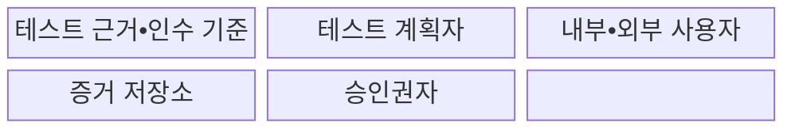
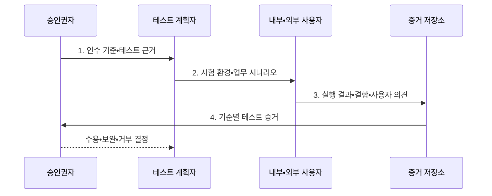

---
sidebar:
  order: 62
  label: "062. 알파•베타•인수 테스트 (Alpha Beta Acceptance Testing)"
  badge:
    text: "기출 • 50%"
    variant: note
title: "알파•베타•인수 테스트 (Alpha Beta Acceptance Testing)"
date: "2026-08-03T09:18:33+09:00"
tags:
  - "notes-software"
weight: 62
extra:
  question_no: "062"
  source_status: "기출"
  source_history: "129회"
  priority: 50
  priority_note: "129회 기출, 사용자 검증 단계 비교"
---

## Ⅰ. 개요

핵심 용어

- **인수 테스트(Acceptance Testing)**: 사용자•발주자의 업무•계약•운영 기준 충족 여부를 증거로 판정하는 테스트이다.
- **업무•현장 적합성**: 시스템이 실제 사용자의 업무 흐름과 운영 환경에 맞는 정도이다.

- 정의/개념: **알파•베타•인수 테스트** 는 내부 환경과 제한된 실제 사용자 환경에서 제품을 검증하고 업무•계약 기준 충족 여부를 사용자 증거로 판정하는 수용 시험
- 배경/필요성: 개발 환경 시험만으로 실제 **업무•현장 적합성 확인 불가**

#### 한줄 요약

- 만든 조직의 시험을 넘어 실제 사용자가 자기 업무와 환경에서 써 보고 받을 수 있는 제품인지 결정한다.

## Ⅱ. 특징

핵심 용어

- **알파(Alpha Testing)**: 개발 조직이 통제하는 환경에서 내부 인력이나 선정 사용자가 수행하는 초기 검증이다.
- **베타(Beta Testing)**: 실제 사용 환경에서 외부 사용자가 현장 문제와 사용성을 검증하는 시험이다.
- **인수 기준(Acceptance Criteria)**: 시스템을 수용하기 위해 충족해야 할 기능•품질•업무 조건이다.

- 알파의 **통제 환경•신속한 결함 재현**
- 베타의 **실사용 환경•사용자 다양성**
- 인수 기준 기반의 **최종 수용 판정**

#### 한줄 요약

- 내부에서 원인을 빨리 찾고 외부 현장의 다양한 문제를 확인한 뒤, 합의한 조건으로 최종 수용 여부를 판단한다.

## Ⅲ. 구조 및 구성요소

핵심 용어

- **테스트 근거(Test Basis)**: 테스트 범위와 조건을 도출하는 요구사항•계약•업무 규칙이다.
- **증거 저장소(Evidence Repository)**: 실행 결과•결함•의견과 인수 기준의 연결 기록을 보관하는 저장소이다.
- **승인권자(Approver)**: 증거를 근거로 수용•보완•거부를 결정하는 사람이다.

| 구성요소 | 책임 |
|:---|:---|
| 테스트 근거•인수 기준 | 요구•계약의 **측정 가능한 수용 조건** 제공 |
| 테스트 계획자 | **환경•참여자•범위** 배정 |
| 내부•외부 사용자 | **실제 업무 시나리오** 수행 |
| 증거 저장소 | 결과•결함•의견의 **기준별 증거** 보관 |
| 승인권자 | 증거 기반 **수용•보완•거부** 결정 |

#### 한줄 요약

- 합격 조건과 참여자, 승인 책임을 나눠 사용자 검증 체계를 구성한다.

## Ⅳ. 흐름도

핵심 용어

- **UAT(User Acceptance Testing, 사용자 인수 테스트)**: 최종 사용자가 업무 시나리오와 수용 기준의 충족 여부를 확인하는 시험이다.
- **테스트 증거(Test Evidence)**: 실행 결과•결함•사용자 의견을 인수 기준과 연결한 판정 기록이다.
- **잔여 위험(Residual Risk)**: 통제 조치 후에도 남아 승인 여부를 판단해야 하는 위험이다.

**동작 원리**

- **1. 인수 기준•테스트 근거**: 승인권자가 측정 가능한 수용 조건 확정
- **2. 시험 환경•업무 시나리오**: 알파•베타•UAT의 역할과 범위 구분
- **3. 실행 결과•결함•사용자 의견**: 지정 환경에서 실제 업무 검증
- **4. 기준별 테스트 증거**: 충족 여부와 잔여 위험을 승인권자에게 제공

> 요약: 목적에 맞는 환경에서 얻은 사용자 증거를 합의한 인수 기준과 대조

#### 한줄 요약

- 받을 조건과 시험 장소를 정한 뒤 사용자가 실제 업무를 수행하고 그 결과로 합격•보완•거부를 결정한다.

## Ⅴ. 종류 및 비교

핵심 용어

- **결함 재현**: 같은 조건에서 오류를 다시 발생시켜 원인과 수정 결과를 확인하는 활동이다.
- **현장 적합성 확인**: 실제 장소•네트워크•장치와 사용자 다양성에서 시스템의 적합성을 검증하는 활동이다.
- **업무 수용 판정**: 합의한 업무 기준에 따라 제품의 수용 여부를 최종 결정하는 활동이다.

| 사용자 검증 방식 | 알파 테스트 | 베타 테스트 | 사용자 인수 테스트 |
|:---|:---|:---|:---|
| 적용 기준 | 출시 전 **결함 재현•신속 수정** | 출시 전 **현장 적합성 확인** | 납품 전 **업무 수용 판정** |
| 핵심 특징 | 내부 통제 환경의 **선정 사용자 시험** | 외부 실사용 환경의 **제한 공개 시험** | 사용자 업무의 **인수 기준 대조** |
| 한계 | 실제 환경•**사용자 다양성 부족** | 환경 편차•**결함 재현 어려움** | 기준 합의•**승인 일정 의존** |

> 요약: 결함 재현•현장 검증•수용 판정 목적에 따라 선택

#### 한줄 요약

- 알파는 내부에서 원인을 찾고, 베타는 현장의 다양성을 확인하며, 인수 테스트는 받을 조건을 최종 판정한다.

## Ⅵ. 실무 고려사항 및 대책

핵심 용어

- **대표 사용자•환경 표본**: 현장의 역할•장치•네트워크 차이를 반영하도록 선정한 시험 참여자와 조건이다.
- **최소화(Data Minimization)**: 시험 목적에 필요한 최소한의 사용자•업무 데이터만 수집•보관하는 원칙이다.
- **가명화(Pseudonymization)**: 추가 정보 없이는 개인을 식별할 수 없도록 데이터를 바꾸는 조치이다.
- **측정 가능한 판정 조건**: 값•범위•관찰 방법을 명시해 합격 여부를 같은 기준으로 판단할 수 있는 인수 조건이다.
- **진단 정보•재현 절차**: 결함 발생 시각•환경•입력•로그와 같은 오류를 다시 만드는 실행 순서이다.
- **보관 기한(Retention Period)**: 시험 데이터와 증거를 유지한 뒤 삭제해야 하는 기간이다.
- **심각도•위험 책임자(Severity•Risk Owner)**: 결함 영향의 등급과 미해결 위험의 수용•완화를 책임지는 주체이다.

| 문제 | 대책 | 효과 |
|:---|:---|:---|
| 인수 기준이 측정 불가능해 합격 해석이 상충 | **측정 가능한 판정 조건** 사전 합의 | **결과 해석 차이** 축소 |
| 역할•환경•장치 표본 편향으로 현장 문제 누락 | **대표 사용자•환경 표본** 구성 | **현장 결함 발견 범위** 확대 |
| 베타 환경의 진단 정보 부족으로 결함 재현 실패 | **진단 정보•재현 절차** 수집 | **외부 결함 추적성** 확보 |
| 실제 업무 데이터 사용으로 개인정보 노출 | **최소화•가명화•보관 기한** 적용 | **개인정보 노출 위험** 감소 |
| 미해결 결함의 위험 소유자 없이 제품 수용 | **심각도•잔여 위험•책임자** 명시 | **중요 위험 승인 누락** 방지 |

> 적용 사례: 기업 결재 시스템은 고객 검증실 알파 시험으로 업무 흐름을 검증

#### 한줄 요약

- 결재 담당자는 통제된 장소에서 업무 흐름을 확인하고, 앱 사용자는 다양한 휴대전화에서 현장 문제를 전달한다.

## Ⅶ. 결론

핵심 용어

- **알파•베타•UAT**: 내부 통제 검증, 외부 현장 검증, 사용자 수용 판정을 구분하는 시험 단계이다.
- **수용 판정**: 인수 기준과 테스트 증거를 대조해 수용•보완•거부를 결정하는 활동이다.

- **결함 재현•현장 적합성•수용 판정** 에 따라 **알파•베타•UAT** 선택

#### 한줄 요약

- 무엇을 확인할지에 따라 내부 통제 시험, 외부 현장 시험, 합의 기준의 최종 판정을 구분한다.
