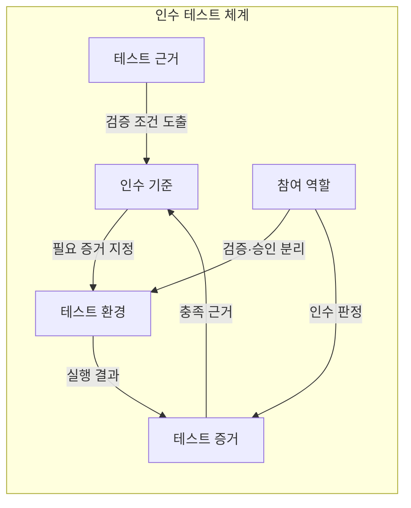
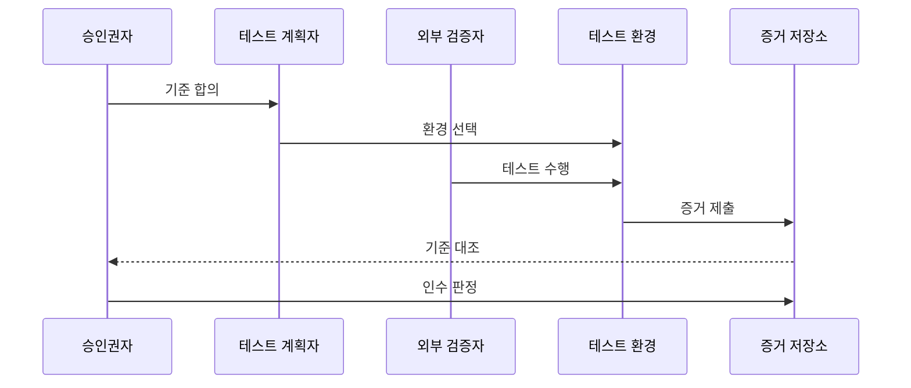

---
sidebar:
  order: 62
  label: "062. 알파·베타·인수 테스트 (Alpha Beta Acceptance Testing)"
  badge:
    text: "기출 · 50%"
    variant: note
title: "알파·베타·인수 테스트 (Alpha Beta Acceptance Testing)"
date: "2026-07-25T17:54:00+09:00"
tags:
  - "notes-software"
weight: 62
extra:
  question_no: "062"
  source_status: "기출"
  source_history: "129회"
  priority: 50
  priority_note: "129회 기출, 사용자 검증 단계 비교"
---

## 미리 알고가기

- **인수 테스트(Acceptance Testing)**: 합의한 업무·계약·운영 기준으로 시스템을 사용할 수 있는지 검증하는 테스트
- **알파 테스트(Alpha Testing)**: Alpha는 ‘알파’로 읽고 그리스 문자의 첫째 글자를 초기 검증 단계에 붙인 관례적 표기로, 개발사 통제 환경에서 잠재 사용자나 독립된 외부 역할이 결함을 재현하는 인수 테스트
- **베타 테스트(Beta Testing)**: Beta는 ‘베타’로 읽고 그리스 문자의 둘째 글자를 알파 다음 검증 단계에 붙인 관례적 표기로, 개발사 밖의 실제 사용 환경에서 잠재·기존 사용자가 현장 문제를 찾는 인수 테스트
- **인수 기준(Acceptance Criteria)**: 시스템을 수용하기 전에 충족해야 한다고 이해관계자가 합의한 조건
- **인수 판정(Acceptance Decision)**: 승인권자가 테스트 증거와 인수 기준을 대조해 수용 여부를 결정하는 행위
- **테스트 근거(Test Basis)**: 인수 범위와 조건을 도출하는 요구사항·계약·업무 규칙
- **테스트 증거(Test Evidence)**: 실행 결과·결함·사용자 의견을 인수 기준과 연결해 수용 판단을 뒷받침하는 기록
- **승인권자(Approver)**: 테스트 수행자와 분리되어 증거와 인수 기준으로 수용·보완·거부를 최종 결정하는 역할

## Ⅰ. 개요

- **정의/개념**: 사용자 증거로 인수 기준 충족 판정
- **배경/필요성**: 시험·사용 환경 차이로 단계별 수용 확인 필요

### 쉽게 이해하기 (학습용)

- 판매자나 실제 장소에서 이용자가 검증하고 조건에 따라 제품을 받을지 정함

## Ⅱ. 특징

- 알파는 통제 환경에서 결함을 재현하고 즉시 지원한다.
- 베타는 실제 환경의 사용 맥락·다양성을 반영한다.
- 필요한 인수 증거에 따라 알파·베타를 선택한다.
- 최종 수용은 합의 기준과 승인권자가 별도로 판정한다.

### 쉽게 이해하기 (학습용)

- 안에서 재현할지 밖에서 볼지 정하되 합격 도장은 합의한 조건으로 따로 찍음

## Ⅲ. 아키텍처 및 구성요소

| 설계 요소 | 설명 |
|:---|:---|
| 테스트 근거 | 요구사항·계약으로 검증 범위 도출 |
| 인수 기준 | 기능·품질·운영 수용 조건 |
| 참여 역할 | 외부 검증자와 최종 승인권자 분리 |
| 테스트 환경 | 알파·베타의 장소·운영 조건 |
| 테스트 증거 | 실행 결과와 기준 충족 여부 연결 |

> 요약: 환경별 증거를 인수 기준·승인권자에 연결

### 쉽게 이해하기 (학습용)

- 기준과 환경 및 검증자와 승인권자를 나눠 수용을 판정함

## Ⅳ. 원리 및 절차 흐름도

| 절차 | 설명 |
|:---|:---|
| 기준 합의 | 인수 조건과 최종 승인권자 지정 |
| 환경 선택 | 재현·현장 다양성에 따라 알파·베타 선택 |
| 테스트 수행 | 외부 역할이 선택 환경에서 검증 |
| 증거 제출 | 실행 결과·결함·피드백을 기록 |
| 기준 대조 | 테스트 증거와 인수 기준 비교 |
| 인수 판정 | 승인권자가 수용·보완·거부 결정 |

> 요약: 환경별 증거를 합의 기준으로 인수 판정

### 쉽게 이해하기 (학습용)

- 검증 장소에서 증거를 모아 합의 기준으로 수용을 정함

## Ⅴ. 종류 및 비교

| 판단 기준 | 알파 테스트 | 베타 테스트 |
|:---|:---|:---|
| 핵심 특징 | 개발사 통제 환경의 사전 검증 | 외부 실제 환경의 사용자 검증 |
| 검증자 | 잠재 사용자·독립된 외부 역할 | 잠재·기존 사용자 |
| 주요 목적 | 결함 재현·즉시 지원 | 실제 사용 문제·의견 수집 |
| 적용 기준 | 개발사 지원·통제가 필요할 때 | 환경·사용자 다양성이 필요할 때 |
| 주요 위험 | 통제 환경 편향 | 사용자·환경별 결과 편차 |

> 요약: 알파·베타는 인수 증거의 환경을 선택

### 쉽게 이해하기 (학습용)

- 알파는 원인을 찾고 베타는 사용을 보며 인수는 수용을 확인함

## Ⅵ. 실무 사례

1. 기업 결재 시스템은 개발사 검증실에서 알파 테스트
2. 구독형 앱은 제한 사용자 단말에서 베타 테스트

### 쉽게 이해하기 (학습용)

- 고객사 업무 담당자가 개발사 검증실에서 결재 흐름을 재현하고 문제를 바로 전달함
- 일부 실제 사용자가 자기 단말에서 앱을 써 보고 현장 문제와 의견을 보냄

## Ⅶ. 결론

- 재현은 알파·현장 다양성은 베타, 수용은 합의 기준으로 판정

### 쉽게 이해하기 (학습용)

- 받을 조건을 먼저 정하고 조건을 확인할 장소와 사람을 선택해야 함
