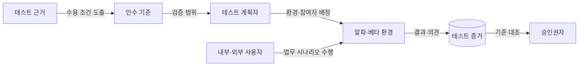
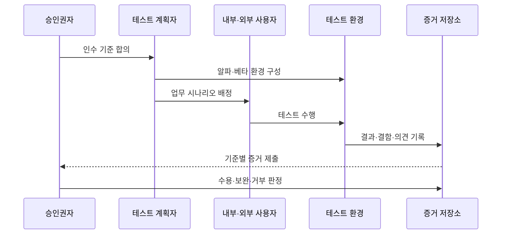

---
sidebar:
  order: 62
  label: "062. 알파·베타·인수 테스트 (Alpha Beta Acceptance Testing)"
  badge:
    text: "기출 · 50%"
    variant: note
title: "알파·베타·인수 테스트 (Alpha Beta Acceptance Testing)"
date: "2026-07-27T23:59:59+09:00"
tags:
  - "notes-software"
weight: 62
extra:
  question_no: "062"
  source_status: "기출"
  source_history: "129회"
  priority: 50
  priority_note: "129회 기출, 사용자 검증 단계 비교"
---

## 미리 알고가기

- **인수 테스트(Acceptance Testing)**: 사용자·발주자의 업무·계약·운영 기준 충족 여부를 검증해 시스템 수용을 결정하는 테스트
- **알파 테스트(Alpha Testing)**: ‘알파’로 읽고 그리스 문자의 첫 글자를 초기 검증 단계에 대응한 명칭이며, 개발 조직이 통제하는 환경에서 내부 인력·선정 사용자가 수행함
- **베타 테스트(Beta Testing)**: ‘베타’로 읽고 그리스 문자의 둘째 글자를 알파 다음 단계에 대응한 명칭이며, 실제 사용 환경에서 외부 사용자가 현장 문제와 사용성을 검증함
- **사용자 인수 테스트(User Acceptance Testing, UAT)**: ‘유에이티’로 읽고 영문 머리글자를 딴 약어이며, 최종 사용자가 업무 시나리오와 수용 기준 충족 여부를 확인함
- **인수 기준(Acceptance Criteria)**: 시스템을 수용하기 위해 충족해야 할 기능·품질·업무 조건
- **테스트 근거(Test Basis)**: 테스트 범위와 조건을 도출하는 요구사항·계약·업무 규칙
- **테스트 증거(Test Evidence)**: 실행 결과·결함·사용자 의견을 인수 기준과 연결한 판정 기록
- **승인권자(Approver)**: 테스트 수행자와 분리되어 증거를 근거로 수용·보완·거부를 결정하는 사람
- **현장 시험(Field Testing)**: 개발 조직 밖의 실제 사용 장소·네트워크·장치 조건에서 수행하는 시험

## Ⅰ. 개요

- **정의/개념**: 사용자 증거로 **인수 기준 충족 여부를 판정**
- **기존 한계**: 개발 환경 시험만으로는 **현장·업무 적합성 미확인**

### 쉽게 이해하기 (학습용)

- 만든 조직의 시험을 넘어 실제 사용자가 자기 업무와 환경에서 써 보고 받을 수 있는 제품인지 결정한다.

## Ⅱ. 특징

- 알파의 **통제 환경·신속한 결함 재현**
- 베타의 **실사용 환경·사용자 다양성**
- 인수 기준 기반의 **최종 수용 판정**

### 쉽게 이해하기 (학습용)

- 내부에서 원인을 빨리 찾고 외부 현장의 다양한 문제를 확인한 뒤, 합의한 조건으로 최종 수용 여부를 판단한다.

## Ⅲ. 아키텍처 및 구성요소

| 구성요소 | 책임 |
|:---|:---|
| 테스트 근거 | 요구·계약의 **수용 조건 제공** |
| 인수 기준 | 기능·품질의 **합격 조건 정의** |
| 테스트 계획자 | **환경·참여자·범위 배정** |
| 내부·외부 사용자 | 실제 업무의 **시나리오 수행** |
| 테스트 증거 | 결과·결함의 **기준 연결 기록** |
| 승인권자 | 증거 기반 **수용·보완·거부** |

> 요약: 환경별 사용자 증거를 합의한 인수 기준과 대조

### 쉽게 이해하기 (학습용)

- 받을 조건을 먼저 정하고 내부와 외부 사용자가 시험한 기록을 모아 최종 책임자가 수용 여부를 결정한다.

## Ⅳ. 원리 및 절차 흐름

| 절차 | 설명 |
|:---|:---|
| 인수 기준 합의 | 업무·계약의 **수용 조건 확정** |
| 환경 구성 | 목적에 맞는 **통제·현장 환경 준비** |
| 시나리오 배정 | 대표 업무와 **사용자 역할 지정** |
| 테스트 수행 | 실제 절차의 **기능·사용성 검증** |
| 증거 기록 | 결과·결함을 **인수 기준에 연결** |
| 인수 판정 | 증거 기반 **수용·보완·거부 결정** |

> 요약: 목적별 환경에서 얻은 증거로 인수 여부를 판정

### 쉽게 이해하기 (학습용)

- 받을 조건과 시험 장소를 정한 뒤 사용자가 실제 업무를 수행하고 그 결과로 합격·보완·거부를 결정한다.

## Ⅴ. 종류 및 비교

| 사용자 검증 방식 | 알파 테스트 | 베타 테스트 | 사용자 인수 테스트 |
|:---|:---|:---|:---|
| 적용 기준 | 출시 전 **결함 재현·신속 수정** | 출시 전 **현장 적합성 확인** | 납품 전 **업무 수용 판정** |
| 핵심 특징 | 내부 통제 환경의 **선정 사용자 시험** | 외부 실사용 환경의 **제한 공개 시험** | 사용자 업무의 **인수 기준 대조** |
| 한계 | 실제 환경·**사용자 다양성 부족** | 환경 편차·**결함 재현 어려움** | 기준 합의·**승인 일정 의존** |

> 요약: 결함 재현·현장 검증·수용 판정 목적에 따라 선택

### 쉽게 이해하기 (학습용)

- 알파는 내부에서 원인을 찾고, 베타는 현장의 다양성을 확인하며, 인수 테스트는 받을 조건을 최종 판정한다.

## Ⅵ. 실무 사례

1. 기업 결재 시스템은 **고객 검증실 알파 시험**으로 흐름 검증
2. 모바일 앱은 **제한 사용자 베타 시험**으로 장치별 결함 수집

### 쉽게 이해하기 (학습용)

- 결재 담당자는 통제된 장소에서 업무 흐름을 확인하고, 앱 사용자는 다양한 휴대전화에서 현장 문제를 전달한다.

## Ⅶ. 결론

- 결함 재현은 **알파**, 현장 적합성은 **베타**, 수용은 **인수 기준**

### 쉽게 이해하기 (학습용)

- 무엇을 확인할지에 따라 내부 통제 시험, 외부 현장 시험, 합의 기준의 최종 판정을 구분한다.
