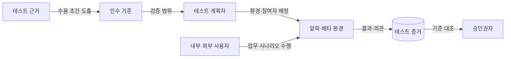
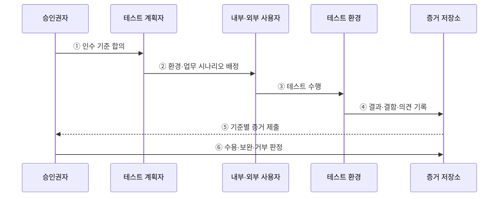

---
sidebar:
  order: 62
  label: "062. 알파·베타·인수 테스트 (Alpha Beta Acceptance Testing)"
  badge:
    text: "기출 · 50%"
    variant: note
title: "알파·베타·인수 테스트 (Alpha Beta Acceptance Testing)"
date: "2026-07-27T23:59:59+09:00"
tags:
  - "notes-software"
weight: 62
extra:
  question_no: "062"
  source_status: "기출"
  source_history: "129회"
  priority: 50
  priority_note: "129회 기출, 사용자 검증 단계 비교"
---

## 미리 알고가기

- **인수 테스트(Acceptance Testing)**: 사용자·발주자의 업무·계약·운영 기준 충족 여부를 검증해 시스템 수용을 결정하는 테스트
- **알파 테스트(Alpha Testing)**: 개발 조직이 통제하는 환경에서 내부 인력이나 선정 사용자가 수행하는 초기 검증
- **베타 테스트(Beta Testing)**: 실제 사용 환경에서 외부 사용자가 현장 문제와 사용성을 검증하는 시험
- **사용자 인수 테스트(User Acceptance Testing, UAT)**: 최종 사용자가 업무 시나리오와 수용 기준의 충족 여부를 확인하는 시험
- **인수 기준(Acceptance Criteria)**: 시스템을 수용하기 위해 충족해야 할 기능·품질·업무 조건
- **테스트 근거(Test Basis)**: 테스트 범위와 조건을 도출하는 요구사항·계약·업무 규칙
- **테스트 증거(Test Evidence)**: 실행 결과·결함·사용자 의견을 인수 기준과 연결한 판정 기록
- **승인권자(Approver)**: 테스트 수행자와 분리되어 증거를 근거로 수용·보완·거부를 결정하는 사람
- **현장 시험(Field Testing)**: 개발 조직 밖의 실제 사용 장소·네트워크·장치 조건에서 수행하는 시험
- **개인정보 최소화(Data Minimization)**: 시험 목적에 필요한 최소한의 사용자·업무 데이터만 수집·보관하는 원칙

## Ⅰ. 개요

- 정의/개념: 사용자 증거로 **인수 기준 충족 여부를 판정**
- 기존 한계: 개발 환경 시험만으로는 **현장·업무 적합성 미확인**

### 쉽게 이해하기 (학습용)

- 만든 조직의 시험을 넘어 실제 사용자가 자기 업무와 환경에서 써 보고 받을 수 있는 제품인지 결정한다.

## Ⅱ. 특징

- 알파의 **통제 환경·신속한 결함 재현**
- 베타의 **실사용 환경·사용자 다양성**
- 인수 기준 기반의 **최종 수용 판정**

### 쉽게 이해하기 (학습용)

- 내부에서 원인을 빨리 찾고 외부 현장의 다양한 문제를 확인한 뒤, 합의한 조건으로 최종 수용 여부를 판단한다.

## Ⅲ. 아키텍처 및 구성요소

**도표안 A — 구조도**

**도표안 B — sequenceDiagram**

| 구성요소 | 책임 |
|:---|:---|
| 테스트 근거 | 요구·계약의 수용 조건 제공 |
| 인수 기준 | 기능·품질의 합격 조건 정의 |
| 테스트 계획자 | 환경·참여자·범위 배정 |
| 내부·외부 사용자 | 실제 업무의 시나리오 수행 |
| 테스트 증거 | 결과·결함의 기준 연결 기록 |
| 승인권자 | 증거 기반 수용·보완·거부 |

**동작 원리**

- ① 승인권자와 계획자가 업무·계약의 수용 조건을 확정한다.
- ② 시험 목적에 맞는 통제 수준·사용자 역할·업무 시나리오를 배정한다.
- ③ 내부 또는 외부 사용자가 실제 절차로 기능과 사용성을 검증한다.
- ④ 테스트 환경의 결과·결함·의견을 인수 기준과 연결해 기록한다.
- ⑤ 증거 저장소가 기준별 충족 여부와 미해결 위험을 제출한다.
- ⑥ 승인권자가 증거를 근거로 수용·보완·거부를 결정한다.

> 요약: 목적에 맞는 환경에서 얻은 사용자 증거를 합의한 인수 기준과 대조한다.

### 쉽게 이해하기 (학습용)

- 받을 조건과 시험 장소를 정한 뒤 사용자가 실제 업무를 수행하고 그 결과로 합격·보완·거부를 결정한다.

## Ⅳ. 종류 및 비교

| 사용자 검증 방식 | 알파 테스트 | 베타 테스트 | 사용자 인수 테스트 |
|:---|:---|:---|:---|
| 적용 기준 | 출시 전 **결함 재현·신속 수정** | 출시 전 **현장 적합성 확인** | 납품 전 **업무 수용 판정** |
| 핵심 특징 | 내부 통제 환경의 **선정 사용자 시험** | 외부 실사용 환경의 **제한 공개 시험** | 사용자 업무의 **인수 기준 대조** |
| 한계 | 실제 환경·**사용자 다양성 부족** | 환경 편차·**결함 재현 어려움** | 기준 합의·**승인 일정 의존** |

> 요약: 결함 재현·현장 검증·수용 판정 목적에 따라 선택

### 쉽게 이해하기 (학습용)

- 알파는 내부에서 원인을 찾고, 베타는 현장의 다양성을 확인하며, 인수 테스트는 받을 조건을 최종 판정한다.

## Ⅴ. 실무 고려사항 및 대책

| 고려사항 | 문제점 | 대책 |
|:---|:---|:---|
| 모호한 인수 기준 | 결과 해석과 수용 결정이 이해관계자마다 다름 | 시험 전에 측정 가능한 합격·보완·거부 조건 합의 |
| 대표성 부족 | 소수 사용자·장치로 현장 문제 누락 | 업무 역할·환경·장치별 대표 표본 구성 |
| 베타 결함 재현 | 외부 환경 정보가 부족해 원인 추적 곤란 | 동의 기반 진단 정보와 재현 절차를 구조화해 수집 |
| 시험 데이터 노출 | 실제 사용자·업무 정보가 불필요하게 수집 | 개인정보 최소화·가명화·보관 기한 적용 |
| 미해결 결함 수용 | 일정 때문에 중요 위험이 판정에서 누락 | 결함 심각도·잔여 위험·보완 책임을 증거에 명시 |

> 적용 사례: 기업 결재 시스템은 고객 검증실 알파 시험으로 업무 흐름을 검증한다.

### 쉽게 이해하기 (학습용)

- 결재 담당자는 통제된 장소에서 업무 흐름을 확인하고, 앱 사용자는 다양한 휴대전화에서 현장 문제를 전달한다.

## Ⅵ. 결론

- 알파·베타·인수 테스트는 통제 환경, 실제 현장, 최종 수용이라는 서로 다른 근거를 제공한다.
- 시험 목적·환경·승인 책임에 맞춰 구분하고 인수 기준으로 최종 판정한다.

### 쉽게 이해하기 (학습용)

- 무엇을 확인할지에 따라 내부 통제 시험, 외부 현장 시험, 합의 기준의 최종 판정을 구분한다.
