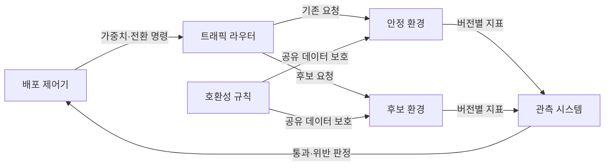
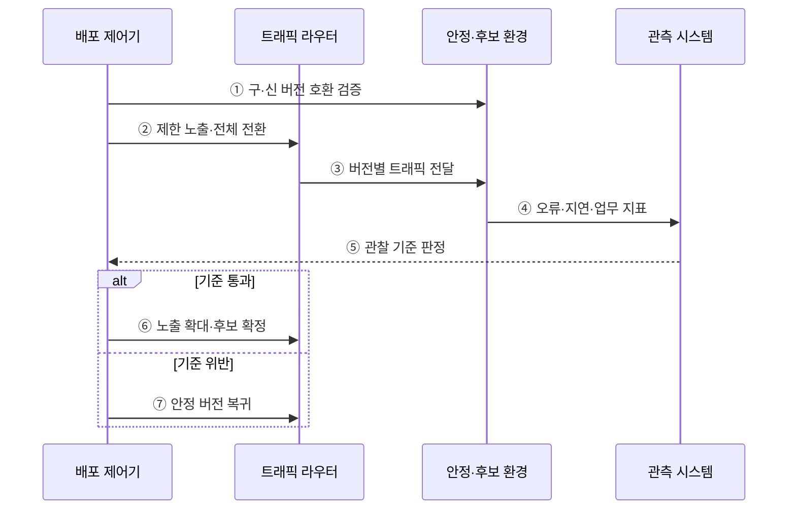

---
sidebar:
  order: 63
  label: "063. 카나리 배포·블루-그린 배포 (Canary Blue-Green Deployment)"
  badge:
    text: "기출 · 70%"
    variant: note
title: "카나리 배포·블루-그린 배포 (Canary Blue-Green Deployment)"
date: "2026-07-27T23:59:59+09:00"
tags:
  - "notes-software"
weight: 63
extra:
  question_no: "063"
  source_status: "기출"
  source_history: "132회, 138회"
  priority: 70
  priority_note: "132·138회 반복, 점진 배포 전략 핵심"
---

## 미리 알고가기

- **카나리 배포(Canary Deployment)**: 광부가 유독가스를 먼저 감지하려 카나리아를 활용한 관행에서 유래한 명칭이며, 새 버전을 소수 트래픽에 먼저 노출해 위험을 조기에 탐지함
- **블루-그린 배포(Blue-Green Deployment)**: 두 운영 환경을 색 이름으로 구분한 명칭이며, 구·신 버전을 병렬 운영하고 전체 트래픽을 한 번에 전환함
- **트래픽 가중치(Traffic Weight)**: 전체 요청 중 특정 버전으로 보낼 비율을 지정하는 라우팅 값
- **영향 반경(Blast Radius)**: 새 버전 결함의 영향을 받는 사용자·요청·자원의 범위
- **관찰 기준(Observation Criteria)**: 오류율·지연·업무 성공률로 배포 확대·중단·복귀를 판단하는 조건
- **점진적 전달(Progressive Delivery)**: 운영 지표와 정책에 따라 새 버전·기능의 노출 범위를 단계적으로 확대하는 방식
- **안정·후보 버전(Stable·Candidate Version)**: 현재 운영 중인 검증 버전과 다음 운영 대상으로 평가 중인 새 버전
- **트래픽 라우터(Traffic Router)**: 요청을 안정·후보 버전에 비율 배분하거나 전체 전환하는 구성요소
- **배포 제어기(Deployment Controller)**: 관찰 기준 결과에 따라 노출 확대·전환·복귀를 실행하는 구성요소
- **호환성 규칙(Compatibility Rule)**: 구·신 버전이 공유 데이터와 인터페이스를 동시에 사용할 수 있도록 정한 규칙
- **외부 부작용(External Side Effect)**: 결제·알림처럼 트래픽을 되돌려도 외부에서 자동 취소되지 않는 처리 결과
- **확장-축소 변경(Expand-Contract Change)**: 구·신 버전이 함께 사용할 구조를 먼저 추가하고 전환이 끝난 뒤 이전 구조를 제거하는 호환 변경 방식

## Ⅰ. 개요

- 정의/개념: 트래픽 노출·환경 전환으로 **배포 위험을 통제**
- 기존 한계: 일괄 교체 배포의 **결함 전체 확산·복구 지연**

### 쉽게 이해하기 (학습용)

- 일부 손님에게 먼저 새 제품을 주거나 새 매장 전체를 준비한 뒤 입구를 바꿔 위험과 전환 시간을 줄이는 방식이다.

## Ⅱ. 특징

- 카나리의 **점진 노출·영향 범위 제한**
- 블루-그린의 **병렬 환경·즉시 전환**
- 구·신 버전의 **데이터·인터페이스 호환**

### 쉽게 이해하기 (학습용)

- 카나리는 일부 사용자부터 관찰하고, 블루-그린은 새 환경 전체를 미리 준비해 입구만 바꾼다.

## Ⅲ. 아키텍처 및 구성요소

**도표안 A — 구조도**

**도표안 B — sequenceDiagram**

| 구성요소 | 책임 |
|:---|:---|
| 배포 제어기 | 확대·전환·복귀 정책 실행 |
| 트래픽 라우터 | 버전별 요청 비율·대상 제어 |
| 안정 환경 | 검증된 기존 서비스 제공 |
| 후보 환경 | 새 버전의 제한·대체 서비스 |
| 관측 시스템 | 버전별 지표의 수집·판정 |
| 호환성 규칙 | 구·신 버전의 동시 동작 보장 |

**동작 원리**

- ① 배포 전에 구·신 버전의 데이터와 API가 함께 동작하는지 검증한다.
- ② 전략에 따라 후보 버전에 일부 또는 전체 트래픽을 할당한다.
- ③ 라우터가 요청을 안정·후보 환경으로 구분해 전달한다.
- ④ 각 환경이 버전별 오류·지연·업무 성과를 관측 시스템에 보낸다.
- ⑤ 관측 시스템이 지표를 허용 임계값과 대조한다.
- ⑥ 기준을 통과하면 후보 버전의 노출을 확대하거나 전체 전환한다.
- ⑦ 기준을 위반하면 신규 요청을 안정 버전으로 되돌린다.

> 요약: 호환성을 확보한 뒤 운영 지표로 후보 버전의 확대 또는 복귀를 결정한다.

### 쉽게 이해하기 (학습용)

- 두 버전이 함께 일할 수 있는지 확인하고 실제 요청을 보낸 뒤 지표가 좋으면 새 버전을 넓히고 나쁘면 되돌린다.

## Ⅳ. 종류 및 비교

| 배포 전략 | 카나리 배포 | 블루-그린 배포 |
|:---|:---|:---|
| 적용 기준 | 지표 관찰·**영향 범위 최소화** | 빠른 전환·**즉시 라우팅 복귀** |
| 핵심 특징 | 후보 트래픽의 **단계적 확대** | 병렬 환경의 **일괄 전환** |
| 한계 | 장시간 공존·**지표 판정 복잡** | 이중 자원·**전환 시 전체 영향** |

> 요약: 점진 관찰은 카나리, 병렬 환경 전환은 블루-그린

### 쉽게 이해하기 (학습용)

- 카나리는 새 버전 사용자를 조금씩 늘리고, 블루-그린은 새 환경 전체를 준비해 입구를 한 번에 바꾼다.

## Ⅴ. 실무 고려사항 및 대책

| 고려사항 | 문제점 | 대책 |
|:---|:---|:---|
| 데이터 비호환 | 복귀한 구 버전이 새 구조를 읽지 못함 | 확장-축소 변경으로 구·신 버전 동시 호환 확보 |
| 표본 부족 | 적은 카나리 요청으로 드문 결함 판단 불가 | 최소 표본·관찰 시간과 업무별 트래픽 구성 |
| 지표 혼합 | 버전별 성능 차이가 전체 평균에 가려짐 | 버전·사용자군별 기술·업무 지표 분리 |
| 외부 부작용 | 복귀해도 이미 실행한 결제·알림은 남음 | 멱등 처리·보상 절차·비가역 작업의 노출 제한 |
| 이중 환경 비용 | 블루-그린 동안 자원 비용이 증가 | 전환 시간·용량 계획과 유휴 환경 회수 자동화 |

> 적용 사례: 결제 서비스는 1% 카나리 트래픽의 오류율을 관찰한 뒤 노출을 확대한다.

### 쉽게 이해하기 (학습용)

- 결제는 일부 요청으로 위험을 제한하고, 주문은 완성된 새 환경을 미리 시험한 뒤 전체 입구를 바꾼다.

## Ⅵ. 결론

- 카나리는 점진적 관찰로 영향 반경을 줄이고 블루-그린은 병렬 환경으로 전환·복귀를 빠르게 한다.
- 위험 검증 방식과 이중 환경 비용에 맞춰 전략을 선택한다.

### 쉽게 이해하기 (학습용)

- 일부 사용자부터 확인하려면 카나리를, 두 환경 사이를 빠르게 바꾸려면 블루-그린을 선택한다.
