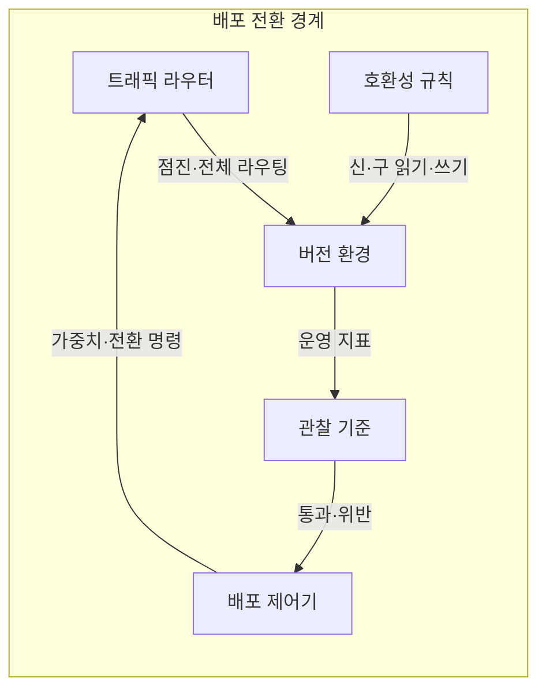
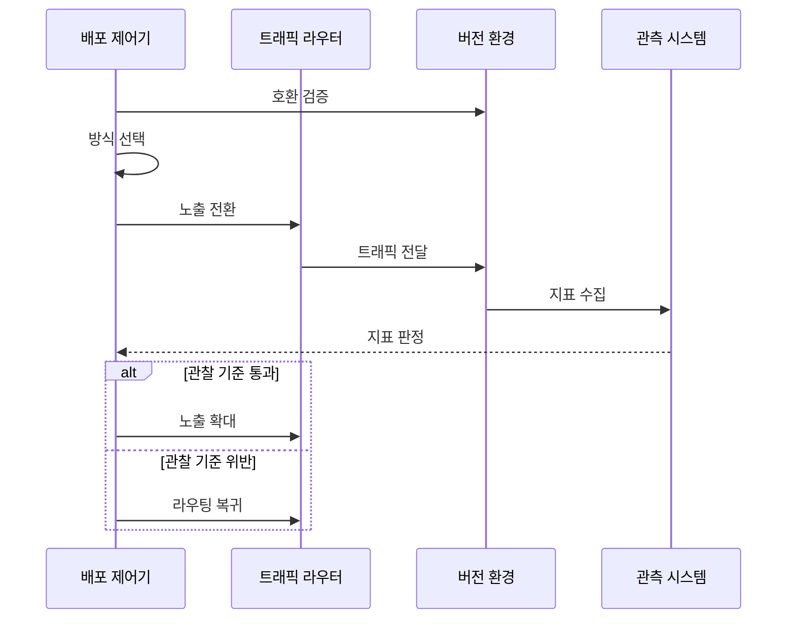

---
sidebar:
  order: 63
  label: "063. 카나리 배포·블루-그린 배포 (Canary Blue-Green Deployment)"
  badge:
    text: "기출 · 70%"
    variant: note
title: "카나리 배포·블루-그린 배포 (Canary Blue-Green Deployment)"
date: "2026-07-25T17:55:00+09:00"
tags:
  - "notes-software"
weight: 63
extra:
  question_no: "063"
  source_status: "기출"
  source_history: "132회, 138회"
  priority: 70
  priority_note: "132·138회 반복, 점진 배포 전략 핵심"
---

## 미리 알고가기

- **카나리 배포(Canary Deployment)**: 새 버전에 일부 트래픽을 보내고 운영 지표에 따라 노출 비율을 단계적으로 늘리는 방식
- **블루-그린 배포(Blue-Green Deployment)**: 구·신 버전의 동일한 두 환경을 병렬 운영하고 전체 라우팅을 한 번에 전환하는 방식
- **트래픽 가중치(Traffic Weight)**: 전체 요청 중 후보 버전으로 보낼 비율을 정하는 라우팅 값
- **블라스트 반경(Blast Radius)**: 새 버전의 결함이 영향을 미치는 사용자·요청·자원의 범위
- **관찰 기준(Observation Criteria)**: 오류율·지연·업무 성공률로 배포 확대·중단·복귀를 판정하는 조건
- **점진적 전달(Progressive Delivery)**: 운영 지표와 정책으로 새 버전이나 기능의 노출 범위를 단계적으로 승격하는 방식
- **안정·후보 버전(Stable·Candidate Version)**: 현재 운영이 검증된 버전과 다음 운영 대상으로 평가 중인 새 버전
- **트래픽 라우터(Traffic Router)**: 배포 제어 명령에 따라 요청을 안정·후보 버전으로 나누거나 전체 전환하는 구성요소
- **배포 제어기(Deployment Controller)**: 관찰 기준의 통과·위반에 따라 후보 노출을 확대하거나 안정 버전으로 복귀시키는 구성요소
- **호환성 규칙(Compatibility Rule)**: 신·구 버전이 공유 데이터와 인터페이스를 동시에 읽고 쓸 수 있도록 허용 범위를 정한 규칙
- **관측 시스템(Observability System)**: 버전별 오류율·지연·업무 성공률을 수집해 배포 제어기의 판단 근거를 제공하는 시스템
- **외부 부작용(External Side Effect)**: 알림 발송·결제 승인처럼 라우팅을 되돌려도 이미 외부에서 실행되어 자동 복원되지 않는 변화
- **라우팅 복귀(Routing Rollback)**: 관찰 기준 위반 시 신규 요청을 후보 버전에서 안정 버전으로 다시 전환하는 조치

## Ⅰ. 개요

- **정의/개념**: 점진 노출·환경 전환으로 배포 위험 통제
- **배경/필요성**: 신버전 결함 확산으로 노출·복귀 통제 필요

### 쉽게 이해하기 (학습용)

- 새 기계를 먼저 쓰게 하거나 옆에 완성한 기계로 스위치를 바꿔 위험을 줄임

## Ⅱ. 특징

- 카나리는 대표 트래픽·관찰 지표로 노출 확대를 판단한다.
- 블루-그린은 병렬 환경 비용으로 즉시 복귀를 얻는다.
- 외부 부작용·데이터 변경은 라우팅 복귀로 복원되지 않는다.
- 공유 데이터는 신·구 버전에서 동시에 호환돼야 한다.

### 쉽게 이해하기 (학습용)

- 사용자를 늘리려면 관찰 기록이 필요하고 연결을 바꾸려면 새 환경을 따로 둬야 함

## Ⅲ. 아키텍처 및 구성요소

| 설계 요소 | 설명 |
|:---|:---|
| 트래픽 라우터 | 버전별 요청 비율·전환 대상 제어 |
| 버전 환경 | 안정·후보 버전을 격리해 병렬 실행 |
| 관찰 기준 | 오류·지연·업무 성공의 승격 조건 |
| 배포 제어기 | 지표에 따라 확대·전환·복귀 실행 |
| 호환성 규칙 | 신·구 버전의 데이터 접근 범위 |

> 요약: 관찰 기준·호환성이 트래픽 전환을 통제

### 쉽게 이해하기 (학습용)

- 라우터가 두 버전을 연결하고 지표와 호환성이 전환을 제한함

## Ⅳ. 원리 및 절차 흐름도

| 절차 | 설명 |
|:---|:---|
| 호환 검증 | 신·구 버전의 동작·데이터 호환 확인 |
| 방식 선택 | 관찰성·병렬 용량으로 전환 방식 결정 |
| 노출 전환 | 소량 또는 전체 트래픽을 후보에 할당 |
| 트래픽 전달 | 라우터가 선택한 버전 환경으로 요청 전달 |
| 지표 수집 | 오류율·지연·업무 성공률 측정 |
| 지표 판정 | 관찰 기준 충족 여부로 확대·복귀 결정 |
| 노출 확대 | 카나리 통과 시 후보 비율 증가 |
| 라우팅 복귀 | 기준 위반 시 안정 버전으로 전환 |

> 요약: 호환성·운영 지표로 노출 확대·복귀 결정

### 쉽게 이해하기 (학습용)

- 호환성을 확인하고 조금씩 늘리거나 전체 입구를 바꿈

## Ⅴ. 종류 및 비교

| 판단 기준 | 카나리 배포 | 블루-그린 배포 |
|:---|:---|:---|
| 핵심 특징 | 후보 트래픽을 점진 확대 | 검증한 신환경으로 전체 전환 |
| 결함 영향 | 선택한 소량 트래픽으로 제한 | 전환 후 전체 신규 트래픽에 영향 |
| 주요 위험 | 관찰 오류·두 버전 운영 복잡도 | 전환 순간의 전체 결함 영향 |
| 적용 기준 | 측정하며 영향 범위를 줄일 때 | 즉시 전체 전환·복귀가 필요할 때 |

> 요약: 카나리는 점진 관찰, 블루-그린은 일괄 전환

### 쉽게 이해하기 (학습용)

- 카나리는 일부를 전환하고 블루그린은 전체 입구를 전환함

## Ⅵ. 실무 사례

1. 결제 서비스는 오류율 임계치로 카나리 트래픽 확대
2. 주문 서비스는 신·구 환경 검증 후 전체 라우팅 전환

### 쉽게 이해하기 (학습용)

- 결제 요청 일부만 새 버전에 보내 오류가 허용 범위일 때 사용자를 늘림
- 주문 서비스는 새 환경 전체를 미리 검사한 뒤 입구를 한 번에 바꾸고 이전 환경을 남김

## Ⅶ. 결론

- 점진 위험 관찰은 카나리, 즉시 전체 전환은 블루-그린

### 쉽게 이해하기 (학습용)

- 조금씩 바꿀지 한 번에 바꿀지 정해도 되돌릴 방법을 준비해야 함
