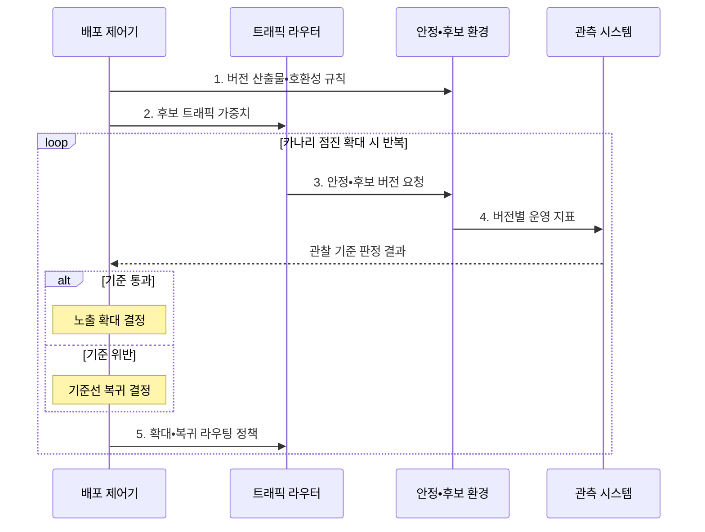

---
sidebar:
  order: 63
  label: "063. 카나리 배포•블루-그린 배포 (Canary Blue-Green Deployment)"
  badge:
    text: "기출 • 70%"
    variant: note
title: "카나리 배포•블루-그린 배포 (Canary Blue-Green Deployment)"
date: "2026-08-04T17:45:00+09:00"
tags:
  - "notes-software"
weight: 63
extra:
  question_no: "063"
  source_status: "기출"
  source_history: "132회, 138회"
  priority: 70
  priority_note: "132•138회 반복, 점진 배포 전략 핵심"
---

## Ⅰ. 개요

핵심 용어

- **배포 전략**: 새 버전의 트래픽 노출과 환경 전환을 제어해 운영 위험을 제한하는 방식이다.
- **카나리 배포(Canary Deployment)**: 새 버전을 일부 트래픽부터 점진 확대하는 전략이다.
- **블루-그린 배포(Blue-Green Deployment)**: 구버전과 신버전 환경의 전체 라우팅을 전환하는 전략이다.
- **전체 사용자 영향(Full-user Impact)**: 배포 실패가 모든 사용자 요청에 확산되는 위험이다.
- **복구 지연(Recovery Delay)**: 실패한 배포의 정상화가 늦어지는 위험이다.

- 정의/개념: **카나리•블루그린 배포** 는 새 버전의 트래픽 노출 비율을 점진적으로 늘리거나 두 환경을 전환하여 변경 위험과 복구 시간을 통제하는 배포 전략
- 배경/필요성: 일괄 교체는 결함 발생 시 **전체 사용자 영향•복구 지연**

#### 한줄 요약

- 일부 손님에게 먼저 새 제품을 주거나 새 매장 전체를 준비한 뒤 입구를 바꿔 위험과 전환 시간을 줄이는 방식이다.

## Ⅱ. 특징

핵심 용어

- **점진 노출(Progressive Exposure)**: 후보 버전의 트래픽을 조금씩 늘리는 원칙이다.
- **영향 범위 제한(Blast-radius Limitation)**: 후보 결함이 미치는 요청 범위를 줄이는 원칙이다.
- **병렬 환경(Parallel Environment)**: 구버전과 신버전 환경을 동시에 준비하는 구조다.
- **즉시 전환(Instant Switch)**: 라우팅만 바꾸어 버전을 빠르게 전환하는 방식이다.
- **데이터 호환(Data Compatibility)**: 두 버전이 같은 데이터를 안전하게 사용하는 성질이다.
- **인터페이스 호환(Interface Compatibility)**: 두 버전이 같은 계약을 안전하게 사용하는 성질이다.

- 카나리의 **점진 노출•영향 범위 제한**
- 블루-그린의 **병렬 환경•즉시 전환**
- 구•신 버전의 **데이터•인터페이스 호환**

#### 한줄 요약

- 카나리는 일부 사용자부터 관찰하고, 블루-그린은 새 환경 전체를 미리 준비해 입구만 바꾼다.

## Ⅲ. 구조 및 구성요소

핵심 용어

- **배포 제어기(Deployment Controller)**: 관찰 기준에 따라 노출 확대•전환•복귀 정책을 실행하는 구성요소이다.
- **트래픽 라우터(Traffic Router)**: 요청을 안정•후보 버전에 비율 배분하거나 전체 전환하는 구성요소이다.
- **관측 시스템(Observability System)**: 버전별 오류•지연•업무 성공률을 수집하고 판정하는 구성요소이다.

| 구성요소 | 책임 |
|:---|:---|
| 배포 제어기 | **확대•전환•복귀 정책** 실행 |
| 트래픽 라우터 | 버전별 **트래픽 가중치•대상** 제어 |
| 안정 환경 | 검증된 **안정 버전 서비스** 제공 |
| 후보 환경 | 새 버전의 **제한•대체 서비스** 제공 |
| 관측 시스템 | **버전별 운영 지표** 수집•판정 |

#### 한줄 요약

- 제어기와 라우터가 두 환경의 노출을 바꾸고 관측 결과를 확인한다.

## Ⅳ. 흐름도

핵심 용어

- **버전 산출물(Version Artifact)**: 후보 환경에 배포하는 실행 이미지•패키지와 설정 묶음이다.
- **호환성 규칙(Compatibility Rule)**: 구•신 버전이 공유 데이터와 인터페이스를 함께 사용하도록 정한 규칙이다.
- **트래픽 가중치(Traffic Weight)**: 전체 요청 중 특정 버전으로 보낼 비율을 지정하는 라우팅 값이다.
- **관찰 기준(Observation Criteria)**: 오류율•지연•업무 성공률로 확대•중단•복귀를 판단하는 조건이다.

**동작 원리**

- **1. 버전 산출물•호환성 규칙**: 데이터•API의 양방향 호환 확인
- **2. 후보 트래픽 가중치**: 카나리 비율 또는 전체 전환 비율 설정
- **3. 안정•후보 버전 요청**: 가중치에 따라 요청 대상을 분리
- **4. 버전별 운영 지표**: 오류•지연•업무 성공률을 버전별 집계
- **5. 확대•복귀 라우팅 정책**: 기준 통과 시 확대하고 위반 시 복귀

> 요약: 호환성을 확보한 뒤 운영 지표로 후보 버전의 확대 또는 복귀 결정

#### 한줄 요약

- 두 버전이 함께 일할 수 있는지 확인하고 실제 요청을 보낸 뒤 지표가 좋으면 새 버전을 넓히고 나쁘면 되돌린다.

## Ⅴ. 종류 및 비교

핵심 용어

| 배포 전략 | 카나리 배포 | 블루-그린 배포 |
|:---|:---|:---|
| 적용 기준 | 지표 관찰•**영향 범위 최소화** | 빠른 전환•**즉시 라우팅 복귀** |
| 핵심 특징 | 후보 트래픽의 **단계적 확대** | 병렬 환경의 **일괄 전환** |
| 한계 | 장시간 공존•**지표 판정 복잡** | 이중 자원•**전환 시 전체 영향** |

> 요약: 점진 관찰은 카나리, 병렬 환경 전환은 블루-그린

#### 한줄 요약

- 카나리는 새 버전 사용자를 조금씩 늘리고, 블루-그린은 새 환경 전체를 준비해 입구를 한 번에 바꾼다.

## Ⅵ. 실무 고려사항 및 대책

핵심 용어

- **확장-축소 변경(Expand-Contract Change)**: 구•신 버전이 함께 사용할 구조를 먼저 추가하고 전환 후 이전 구조를 제거하는 방식이다.
- **멱등성(Idempotency)**: 같은 요청을 반복 처리해도 결과가 한 번 처리한 것과 같은 성질이다.
- **보상 절차(Compensation Procedure)**: 이미 발생한 외부 부작용을 반대 업무로 상쇄하는 절차이다.
- **버전별 지표(Per-version Metric)**: 후보와 안정 버전별로 집계한 운영 측정값이다.
- **사용자군별 지표(Per-cohort Metric)**: 코호트별로 집계한 운영 측정값이다.
- **코호트(Cohort)**: 지역•계정•기기처럼 같은 특성을 기준으로 묶어 후보 버전에 노출하는 사용자 집단이다.
- **최소 표본(Minimum Sample)**: 희귀 오류까지 판단하는 데 필요한 요청 수다.
- **관찰 시간(Observation Window)**: 후보 지표를 평가할 최소 기간이다.
- **업무별 트래픽(Business Traffic Mix)**: 핵심 업무 시나리오별 요청 구성이다.
- **노출 제한(Exposure Limit)**: 후보 버전이나 외부 부작용에 영향을 받을 수 있는 사용자•요청 비율의 상한이다.
- **용량 계획(Capacity Planning)**: 병렬 환경에 필요한 자원을 미리 산정하는 활동이다.
- **유휴 환경 자동 회수(Idle Environment Reclamation)**: 전환 뒤 쓰지 않는 환경 자원을 자동 해제하는 통제다.

| 문제 | 대책 | 효과 |
|:---|:---|:---|
| 비가역 데이터 변경으로 이전 버전 복귀 실패 | **확장-축소 변경** 으로 동시 호환 | **복귀 시 데이터 오류** 방지 |
| 표본•관찰 시간이 작아 드문 결함 미탐지 | **최소 표본•시간•업무별 트래픽** 구성 | **희귀 결함 판정 근거** 확보 |
| 버전•사용자군 지표 혼합으로 후보 이상 은폐 | **버전•사용자군별 지표** 분리 | **후보 버전 이상** 조기 탐지 |
| 복귀 후에도 결제•알림 부작용이 잔존 | **멱등성•보상 절차•노출 제한** 적용 | **중복 결제•알림 피해** 감소 |
| 블루-그린 유휴 환경 유지로 자원 비용 증가 | **용량 계획•유휴 환경 자동 회수** | **병렬 운영 비용** 통제 |

> 적용 사례: 결제 서비스는 1% 카나리 트래픽의 오류율을 관찰한 뒤 노출을 확대

#### 한줄 요약

- 결제는 일부 요청으로 위험을 제한하고, 주문은 완성된 새 환경을 미리 시험한 뒤 전체 입구를 바꾼다.

## Ⅶ. 결론

핵심 용어

- 점진적 위험 검증은 **카나리**, 즉시 전환•복귀는 **블루-그린** 선택

#### 한줄 요약

- 일부 사용자부터 확인하려면 카나리를, 두 환경 사이를 빠르게 바꾸려면 블루-그린을 선택한다.
