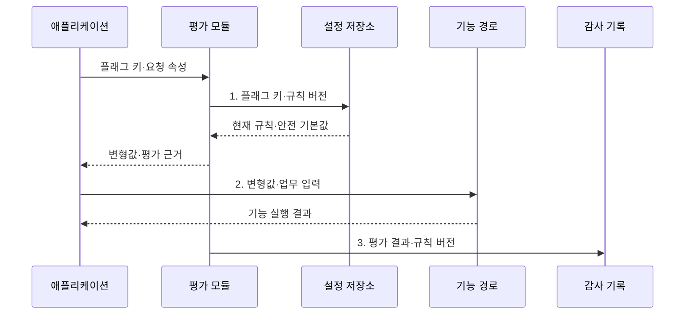

---
sidebar:
  order: 64
  label: "064. 피처 플래그 (Feature Flag)"
  badge:
    text: "기출 · 50%"
    variant: note
title: "피처 플래그 (Feature Flag)"
date: "2026-08-02T12:00:00+09:00"
tags:
  - "notes-software"
weight: 64
extra:
  question_no: "064"
  source_status: "기출"
  source_history: "138회"
  priority: 50
  priority_note: "138회 기출, 배포 분리·기능 제어 현안"
---

## Ⅰ. 개요

핵심 용어

- **실행 중 기능 경로**: 애플리케이션을 다시 배포하지 않고 요청 조건에 따라 선택하는 코드 분기이다.
- **긴급 차단**: 장애 기능의 노출을 설정 변경만으로 즉시 중단하는 운영 통제이다.

- 정의/개념: 요청 조건으로 **실행 중 기능 경로**를 선택하는 기법
- 배경/필요성: 재배포만으로는 사용자별 공개 시점·**긴급 차단 통제 불가**

### 쉽게 이해하기 (학습용)

- 기능을 미리 설치하고 사용자나 상황에 따라 스위치만 켜 공개하는 방식이다.

## Ⅱ. 특징

핵심 용어

- **배포·릴리스 분리**: 코드를 환경에 설치하는 시점과 기능을 사용자에게 공개하는 시점을 나누는 방식이다.
- **대상 규칙·코호트**: 요청 속성과 공통 특성을 가진 사용자 묶음으로 기능 노출 대상을 정하는 기준이다.
- **만료 플래그 누적**: 종료된 플래그가 코드에 남아 분기와 검증 비용을 늘리는 상태이다.

- **배포·릴리스 분리**로 코드 재배포 없이 기능 공개
- **대상 규칙·코호트**로 사용자별 기능 경로 선택
- **만료 플래그 누적**은 분기·검증 비용 증가

### 쉽게 이해하기 (학습용)

- 스위치를 오래 남기면 켜짐과 꺼짐 조합만큼 검사할 경로가 늘어난다.

## Ⅲ. 구조 및 구성요소

핵심 용어

- **설정 저장소(Configuration Store)**: 플래그 규칙·변형값·기본값과 버전을 보관하는 저장소이다.
- **평가 모듈(Evaluation Module)**: 플래그 키와 요청 속성을 규칙에 대조해 변형값을 결정하는 구성요소이다.
- **기능 경로(Feature Path)**: 평가된 변형값에 따라 애플리케이션이 실행하는 코드 분기이다.
- **감사 기록(Audit Log)**: 평가 결과·규칙 버전·변경 주체를 추적하도록 남긴 기록이다.

| 구성요소 | 책임 |
|:---|:---|
| 설정 저장소 | **규칙·변형값·기본값** 보관 |
| 평가 모듈 | **요청 속성·대상 규칙** 평가 |
| 애플리케이션 | 평가 결과로 **기능 경로** 선택 |
| 기능 경로 | 변형값별 **업무 로직 분기** 실행 |
| 감사 기록 | **평가 결과·규칙 버전** 추적 |

### 쉽게 이해하기 (학습용)

- 저장된 규칙을 평가해 기능을 선택하고 그 결과를 기록한다.

## Ⅳ. 흐름도

핵심 용어

- **안전 기본값(Safe Default)**: 규칙 조회 실패 시 핵심 기능을 유지하도록 정한 값이다.
- **변형값(Variant)**: 플래그 평가 결과로 선택되는 기능 또는 설정값이다.
- **플래그 키·규칙 버전**: 평가할 기능 설정의 식별자와 판정에 사용한 규칙의 변경 이력 값이다.

**동작 원리**

- **1. 플래그 키·규칙 버전**: 최신 규칙과 조회 실패 시 안전 기본값 확보
- **2. 변형값·업무 입력**: 평가된 변형값에 맞는 기능 경로 호출
- **3. 평가 결과·규칙 버전**: 값·규칙 버전·대상을 감사용 보존

> 요약: 요청 속성과 대상 규칙을 평가해 실행 중 기능 경로를 선택

### 쉽게 이해하기 (학습용)

- 규칙과 맞는 기능을 고르고 규칙을 읽지 못하면 안전한 기본 기능을 쓴다.

## Ⅴ. 종류 및 비교

핵심 용어

- **릴리스 플래그(Release Flag)**: 배포와 공개 시점을 분리하고 점진 공개 후 제거하는 임시 플래그이다.
- **실험 플래그(Experiment Flag)**: 코호트별 변형값을 배정해 기능 효과를 비교하는 플래그이다.
- **운영 플래그(Operational Flag)**: 장애 기능을 즉시 차단하도록 장기 유지하고 점검하는 플래그이다.

| 피처 플래그 유형 | 릴리스 플래그 | 실험 플래그 | 운영 플래그 |
|:---|:---|:---|:---|
| 적용 기준 | 배포와 **공개 시점 분리** | 변형별 **효과 비교** | 장애 기능 **즉시 차단** |
| 핵심 특징 | 점진 공개 후 **플래그 제거** | 코호트별 **변형값 배정** | 장기 유지·**정기 재검토** |
| 한계 | 만료 플래그·**분기 누적** | 표본 편향·**지표 오판** | 의존 기능·**연쇄 차단** |

> 요약: 공개·실험 플래그는 종료 후 제거하고 운영 플래그는 지속 점검

### 쉽게 이해하기 (학습용)

- 공개와 실험용 스위치는 종료 뒤 제거하고 비상 스위치는 정기적으로 점검한다.

## Ⅵ. 실무 고려사항 및 대책

핵심 용어

- **캐시·시간 제한(Cache·Timeout)**: 설정을 임시 저장하고 조회 대기 시간을 제한하는 장애 격리 수단이다.
- **일관된 배정(Sticky Assignment)**: 같은 사용자가 반복 요청해도 같은 실험 변형값을 받도록 유지하는 방식이다.
- **RBAC(Role-Based Access Control, 역할 기반 접근통제)**: 역할별로 플래그 조회·변경 권한을 제한하는 통제이다.
- **플래그 의존(Flag Dependency)**: 한 플래그의 유효한 값이 다른 플래그 상태에 좌우되는 관계이다.

| 문제 | 대책 | 효과 |
|:---|:---|:---|
| 설정 저장소 지연이 모든 기능 요청으로 전파 | **캐시·시간 제한·안전 기본값** 적용 | **요청 장애 확산** 방지 |
| 만료 플래그가 코드에 남아 분기 조합 증가 | **소유자·목적·만료일** 등록 후 제거 | **분기·시험 복잡도** 감소 |
| 요청마다 실험 변형값이 달라 사용자 경험 왜곡 | **사용자 키 기반 일관된 배정** | **경험·실험 지표** 안정화 |
| 변경 권한 집중으로 기능이 무단 노출 | **RBAC·이중 승인·감사 기록** 적용 | **무단 기능 노출** 방지 |
| 플래그 의존 조합 증가로 미검증 경로 실행 | **의존 제한·핵심 조합 자동 시험** | **미검증 경로 실행** 차단 |

> 적용 사례: 결제 검증 기능을 지정 코호트부터 공개

### 쉽게 이해하기 (학습용)

- 결제 검증을 일부 사용자에게 먼저 공개한 뒤 안정성을 확인해 전체 공개한다.

## Ⅶ. 결론

핵심 용어

- **만료 후 제거**: 목적을 달성한 임시 플래그와 관련 코드 분기를 삭제하는 수명주기 조치이다.
- **운영 플래그 유지**: 비상 제어 목적의 플래그를 정기 검증하며 지속 관리하는 운영 원칙이다.

- 점진 공개·실험은 **만료 후 제거**, 비상 제어는 **운영 플래그 유지**

### 쉽게 이해하기 (학습용)

- 플래그 목적에 맞는 유형을 고르고 임시 플래그에는 제거 날짜를 정한다.
