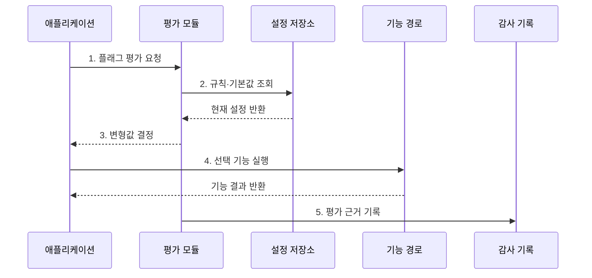

---
sidebar:
  order: 64
  label: "064. 피처 플래그 (Feature Flag)"
  badge:
    text: "기출 · 50%"
    variant: note
title: "피처 플래그 (Feature Flag)"
date: "2026-07-27T23:59:59+09:00"
tags:
  - "notes-software"
weight: 64
extra:
  question_no: "064"
  source_status: "기출"
  source_history: "138회"
  priority: 50
  priority_note: "138회 기출, 배포 분리·기능 제어 현안"
---

## 미리 알고가기

- **피처 플래그(Feature Flag)**: ‘피처 플래그’로 읽으며, 기능을 뜻하는 Feature와 표시를 뜻하는 Flag를 결합한 이름으로 실행 중 기능 경로를 선택하는 설정 장치
- **배포(Deployment)**: 코드를 실행 환경에 설치하는 작업
- **릴리스(Release)**: 설치된 기능을 사용자에게 공개하는 작업
- **코호트(Cohort)**: ‘코호트’로 읽으며, 공통 특성을 가진 집단이라는 뜻으로 같은 기능을 제공할 사용자 묶음
- **변형값(Variant)**: 플래그 평가 결과로 선택되는 기능 또는 설정값
- **킬 스위치(Kill Switch)**: 장애 발생 시 기능을 즉시 차단하는 운영 플래그
- **안전 기본값(Safe Default)**: 규칙 조회 실패 시 핵심 기능을 유지하도록 정한 값
- **플래그 부채(Flag Debt)**: 종료된 플래그가 남아 코드·검증 비용을 늘리는 상태
- **일관된 배정(Sticky Assignment)**: 같은 사용자가 반복 요청해도 같은 실험 변형값을 받도록 배정 결과를 유지하는 방식

## Ⅰ. 개요

- 정의/개념: 요청 조건으로 **실행 중 기능 경로**를 선택하는 기법
- 배경/필요성: 코드 배포와 기능 공개를 분리해 **노출 시점 통제**

### 쉽게 이해하기 (학습용)

- 기능을 미리 설치하고 사용자나 상황에 따라 스위치만 켜 공개하는 방식이다.

## Ⅱ. 특징

- **배포·릴리스 분리**로 코드 재배포 없이 기능 공개
- **대상 규칙·코호트**로 사용자별 기능 경로 선택
- **만료 플래그 누적**은 분기·검증 비용 증가

### 쉽게 이해하기 (학습용)

- 스위치를 오래 남기면 켜짐과 꺼짐 조합만큼 검사할 경로가 늘어난다.

## Ⅲ. 구조 및 구성요소

| 구성요소 | 책임 |
|:---|:---|
| 설정 저장소 | 규칙·변형값·기본값 보관 |
| 평가 모듈 | 요청 속성과 대상 규칙 평가 |
| 애플리케이션 | 변형값에 따른 기능 분기 실행 |
| 감사 기록 | 평가 결과와 규칙 버전 추적 |

### 쉽게 이해하기 (학습용)

- 저장된 규칙을 평가해 기능을 선택하고 그 결과를 기록한다.

## Ⅳ. 흐름도

**동작 원리**

- **1. 플래그 평가 요청**: 키와 요청 속성을 전달
- **2. 규칙·기본값 조회**: 장애 시 사용할 안전값까지 확보
- **3. 변형값 결정**: 요청 조건과 코호트로 경로 판정
- **4. 선택 기능 실행**: 평가 결과에 맞는 코드 경로 호출
- **5. 평가 근거 기록**: 값·규칙 버전·대상을 감사용 보존

> 요약: 요청 속성과 대상 규칙을 평가해 실행 중 기능 경로를 선택

### 쉽게 이해하기 (학습용)

- 규칙과 맞는 기능을 고르고 규칙을 읽지 못하면 안전한 기본 기능을 쓴다.

## Ⅴ. 종류 및 비교

| 피처 플래그 유형 | 릴리스 플래그 | 실험 플래그 | 운영 플래그 |
|:---|:---|:---|:---|
| 적용 기준 | 배포와 **공개 시점 분리** | 변형별 **효과 비교** | 장애 기능 **즉시 차단** |
| 핵심 특징 | 점진 공개 후 **플래그 제거** | 코호트별 **변형값 배정** | 장기 유지·**정기 재검토** |
| 한계 | 만료 플래그·**분기 누적** | 표본 편향·**지표 오판** | 의존 기능·**연쇄 차단** |

> 요약: 공개·실험 플래그는 종료 후 제거하고 운영 플래그는 지속 점검

### 쉽게 이해하기 (학습용)

- 공개와 실험용 스위치는 종료 뒤 제거하고 비상 스위치는 정기적으로 점검한다.

## Ⅵ. 실무 고려사항 및 대책

| 고려사항 | 대책 | 효과 |
|:---|:---|:---|
| 설정 저장소 장애 | 캐시·시간 제한·안전 기본값 적용 | 요청 장애 확산 방지 |
| 플래그 부채 | 소유자·목적·만료일 등록 후 제거 | 분기·시험 복잡도 감소 |
| 실험 배정 변동 | 사용자 키 기반 일관 배정 | 경험과 실험 지표 안정화 |
| 권한 오용 | 역할 권한·이중 승인·감사 적용 | 무단 기능 노출 방지 |
| 의존 플래그 충돌 | 의존 제한과 핵심 조합 자동 시험 | 미검증 경로 실행 차단 |

> 적용 사례: 결제 검증 기능을 지정 코호트부터 공개

### 쉽게 이해하기 (학습용)

- 결제 검증을 일부 사용자에게 먼저 공개한 뒤 안정성을 확인해 전체 공개한다.

## Ⅶ. 결론

- **노출 목적·안전 기본값·수명**에 따라 플래그를 운영

### 쉽게 이해하기 (학습용)

- 플래그 목적에 맞는 유형을 고르고 임시 플래그에는 제거 날짜를 정한다.
