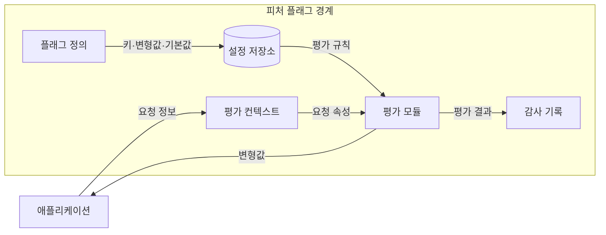
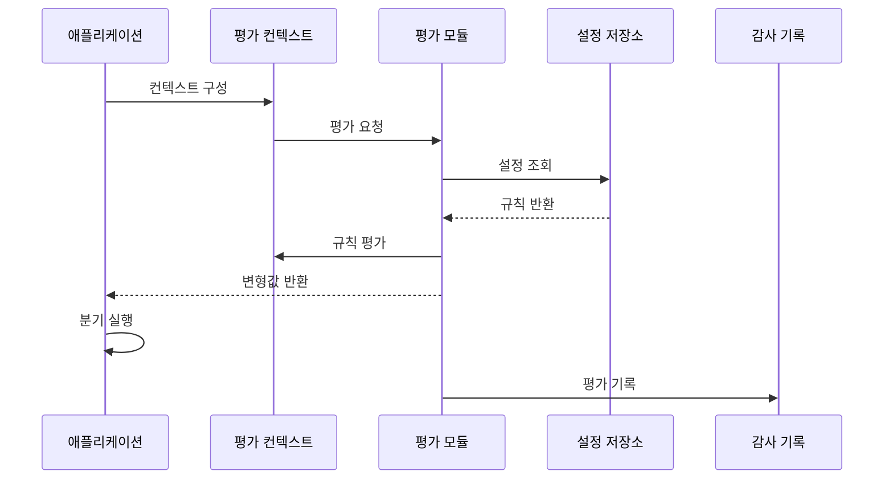

---
sidebar:
  order: 64
  label: "064. 피처 플래그 (Feature Flag)"
  badge:
    text: "기출 · 50%"
    variant: note
title: "피처 플래그 (Feature Flag)"
date: "2026-07-25T17:56:00+09:00"
tags:
  - "notes-software"
weight: 64
extra:
  question_no: "064"
  source_status: "기출"
  source_history: "138회"
  priority: 50
  priority_note: "138회 기출, 배포 분리·기능 제어 현안"
---

## 미리 알고가기

- **피처 플래그(Feature Flag)**: 요청·사용자·환경 조건으로 실행할 기능 경로를 런타임에 선택하는 설정 장치
- **배포·릴리스(Deployment and Release)**: 실행 코드를 환경에 설치하는 시점과 기능을 사용자에게 공개하는 시점
- **평가 컨텍스트(Evaluation Context)**: 사용자·서비스·지역처럼 플래그 규칙이 변형값을 선택할 때 참조하는 속성
- **변형값(Variant)**: 플래그 평가 결과로 반환돼 서로 다른 기능 동작이나 설정을 나타내는 값
- **코호트(Cohort)**: 실험·점진 공개에서 같은 변형값을 일관되게 받도록 묶은 사용자 집단
- **킬 스위치(Kill Switch)**: 장애나 과부하 때 비핵심 기능 경로를 즉시 비활성화하는 운영 플래그
- **플래그 부채(Flag Debt)**: 목적이 끝난 플래그와 분기가 남아 코드·검증·권한 비용을 늘린 상태
- **플래그 정의(Flag Definition)**: 기능을 식별하는 키와 변형값·안전 기본값·종료일을 묶어 평가 대상을 정한 설정
- **평가 모듈(Evaluation Module)**: 요청 컨텍스트를 플래그 규칙과 대조해 실행할 변형값을 반환하는 구성요소
- **설정 저장소(Configuration Store)**: 플래그 규칙·기본값·버전을 보관해 평가 모듈에 제공하는 저장소
- **감사 기록(Audit Log)**: 플래그 평가 결과와 설정 변경 주체·시각을 남겨 기능 노출 경로를 추적하는 기록
- **안전 기본값(Safe Default)**: 설정 조회 실패나 일치 규칙 부재 때 반환해 핵심 기능을 유지하도록 정한 변형값
- **릴리스 플래그(Release Flag)**: 배포된 기능의 사용자 공개 여부를 제어하고 전체 공개 뒤 제거하는 임시 플래그
- **실험 플래그(Experiment Flag)**: 코호트별 변형값을 나눠 효과를 비교하고 실험 종료 뒤 제거하는 임시 플래그
- **운영 플래그(Operational Flag)**: 장애 기능을 즉시 비활성화하도록 장기 유지하며 정기 재검토하는 플래그

## Ⅰ. 개요

- **정의/개념**: 요청 조건으로 실행 중 기능 경로 선택
- **배경/필요성**: 배포·공개 결합으로 노출 시점 분리 필요

### 쉽게 이해하기 (학습용)

- 전등을 미리 설치한 뒤 사용자나 상황에 따라 스위치만 켜 공개하는 장치임

## Ⅱ. 특징

- 같은 배포본이 요청별 규칙에 맞는 변형값을 실행한다.
- 코호트 고정은 사용자별 변형값을 일관되게 유지한다.
- 킬 스위치는 기능을 꺼도 기존 부작용을 복원하지 못한다.
- 플래그 수명·조합 증가는 코드·검증 비용을 누적한다.

### 쉽게 이해하기 (학습용)

- 스위치를 오래 남기면 켜짐·꺼짐 조합 수만큼 검사 경로가 증가함

## Ⅲ. 아키텍처 및 구성요소

| 설계 요소 | 설명 |
|:---|:---|
| 플래그 정의 | 키·변형값·안전 기본값·종료일 |
| 평가 컨텍스트 | 사용자·서비스·지역 속성 제공 |
| 평가 모듈 | 컨텍스트·규칙으로 변형값 선택 |
| 설정 저장소 | 플래그 규칙·기본값·버전 보관 |
| 감사 기록 | 평가 결과·설정 변경 이력 추적 |

> 요약: 평가 모듈이 컨텍스트·규칙으로 기능 경로 선택

### 쉽게 이해하기 (학습용)

- 스위치 규칙과 사용자 정보를 비교해 기능을 선택하고 규칙 변경자를 기록함

## Ⅳ. 원리 및 절차 흐름도

| 절차 | 설명 |
|:---|:---|
| 컨텍스트 구성 | 사용자·서비스·지역 속성을 수집 |
| 평가 요청 | 플래그 키와 컨텍스트를 모듈에 전달 |
| 설정 조회 | 플래그 규칙·안전 기본값 조회 |
| 규칙 반환 | 버전이 지정된 평가 규칙 전달 |
| 규칙 평가 | 대상 조건·코호트 우선순위 대조 |
| 변형값 반환 | 일치 규칙 또는 안전 기본값 선택 |
| 분기 실행 | 변형값에 대응하는 기능 경로 실행 |
| 평가 기록 | 키·컨텍스트·변형값·규칙 버전 기록 |

> 요약: 요청 컨텍스트로 변형값·기능 경로 선택

### 쉽게 이해하기 (학습용)

- 사용자 정보를 스위치 규칙과 비교해 맞는 기능을 선택하고 규칙이 없으면 안전한 기본 기능을 씀

## Ⅴ. 종류 및 비교

| 판단 기준 | 릴리스 플래그 | 실험 플래그 | 운영 플래그 |
|:---|:---|:---|:---|
| 핵심 특징 | 기능 공개 여부 제어 | 코호트별 변형값 제어 | 장애 기능 즉시 차단 |
| 수명 | 전체 공개 후 제거 | 실험 종료 후 제거 | 장기 유지·정기 재검토 |
| 적용 기준 | 배포와 공개를 분리할 때 | 변형별 효과를 비교할 때 | 기능 차단으로 장애를 줄일 때 |
| 주요 위험 | 만료 플래그·분기 누적 | 표본 편향·지표 오판 | 의존 기능 연쇄 차단 |

> 요약: 릴리스·실험은 제거하고 운영 플래그는 재검토

### 쉽게 이해하기 (학습용)

- 공개와 실험용 임시 스위치는 일이 끝나면 떼고 비상 스위치는 계속 쓸 이유를 정기 확인함

## Ⅵ. 실무 사례

1. 결제 검증 기능은 지정 코호트부터 공개 후 플래그 제거
2. 추천 과부하 시 킬 스위치로 추천만 비활성화

### 쉽게 이해하기 (학습용)

- 결제 검증을 정한 사용자부터 열어 모두에게 공개한 뒤 임시 스위치를 제거함
- 추천 계산이 서버를 압박하면 추천만 끄고 상품 구매 기능은 계속 제공함

## Ⅶ. 결론

- 목적·종료일·안전 기본값으로 플래그 생성·제거 결정

### 쉽게 이해하기 (학습용)

- 스위치를 만들 때 용도와 철거 날짜를 정하고 규칙을 못 읽으면 쓸 안전 기능도 준비함
