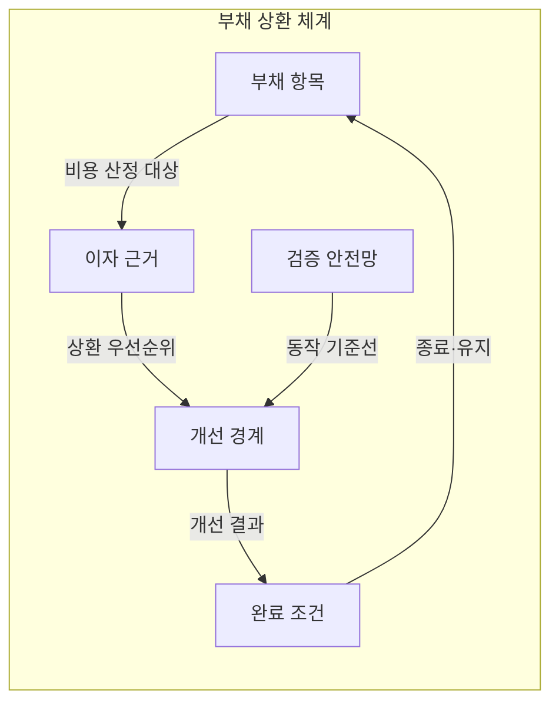
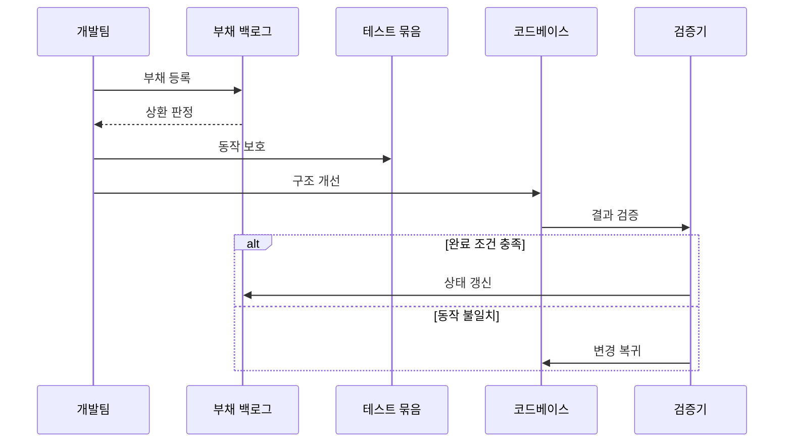

---
sidebar:
  order: 65
  label: "065. 소프트웨어 리팩터링·기술부채 (Refactoring Technical Debt)"
  badge:
    text: "기출 · 70%"
    variant: note
title: "소프트웨어 리팩터링·기술부채 (Refactoring Technical Debt)"
date: "2026-07-25T17:57:00+09:00"
tags:
  - "notes-software"
weight: 65
extra:
  question_no: "065"
  source_status: "기출"
  source_history: "123회, 129회"
  priority: 70
  priority_note: "123·129회 반복, 구조 개선·부채 관리"
---

## 미리 알고가기

- **리팩터링(Refactoring)**: 외부에서 관찰되는 동작은 유지하면서 코드 내부 구조를 개선하는 작업
- **기술부채(Technical Debt)**: 빠른 선택이나 구조 결함이 미래 변경 때 추가 비용을 반복 발생시키는 상태
- **관찰 가능한 동작(Observable Behavior)**: 입력에 대한 출력·상태·외부 상호작용처럼 개선 전후에 같아야 할 결과
- **부채 원금·이자(Principal and Interest)**: 부채를 제거하는 일회성 비용과 방치할 때 변경마다 추가되는 비용
- **회귀 테스트(Regression Test)**: 구조 변경 뒤 기존 외부 동작이 유지되는지 확인하는 테스트
- **특성화 테스트(Characterization Test)**: 명세가 부족한 기존 코드의 현재 동작을 실행 예로 기록하는 테스트
- **코드 스멜(Code Smell)**: 중복·긴 메서드·강한 결합처럼 설계 문제를 의심하게 하는 표면 징후
- **부채 백로그(Debt Backlog)**: 부채 위치·원인·소유자·이자·상환 조건을 기록한 관리 목록
- **부채 항목(Debt Item)**: 한 기술부채의 위치·원인·소유자와 상환 조건을 추적하도록 백로그에 등록한 단위
- **이자 근거(Interest Evidence)**: 변경 시간·빈도·결함 영향으로 부채를 방치할 때 반복되는 추가 비용을 판단하는 자료
- **검증 안전망(Verification Safety Net)**: 작은 구조 변경 전후의 관찰 가능한 동작을 비교해 의도하지 않은 변화를 찾는 테스트 묶음
- **개선 경계(Improvement Boundary)**: 한 번에 동작 보존을 검증할 수 있도록 리팩터링 범위를 작게 나눈 코드 영역
- **완료 조건(Completion Criteria)**: 외부 동작 일치·구조 목표 달성·백로그 종료를 함께 확인하는 상환 종료 기준
- **점진 리팩터링(Incremental Refactoring)**: 동작을 보존하는 작은 구조 변환을 연속 적용해 변경 위험을 제한하는 개선 방식
- **현 상태 유지(Keep As-Is)**: 변경 빈도가 낮거나 종료가 가까워 상환 비용이 미래 이자보다 클 때 기존 구현을 유지하는 선택
- **전면 재작성(Full Rewrite)**: 기존 구조가 새 요구를 수용하지 못할 때 동작과 구현을 새로 정의하는 대안
- **정책 객체(Policy Object)**: 여러 조건문에 흩어진 업무 규칙을 정책별 객체로 분리해 교체 범위를 줄이는 구조

## Ⅰ. 개요

- **정의/개념**: 동작 보존 구조 개선으로 기술부채 절감
- **배경/필요성**: 변경 비용 누적으로 리팩터링 우선순위 필요

### 쉽게 이해하기 (학습용)

- 자주 쓰는 창고부터 영업 결과는 그대로 유지하며 안쪽 배치만 조금씩 정리함

## Ⅱ. 특징

- 작은 동작 보존 변환을 이어 적용해 변경 위험을 줄인다.
- 변경 빈도가 낮으면 부채 이자도 작아 상환을 미룬다.
- 기능 추가·재작성은 동작을 바꿔 리팩터링과 구분된다.
- 회귀·특성화 테스트가 동작 보존의 안전망이 된다.

### 쉽게 이해하기 (학습용)

- 자주 바꾸는 창고는 재고 결과가 같은지 확인하며 정리하고 곧 닫을 창고는 그대로 둠

## Ⅲ. 아키텍처 및 구성요소

| 설계 요소 | 설명 |
|:---|:---|
| 부채 항목 | 위치·원인·소유자·상환 조건 |
| 이자 근거 | 변경 시간·빈도·결함 영향의 추가 비용 |
| 검증 안전망 | 변경 전후의 관찰 동작 비교 |
| 개선 경계 | 한 번에 검증할 작은 구조 변경 |
| 완료 조건 | 동작 일치·구조 목표·백로그 종료 |

> 요약: 부채 이자로 순위를 정하고 검증으로 동작 보호

### 쉽게 이해하기 (학습용)

- 빚이 있는 위치와 반복 비용을 적고 한 번에 정리할 범위와 결과 확인 방법을 함께 정함

## Ⅳ. 원리 및 절차 흐름도

| 절차 | 설명 |
|:---|:---|
| 부채 등록 | 위치·원인·이자·소유자 기록 |
| 상환 판정 | 미래 이자와 상환 비용 비교 |
| 동작 보호 | 특성화·회귀 테스트로 기준선 확보 |
| 구조 개선 | 작은 동작 보존 변환 적용 |
| 결과 검증 | 테스트로 동작 일치·구조 목표 확인 |
| 상태 갱신 | 완료 시 백로그 종료·잔여 부채 기록 |
| 변경 복귀 | 동작 불일치 시 직전 구조로 복귀 |

> 요약: 미래 이자가 큰 부채를 작은 변환·검증으로 상환

### 쉽게 이해하기 (학습용)

- 앞으로 반복 비용이 큰 창고부터 재고 결과를 지키며 작은 구역씩 정리함

## Ⅴ. 종류 및 비교

| 판단 기준 | 점진 리팩터링 | 현 상태 유지 | 전면 재작성 |
|:---|:---|:---|:---|
| 핵심 특징 | 동작을 보존하며 내부 구조 개선 | 현재 구현을 유지하며 부채 누적 | 구조·구현을 새로 작성 |
| 동작 처리 | 기존 외부 동작 보존 | 현재 동작 유지 | 요구에 맞춰 동작 재정의 |
| 주요 위험 | 검증 부족 시 동작 변경 | 변경마다 부채 이자 누적 | 기존 규칙·예외 누락 |
| 적용 기준 | 동작은 유효하고 변경이 잦을 때 | 변경이 드물고 종료가 가까울 때 | 기존 구조가 새 요구를 막을 때 |

> 요약: 변경 빈도·구조 한계로 개선·유지·재작성 선택

### 쉽게 이해하기 (학습용)

- 자주 고칠 창고는 조금씩 정리하고 곧 닫으면 유지하며 새 용도를 못 담으면 다시 지음

## Ⅵ. 실무 사례

1. 정산 조건문은 특성화 테스트 후 계산 정책 객체로 추출
2. 종료 예정 파일 변환기의 낮은 이자 부채는 교체까지 유지

### 쉽게 이해하기 (학습용)

- 자주 바뀌는 정산 규칙은 현재 금액을 기록한 뒤 계산 방법별로 분리함
- 곧 교체할 파일 변환기는 수정할 일이 드물어 구조를 고치는 비용을 쓰지 않음

## Ⅶ. 결론

- 미래 부채 이자가 상환 비용보다 큰 코드부터 리팩터링

### 쉽게 이해하기 (학습용)

- 모든 빚을 없애려 하지 않고 앞으로 낼 이자가 지금 갚는 비용보다 큰 빚부터 정리함
