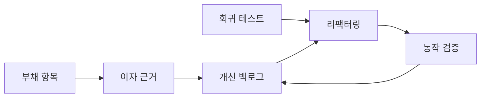
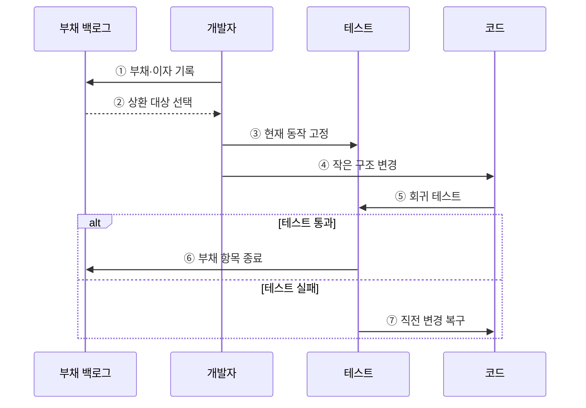

---
sidebar:
  order: 65
  label: "065. 소프트웨어 리팩터링·기술부채 (Refactoring Technical Debt)"
  badge:
    text: "기출 · 70%"
    variant: note
title: "소프트웨어 리팩터링·기술부채 (Refactoring Technical Debt)"
date: "2026-07-27T23:59:59+09:00"
tags:
  - "notes-software"
weight: 65
extra:
  question_no: "065"
  source_status: "기출"
  source_history: "123회, 129회"
  priority: 70
  priority_note: "123·129회 반복, 구조 개선·부채 관리"
---

## 미리 알고가기

- **리팩터링(Refactoring)**: ‘리팩터링’으로 읽으며, 다시 구성한다는 뜻으로 외부 동작을 유지하며 내부 구조를 개선하는 작업
- **기술부채(Technical Debt)**: 빠른 개발 선택으로 미래 변경 때 반복 발생하는 추가 비용
- **원금·이자(Principal and Interest)**: 부채 제거 비용과 방치로 반복되는 변경 비용
- **코드 스멜(Code Smell)**: 설계 문제 가능성을 나타내는 중복·긴 메서드 등의 표면 징후
- **회귀 테스트(Regression Test)**: 구조 변경이 기존 기능을 깨뜨리지 않았는지 확인하는 테스트
- **특성화 테스트(Characterization Test)**: 명세가 부족한 기존 코드의 현재 동작을 기록하는 테스트
- **부채 백로그(Debt Backlog)**: 부채 위치·원인·이자·상환 조건을 관리하는 목록
- **보이스카우트 규칙(Boy Scout Rule)**: 코드를 만졌을 때 처음보다 조금 더 나은 상태로 남기는 점진 개선 원칙

## Ⅰ. 개요

- 정의/개념: 외부 동작을 보존하며 **내부 구조를 개선**하는 활동
- 기존 한계: 기술부채 누적으로 **변경 비용·결함 위험** 증가

### 쉽게 이해하기 (학습용)

- 영업을 계속하면서 손님이 쓰는 방식은 그대로 두고 매장 동선을 정리하는 일과 같다.

## Ⅱ. 특징

- **작은 동작 보존 변경**을 반복해 위험 제한
- **회귀 테스트 안전망**으로 외부 동작 유지 검증
- 기능 추가와 달리 **내부 품질 개선**이 목적

### 쉽게 이해하기 (학습용)

- 한 번에 조금씩 고치고 매번 같은 결과가 나오는지 검사한다.

## Ⅲ. 아키텍처 및 구성요소

**도표안 A — 구조도**

**도표안 B — sequenceDiagram**

| 구성요소 | 책임 |
|:---|:---|
| 부채 항목 | 위치·원인·상환 조건 기록 |
| 이자 근거 | 반복 변경의 추가 비용 측정 |
| 개선 백로그 | 비용 대비 상환 우선순위 결정 |
| 회귀 테스트 | 변경 전후 외부 동작 검증 |
| 리팩터링 | 작은 단위의 내부 구조 개선 |

**동작 원리**

- ① 개발자가 부채의 위치·원인·반복 변경 비용을 기록한다.
- ② 백로그가 부채 이자와 상환 비용을 비교해 대상을 정한다.
- ③ 명세가 부족하면 특성화 테스트로 현재 외부 동작을 고정한다.
- ④ 한 번에 되돌릴 수 있는 작은 구조 개선을 적용한다.
- ⑤ 전체 회귀 테스트로 변경 전후 결과가 같은지 확인한다.
- ⑥ 통과하면 개선 효과를 기록하고 부채 항목을 종료한다.
- ⑦ 실패하면 직전 변경을 복구하고 더 작은 단위로 다시 시도한다.

> 요약: 반복 비용이 큰 부채를 선택해 작은 변경과 회귀 검증으로 상환한다.

### 쉽게 이해하기 (학습용)

- 앞으로 반복해서 낼 비용이 큰 빚부터 조금씩 갚고 기능을 매번 확인한다.

## Ⅳ. 종류 및 비교

| 부채 대응 방식 | 점진 리팩터링 | 현 상태 유지 | 전면 재작성 |
|:---|:---|:---|:---|
| 적용 기준 | 동작 유효·**변경 빈도 높음** | 변경 적음·**종료 임박** | 구조가 **신규 요구 차단** |
| 핵심 특징 | 동작 보존·**소규모 개선** | 구현 유지·**부채 감수** | 구조·구현 **전면 교체** |
| 한계 | 장기 소요·**검증 비용** | 변경 이자·**결함 누적** | 기능 누락·**전환 위험** |

> 요약: 유효한 동작은 점진 개선하고 신규 요구를 막는 구조만 재작성을 검토한다.

### 쉽게 이해하기 (학습용)

- 자주 바꾸는 코드는 조금씩 고치고 곧 폐기할 코드는 유지하며 구조가 막혔을 때만 다시 만든다.

## Ⅴ. 실무 고려사항 및 대책

| 고려사항 | 문제점 | 대책 |
|:---|:---|:---|
| 테스트 없는 변경 | 구조 개선 중 기존 동작 손상 | 특성화·회귀 테스트로 동작을 먼저 고정 |
| 대규모 리팩터링 | 변경 원인 격리와 복구가 어려움 | 작은 커밋과 보이스카우트 규칙으로 점진 적용 |
| 스멜 일괄 제거 | 변경하지 않는 코드에 비용 낭비 | 변경 빈도·장애 영향·부채 이자로 우선순위 결정 |
| 기능 개발 혼합 | 동작 변경과 구조 변경의 원인이 뒤섞임 | 가능하면 기능 변경과 리팩터링 커밋 분리 |
| 전면 재작성 낙관 | 숨은 업무 규칙·운영 지식 누락 | 점진 교체와 동작 비교·전환 기준 운영 |

> 적용 사례: 중복 과금 조건을 정책 객체로 추출해 변경 지점을 줄인다.

### 쉽게 이해하기 (학습용)

- 여러 곳에 흩어진 과금 규칙을 한 객체로 모아 변경 지점을 줄인다.

## Ⅵ. 결론

- 리팩터링은 외부 동작을 지키며 내부 구조를 개선하고 기술부채의 미래 이자를 낮춘다.
- 부채 이자·변경 빈도·회귀 위험을 기준으로 점진 상환한다.

### 쉽게 이해하기 (학습용)

- 모든 빚을 없애지 않고 앞으로 더 큰 비용을 만드는 부채부터 갚는다.
