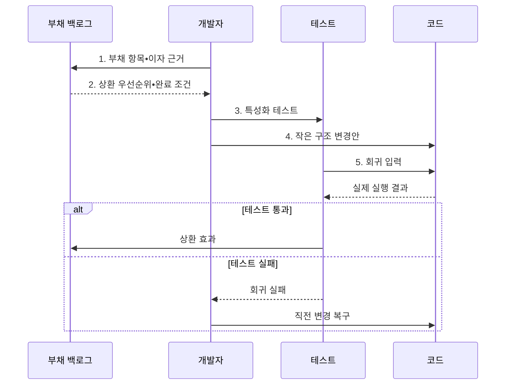

---
sidebar:
  order: 65
  label: "065. 소프트웨어 리팩터링•기술부채 (Refactoring Technical Debt)"
  badge:
    text: "기출 • 70%"
    variant: note
title: "소프트웨어 리팩터링•기술부채 (Refactoring Technical Debt)"
date: "2026-08-05T01:03:38+09:00"
tags:
  - "notes-software"
weight: 65
extra:
  question_no: "065"
  source_status: "기출"
  source_history: "123회, 129회"
  priority: 70
  priority_note: "123•129회 반복, 구조 개선•부채 관리"
---

## Ⅰ. 개요

<details>
<summary>핵심 용어</summary>

- **리팩터링(Refactoring)**: 외부 동작은 유지하면서 코드의 중복•복잡도•명칭과 책임 배치를 바꾸는 활동이다.
- **기술부채(Technical Debt)**: 빠른 전달을 위해 미룬 설계•시험•품질 작업이 이후 변경 비용과 결함 위험으로 누적된 상태이다.
- **추가 비용 누적(Accumulated Cost)**: 부채 방치로 반복 변경 비용이 계속 커지는 현상이다.
- **결함 위험 누적(Accumulated Defect Risk)**: 부채 방치로 오류 가능성이 계속 커지는 현상이다.

</details>

- 정의/개념: **리팩터링** 은 소프트웨어의 외부 동작을 보존하면서 코드의 내부 구조를 개선하여 기술부채와 변경 비용을 줄이는 개발 활동
- 배경/필요성: 기술부채 방치는 반복 변경마다 **추가 비용•결함 위험 누적**

#### 한줄 요약

- 영업을 계속하면서 손님이 쓰는 방식은 그대로 두고 매장 동선을 정리하는 일과 같다.

## Ⅱ. 특징

<details>
<summary>핵심 용어</summary>

- **작은 동작 보존 변경**: 기능 결과를 유지하며 한 번에 복구 가능한 규모로 구조를 고치는 방식이다.
- **회귀 테스트 안전망**: 구조 변경 전후에 기존 기능이 같은 결과를 내는지 자동 확인하는 시험 집합이다.
- **내부 품질 개선**: 새 기능 추가가 아니라 분석성•변경성•시험성을 높이는 작업 목적이다.

</details>

- **작은 동작 보존 변경** 을 반복해 위험 제한
- **회귀 테스트 안전망** 으로 외부 동작 유지 검증
- 기능 추가와 달리 **내부 품질 개선** 이 목적

#### 한줄 요약

- 한 번에 조금씩 고치고 매번 같은 결과가 나오는지 검사한다.

## Ⅲ. 구조 및 구성요소

<details>
<summary>핵심 용어</summary>

- **코드 스멜(Code Smell)**: 설계 문제 가능성을 나타내는 중복•긴 메서드 등의 표면 징후이다.
- **부채 백로그(Debt Backlog)**: 부채 위치•원인•이자•상환 조건을 관리하는 목록이다.
- **회귀 테스트(Regression Test)**: 구조 변경이 기존 기능을 깨뜨리지 않았는지 확인하는 테스트이다.

</details>

```text
                         [코드 스멜]
                              |
                              |
[회귀 테스트] -------- [부채 백로그] -------- [리팩터링]
       \                                          /
        \                                        /
         +--------------------------------------+
```

선의 의미: 코드 스멜과 부채 백로그의 선은 부채 징후 등록 관계, 부채 백로그와 리팩터링의 선은 위치•원인•이자•상환 조건 제공 관계, 리팩터링과 회귀 테스트의 선은 구조 변경의 외부 동작 검증 관계, 회귀 테스트와 부채 백로그의 선은 검증 결과와 상환 상태 반영 관계를 뜻한다.

| 구성요소 | 책임 |
|:---|:---|
| 코드 스멜 | **중복•긴 메서드** 등 부채 징후 제공 |
| 부채 백로그 | **위치•원인•이자•상환 조건** 관리 |
| 회귀 테스트 | 변경 전후 **외부 동작 보존** 검증 |
| 리팩터링 | 작은 단위의 **내부 구조 개선** 수행 |

#### 한줄 요약

- 부채 목록과 비용 근거로 개선 대상을 골라 테스트와 함께 고친다.

## Ⅳ. 흐름도

<details>
<summary>핵심 용어</summary>

- **특성화 테스트(Characterization Test)**: 명세가 부족한 기존 코드의 현재 동작을 기록하는 테스트이다.
- **상환 우선순위(Repayment Priority)**: 부채 이자와 제거 비용으로 정한 작업 순서다.
- **완료 조건(Completion Criteria)**: 부채 상환 작업의 종료를 판정하는 기준이다.
- **회귀 입력**: 구조 변경 전후의 외부 동작이 같은지 확인하기 위해 반복 실행하는 시험 데이터이다.

</details>



**동작 원리**

- **1. 부채 항목•이자 근거**: 위치와 반복 변경 비용 기록
- **2. 상환 우선순위•완료 조건**: 이자와 상환 비용을 비교
- **3. 특성화 테스트**: 명세가 부족한 코드의 현재 동작 고정
- **4. 작은 구조 변경안**: 복구 가능한 단위로 내부 구조 개선
- **5. 회귀 입력**: 변경 코드의 외부 동작 보존 여부 검증

> 요약: 반복 비용이 큰 부채를 선택해 작은 변경과 회귀 검증으로 상환

#### 한줄 요약

- 앞으로 반복해서 낼 비용이 큰 빚부터 조금씩 갚고 기능을 매번 확인한다.

## Ⅴ. 종류 및 비교

<details>
<summary>핵심 용어</summary>

- **점진 리팩터링(Incremental Refactoring)**: 유효한 동작을 유지하며 작은 구조 개선을 반복하는 대응 방식이다.
- **현 상태 유지(Status Quo)**: 변경 가능성이 낮거나 종료가 임박한 코드의 부채 비용을 감수하는 선택이다.
- **전면 재작성(Full Rewrite)**: 기존 구조와 구현을 새로 교체하는 고위험 대응 방식이다.

</details>

| 부채 대응 방식 | 점진 리팩터링 | 현 상태 유지 | 전면 재작성 |
|:---|:---|:---|:---|
| 적용 기준 | 동작 유효•**변경 빈도 높음** | 변경 적음•**종료 임박** | 구조가 **신규 요구 차단** |
| 핵심 특징 | 동작 보존•**소규모 개선** | 구현 유지•**부채 감수** | 구조•구현 **전면 교체** |
| 한계 | 장기 소요•**검증 비용** | 변경 이자•**결함 누적** | 기능 누락•**전환 위험** |

> 요약: 유효한 동작은 점진 개선하고 신규 요구를 막는 구조만 재작성을 검토

#### 한줄 요약

- 자주 바꾸는 코드는 조금씩 고치고 곧 폐기할 코드는 유지하며 구조가 막혔을 때만 다시 만든다.

## Ⅵ. 실무 고려사항 및 대책

<details>
<summary>핵심 용어</summary>

- **작은 커밋(Small Commit)**: 변경 원인을 격리하도록 작업을 나눈 이력 단위다.
- **반복 검증(Repeated Validation)**: 작은 변경마다 동작 보존 여부를 확인하는 방식이다.
- **정책 객체(Policy Object)**: 흩어진 업무 판단 규칙을 하나의 객체로 모은 설계 요소이다.
- **변경 빈도(Change Frequency)**: 해당 코드가 수정되는 횟수다.
- **장애 영향(Failure Impact)**: 결함이 사용자와 업무에 미치는 피해 규모다.
- **기능 커밋(Feature Commit)**: 외부 동작 추가만 담은 변경 이력이다.
- **리팩터링 커밋(Refactoring Commit)**: 내부 구조 개선만 담은 변경 이력이다.
- **점진 교체(Incremental Replacement)**: 기존 구현을 작은 범위부터 신규 구현으로 바꾸는 방식이다.
- **동작 비교(Behavior Comparison)**: 두 구현에 같은 입력을 넣어 결과를 비교하는 검증이다.

</details>

| 문제 | 대책 | 효과 |
|:---|:---|:---|
| 기존 동작 명세 없이 구조를 바꿔 기능 손상 | **특성화•회귀 테스트** 로 동작 고정 | **기존 기능 손상** 방지 |
| 대규모 변경이 실패 원인을 섞어 복구 지연 | **작은 커밋•반복 검증** 으로 점진 적용 | **원인 격리•복구** 용이 |
| 변경이 적은 코드의 스멜까지 일괄 제거 | **변경 빈도•장애 영향** 으로 우선순위 결정 | **개선 비용 낭비** 방지 |
| 기능 개발과 구조 개선을 섞어 변경 원인 불명 | **기능•리팩터링 커밋** 분리 | **변경 원인 추적성** 확보 |
| 전면 재작성에서 숨은 업무 규칙 누락 | **점진 교체•동작 비교** 적용 | **업무 규칙 누락 위험** 감소 |

> 적용 사례: 중복 과금 조건을 정책 객체로 추출해 변경 지점을 감소

#### 한줄 요약

- 여러 곳에 흩어진 과금 규칙을 한 객체로 모아 변경 지점을 줄인다.

## Ⅶ. 결론

<details>
<summary>핵심 용어</summary>

- **부채 이자(Debt Interest)**: 기술부채 때문에 반복해서 발생하는 변경 비용이다.
- **회귀 위험(Regression Risk)**: 부채 상환 중 기존 기능이 손상될 가능성이다.
- **상환 순서**: 미래 비용을 가장 크게 줄일 수 있도록 기술부채 작업에 부여한 우선순위이다.

</details>

- **부채 이자•변경 빈도•회귀 위험** 으로 상환 순서를 결정

#### 한줄 요약

- 모든 빚을 없애지 않고 앞으로 더 큰 비용을 만드는 부채부터 갚는다.
