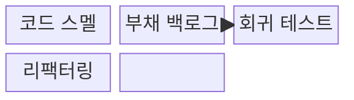
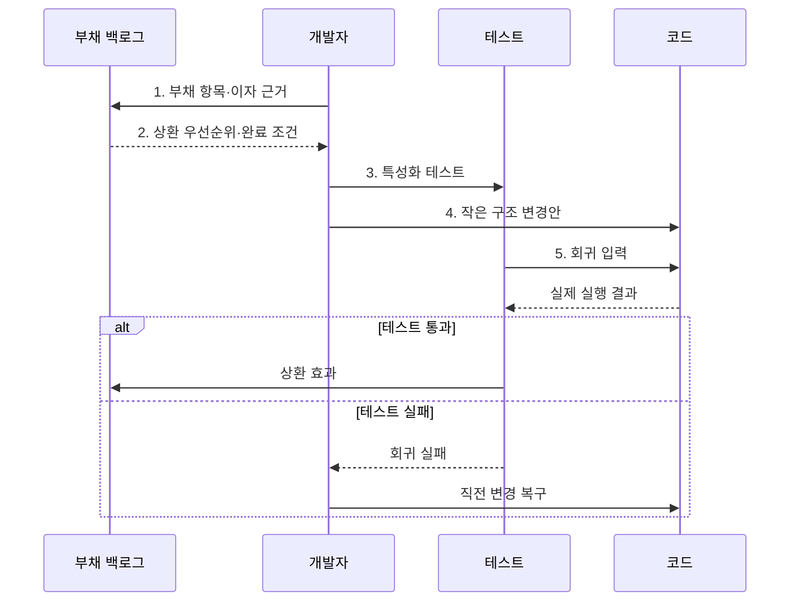

---
sidebar:
  order: 65
  label: "065. 소프트웨어 리팩터링·기술부채 (Refactoring Technical Debt)"
  badge:
    text: "기출 · 70%"
    variant: note
title: "소프트웨어 리팩터링·기술부채 (Refactoring Technical Debt)"
date: "2026-07-30T23:17:05+09:00"
tags:
  - "notes-software"
weight: 65
extra:
  question_no: "065"
  source_status: "기출"
  source_history: "123회, 129회"
  priority: 70
  priority_note: "123·129회 반복, 구조 개선·부채 관리"
---

## 미리 알고가기

- **리팩터링(Refactoring)**: ‘리팩터링’으로 읽으며, 다시 구성한다는 뜻으로 외부 동작을 유지하며 내부 구조를 개선하는 작업
- **기술부채(Technical Debt)**: 빠른 개발 선택으로 미래 변경 때 반복 발생하는 추가 비용
- **원금·이자(Principal and Interest)**: 부채 제거 비용과 방치로 반복되는 변경 비용
- **코드 스멜(Code Smell)**: 설계 문제 가능성을 나타내는 중복·긴 메서드 등의 표면 징후
- **회귀 테스트(Regression Test)**: 구조 변경이 기존 기능을 깨뜨리지 않았는지 확인하는 테스트
- **특성화 테스트(Characterization Test)**: 명세가 부족한 기존 코드의 현재 동작을 기록하는 테스트
- **부채 백로그(Debt Backlog)**: 부채 위치·원인·이자·상환 조건을 관리하는 목록
- **보이스카우트 규칙(Boy Scout Rule)**: 코드를 만졌을 때 처음보다 조금 더 나은 상태로 남기는 점진 개선 원칙
- **정책 객체(Policy Object)**: 흩어진 업무 판단 규칙을 하나의 객체로 모은 설계 요소

## Ⅰ. 개요

- 정의/개념: 외부 동작을 보존하며 **내부 구조를 개선**하는 활동
- 배경/필요성: 기술부채 방치는 반복 변경마다 **추가 비용·결함 위험 누적**

### 쉽게 이해하기 (학습용)

- 영업을 계속하면서 손님이 쓰는 방식은 그대로 두고 매장 동선을 정리하는 일과 같다.

## Ⅱ. 특징

- **작은 동작 보존 변경**을 반복해 위험 제한
- **회귀 테스트 안전망**으로 외부 동작 유지 검증
- 기능 추가와 달리 **내부 품질 개선**이 목적

### 쉽게 이해하기 (학습용)

- 한 번에 조금씩 고치고 매번 같은 결과가 나오는지 검사한다.

## Ⅲ. 구조 및 구성요소

| 구성요소 | 책임 |
|:---|:---|
| 코드 스멜 | **중복·긴 메서드** 등 부채 징후 제공 |
| 부채 백로그 | **위치·원인·이자·상환 조건** 관리 |
| 회귀 테스트 | 변경 전후 **외부 동작 보존** 검증 |
| 리팩터링 | 작은 단위의 **내부 구조 개선** 수행 |

### 쉽게 이해하기 (학습용)

- 부채 목록과 비용 근거로 개선 대상을 골라 테스트와 함께 고친다.

## Ⅳ. 흐름도

**동작 원리**

- **1. 부채 항목·이자 근거**: 위치와 반복 변경 비용 기록
- **2. 상환 우선순위·완료 조건**: 이자와 상환 비용을 비교
- **3. 특성화 테스트**: 명세가 부족한 코드의 현재 동작 고정
- **4. 작은 구조 변경안**: 복구 가능한 단위로 내부 구조 개선
- **5. 회귀 입력**: 변경 코드의 외부 동작 보존 여부 검증

> 요약: 반복 비용이 큰 부채를 선택해 작은 변경과 회귀 검증으로 상환

### 쉽게 이해하기 (학습용)

- 앞으로 반복해서 낼 비용이 큰 빚부터 조금씩 갚고 기능을 매번 확인한다.

## Ⅴ. 종류 및 비교

| 부채 대응 방식 | 점진 리팩터링 | 현 상태 유지 | 전면 재작성 |
|:---|:---|:---|:---|
| 적용 기준 | 동작 유효·**변경 빈도 높음** | 변경 적음·**종료 임박** | 구조가 **신규 요구 차단** |
| 핵심 특징 | 동작 보존·**소규모 개선** | 구현 유지·**부채 감수** | 구조·구현 **전면 교체** |
| 한계 | 장기 소요·**검증 비용** | 변경 이자·**결함 누적** | 기능 누락·**전환 위험** |

> 요약: 유효한 동작은 점진 개선하고 신규 요구를 막는 구조만 재작성을 검토

### 쉽게 이해하기 (학습용)

- 자주 바꾸는 코드는 조금씩 고치고 곧 폐기할 코드는 유지하며 구조가 막혔을 때만 다시 만든다.

## Ⅵ. 실무 고려사항 및 대책

| 고려사항 | 대책 | 효과 |
|:---|:---|:---|
| 기존 동작 명세 없이 구조를 바꿔 기능 손상 | **특성화·회귀 테스트**로 동작 고정 | **기존 기능 손상** 방지 |
| 대규모 변경이 실패 원인을 섞어 복구 지연 | **작은 커밋·반복 검증**으로 점진 적용 | **원인 격리·복구** 용이 |
| 변경이 적은 코드의 스멜까지 일괄 제거 | **변경 빈도·장애 영향**으로 우선순위 결정 | **개선 비용 낭비** 방지 |
| 기능 개발과 구조 개선을 섞어 변경 원인 불명 | **기능·리팩터링 커밋** 분리 | **변경 원인 추적성** 확보 |
| 전면 재작성에서 숨은 업무 규칙 누락 | **점진 교체·동작 비교** 적용 | **업무 규칙 누락 위험** 감소 |

> 적용 사례: 중복 과금 조건을 정책 객체로 추출해 변경 지점을 감소

### 쉽게 이해하기 (학습용)

- 여러 곳에 흩어진 과금 규칙을 한 객체로 모아 변경 지점을 줄인다.

## Ⅶ. 결론

- **부채 이자·변경 빈도·회귀 위험**으로 상환 순서를 결정

### 쉽게 이해하기 (학습용)

- 모든 빚을 없애지 않고 앞으로 더 큰 비용을 만드는 부채부터 갚는다.
