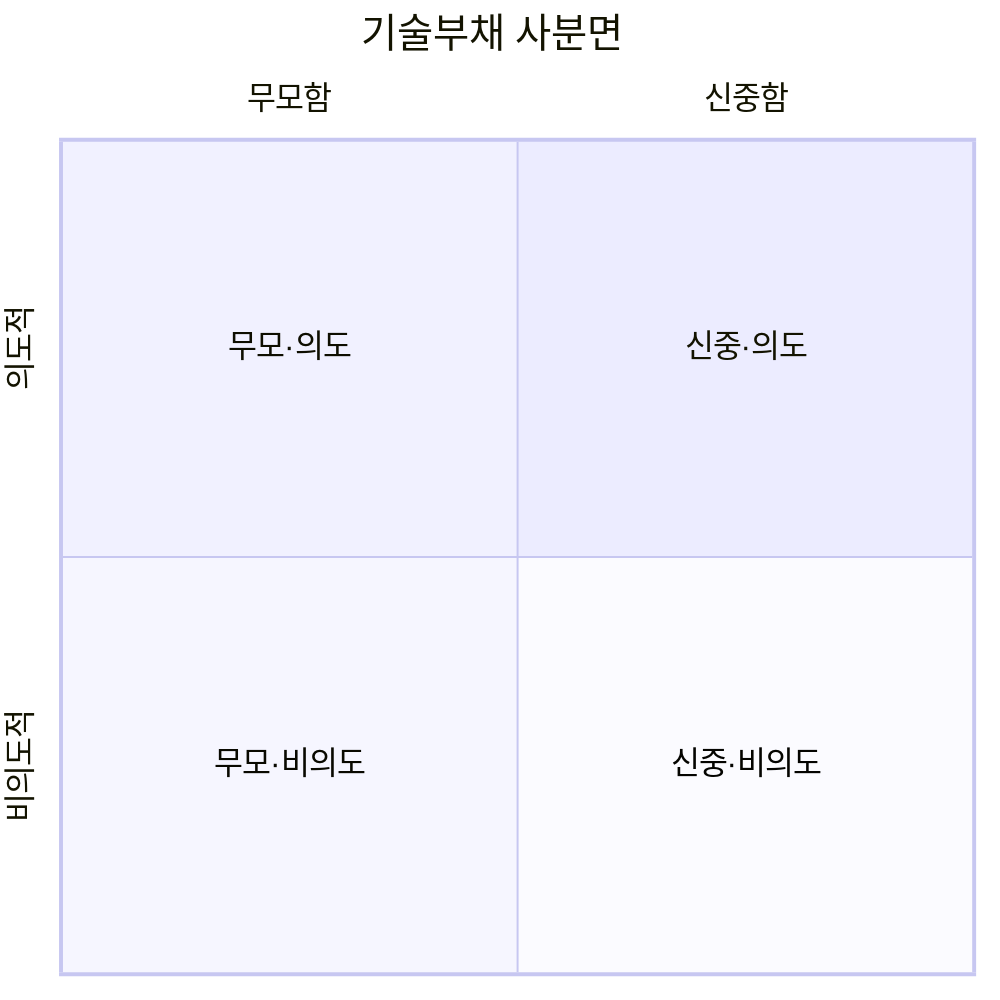
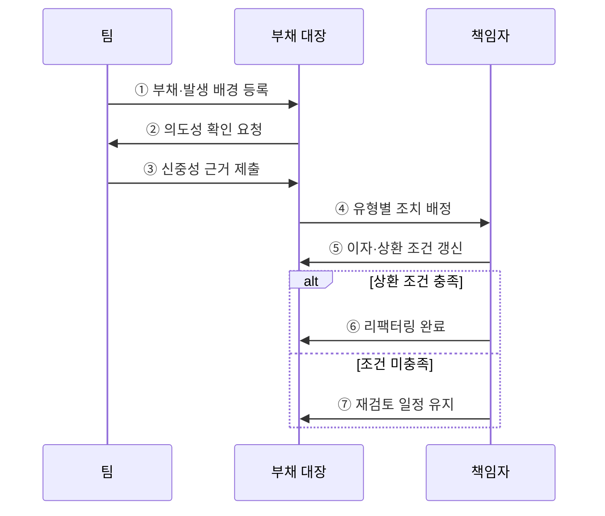

---
sidebar:
  order: 66
  label: "066. 소프트웨어 기술부채 사분면 (Technical Debt Quadrant)"
  badge:
    text: "기출 · 30%"
    variant: note
title: "소프트웨어 기술부채 사분면 (Technical Debt Quadrant)"
date: "2026-07-27T23:59:59+09:00"
tags:
  - "notes-software"
weight: 66
extra:
  question_no: "066"
  source_status: "기출"
  source_history: "123회"
  priority: 30
  priority_note: "123회 기출, 부채 원인·상환 판단 분류"
---

## 미리 알고가기

- **기술부채 사분면(Technical Debt Quadrant)**: ‘테크니컬 데트 쿼드런트’로 읽으며, 기술부채를 의도성과 신중성의 두 축으로 분류하는 도구
- **의도적(Deliberate)**: 미래 비용을 인식하고 선택한 부채
- **비의도적(Inadvertent)**: 지식·경험 부족으로 인식하지 못한 채 생긴 부채
- **신중한(Prudent)**: 이익·위험·상환 계획을 검토한 선택
- **무모한(Reckless)**: 장기 비용이나 대안을 검토하지 않은 선택
- **기술부채 원금·이자**: 부채 제거 비용과 방치로 반복되는 추가 비용
- **리팩터링(Refactoring)**: 외부 동작을 유지하며 내부 구조를 개선하는 활동
- **상환 조건(Repayment Trigger)**: 변경 빈도·장애 위험·비용 임계값처럼 부채 제거를 시작하도록 정한 조건

## Ⅰ. 개요

- 정의/개념: 기술부채를 **의도성·신중성**으로 분류하는 도구
- 기존 한계: 부채 원인 혼재로 **상환 전략 차별화** 곤란

### 쉽게 이해하기 (학습용)

- 같은 빚이라도 알고 빌렸는지와 갚을 계획을 세웠는지에 따라 대응을 달리하는 표다.

## Ⅱ. 특징

- **의도성·신중성 두 축**으로 네 유형 분류
- 유형별 원인에 따라 **상환·학습·통제** 결정
- 분류보다 **이자 근거·상환 조건** 기록이 중요

### 쉽게 이해하기 (학습용)

- 계획한 지름길은 갚을 날짜를 정하고 실력 부족으로 생긴 문제는 학습과 개선을 함께 한다.

## Ⅲ. 아키텍처 및 구성요소

**도표안 A — 구조도**

**도표안 B — sequenceDiagram**

| 분류 요소 | 책임 |
|:---|:---|
| 의도성 축 | 부채의 사전 인지 여부 판정 |
| 신중성 축 | 대안·위험·상환 계획 검토 판정 |
| 이자 근거 | 방치에 따른 반복 비용 측정 |
| 부채 대장 | 유형·책임자·상환 조건 기록 |

**동작 원리**

- ① 팀이 부채 위치·발생 배경·선택 당시 정보를 대장에 등록한다.
- ② 대장이 미래 비용을 사전에 인지했는지 확인하도록 요청한다.
- ③ 팀이 대안·위험·상환 계획을 검토한 근거를 제출한다.
- ④ 의도성과 신중성 조합에 따라 상환·학습·통제 조치를 배정한다.
- ⑤ 책임자가 반복 비용과 상환 조건·재검토 시점을 갱신한다.
- ⑥ 조건을 충족하면 리팩터링하고 효과를 확인해 항목을 종료한다.
- ⑦ 조건을 충족하지 않으면 현재 선택 근거와 다음 검토 일정을 유지한다.

> 요약: 발생 원인을 분류하고 유형별 조치와 상환 조건을 지속 추적한다.

### 쉽게 이해하기 (학습용)

- 왜 생겼는지를 확인한 뒤 담당자와 갚을 조건을 기록하고 정기적으로 다시 판단한다.

## Ⅳ. 종류 및 비교

| 기술부채 유형 | 신중·의도 | 무모·의도 | 신중·비의도 | 무모·비의도 |
|:---|:---|:---|:---|:---|
| 적용 기준 | 기한 이익과 **상환 계획 존재** | 위험 인지·**대안 검토 부재** | 구현 후 **개선점 학습** | 지식·검토 **모두 부족** |
| 핵심 특징 | 계획 부채·**조건부 상환** | 일정 우선·**위험 수용** | 경험 환류·**구조 개선** | 역량 보완·**기본 통제** |
| 한계 | 상환 지연·**계획 무력화** | 결함·변경 비용 **급증** | 사후 발견·**재작업** | 반복 부채·**품질 저하** |

> 요약: 계획 부채는 상환을 추적하고 비의도 부채는 학습과 통제를 보강한다.

### 쉽게 이해하기 (학습용)

- 계획한 부채는 상환을 추적하고 몰라서 생긴 부채는 교육과 검토 절차로 재발을 막는다.

## Ⅴ. 실무 고려사항 및 대책

| 고려사항 | 문제점 | 대책 |
|:---|:---|:---|
| 유형 낙인 | 사람을 무모하다고 평가해 부채 공개 위축 | 개인이 아닌 당시 정보·의사결정 과정과 시스템을 분류 |
| 계획 부채 방치 | 신중·의도 유형이라는 이유로 상환 지연 | 책임자·상환 조건·최종 기한을 대장에 필수 기록 |
| 정성 판단 편중 | 실제 비용 없이 유형 논쟁만 반복 | 변경 시간·장애·우회 작업으로 부채 이자 측정 |
| 비의도 부채 반복 | 제거 후에도 지식·검토 부족이 지속 | 교육·설계 검토·자동 품질 통제를 함께 개선 |
| 대장 노후화 | 이미 제거되거나 악화된 부채가 그대로 남음 | 변경·장애 사건과 연계해 상태·이자를 정기 갱신 |

> 적용 사례: 출시 기한용 임시 구현에는 책임자와 상환 일정을 함께 등록한다.

### 쉽게 이해하기 (학습용)

- 출시를 위해 택한 지름길은 책임자와 제거 날짜를 함께 기록한다.

## Ⅵ. 결론

- 기술부채 사분면은 발생 의도와 판단 신중성을 분리해 대응 방식을 정한다.
- 계획 부채는 추적 상환하고 비의도 부채는 학습·품질 체계로 재발을 줄인다.

### 쉽게 이해하기 (학습용)

- 부채의 원인에 맞춰 갚는 활동과 다시 만들지 않는 활동을 함께 정한다.
