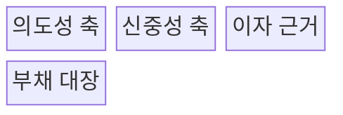
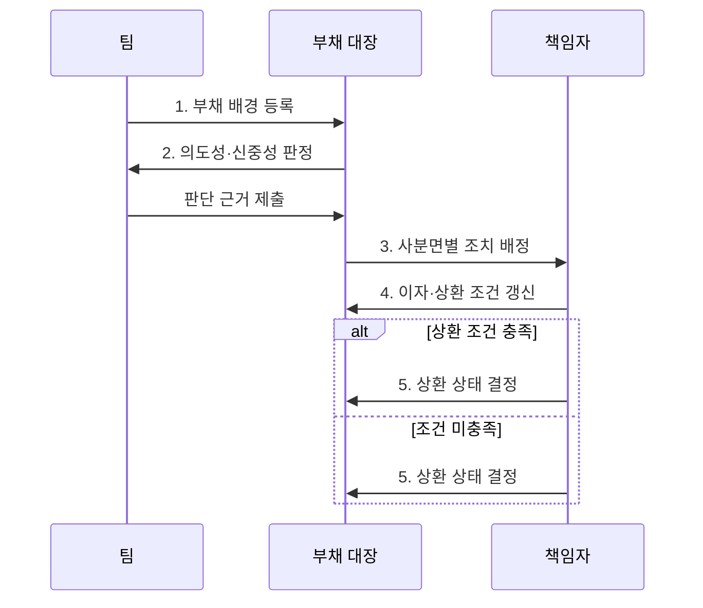

---
sidebar:
  order: 66
  label: "066. 소프트웨어 기술부채 사분면 (Technical Debt Quadrant)"
  badge:
    text: "기출 · 30%"
    variant: note
title: "소프트웨어 기술부채 사분면 (Technical Debt Quadrant)"
date: "2026-07-27T23:59:59+09:00"
tags:
  - "notes-software"
weight: 66
extra:
  question_no: "066"
  source_status: "기출"
  source_history: "123회"
  priority: 30
  priority_note: "123회 기출, 부채 원인·상환 판단 분류"
---

## 미리 알고가기

- **기술부채 사분면(Technical Debt Quadrant)**: ‘테크니컬 데트 쿼드런트’로 읽으며, 기술부채를 의도성과 신중성의 두 축으로 분류하는 도구
- **의도적(Deliberate)**: 미래 비용을 인식하고 선택한 부채
- **비의도적(Inadvertent)**: 지식·경험 부족으로 인식하지 못한 채 생긴 부채
- **신중한(Prudent)**: 이익·위험·상환 계획을 검토한 선택
- **무모한(Reckless)**: 장기 비용이나 대안을 검토하지 않은 선택
- **기술부채 원금·이자**: 부채 제거 비용과 방치로 반복되는 추가 비용
- **리팩터링(Refactoring)**: 외부 동작을 유지하며 내부 구조를 개선하는 활동
- **상환 조건(Repayment Trigger)**: 변경 빈도·장애 위험·비용 임계값처럼 부채 제거를 시작하도록 정한 조건

## Ⅰ. 개요

- 정의/개념: 기술부채를 **의도성·신중성**으로 분류하는 도구
- 배경/필요성: 부채 원인별 상환·예방 전략 구분

### 쉽게 이해하기 (학습용)

- 같은 빚이라도 알고 빌렸는지와 갚을 계획을 세웠는지에 따라 대응을 달리하는 표다.

## Ⅱ. 특징

- **의도성·신중성 두 축**으로 네 유형 분류
- 유형별 원인에 따라 **상환·학습·통제** 결정
- 분류보다 **이자 근거·상환 조건** 기록이 중요

### 쉽게 이해하기 (학습용)

- 계획한 지름길은 갚을 날짜를 정하고 실력 부족으로 생긴 문제는 학습과 개선을 함께 한다.

## Ⅲ. 구조 및 구성요소

| 구성요소 | 책임 |
|:---|:---|
| 의도성 축 | 부채의 사전 인지 여부 판정 |
| 신중성 축 | 대안·위험·상환 계획 검토 판정 |
| 이자 근거 | 방치에 따른 반복 비용 측정 |
| 부채 대장 | 유형·책임자·상환 조건 기록 |

### 쉽게 이해하기 (학습용)

- 부채가 계획된 선택인지와 위험을 검토했는지를 나눠 기록한다.

## Ⅳ. 흐름도

**동작 원리**

- **1. 부채 배경 등록**: 선택 당시 위험 인지·검토 정보 보존
- **2. 의도성·신중성 판정**: 인지 여부와 대안 검토로 사분면 분류
- **3. 사분면별 조치 배정**: 상환·학습·통제 책임 결정
- **4. 이자·상환 조건 갱신**: 반복 비용과 상환 시점 추적
- **5. 상환 상태 결정**: 조건 충족 시 종료, 미충족 시 재검토

> 요약: 발생 원인을 분류하고 유형별 조치와 상환 조건을 지속 추적

### 쉽게 이해하기 (학습용)

- 왜 생겼는지를 확인한 뒤 담당자와 갚을 조건을 기록하고 정기적으로 다시 판단한다.

## Ⅴ. 종류 및 비교

| 기술부채 유형 | 신중·의도 | 무모·의도 | 신중·비의도 | 무모·비의도 |
|:---|:---|:---|:---|:---|
| 적용 기준 | 기한 이익과 **상환 계획 존재** | 위험 인지·**대안 검토 부재** | 구현 후 **개선점 학습** | 지식·검토 **모두 부족** |
| 핵심 특징 | 계획 부채·**조건부 상환** | 일정 우선·**위험 수용** | 경험 환류·**구조 개선** | 역량 보완·**기본 통제** |
| 한계 | 상환 지연·**계획 무력화** | 결함·변경 비용 **급증** | 사후 발견·**재작업** | 반복 부채·**품질 저하** |

> 요약: 계획 부채는 상환을 추적하고 비의도 부채는 학습과 통제를 보강

### 쉽게 이해하기 (학습용)

- 계획한 부채는 상환을 추적하고 몰라서 생긴 부채는 교육과 검토 절차로 재발을 막는다.

## Ⅵ. 실무 고려사항 및 대책

| 고려사항 | 대책 | 효과 |
|:---|:---|:---|
| 유형 낙인 | 당시 정보와 의사결정 과정을 분류 | 부채 공개 위축 방지 |
| 계획 부채 방치 | 책임자·상환 조건·기한 기록 | 상환 지연 통제 |
| 정성 판단 편중 | 변경 시간·장애로 이자 측정 | 유형 논쟁보다 비용 판단 강화 |
| 비의도 부채 반복 | 교육·설계 검토·품질 통제 개선 | 같은 부채의 재발 감소 |
| 대장 노후화 | 변경·장애와 연계해 상태 갱신 | 부채 정보의 현행성 확보 |

> 적용 사례: 출시 기한용 임시 구현에는 책임자와 상환 일정을 함께 등록

### 쉽게 이해하기 (학습용)

- 출시를 위해 택한 지름길은 책임자와 제거 날짜를 함께 기록한다.

## Ⅶ. 결론

- **의도성·신중성·이자**에 따라 상환과 예방 조치를 결정

### 쉽게 이해하기 (학습용)

- 부채의 원인에 맞춰 갚는 활동과 다시 만들지 않는 활동을 함께 정한다.
