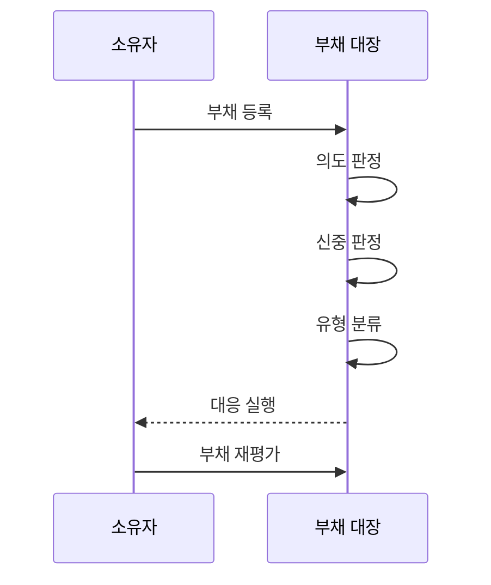

---
sidebar:
  order: 66
  label: "066. 소프트웨어 기술부채 사분면 (Technical Debt Quadrant)"
  badge:
    text: "기출 · 30%"
    variant: note
title: "소프트웨어 기술부채 사분면 (Technical Debt Quadrant)"
date: "2026-07-25T17:58:00+09:00"
tags:
  - "notes-software"
weight: 66
extra:
  question_no: "066"
  source_status: "기출"
  source_history: "123회"
  priority: 30
  priority_note: "123회 기출, 부채 원인·상환 판단 분류"
---

## 미리 알고가기

- **기술부채 사분면(Technical Debt Quadrant)**: 부채를 알고 선택했는지와 편익·비용을 검토했는지를 두 축으로 나눠 대응을 정하는 분류 도구
- **기술부채(Technical Debt)**: 빠른 선택이나 설계 결함이 미래 변경마다 추가 비용을 반복 발생시키는 상태
- **의도적·비의도적(Deliberate and Inadvertent)**: 기술부채의 미래 비용을 알고 선택했는지 구분하는 의도성 축
- **신중함·무모함(Prudent and Reckless)**: 조기 편익·상환 비용·설계 대안을 검토했는지 구분하는 신중성 축
- **신중·의도형(Prudent and Deliberate Debt)**: 조기 편익이 상환 비용보다 커서 재검토 조건과 소유자를 두고 계획한 부채
- **무모·의도형(Reckless and Deliberate Debt)**: 미래 비용을 알면서도 편익·대안·상환 조건을 검토하지 않고 만든 부채
- **신중·비의도형(Prudent and Inadvertent Debt)**: 구현 뒤 더 나은 설계를 배워 발견했으며 학습 결과를 개선에 반영할 부채
- **무모·비의도형(Reckless and Inadvertent Debt)**: 설계 지식과 검토가 부족해 인지하지 못한 채 만든 부채
- **부채 원금·이자(Principal and Interest)**: 부채를 제거하는 일회성 비용과 방치할 때 변경마다 반복되는 추가 비용
- **부채 대장(Debt Register)**: 부채의 위치·근거·소유자·상환 조건과 재검토 시점을 기록하는 관리 목록
- **리팩터링(Refactoring)**: 외부에서 관찰되는 동작을 유지하면서 코드 내부 구조를 개선하는 작업

## Ⅰ. 개요

- **정의/개념**: 의도성·신중성으로 부채 대응을 정하는 분류 도구
- **배경/필요성**: 부채 원인 차이로 유형별 상환 전략 필요

### 쉽게 이해하기 (학습용)

- 빚을 알고 냈는지와 이자 및 상환 가능성을 따져 다르게 관리함

## Ⅱ. 특징

- 부채 인지 여부와 비용 검토 수준을 독립 판정한다.
- 신중·의도형은 조기 편익과 상환 조건을 기록한다.
- 신중·비의도형은 학습 결과를 구조 개선에 반영한다.
- 무모형은 결정·학습 실패 원인을 제거한다.

### 쉽게 이해하기 (학습용)

- 계획한 대출은 관리하고 모르고 생긴 빚은 배우며 계산 없는 빚은 바로잡음

## Ⅲ. 아키텍처 및 구성요소

| 설계 요소 | 설명 |
|:---|:---|
| 부채 항목 | 위치·영향·소유자·발견 시점 |
| 결정 증거 | 타협·대안·승인 기록으로 의도성 판정 |
| 설계 판단 | 지식·검토·비용 근거로 신중성 판정 |
| 비용 근거 | 상환 원금과 반복 이자 추적 |
| 대응 정책 | 유형별 상환·학습·예방 책임 |

> 요약: 의도성과 신중성 증거가 부채 대응 정책을 결정함

### 쉽게 이해하기 (학습용)

- 결정 증거와 비용 근거로 부채 유형과 책임을 정함

## Ⅳ. 원리 및 절차 흐름도

| 절차 | 설명 |
|:---|:---|
| 부채 등록 | 위치·소유자·예상 비용 기록 |
| 의도 판정 | 미래 비용 인지 여부 확인 |
| 신중 판정 | 편익·이자·설계 대안 검토 |
| 유형 분류 | 두 축으로 네 유형 분류 |
| 대응 실행 | 유형별 상환·학습·예방 적용 |
| 부채 재평가 | 변경 빈도·수명으로 순위 조정 |

> 요약: 의도성과 신중성을 판정해 유형별 대응을 실행함

### 쉽게 이해하기 (학습용)

- 기록으로 부채를 나눠 상환과 학습 및 예방을 적용함

## Ⅴ. 종류 및 비교

| 신중성별 의도성 | 의도적 | 비의도적 |
|:---|:---|:---|
| 신중 | 편익·상환 조건을 기록한 타협 | 학습 뒤 발견해 구조 개선 |
| 무모 | 비용 검토 없이 일정 우선 | 설계 지식·검토 부족 |

> 요약: 신중한 부채는 추적하고 무모한 부채는 원인을 예방함

### 쉽게 이해하기 (학습용)

- 계획한 부채는 추적하고 무계획 부채는 원인부터 고침

## Ⅵ. 실무 사례

1. 임시 코드는 신중·의도형으로 등록해 제거 조건 지정
2. 발견한 설계 경계는 신중·비의도형으로 개선 시점 지정

### 쉽게 이해하기 (학습용)

- 임시 다리는 철거일과 담당자를 정해 둠
- 더 좋은 길을 발견하면 개선 시점을 기록함

## Ⅶ. 결론

- 의도성·신중성으로 상환·학습·예방 결정

### 쉽게 이해하기 (학습용)

- 계획한 빚은 이자를 관리하고 무계획 빚은 갚으며 다시 생길 원인도 없앰
