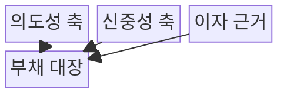
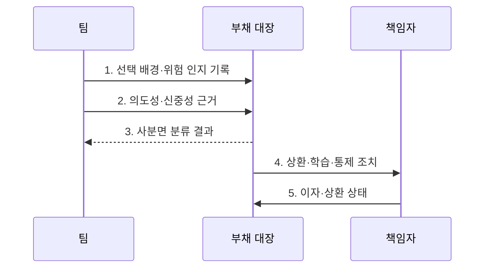

---
sidebar:
  order: 66
  label: "066. 소프트웨어 기술부채 사분면 (Technical Debt Quadrant)"
  badge:
    text: "기출 · 30%"
    variant: note
title: "소프트웨어 기술부채 사분면 (Technical Debt Quadrant)"
date: "2026-08-02T12:00:00+09:00"
tags:
  - "notes-software"
weight: 66
extra:
  question_no: "066"
  source_status: "기출"
  source_history: "123회"
  priority: 30
  priority_note: "123회 기출, 부채 원인·상환 판단 분류"
---

## Ⅰ. 개요

핵심 용어

- **의도성·신중성**: 부채를 알고 선택했는지와 이익·위험·상환 계획을 검토했는지를 나타내는 분류 축이다.
- **상환·예방 책임**: 발생한 부채를 제거하고 같은 원인의 재발을 막도록 배정한 역할이다.

- 정의/개념: **기술부채 사분면**은 기술부채가 의도적으로 선택됐는지와 그 선택이 신중했는지를 두 축으로 분류하여 대응 책임을 정하는 분석 도구
- 배경/필요성: 발생 원인을 구분하지 않으면 **상환·예방 책임 배정 불가**

#### 한줄 요약

- 같은 빚이라도 알고 빌렸는지와 갚을 계획을 세웠는지에 따라 대응을 달리하는 표다.

## Ⅱ. 특징

핵심 용어

- **의도성·신중성 두 축**: 기술부채를 네 유형으로 구분하는 사분면의 기준이다.
- **상환·학습·통제**: 부채 유형에 따라 제거, 역량 보완, 절차 개선을 선택하는 대응이다.
- **이자 근거·상환 조건**: 방치 비용을 입증하고 부채 제거를 시작할 시점을 정하는 정보이다.

- **의도성·신중성 두 축**으로 네 유형 분류
- 유형별 원인에 따라 **상환·학습·통제** 결정
- 분류보다 **이자 근거·상환 조건** 기록이 중요

#### 한줄 요약

- 계획한 지름길은 갚을 날짜를 정하고 실력 부족으로 생긴 문제는 학습과 개선을 함께 한다.

## Ⅲ. 구조 및 구성요소

핵심 용어

- **사전 인지 여부**: 선택 당시 미래 비용과 위험을 알고 있었는지 판정하는 의도성 기준이다.
- **대안·위험·상환 계획**: 선택의 신중성을 판단하기 위해 검토해야 하는 근거이다.
- **부채 대장(Debt Register)**: 부채 유형·위치·책임자·이자·상환 조건을 관리하는 목록이다.

| 구성요소 | 책임 |
|:---|:---|
| 의도성 축 | 부채의 **사전 인지 여부** 판정 |
| 신중성 축 | **대안·위험·상환 계획** 검토 판정 |
| 이자 근거 | 방치에 따른 **반복 변경 비용** 측정 |
| 부채 대장 | **유형·책임자·상환 조건** 기록 |

#### 한줄 요약

- 부채가 계획된 선택인지와 위험을 검토했는지를 나눠 기록한다.

## Ⅳ. 흐름도

핵심 용어

- **사분면 분류 결과**: 의도성과 신중성의 조합으로 판정한 기술부채 유형이다.
- **상환·학습·통제 조치**: 유형별 원인에 맞춰 배정한 제거·교육·예방 활동이다.
- **이자·상환 상태**: 반복 비용과 상환 조건 충족 여부를 지속 추적한 정보이다.

**동작 원리**

- **1. 선택 배경·위험 인지 기록**: 선택 당시 정보와 검토 과정 보존
- **2. 의도성·신중성 근거**: 인지 여부와 대안·상환 계획 확인
- **3. 사분면 분류 결과**: 두 축의 조합으로 부채 원인 분류
- **4. 상환·학습·통제 조치**: 유형별 실행 책임과 예방 활동 배정
- **5. 이자·상환 상태**: 반복 비용과 상환 조건 충족 여부 추적

> 요약: 발생 원인을 분류하고 유형별 조치와 상환 조건을 지속 추적

#### 한줄 요약

- 왜 생겼는지를 확인한 뒤 담당자와 갚을 조건을 기록하고 정기적으로 다시 판단한다.

## Ⅴ. 종류 및 비교

핵심 용어

- **신중·의도(Prudent·Deliberate)**: 위험을 알고 대안과 상환 계획을 검토해 선택한 계획 부채이다.
- **무모·의도(Reckless·Deliberate)**: 위험은 알지만 대안과 장기 비용을 충분히 검토하지 않은 부채이다.
- **신중·비의도(Prudent·Inadvertent)**: 구현 후 학습으로 개선점을 발견하고 구조 개선으로 환류하는 부채이다.
- **무모·비의도(Reckless·Inadvertent)**: 지식과 검토가 모두 부족해 인식하지 못한 채 생긴 부채이다.

| 기술부채 유형 | 신중·의도 | 무모·의도 | 신중·비의도 | 무모·비의도 |
|:---|:---|:---|:---|:---|
| 적용 기준 | 기한 이익과 **상환 계획 존재** | 위험 인지·**대안 검토 부재** | 구현 후 **개선점 학습** | 지식·검토 **모두 부족** |
| 핵심 특징 | 계획 부채·**조건부 상환** | 일정 우선·**위험 수용** | 경험 환류·**구조 개선** | 역량 보완·**기본 통제** |
| 한계 | 상환 지연·**계획 무력화** | 결함·변경 비용 **급증** | 사후 발견·**재작업** | 반복 부채·**품질 저하** |

> 요약: 계획 부채는 상환을 추적하고 비의도 부채는 학습과 통제를 보강

#### 한줄 요약

- 계획한 부채는 상환을 추적하고 몰라서 생긴 부채는 교육과 검토 절차로 재발을 막는다.

## Ⅵ. 실무 고려사항 및 대책

핵심 용어

- **책임자·상환 조건·기한**: 계획 부채를 방치하지 않도록 대장에 함께 기록하는 관리 정보이다.
- **변경 시간·장애 비용**: 기술부채 이자를 정량화해 상환 우선순위를 정하는 측정값이다.
- **교육·설계 검토·품질 통제**: 비의도 부채의 원인을 제거하고 재발을 막는 예방 활동이다.

| 문제 | 대책 | 효과 |
|:---|:---|:---|
| 결과만으로 무모함을 낙인찍어 부채 공개 위축 | **당시 정보·의사결정 과정**으로 분류 | **부채 공개 위축** 방지 |
| 계획 부채에 책임자·상환 조건이 없어 방치 | **책임자·상환 조건·기한** 기록 | **상환 지연** 통제 |
| 정성적 유형 논쟁으로 실제 상환 비용 은폐 | **변경 시간·장애 비용**으로 이자 측정 | **비용 기반 상환 판단** 강화 |
| 지식·검토 부족이 남아 비의도 부채 반복 | **교육·설계 검토·품질 통제** 개선 | **동일 부채 재발** 감소 |
| 변경·장애 후 대장을 갱신하지 않아 정보 노후 | **변경·장애와 상태 갱신** 연계 | **부채 정보 현행성** 확보 |

> 적용 사례: 출시 기한용 임시 구현에는 책임자와 상환 일정을 함께 등록

#### 한줄 요약

- 출시를 위해 택한 지름길은 책임자와 제거 날짜를 함께 기록한다.

## Ⅶ. 결론

핵심 용어

- **의도성·신중성·이자**: 부채의 발생 원인과 미래 비용을 함께 판단하는 대응 기준이다.
- **상환과 예방 조치**: 기존 부채를 제거하는 활동과 동일 원인의 재발을 막는 활동이다.

- **의도성·신중성·이자**에 따라 상환과 예방 조치를 결정

#### 한줄 요약

- 부채의 원인에 맞춰 갚는 활동과 다시 만들지 않는 활동을 함께 정한다.
