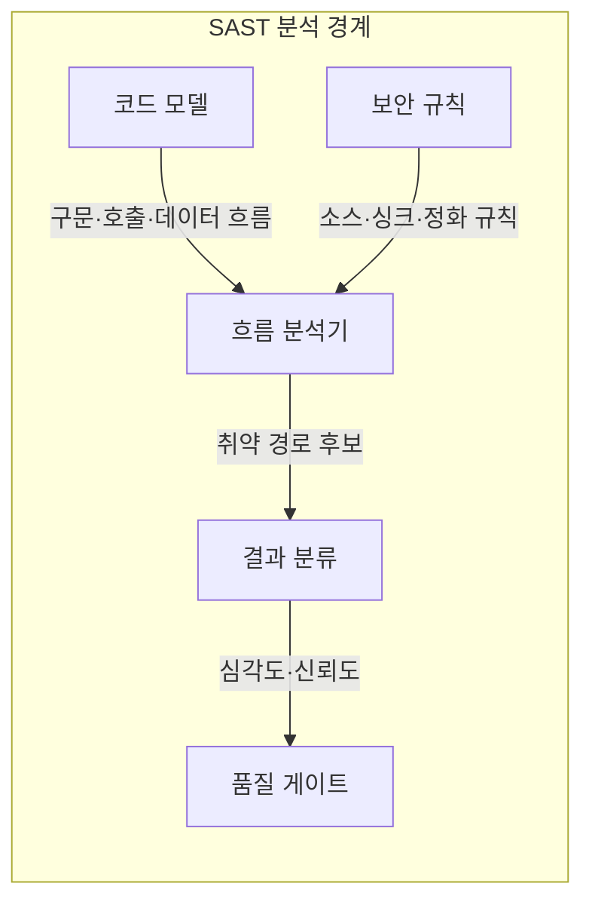
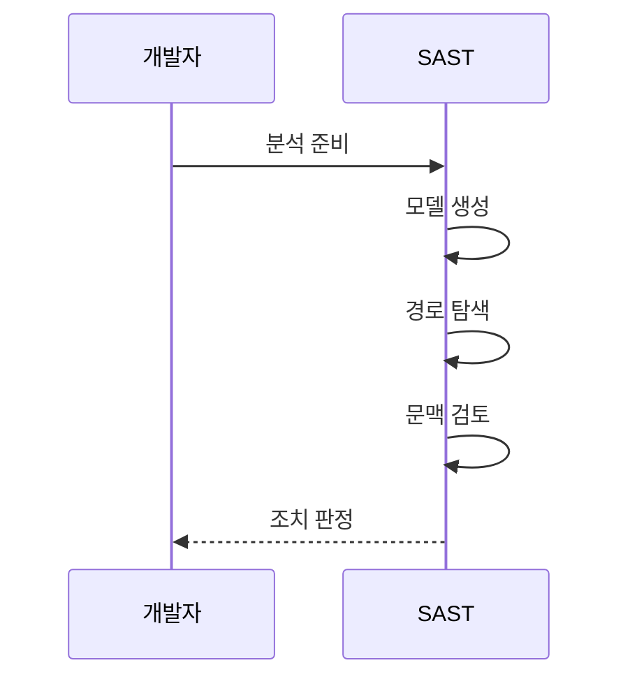

---
sidebar:
  order: 67
  label: "067. 정적 분석 SAST (Static Application Security Testing)"
  badge:
    text: "기출 · 70%"
    variant: note
title: "정적 분석 SAST (Static Application Security Testing)"
date: "2026-07-25T17:59:00+09:00"
tags:
  - "notes-software"
weight: 67
extra:
  question_no: "067"
  source_status: "기출"
  source_history: "128회, 135회"
  priority: 70
  priority_note: "128·135회 반복, 정적 취약점 탐지 핵심"
---

## 미리 알고가기

- **정적 애플리케이션 보안 테스트(Static Application Security Testing, SAST)**: 프로그램을 실행하지 않고 코드 모델과 보안 규칙으로 취약 경로와 원인 위치를 찾는 검사
- **동적 애플리케이션 보안 테스트(Dynamic Application Security Testing, DAST)**: 실행 중인 애플리케이션의 인터페이스에 요청을 보내 실제 취약 동작을 검증하는 검사
- **추상 구문 트리(Abstract Syntax Tree, AST)**: 코드의 문법 요소와 포함 관계를 트리 노드로 나타내 흐름 분석의 기반이 되는 모델
- **응용 프로그래밍 인터페이스(Application Programming Interface, API)**: 외부 프로그램의 요청이 애플리케이션 기능으로 들어오는 호출 접점
- **구조화 질의 언어(Structured Query Language, SQL)**: 관계형 데이터베이스의 데이터 조회·변경 명령을 표현하는 언어
- **오염 분석(Taint Analysis)**: 신뢰하지 않은 외부 입력이 정화되지 않은 채 위험 연산까지 도달하는 경로를 추적하는 분석
- **소스·싱크·정화 함수(Source·Sink·Sanitizer)**: 소스는 외부 입력 지점, 싱크는 위험 연산, 정화 함수는 입력의 위험 문자를 제거하거나 무해하게 바꾸는 처리
- **호출 그래프(Call Graph)**: 함수·메서드 사이의 호출 관계를 연결해 입력이 여러 호출을 거쳐 이동하는 경로를 나타낸 그래프
- **도달 가능성(Reachability)**: 분석한 취약 경로가 실제 제어 흐름에서 실행될 수 있는지 나타내는 성질
- **오탐·미탐(False Positive and False Negative)**: 오탐은 안전한 경로를 취약하다고 경고한 결과이고 미탐은 실제 취약 경로를 놓친 결과
- **심각도·신뢰도(Severity·Confidence)**: 심각도는 취약점의 예상 영향이고 신뢰도는 분석 결과가 실제 취약점일 가능성에 대한 도구의 평가
- **품질 게이트(Quality Gate)**: 허용 심각도·신뢰도 기준을 넘는 취약점 결과로 코드 병합이나 배포를 중단하는 통제
- **수동 리뷰(Manual Review)**: 자동 분석이 알 수 없는 업무 권한·실행 문맥을 사람이 확인해 경고의 실제 취약 여부를 판정하는 검토

## Ⅰ. 개요

- **정의/개념**: 코드 모델·보안 규칙으로 취약 경로를 찾는 검사
- **배경/필요성**: 배포 후 취약점 수정 비용으로 정적 탐지 필요

### 쉽게 이해하기 (학습용)

- 설계도에서 외부 배선이 위험 장치로 바로 이어지는 경로를 찾는 것임

## Ⅱ. 특징

- 빌드 전에 취약 코드 위치와 입력 경로를 제시한다.
- AST·호출·데이터 흐름으로 소스-싱크를 추적한다.
- 언어·프레임워크·빌드 문맥이 탐지 정확도를 좌우한다.
- 실행 상태가 없어 오탐·미탐을 수동 검토해야 한다.

### 쉽게 이해하기 (학습용)

- 설계도에서 위험을 찾지만 문이 잠기는지는 확인이 필요함

## Ⅲ. 아키텍처 및 구성요소

| 설계 요소 | 설명 |
|:---|:---|
| 코드 모델 | 구문을 AST·호출·데이터 흐름으로 표현 |
| 보안 규칙 | 위험 API·정화 함수·취약 패턴 정의 |
| 흐름 분석기 | 외부 입력에서 위험 함수까지 경로 계산 |
| 결과 분류 | 위치·경로·심각도·신뢰도 부여 |
| 품질 게이트 | 검토 결과로 병합·배포 통제 |

> 요약: 코드 흐름과 보안 규칙이 취약 경로 후보를 산출함

### 쉽게 이해하기 (학습용)

- 코드 모델과 규칙으로 수정 위치와 통과 여부를 정함

## Ⅳ. 원리 및 절차 흐름도

| 절차 | 설명 |
|:---|:---|
| 분석 준비 | 소스·종속성·보안 규칙 로드 |
| 모델 생성 | AST·호출·데이터 흐름 구성 |
| 경로 탐색 | 외부 입력부터 위험 함수까지 추적 |
| 문맥 검토 | 정화 여부·도달 가능성 검토 |
| 조치 판정 | 수정·예외·품질 게이트 결정 |

> 요약: 취약 경로의 도달성과 정화를 검토해 조치를 판정함

### 쉽게 이해하기 (학습용)

- 외부 입력이 위험 함수까지 가는 경로와 정화를 확인함

## Ⅴ. 종류 및 비교

| 판단 기준 | SAST | DAST |
|:---|:---|:---|
| 핵심 특징 | 코드 산출물의 내부 흐름 분석 | 실행 인터페이스의 요청·응답 분석 |
| 탐지 강점 | 취약 코드 위치와 입력 경로를 찾음 | 실제 구성 세션 취약 동작을 찾음 |
| 적용 기준 | 코드와 언어 분석 지원이 있을 때 | 실행 환경과 진입점이 준비됐을 때 |
| 주요 위험 | 오탐·실행 구성 취약점 누락 | 경로 미실행·코드 위치 추적 난도 |

> 요약: SAST는 코드, DAST는 실행 동작을 확인

### 쉽게 이해하기 (학습용)

- SAST는 설계도를 보고 위험을 찾고 DAST는 건물을 검증함

## Ⅵ. 실무 사례

1. SQL 문자열 결합 경로를 매개변수 질의로 수정
2. 권한 경고는 업무 규칙과 대조해 수동 판정

### 쉽게 이해하기 (학습용)

- 입력이 명령에 섞이는 경로를 찾아 수정함
- 할인 권한은 사람이 업무 규칙을 확인함

## Ⅶ. 결론

- SAST로 코드 경로 탐지, 실행 공백은 DAST로 검증

### 쉽게 이해하기 (학습용)

- 설계도에서 위험 경로를 찾고 실제 작동 여부는 실행 검사로 확인함
