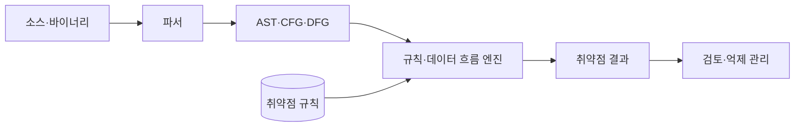
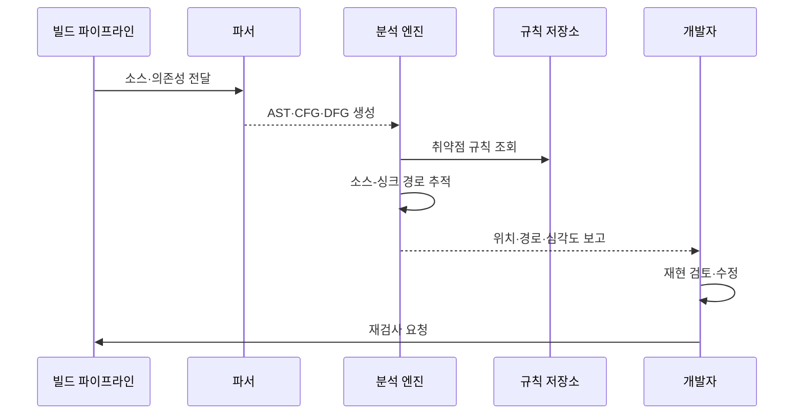

---
sidebar:
  order: 67
  label: "067. 정적 분석 SAST (Static Application Security Testing)"
  badge:
    text: "기출 · 70%"
    variant: note
title: "정적 분석 SAST (Static Application Security Testing)"
date: "2026-07-27T23:59:59+09:00"
tags:
  - "notes-software"
weight: 67
extra:
  question_no: "067"
  source_status: "기출"
  source_history: "128회, 135회"
  priority: 70
  priority_note: "128·135회 반복, 정적 취약점 탐지 핵심"
---

## 미리 알고가기

- **SAST(Static Application Security Testing)**: 프로그램을 실행하지 않고 소스·바이너리의 보안 결함을 찾는 정적 보안 테스트
- **AST(Abstract Syntax Tree)**: 소스 코드의 문법 구조를 트리로 표현해 의미 분석에 사용하는 자료구조
- **CFG(Control Flow Graph)**: 프로그램에서 실행 가능한 제어 경로를 그래프로 표현한 구조
- **DFG(Data Flow Graph)**: 값의 정의·사용·전파 관계를 그래프로 표현한 구조
- **소스(Source)**: 외부 입력이 데이터 흐름에 들어오는 지점
- **싱크(Sink)**: 명령 실행·데이터베이스 질의처럼 오염값이 위험을 일으키는 지점
- **새니타이저(Sanitizer)**: 오염값을 검증·변환해 위험을 제거하는 처리
- **오탐·미탐(False Positive·False Negative)**: 정상 코드를 취약하다고 판단하거나 실제 취약점을 놓치는 오류

## Ⅰ. 개요

- 정의/개념: 코드 비실행 상태에서 **보안 결함을 분석**하는 기법
- 기존 한계: 수동 코드 검토의 **대규모 경로 추적 한계**

### 쉽게 이해하기 (학습용)

- 프로그램을 켜지 않고 설계도와 코드 흐름을 따라 위험한 입력 경로를 찾는 방식이다.

## Ⅱ. 특징

- **화이트박스 분석**으로 결함 위치와 경로 제시
- 개발 초기·빌드 단계의 **시프트 레프트 탐지**
- 동적 실행 맥락 부재로 **오탐·미탐 발생**

### 쉽게 이해하기 (학습용)

- 코드 내부를 볼 수 있어 위치는 잘 찾지만 실제 실행 환경에서 가능한 공격인지는 따로 확인해야 한다.

## Ⅲ. 아키텍처 및 구성요소

| 구성요소 | 책임 |
|:---|:---|
| 파서 | 코드를 **중간 표현으로 변환** |
| 흐름 모델 | 제어·데이터의 **도달 경로 표현** |
| 분석 엔진 | 소스에서 싱크까지 **오염 전파 추적** |
| 취약점 규칙 | 위험 패턴과 **안전 처리 조건** 정의 |
| 결과 관리 | 결함 위치·경로와 **오탐 억제** 관리 |

> 요약: 코드 흐름에서 오염값이 위험 지점에 도달하는지 분석

### 쉽게 이해하기 (학습용)

- 입력값이 검사되지 않은 채 명령이나 질의까지 흘러가는 길을 코드에서 찾는다.

## Ⅳ. 원리 및 절차 흐름도

| 절차 | 설명 |
|:---|:---|
| 코드 모델 생성 | 소스·바이너리·의존성을 **AST·CFG·DFG**로 구성 |
| 규칙 조회 | 언어별 **취약점 패턴 적용** |
| 경로 추적 | 소스부터 싱크까지 **오염 전파 분석** |
| 결과 검토 | 위치·경로와 **실행 가능성 확인** |
| 수정·재검사 | 원인 제거 후 **동일 규칙 재검사** |

> 요약: 코드 모델과 규칙으로 위험 데이터 경로를 추적

### 쉽게 이해하기 (학습용)

- 코드를 구조도로 바꿔 위험한 입력 길을 찾고 사람이 실제 위험인지 확인한 뒤 다시 검사한다.

## Ⅴ. 종류 및 비교

| 애플리케이션 보안 테스트 | SAST | DAST |
|:---|:---|:---|
| 적용 기준 | 개발 중 **코드 결함 조기 탐지** | 실행 중 **외부 공격 검증** |
| 핵심 특징 | 내부 코드·**경로 분석** | 요청·응답 기반 **블랙박스 검사** |
| 한계 | 실행 맥락 부재·**오탐** | 코드 위치 불명·**경로 누락** |

### 쉽게 이해하기 (학습용)

- SAST는 코드 안에서 원인을 찾고 DAST는 실행 중인 서비스 밖에서 공격 결과를 확인한다.

## Ⅵ. 실무 사례

1. 빌드 시 **SQL 삽입 오염 경로 차단**

### 쉽게 이해하기 (학습용)

- 사용자 입력이 검증 없이 데이터베이스 질의에 들어가는 변경은 빌드를 막는다.

## Ⅶ. 결론

- 배포 전 코드 취약점을 조기에 차단하기 위해 **데이터 흐름·오탐률·분석 범위·실행 영향**을 검토하고, 원인은 SAST로 추적하며 실제 공격 가능성은 DAST로 보완한다

### 쉽게 이해하기 (학습용)

- 코드 분석 결과를 실제 공격 테스트와 함께 확인해야 각 방식의 누락을 줄일 수 있다.
