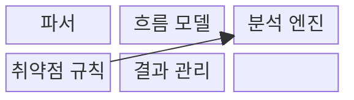
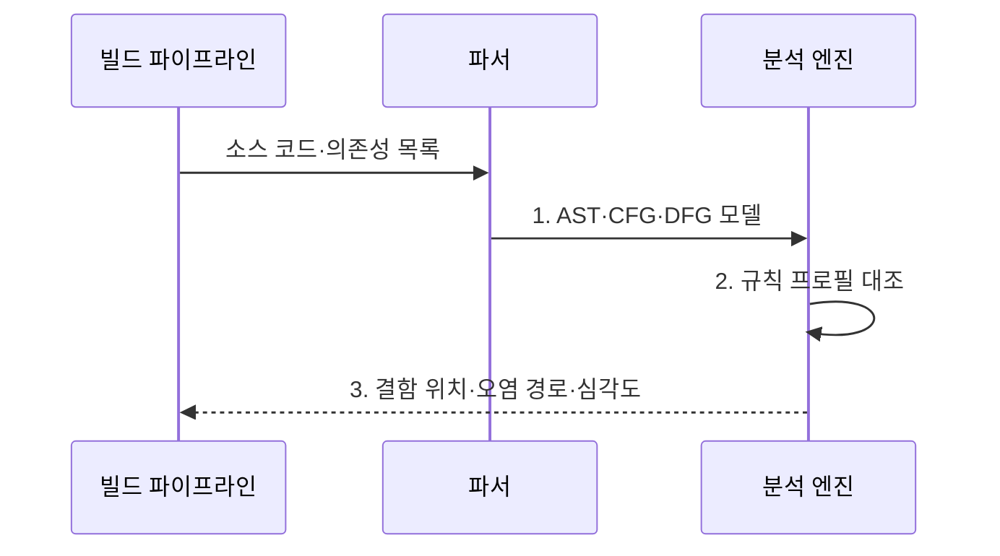

---
sidebar:
  order: 67
  label: "067. 정적 분석 SAST (Static Application Security Testing)"
  badge:
    text: "기출 · 70%"
    variant: note
title: "정적 분석 SAST (Static Application Security Testing)"
date: "2026-08-02T12:00:00+09:00"
tags:
  - "notes-software"
weight: 67
extra:
  question_no: "067"
  source_status: "기출"
  source_history: "128회, 135회"
  priority: 70
  priority_note: "128·135회 반복, 정적 취약점 탐지 핵심"
---

## Ⅰ. 개요

핵심 용어

- **정적 애플리케이션 보안 테스트(Static Application Security Testing, SAST)**: 프로그램을 실행하지 않고 코드 구조와 규칙으로 취약 경로를 찾는 보안 시험 기법이다.
- **입력-위험 동작 경로**: 외부 입력이 검증 없이 명령 실행이나 데이터베이스 질의에 도달하는 흐름이다.

- 정의/개념: **SAST** 는 애플리케이션을 실행하지 않고 소스·바이트코드의 데이터 흐름과 제어 흐름을 분석하여 보안 결함을 찾는 정적 보안 시험 기법
- 배경/필요성: 수동 검토는 대규모 코드의 **입력-위험 동작 경로 추적 한계**

#### 한줄 요약

- 프로그램을 켜지 않고 설계도와 코드 흐름을 따라 위험한 입력 경로를 찾는 방식이다.

## Ⅱ. 특징

핵심 용어

- **화이트박스 분석(White-box Analysis)**: 코드 내부 구조와 구현을 볼 수 있는 상태에서 수행하는 분석이다.
- **시프트 레프트(Shift Left)**: 보안 검증을 개발·빌드 초기 단계로 앞당기는 원칙이다.
- **오탐·미탐(False Positive·False Negative)**: 정상 코드를 취약하다고 판단하거나 실제 취약점을 놓치는 오류이다.

- **화이트박스 분석** 으로 결함 위치와 경로 제시
- 개발 초기·빌드 단계의 **시프트 레프트 탐지**
- 동적 실행 맥락 부재로 **오탐·미탐 발생**

#### 한줄 요약

- 코드 내부를 볼 수 있어 위치는 잘 찾지만 실제 실행 환경에서 가능한 공격인지는 따로 확인해야 한다.

## Ⅲ. 구조 및 구성요소

핵심 용어

- **파서(Parser)**: 소스 코드를 분석 가능한 구문 구조로 변환하는 구성요소이다.
- **소스-싱크 오염 전파**: 외부 입력이 위험한 연산 지점까지 전달되는 데이터 흐름이다.
- **새니타이저(Sanitizer)**: 오염값을 검증·변환해 위험을 제거하는 처리이다.
- **억제 근거**: 검토한 오탐을 범위와 만료 조건에 따라 결과에서 제외하는 이유와 증거이다.

| 구성요소 | 책임 |
|:---|:---|
| 파서 | 코드를 **구문 구조** 로 변환 |
| 흐름 모델 | **제어·데이터 도달 경로** 표현 |
| 분석 엔진 | **소스-싱크 오염 전파** 추적 |
| 취약점 규칙 | **위험 패턴·새니타이저 조건** 정의 |
| 결과 관리 | **결함 위치·경로·억제 근거** 관리 |

#### 한줄 요약

- 코드를 흐름 모델로 바꾸고 규칙과 대조해 위험 경로를 찾는다.

## Ⅳ. 흐름도

핵심 용어

- **AST(Abstract Syntax Tree, 추상 구문 트리)**: 소스 코드의 문법 구조를 트리로 표현한 자료구조이다.
- **CFG(Control Flow Graph, 제어 흐름 그래프)**: 프로그램에서 실행 가능한 제어 경로를 그래프로 표현한 구조이다.
- **DFG(Data Flow Graph, 데이터 흐름 그래프)**: 값의 정의·사용·전파 관계를 그래프로 표현한 구조이다.
- **오염 경로(Taint Path)**: 외부 입력이 새니타이저를 거치지 않고 위험한 싱크까지 도달하는 경로이다.
- **규칙 프로필(Rule Profile)**: 언어·프레임워크별 취약 소스·싱크·새니타이저 조건을 묶어 적용하는 분석 규칙 집합이다.
- **심각도(Severity)**: 취약점이 악용됐을 때 기밀성·무결성·가용성에 미치는 피해 등급이다.

**동작 원리**

- **1. AST·CFG·DFG 모델**: 소스·의존성을 구문·제어·데이터 구조로 변환
- **2. 규칙 프로필 대조**: 언어·프레임워크별 소스-싱크 경로의 안전 조건 확인
- **3. 결함 위치·오염 경로·심각도**: 취약 원인과 전파 경로를 결과로 보존

> 요약: 코드 모델과 규칙으로 위험 데이터가 소스에서 싱크까지 도달하는 경로를 검색

#### 한줄 요약

- 코드를 구조도로 바꿔 위험한 입력 길을 찾고 사람이 실제 위험인지 확인한 뒤 다시 검사한다.

## Ⅴ. 종류 및 비교

핵심 용어

- **SAST(Static Application Security Testing, 정적 애플리케이션 보안 테스트)**: 코드 내부 경로를 분석해 개발 중 결함을 조기에 찾는 보안 테스트이다.
- **DAST(Dynamic Application Security Testing, 동적 애플리케이션 보안 테스트)**: 실행 중인 서비스에 요청을 보내 외부 공격 가능성을 검증하는 테스트이다.

| 애플리케이션 보안 테스트 | SAST | DAST |
|:---|:---|:---|
| 적용 기준 | 개발 중 **코드 결함 조기 탐지** | 실행 중 **외부 공격 검증** |
| 핵심 특징 | 내부 코드·**경로 분석** | 요청·응답 기반 **블랙박스 검사** |
| 한계 | 실행 맥락 부재·**오탐** | 코드 위치 불명·**경로 누락** |

> 요약: SAST는 코드 원인을 찾고 DAST는 실행 환경의 공격 가능성을 확인

#### 한줄 요약

- SAST는 코드 안에서 원인을 찾고 DAST는 실행 중인 서비스 밖에서 공격 결과를 확인한다.

## Ⅵ. 실무 고려사항 및 대책

핵심 용어

- **근거별 억제**: 오탐의 위치·이유·범위·만료 조건을 기록하고 이후 결과에서 제외하는 처리이다.
- **취약 코드 회귀 검사(Vulnerability Regression Test)**: 알려진 취약 코드가 분석기 갱신 후에도 탐지되는지 확인하는 검사이다.
- **증분 분석(Incremental Analysis)**: 전체 코드 대신 변경분과 영향 범위를 우선 분석하는 방식이다.
- **실행 가능성 검토(Reachability Review)**: 탐지 경로가 실제 입력·설정·호출 조건에서 실행될 수 있는지 확인하는 검토이다.
- **경고 피로(Alert Fatigue)**: 오탐·중복 경고가 많아져 중요한 취약점까지 검토가 늦거나 무시되는 현상이다.
- **분석기 갱신(Analyzer Update)**: 새 언어·프레임워크 흐름과 취약 패턴을 인식하도록 엔진과 규칙을 최신화하는 작업이다.
- **저장소·산출물 기준 범위**: 직접 작성 코드뿐 아니라 생성 코드와 빌드에 포함된 의존성까지 분석 대상으로 정한 경계이다.
- **주기적 전체 분석(Periodic Full Analysis)**: 증분 검사에서 놓칠 교차 모듈 경로를 찾도록 전체 저장소를 정기적으로 다시 분석하는 방식이다.
- **노출·자산 영향(Exposure·Asset Impact)**: 취약 경로가 외부 입력에 열려 있는 정도와 침해 시 보호 대상에 미치는 피해이다.

| 문제 | 대책 | 효과 |
|:---|:---|:---|
| 실행 불가능한 경로까지 탐지해 오탐과 경고 피로 증가 | **실행 가능성 검토·근거별 억제** | **경고 피로·오탐** 감소 |
| 규칙 노후화로 새 프레임워크 흐름을 미탐 | **분석기 갱신·취약 코드 회귀 검사** | **새 코드 흐름 미탐** 방지 |
| 선택한 디렉터리만 분석해 생성 코드·의존성 누락 | **저장소·산출물 기준 범위** 명시 | **생성 코드·의존성** 포함 |
| 매 변경마다 전체 분석해 병합 피드백 지연 | **증분 분석·주기적 전체 분석** 병행 | **병합 피드백 시간** 단축 |
| 심각도만으로 도달 불가능한 저영향 경로까지 차단 | **경로·노출·자산 영향** 으로 우선순위화 | **실제 위험 중심 차단** |

> 적용 사례: 빌드에서 사용자 입력이 검증 없이 SQL 질의에 도달하는 경로를 차단

#### 한줄 요약

- 사용자 입력이 검증 없이 데이터베이스 질의에 들어가는 변경은 빌드를 막는다.

## Ⅶ. 결론

핵심 용어

- **코드 경로·실행 가능성·자산 영향**: SAST 결과의 실제 위험과 조치 순서를 판단하는 세 가지 기준이다.
- **SAST 조치 우선순위**: 탐지 결과 중 먼저 수정하거나 차단할 항목의 순서이다.

- **코드 경로·실행 가능성·자산 영향** 으로 **SAST 조치 우선순위** 결정

#### 한줄 요약

- 코드 분석 결과를 실제 공격 테스트와 함께 확인해야 각 방식의 누락을 줄일 수 있다.
