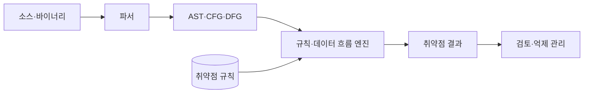
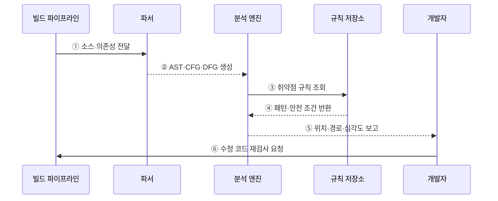

---
sidebar:
  order: 67
  label: "067. 정적 분석 SAST (Static Application Security Testing)"
  badge:
    text: "기출 · 70%"
    variant: note
title: "정적 분석 SAST (Static Application Security Testing)"
date: "2026-07-27T23:59:59+09:00"
tags:
  - "notes-software"
weight: 67
extra:
  question_no: "067"
  source_status: "기출"
  source_history: "128회, 135회"
  priority: 70
  priority_note: "128·135회 반복, 정적 취약점 탐지 핵심"
---

## 미리 알고가기

- **SAST(Static Application Security Testing)**: 프로그램을 실행하지 않고 소스·바이너리의 보안 결함을 찾는 정적 보안 테스트
- **AST(Abstract Syntax Tree)**: 소스 코드의 문법 구조를 트리로 표현해 의미 분석에 사용하는 자료구조
- **CFG(Control Flow Graph)**: 프로그램에서 실행 가능한 제어 경로를 그래프로 표현한 구조
- **DFG(Data Flow Graph)**: 값의 정의·사용·전파 관계를 그래프로 표현한 구조
- **소스(Source)**: 외부 입력이 데이터 흐름에 들어오는 지점
- **싱크(Sink)**: 명령 실행·데이터베이스 질의처럼 오염값이 위험을 일으키는 지점
- **새니타이저(Sanitizer)**: 오염값을 검증·변환해 위험을 제거하는 처리
- **오탐·미탐(False Positive·False Negative)**: 정상 코드를 취약하다고 판단하거나 실제 취약점을 놓치는 오류
- **억제(Suppression)**: 검토한 오탐을 근거·범위·만료 조건과 함께 이후 결과에서 제외하는 처리

## Ⅰ. 개요

- 정의/개념: 코드 비실행 상태에서 **보안 결함을 분석**하는 기법
- 기존 한계: 수동 코드 검토의 **대규모 경로 추적 한계**

### 쉽게 이해하기 (학습용)

- 프로그램을 켜지 않고 설계도와 코드 흐름을 따라 위험한 입력 경로를 찾는 방식이다.

## Ⅱ. 특징

- **화이트박스 분석**으로 결함 위치와 경로 제시
- 개발 초기·빌드 단계의 **시프트 레프트 탐지**
- 동적 실행 맥락 부재로 **오탐·미탐 발생**

### 쉽게 이해하기 (학습용)

- 코드 내부를 볼 수 있어 위치는 잘 찾지만 실제 실행 환경에서 가능한 공격인지는 따로 확인해야 한다.

## Ⅲ. 아키텍처 및 구성요소

**도표안 A — 구조도**

**도표안 B — sequenceDiagram**

| 구성요소 | 책임 |
|:---|:---|
| 파서 | 코드를 중간 표현으로 변환 |
| 흐름 모델 | 제어·데이터의 도달 경로 표현 |
| 분석 엔진 | 소스에서 싱크까지 오염 전파 추적 |
| 취약점 규칙 | 위험 패턴과 안전 처리 조건 정의 |
| 결과 관리 | 결함 위치·경로와 오탐 억제 관리 |

**동작 원리**

- ① 빌드 파이프라인이 분석할 소스·바이너리·의존성을 전달한다.
- ② 파서가 코드를 AST·CFG·DFG 중간 표현으로 변환한다.
- ③ 분석 엔진이 언어·프레임워크별 취약점 규칙을 조회한다.
- ④ 규칙 저장소가 위험 패턴과 안전 처리 조건을 반환한다.
- ⑤ 엔진이 소스부터 싱크까지 오염 전파를 추적해 위치·경로·심각도를 보고한다.
- ⑥ 개발자가 실행 가능성을 검토하고 원인을 수정해 같은 규칙으로 재검사한다.

> 요약: 코드 모델과 규칙으로 위험 데이터가 소스에서 싱크까지 도달하는 경로를 찾는다.

### 쉽게 이해하기 (학습용)

- 코드를 구조도로 바꿔 위험한 입력 길을 찾고 사람이 실제 위험인지 확인한 뒤 다시 검사한다.

## Ⅳ. 종류 및 비교

| 애플리케이션 보안 테스트 | SAST | DAST |
|:---|:---|:---|
| 적용 기준 | 개발 중 **코드 결함 조기 탐지** | 실행 중 **외부 공격 검증** |
| 핵심 특징 | 내부 코드·**경로 분석** | 요청·응답 기반 **블랙박스 검사** |
| 한계 | 실행 맥락 부재·**오탐** | 코드 위치 불명·**경로 누락** |

> 요약: SAST는 코드 원인을 찾고 DAST는 실행 환경의 공격 가능성을 확인한다.

### 쉽게 이해하기 (학습용)

- SAST는 코드 안에서 원인을 찾고 DAST는 실행 중인 서비스 밖에서 공격 결과를 확인한다.

## Ⅴ. 실무 고려사항 및 대책

| 고려사항 | 문제점 | 대책 |
|:---|:---|:---|
| 높은 오탐 | 경고 피로로 실제 취약점까지 무시 | 경로·실행 가능성 검토와 근거 있는 범위별 억제 |
| 규칙 노후화 | 새 언어 기능·프레임워크 흐름을 놓침 | 규칙·분석기 버전 갱신과 표본 취약 코드 회귀 검사 |
| 분석 범위 누락 | 생성 코드·의존성·설정의 위험 미탐 | 저장소·빌드 산출물 기준으로 포함 범위 명시 |
| 긴 분석 시간 | 전체 분석이 병합 피드백을 지연 | 변경분 빠른 검사와 주기적 전체 분석 병행 |
| 심각도만 차단 | 실제 도달 가능성·자산 중요도를 반영하지 못함 | 경로·노출·자산 영향 기반 위험 우선순위 적용 |

> 적용 사례: 빌드에서 사용자 입력이 검증 없이 SQL 질의에 도달하는 경로를 차단한다.

### 쉽게 이해하기 (학습용)

- 사용자 입력이 검증 없이 데이터베이스 질의에 들어가는 변경은 빌드를 막는다.

## Ⅵ. 결론

- SAST는 코드를 실행하지 않고 취약 데이터 흐름과 원인 위치를 조기에 찾는다.
- 실제 공격 가능성과 실행 맥락은 DAST·수동 검토로 보완한다.

### 쉽게 이해하기 (학습용)

- 코드 분석 결과를 실제 공격 테스트와 함께 확인해야 각 방식의 누락을 줄일 수 있다.
