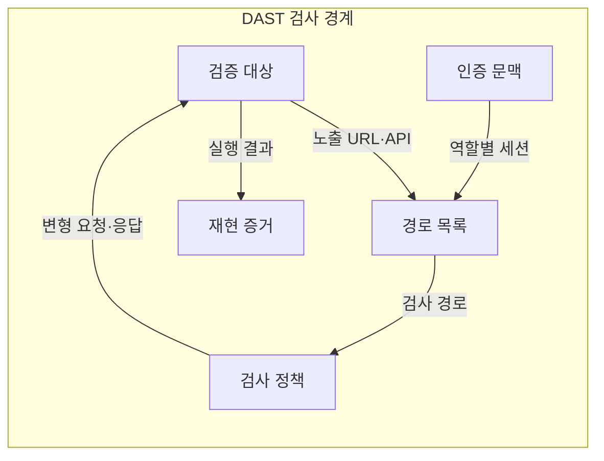
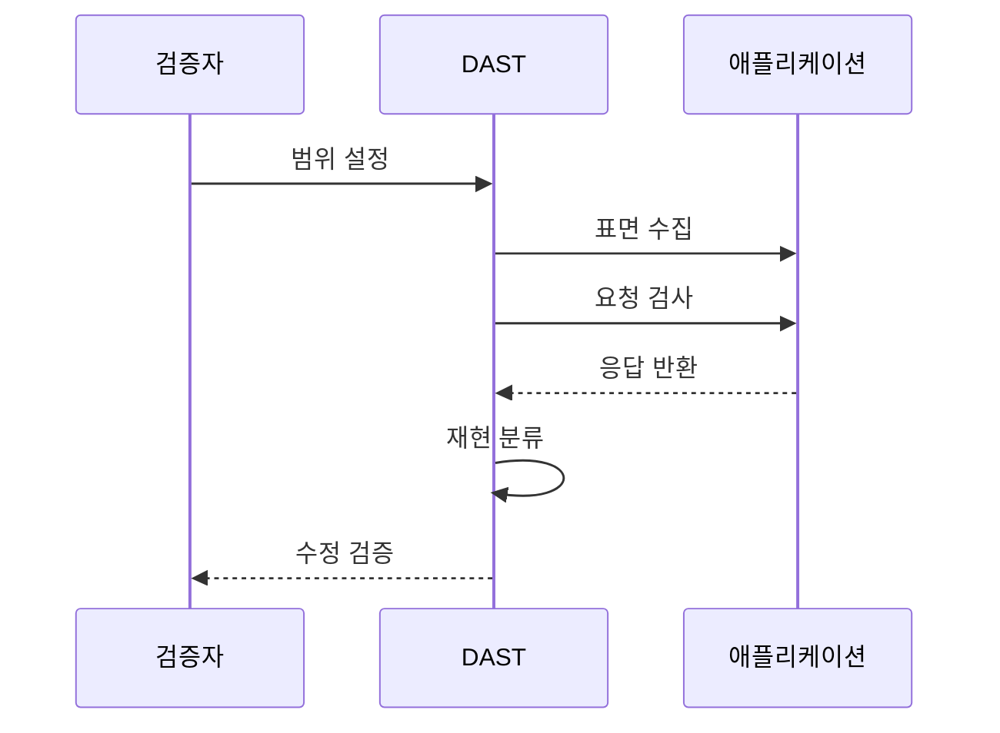

---
sidebar:
  order: 68
  label: "068. 동적 애플리케이션 보안 테스트 DAST (Dynamic Application Security Testing)"
  badge:
    text: "기출 · 70%"
    variant: note
title: "동적 애플리케이션 보안 테스트 DAST (Dynamic Application Security Testing)"
date: "2026-07-25T18:00:00+09:00"
tags:
  - "notes-software"
weight: 68
extra:
  question_no: "068"
  source_status: "기출"
  source_history: "128회, 135회"
  priority: 70
  priority_note: "128·135회 반복, 실행 기반 취약점 탐지"
---

## 미리 알고가기

- **동적 애플리케이션 보안 테스트(Dynamic Application Security Testing, DAST)**: 실행 중인 애플리케이션에 변형 요청을 보내 응답·상태로 실제 취약 동작을 검증하는 검사
- **정적 애플리케이션 보안 테스트(Static Application Security Testing, SAST)**: 프로그램을 실행하지 않고 코드 모델과 보안 규칙으로 취약 경로와 원인 위치를 찾는 검사
- **블랙박스 테스트(Black-box Testing)**: 내부 코드를 보지 않고 외부 입력과 관찰 가능한 출력으로 요구 동작을 검사하는 방식
- **공격 표면(Attack Surface)**: 외부 입력이 시스템에 도달할 수 있는 화면·주소·서비스 요청·권한 기능의 전체 접점
- **통합 자원 위치 지정자(Uniform Resource Locator, URL)**: 웹 자원의 위치와 접근 방식을 나타내 DAST가 검사 경로를 식별하는 주소
- **응용 프로그래밍 인터페이스(Application Programming Interface, API)**: 외부 프로그램의 요청이 애플리케이션 기능으로 들어오는 호출 접점
- **크롤링(Crawling)**: 시작 화면의 링크를 따라가며 검사할 주소와 입력 항목을 자동 수집하는 작업
- **인증 문맥(Authentication Context)**: 계정·역할·토큰·세션을 묶어 DAST 요청이 어떤 권한으로 실행되는지 나타내는 상태
- **경로 목록(Path Inventory)**: 검사할 URL·매개변수·권한 기능을 빠짐없이 관리해 숨은 공격 표면 누락을 줄이는 목록
- **검사 정책(Scan Policy)**: 허용 공격 유형·요청 속도·중단 조건을 정해 검사 범위와 운영 영향을 통제하는 규칙
- **재현 증거(Reproduction Evidence)**: 같은 요청으로 취약 동작을 반복 확인할 수 있도록 요청·응답·상태·위험 등급을 묶은 기록
- **스테이징 환경(Staging Environment)**: 운영과 유사하지만 실제 사용자와 격리되어 공격성 검사를 안전하게 수행하는 배포 전 환경

## Ⅰ. 개요

- **정의/개념**: 실행 요청·응답으로 실제 취약 동작을 찾는 검사
- **배경/필요성**: 실행 환경 결합 취약점으로 동적 검증 필요

### 쉽게 이해하기 (학습용)
- 완성된 건물의 문을 허가된 범위에서 열어 실제로 침입 가능한 틈을 확인함

## Ⅱ. 특징

- 서버 설정·인증 세션까지 결합한 취약 동작을 검증한다.
- 소스 언어와 무관하게 노출 화면·API를 검사한다.
- 경로 목록·권한 문맥이 미실행 경로 누락을 좌우한다.
- 요청은 재현해도 원인 코드는 별도 분석해야 한다.

### 쉽게 이해하기 (학습용)
- 실제 문을 검증해 잠금 실패는 확인하지만 원인은 코드를 다시 봐야 함

## Ⅲ. 아키텍처 및 구성요소

| 설계 요소 | 설명 |
|:---|:---|
| 검증 대상 | 격리한 애플리케이션·API 범위 |
| 경로 목록 | URL·매개변수·권한 기능 관리 |
| 인증 문맥 | 역할별 계정·토큰·세션 제공 |
| 검사 정책 | 공격 유형·속도·중단 조건 통제 |
| 재현 증거 | 요청·응답·상태·위험 등급 기록 |

> 요약: 인증 문맥과 검사 정책이 실행 검증 범위를 통제함

### 쉽게 이해하기 (학습용)
- 경로와 권한 및 검사 정책을 정하고 재현 증거를 남김

## Ⅳ. 원리 및 절차 흐름도

| 절차 | 설명 |
|:---|:---|
| 범위 설정 | 격리 환경·허용 경로·중단 조건 정의 |
| 표면 수집 | 크롤링·명세로 공격 표면 수집 |
| 요청 검사 | 변형 요청의 응답·상태 분석 |
| 응답 반환 | 실행 결과와 상태를 검사기에 반환 |
| 재현 분류 | 인증 문맥에서 취약 위험 확정 |
| 수정 검증 | 같은 요청으로 수정 결과 재검증 |

> 요약: 공격 표면을 검사하고 재현 요청으로 수정 결과를 확인함

### 쉽게 이해하기 (학습용)
- 검증 범위를 정하고 같은 요청으로 취약점과 수정을 확인함

## Ⅴ. 종류 및 비교

| 판단 기준 | DAST | SAST |
|:---|:---|:---|
| 핵심 특징 | 요청·응답·상태 외부 분석 | 코드·데이터 흐름 내부 분석 |
| 산출 증거 | 재현 요청과 실행 영향 | 의심 코드 위치와 규칙 위반 |
| 적용 기준 | 실행 환경의 공격 가능성 확인 | 코드 단계에서 조기 탐지 |
| 주요 위험 | 미실행 경로·원인 코드 추적 난도 | 오탐·실행 구성 취약점 누락 |

> 요약: SAST는 코드, DAST는 실제 공격을 확인

### 쉽게 이해하기 (학습용)
- SAST는 코드를 찾고 DAST는 실행 위험을 확인해 보완함

## Ⅵ. 실무 사례

1. 금융 API는 권한별 토큰으로 타 고객 접근 재현
2. 스테이징의 재현된 고위험을 배포 차단 조건으로 설정

### 쉽게 이해하기 (학습용)
- 권한별 요청으로 다른 고객 정보 노출을 확인함
- 재현된 고위험만 배포 차단 조건으로 삼음

## Ⅶ. 결론

- 격리 범위·인증 문맥으로 DAST 후 SAST와 결합

### 쉽게 이해하기 (학습용)
- 검증 요청을 보내 위험을 확인하고 재현하며 코드 검사 결과와 함께 판단함
