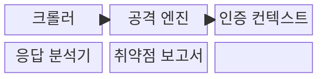
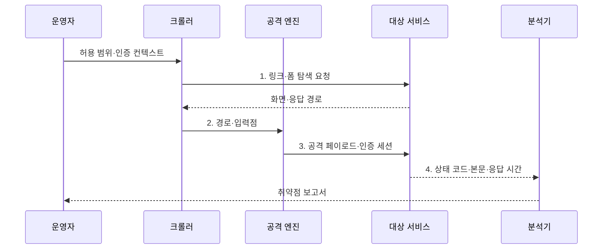

---
sidebar:
  order: 68
  label: "068. 동적 애플리케이션 보안 테스트 DAST (Dynamic Application Security Testing)"
  badge:
    text: "기출 · 70%"
    variant: note
title: "동적 애플리케이션 보안 테스트 DAST (Dynamic Application Security Testing)"
date: "2026-08-02T12:00:00+09:00"
tags:
  - "notes-software"
weight: 68
extra:
  question_no: "068"
  source_status: "기출"
  source_history: "128회, 135회"
  priority: 70
  priority_note: "128·135회 반복, 실행 기반 취약점 탐지"
---

## Ⅰ. 개요

핵심 용어

- **동적 보안 테스트**: 실행 중인 서비스에 공격 요청을 보내 외부에서 관찰되는 취약 반응을 찾는 시험이다.
- **실제 공격 성공**: 설정·인증·실행 환경을 포함한 조건에서 공격이 유효한 결과를 만드는 상태이다.

- 정의/개념: 실행 서비스에 공격 요청을 보내 취약 반응을 찾는 **동적 보안 테스트**
- 배경/필요성: 코드 분석만으로는 설정·인증을 포함한 **실제 공격 성공 확인 불가**

### 쉽게 이해하기 (학습용)

- 완성된 건물의 문과 창문을 실제로 두드려 외부에서 열리는 약한 지점을 찾는 방식이다.

## Ⅱ. 특징

핵심 용어

- **블랙박스 실행 검사**: 내부 코드 없이 외부 입력과 출력으로 실행 서비스의 보안을 검증하는 방식이다.
- **실제 취약 반응 확인**: 서버 설정과 인증을 포함한 환경에서 공격 결과를 직접 관찰하는 활동이다.
- **검사 누락**: 크롤러가 찾지 못한 경로나 권한이 시험 대상에서 빠지는 상태이다.

- 외부 공격자 관점의 **블랙박스 실행 검사**
- 서버 설정·인증을 포함한 **실제 취약 반응 확인**
- 탐색하지 못한 경로와 권한은 **검사 누락**

### 쉽게 이해하기 (학습용)

- 실제 서비스 반응을 확인하지만 크롤러가 찾지 못한 화면이나 권한은 검사할 수 없다.

## Ⅲ. 구조 및 구성요소

핵심 용어

- **크롤러(Crawler)**: 링크·폼·경로를 따라가며 검사할 공격 표면을 수집하는 구성요소이다.
- **공격 페이로드(Attack Payload)**: 취약 반응을 유도하려고 입력점에 삽입하는 공격 데이터이다.
- **인증 컨텍스트(Authentication Context)**: 로그인 상태·권한·세션을 유지하는 테스트 정보이다.
- **취약점 보고서(Vulnerability Report)**: 공격 요청·서비스 응답·재현 절차를 연결한 증거이다.

| 구성요소 | 책임 |
|:---|:---|
| 크롤러 | **경로·폼·매개변수** 공격 표면 수집 |
| 공격 엔진 | 입력점별 **공격 페이로드** 주입 |
| 인증 컨텍스트 | **세션·권한별 접근 상태** 유지 |
| 응답 분석기 | **상태·본문·응답 시간**의 취약 징후 판정 |
| 취약점 보고서 | **요청·응답·재현 절차** 증거 제공 |

### 쉽게 이해하기 (학습용)

- 경로를 찾고 공격 요청을 보낸 뒤 응답 증거로 취약점을 판정한다.

## Ⅳ. 흐름도

핵심 용어

- **공격 표면(Attack Surface)**: 외부에서 접근 가능한 경로·매개변수·기능의 집합이다.
- **공격 엔진(Attack Engine)**: 입력점별로 공격 페이로드와 인증 상태를 조합해 요청하는 구성요소이다.
- **상태 코드·본문·응답 시간**: 공격 결과의 취약 징후를 판정하는 외부 관측 자료이다.

**동작 원리**

- **1. 링크·폼 탐색 요청**: 허용 범위에서 화면·경로 수집
- **2. 경로·입력점**: 공격 가능한 매개변수와 기능을 공격 엔진에 제공
- **3. 공격 페이로드·인증 세션**: 권한별 입력점에 변조 요청 전송
- **4. 상태 코드·본문·응답 시간**: 취약 반응을 판정해 재현 증거 보존

> 요약: 범위 내 공격 표면에 실제 요청을 보내 외부에서 관찰되는 취약 반응을 검증

### 쉽게 이해하기 (학습용)

- 검사할 구역과 권한을 정하고 공격을 보낸 뒤 같은 요청으로 수정 여부를 다시 확인한다.

## Ⅴ. 종류 및 비교

핵심 용어

- **DAST(Dynamic Application Security Testing, 동적 애플리케이션 보안 테스트)**: 실행 서비스의 요청·응답으로 공격 가능성을 검증하는 테스트이다.
- **SAST(Static Application Security Testing, 정적 애플리케이션 보안 테스트)**: 소스·바이너리의 내부 경로를 분석해 코드 결함을 찾는 테스트이다.

| 애플리케이션 보안 테스트 | DAST | SAST |
|:---|:---|:---|
| 적용 기준 | 운영 유사 환경의 **공격 가능성 검증** | 개발 단계의 **코드 결함 조기 탐지** |
| 핵심 특징 | 실행 서비스 **요청·응답 분석** | 소스·바이너리 **내부 경로 분석** |
| 한계 | 코드 위치 불명·**탐색 경로 누락** | 실행 맥락 부재·**오탐** |

> 요약: DAST는 공격 가능성을 확인하고 SAST는 코드 원인을 추적

### 쉽게 이해하기 (학습용)

- DAST는 실제로 공격이 되는지 보고 SAST는 그 원인이 코드 어디에 있는지 찾는다.

## Ⅵ. 실무 고려사항 및 대책

핵심 용어

- **API 명세(Application Programming Interface Specification)**: 외부 호출 경로·입력·응답 형식을 정의한 문서이다.
- **프록시 기록(Proxy Record)**: 중계 지점에서 실제 요청·응답을 수집한 통신 기록이다.
- **요청 식별자(Request ID)**: 외부 요청과 내부 로그·코드 실행을 연결하는 고유 값이다.
- **스테이징 환경(Staging Environment)**: 운영과 유사하되 실제 사용자 영향 없이 보안 검증을 수행하는 시험 환경이다.

| 문제 | 대책 | 효과 |
|:---|:---|:---|
| 링크 탐색만으로 숨은 API·비공개 경로 누락 | **API 명세·프록시 기록·수동 경로** 추가 | **숨은 경로 검사 범위** 확대 |
| 단일 계정 검사로 역할별 권한 취약점 누락 | **역할별 계정·권한 전환** 구성 | **권한별 취약점 누락** 방지 |
| 파괴적 요청이 운영 데이터·가용성을 훼손 | **격리 환경·요청 제한·시험 데이터** 사용 | **데이터·가용성 훼손** 방지 |
| 일반 오류 응답을 취약 반응으로 오판 | **원본 요청 재현·수동 검토** | **취약 판정 신뢰도** 향상 |
| 외부 응답만으로 취약 코드 위치 추적 곤란 | **요청 식별자·로그·SAST** 연계 | **수정 위치 추적성** 확보 |

> 적용 사례: 운영 유사 스테이징 환경에서 SQL 삽입 요청의 데이터 노출과 오류 반응을 검증

### 쉽게 이해하기 (학습용)

- 운영과 비슷한 환경에 공격 질의를 보내 데이터 노출이나 오류 반응을 확인한다.

## Ⅶ. 결론

핵심 용어

- **공격 표면·권한·운영 영향**: DAST의 탐색 범위와 안전 통제를 결정하는 세 가지 기준이다.
- **DAST 범위**: 동적 공격 검사를 수행할 경로·역할·기능·환경의 경계이다.

- **공격 표면·권한·운영 영향**에 따라 DAST 범위를 결정

### 쉽게 이해하기 (학습용)

- 외부 공격 결과와 내부 코드 원인을 함께 확인해야 취약점의 위치와 영향 모두를 알 수 있다.
