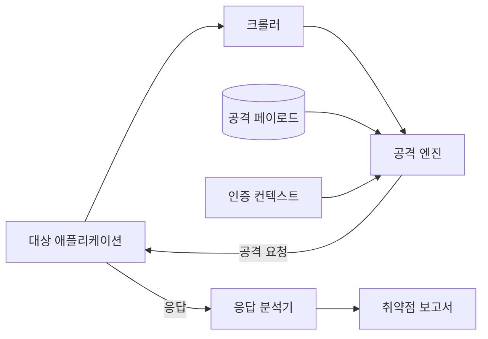
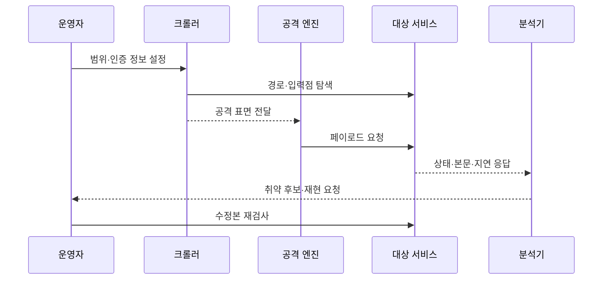

---
sidebar:
  order: 68
  label: "068. 동적 애플리케이션 보안 테스트 DAST (Dynamic Application Security Testing)"
  badge:
    text: "기출 · 70%"
    variant: note
title: "동적 애플리케이션 보안 테스트 DAST (Dynamic Application Security Testing)"
date: "2026-07-27T23:59:59+09:00"
tags:
  - "notes-software"
weight: 68
extra:
  question_no: "068"
  source_status: "기출"
  source_history: "128회, 135회"
  priority: 70
  priority_note: "128·135회 반복, 실행 기반 취약점 탐지"
---

## 미리 알고가기

- **DAST(Dynamic Application Security Testing)**: ‘대스트’로 읽고 영문 머리글자를 딴 약어이며, 실행 중 애플리케이션에 공격 요청을 보내 취약점을 찾는 테스트
- **블랙박스 테스트(Black-box Test)**: 내부 코드 없이 외부 입력과 출력으로 동작을 검증하는 방식
- **크롤러(Crawler)**: 링크·폼·경로를 따라가며 검사할 공격 표면을 수집하는 구성요소
- **퍼저(Fuzzer)**: 비정상·경계 입력을 반복 주입해 오류와 취약 반응을 찾는 도구
- **페이로드(Payload)**: 취약 반응을 유도하려고 요청에 삽입하는 공격 데이터
- **공격 표면(Attack Surface)**: 외부에서 접근 가능한 경로·매개변수·기능의 집합
- **인증 컨텍스트(Authentication Context)**: 로그인 상태·권한·세션을 유지하는 테스트 정보
- **오탐·미탐(False Positive·False Negative)**: 정상 반응을 취약하다고 판단하거나 실제 취약점을 놓치는 오류

## Ⅰ. 개요

- **정의/개념**: 실행 서비스에 공격 요청을 보내 **취약 반응을 탐지**하는 기법
- **기존 한계**: 코드 분석만으로 **실행 환경 취약점 검증** 곤란

### 쉽게 이해하기 (학습용)

- 완성된 건물의 문과 창문을 실제로 두드려 외부에서 열리는 약한 지점을 찾는 방식이다.

## Ⅱ. 특징

- 외부 공격자 관점의 **블랙박스 실행 검사**
- 서버 설정·인증을 포함한 **실제 취약 반응 확인**
- 탐색하지 못한 경로와 권한은 **검사 누락**

### 쉽게 이해하기 (학습용)

- 실제 서비스 반응을 확인하지만 크롤러가 찾지 못한 화면이나 권한은 검사할 수 없다.

## Ⅲ. 아키텍처 및 구성요소

| 구성요소 | 책임 |
|:---|:---|
| 크롤러 | 경로·폼·매개변수의 **공격 표면 수집** |
| 공격 엔진 | 경로별 **공격 페이로드 주입** |
| 인증 컨텍스트 | 세션·권한별 **접근 상태 유지** |
| 응답 분석기 | 상태·본문·시간의 **취약 징후 판정** |
| 보고서 | 요청·응답과 **재현 증거 제공** |

> 요약: 공격 표면에 페이로드를 주입하고 응답으로 취약점 판정

### 쉽게 이해하기 (학습용)

- 접근 가능한 주소를 모아 공격 입력을 보내고 오류 메시지나 비정상 응답을 증거로 남긴다.

## Ⅳ. 원리 및 절차 흐름도

| 절차 | 설명 |
|:---|:---|
| 범위 설정 | 대상·제외 경로와 **권한 정의** |
| 표면 탐색 | 링크·폼·API **입력점 수집** |
| 공격 생성 | 입력점별 **페이로드 구성** |
| 요청 실행 | 인증 상태로 **공격 요청 전송** |
| 응답 판정 | 오류·지연·본문의 **취약 징후 분석** |
| 재현·재검사 | 증거 확인 후 **수정 결과 검증** |

> 요약: 범위 내 입력점에 공격 요청을 보내 취약 반응 검증

### 쉽게 이해하기 (학습용)

- 검사할 구역과 권한을 정하고 공격을 보낸 뒤 같은 요청으로 수정 여부를 다시 확인한다.

## Ⅴ. 종류 및 비교

| 애플리케이션 보안 테스트 | DAST | SAST |
|:---|:---|:---|
| 적용 기준 | 운영 유사 환경의 **공격 가능성 검증** | 개발 단계의 **코드 결함 조기 탐지** |
| 핵심 특징 | 실행 서비스 **요청·응답 분석** | 소스·바이너리 **내부 경로 분석** |
| 한계 | 코드 위치 불명·**탐색 경로 누락** | 실행 맥락 부재·**오탐** |

### 쉽게 이해하기 (학습용)

- DAST는 실제로 공격이 되는지 보고 SAST는 그 원인이 코드 어디에 있는지 찾는다.

## Ⅵ. 실무 사례

1. 스테이징에서 **SQL 삽입 응답 검증**
2. 권한별 세션으로 **접근통제 우회 탐지**

### 쉽게 이해하기 (학습용)

- 운영과 비슷한 환경에 공격 질의를 보내 데이터 노출이나 오류 반응을 확인한다.
- 일반 사용자와 관리자 세션을 나눠 권한 밖 화면에 접근할 수 있는지 검사한다.

## Ⅶ. 결론

- 실행 공격 검증은 **DAST**, 코드 원인 추적은 **SAST 병행**

### 쉽게 이해하기 (학습용)

- 외부 공격 결과와 내부 코드 원인을 함께 확인해야 취약점의 위치와 영향 모두를 알 수 있다.
