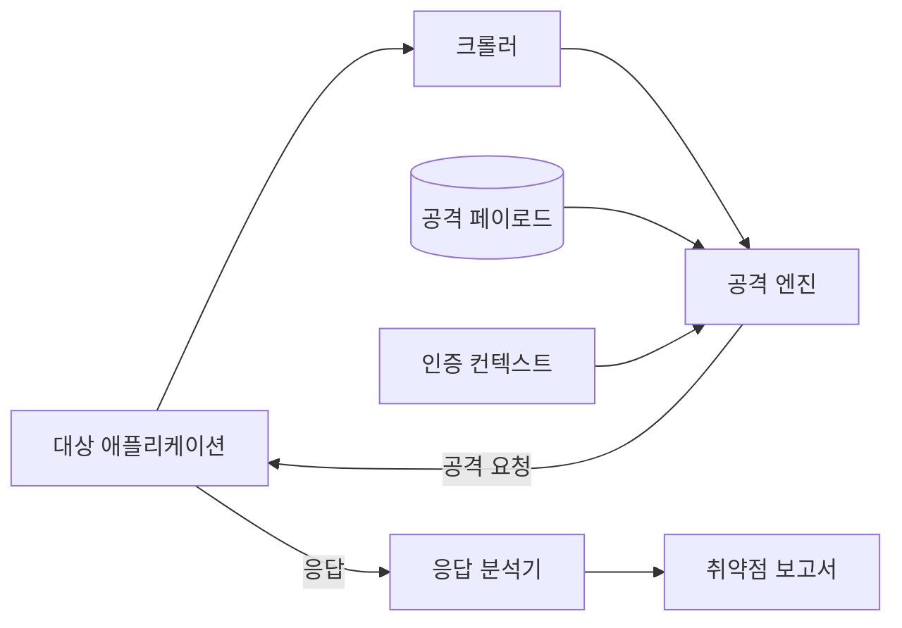
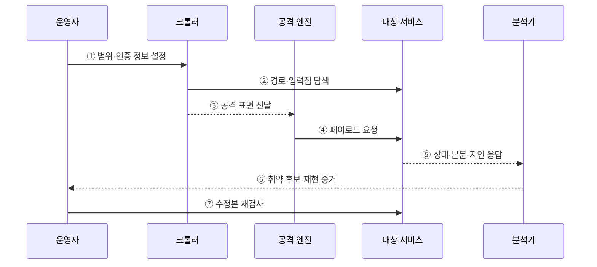

---
sidebar:
  order: 68
  label: "068. 동적 애플리케이션 보안 테스트 DAST (Dynamic Application Security Testing)"
  badge:
    text: "기출 · 70%"
    variant: note
title: "동적 애플리케이션 보안 테스트 DAST (Dynamic Application Security Testing)"
date: "2026-07-27T23:59:59+09:00"
tags:
  - "notes-software"
weight: 68
extra:
  question_no: "068"
  source_status: "기출"
  source_history: "128회, 135회"
  priority: 70
  priority_note: "128·135회 반복, 실행 기반 취약점 탐지"
---

## 미리 알고가기

- **DAST(Dynamic Application Security Testing)**: 실행 중인 애플리케이션에 공격 요청을 보내 외부에서 노출되는 취약점을 찾는 동적 보안 테스트
- **블랙박스 테스트(Black-box Test)**: 내부 코드 없이 외부 입력과 출력으로 동작을 검증하는 방식
- **크롤러(Crawler)**: 링크·폼·경로를 따라가며 검사할 공격 표면을 수집하는 구성요소
- **퍼저(Fuzzer)**: 비정상·경계 입력을 반복 주입해 오류와 취약 반응을 찾는 도구
- **페이로드(Payload)**: 취약 반응을 유도하려고 요청에 삽입하는 공격 데이터
- **공격 표면(Attack Surface)**: 외부에서 접근 가능한 경로·매개변수·기능의 집합
- **인증 컨텍스트(Authentication Context)**: 로그인 상태·권한·세션을 유지하는 테스트 정보
- **오탐·미탐(False Positive·False Negative)**: 정상 반응을 취약하다고 판단하거나 실제 취약점을 놓치는 오류
- **스테이징 환경(Staging Environment)**: 운영과 유사하게 구성하되 실제 사용자 영향 없이 배포·보안 검증을 수행하는 시험 환경
- **파괴적 페이로드(Destructive Payload)**: 데이터 삭제·대량 요청처럼 대상 상태나 가용성을 훼손할 수 있는 공격 입력

## Ⅰ. 개요

- 정의/개념: 실행 서비스에 공격 요청을 보내 **취약 반응을 탐지**하는 기법
- 기존 한계: 코드 분석만으로 **실행 환경 취약점 검증** 곤란

### 쉽게 이해하기 (학습용)

- 완성된 건물의 문과 창문을 실제로 두드려 외부에서 열리는 약한 지점을 찾는 방식이다.

## Ⅱ. 특징

- 외부 공격자 관점의 **블랙박스 실행 검사**
- 서버 설정·인증을 포함한 **실제 취약 반응 확인**
- 탐색하지 못한 경로와 권한은 **검사 누락**

### 쉽게 이해하기 (학습용)

- 실제 서비스 반응을 확인하지만 크롤러가 찾지 못한 화면이나 권한은 검사할 수 없다.

## Ⅲ. 아키텍처 및 구성요소

**도표안 A — 구조도**

**도표안 B — sequenceDiagram**

| 구성요소 | 책임 |
|:---|:---|
| 크롤러 | 경로·폼·매개변수의 공격 표면 수집 |
| 공격 엔진 | 경로별 공격 페이로드 주입 |
| 인증 컨텍스트 | 세션·권한별 접근 상태 유지 |
| 응답 분석기 | 상태·본문·시간의 취약 징후 판정 |
| 보고서 | 요청·응답과 재현 증거 제공 |

**동작 원리**

- ① 운영자가 대상·제외 경로와 권한별 인증 정보를 설정한다.
- ② 크롤러가 링크·폼·API를 따라 경로와 입력점을 수집한다.
- ③ 수집한 공격 표면과 인증 상태를 공격 엔진에 전달한다.
- ④ 공격 엔진이 입력점별 페이로드를 대상 서비스에 보낸다.
- ⑤ 대상의 상태 코드·본문·지연·상태 변화를 분석기에 전달한다.
- ⑥ 분석기가 취약 징후와 원본 요청·응답을 재현 증거로 보고한다.
- ⑦ 운영자가 후보를 확인하고 수정본에 같은 공격을 다시 실행한다.

> 요약: 범위 내 공격 표면에 실제 요청을 보내 외부에서 관찰되는 취약 반응을 검증한다.

### 쉽게 이해하기 (학습용)

- 검사할 구역과 권한을 정하고 공격을 보낸 뒤 같은 요청으로 수정 여부를 다시 확인한다.

## Ⅳ. 종류 및 비교

| 애플리케이션 보안 테스트 | DAST | SAST |
|:---|:---|:---|
| 적용 기준 | 운영 유사 환경의 **공격 가능성 검증** | 개발 단계의 **코드 결함 조기 탐지** |
| 핵심 특징 | 실행 서비스 **요청·응답 분석** | 소스·바이너리 **내부 경로 분석** |
| 한계 | 코드 위치 불명·**탐색 경로 누락** | 실행 맥락 부재·**오탐** |

> 요약: DAST는 공격 가능성을 확인하고 SAST는 코드 원인을 추적한다.

### 쉽게 이해하기 (학습용)

- DAST는 실제로 공격이 되는지 보고 SAST는 그 원인이 코드 어디에 있는지 찾는다.

## Ⅴ. 실무 고려사항 및 대책

| 고려사항 | 문제점 | 대책 |
|:---|:---|:---|
| 공격 표면 누락 | 숨은 API·단일 페이지 경로를 크롤러가 찾지 못함 | API 명세·프록시 기록·수동 경로를 검사 입력에 추가 |
| 인증 범위 부족 | 관리자·사용자별 권한 취약점 누락 | 역할별 계정·세션과 권한 전환 시나리오 구성 |
| 운영 영향 | 파괴적 페이로드가 데이터·가용성을 훼손 | 격리된 스테이징·요청 제한·시험 데이터 사용 |
| 오탐 | 일반 오류·지연을 취약 반응으로 잘못 판정 | 원본 요청·응답 재현과 사람 검토 후 확정 |
| 코드 추적 부족 | 외부 증상만 있어 수정 위치를 찾기 어려움 | 요청 식별자·로그·SAST 결과와 연계 |

> 적용 사례: 운영 유사 스테이징 환경에서 SQL 삽입 요청의 데이터 노출과 오류 반응을 검증한다.

### 쉽게 이해하기 (학습용)

- 운영과 비슷한 환경에 공격 질의를 보내 데이터 노출이나 오류 반응을 확인한다.

## Ⅵ. 결론

- DAST는 실행 중인 서비스의 외부 공격 표면과 실제 취약 반응을 검증한다.
- 검사 범위·권한·운영 안전을 통제하고 SAST·로그와 연결해 코드 원인까지 제거한다.

### 쉽게 이해하기 (학습용)

- 외부 공격 결과와 내부 코드 원인을 함께 확인해야 취약점의 위치와 영향 모두를 알 수 있다.
