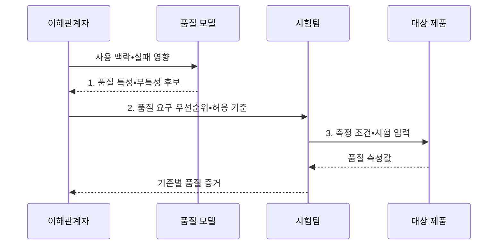

---
sidebar:
  order: 69
  label: "069. ISO/IEC 25010 소프트웨어 제품 품질 모델 (Software Product Quality Model)"
  badge:
    text: "기출 • 70%"
    variant: note
title: "ISO/IEC 25010 소프트웨어 제품 품질 모델 (Software Product Quality Model)"
date: "2026-08-04T11:44:00+09:00"
tags:
  - "notes-software"
weight: 69
extra:
  question_no: "069"
  source_status: "기출"
  source_history: "120회, 128회"
  priority: 70
  priority_note: "120•128회 반복, 품질 특성 상위 모델"
---

## Ⅰ. 개요

핵심 용어

- **9개 특성으로 분류**: 현행 ISO/IEC 25010이 ICT•소프트웨어 제품 품질을 아홉 상위 관점으로 나누는 체계이다.
- **ISO/IEC 25010:2023**: ICT•소프트웨어 제품 품질을 기능 적합성부터 안전성까지 9개 특성과 부특성으로 분류한 국제표준이다.
- **제품 비교 불일치(Product Comparison Mismatch)**: 조직별 품질 용어 차이로 제품 평가가 달라지는 문제다.
- **수용 판정 불일치(Acceptance Decision Mismatch)**: 조직별 합격 기준 차이로 판정이 달라지는 문제다.

- 정의/개념: **ISO/IEC 25010** 은 ICT 제품 품질을 기능 적합성•성능 효율성•호환성 등 9개 특성과 하위 특성으로 분류한 국제표준
- 배경/필요성: 조직별 품질 용어•기준 차이로 **제품 비교•수용 판정 불일치**

#### 한줄 요약

- 막연히 좋은 제품이라고 말하지 않고 공통 품질 항목과 합격 기준으로 바꾸는 표준이다.

## Ⅱ. 특징

핵심 용어

- **계층형 특성(Hierarchical Characteristic)**: 제품 품질을 상위 평가 관점으로 나눈 분류다.
- **계층형 부특성(Hierarchical Subcharacteristic)**: 상위 특성을 측정 가능한 하위 요구로 나눈 분류다.
- **공통 품질 어휘**: 요구•설계•시험 참여자가 같은 의미로 사용하는 표준 품질 용어이다.
- **측정값(Measure)**: 품질 충족 정도를 표현한 결과다.
- **허용 기준(Acceptance Threshold)**: 합격과 불합격을 가르는 임계값이다.

- 제품 품질을 **계층형 특성•부특성** 으로 구조화
- 요구•설계•시험에 **공통 품질 어휘** 제공
- 사용 맥락에 따라 **측정값•허용 기준** 별도 설정

#### 한줄 요약

- 같은 품질 이름을 쓰되 서비스 위험과 사용 환경에 맞춰 숫자 기준은 따로 정한다.

## Ⅲ. 구조 및 구성요소

핵심 용어

- **사용 맥락(Context of Use)**: 사용자•업무•장비•환경•실패 영향을 묶은 품질 판단 조건이다.
- **품질 특성(Quality Characteristic)**: 제품 품질을 평가 관점별로 나눈 상위 분류이다.
- **부특성(Subcharacteristic)**: 상위 품질 특성을 측정 가능한 요구 단위로 세분한 분류이다.
- **품질 측정값(Quality Measure)**: 품질 특성의 충족 정도를 수치나 판정값으로 표현한 결과이다.

| 구성요소 | 책임 |
|:---|:---|
| 사용 맥락 | **사용자•업무•환경•실패 영향** 정의 |
| 품질 특성 | 제품 품질의 **9개 상위 관점** 분류 |
| 부특성 | 품질 특성을 **검증 요구 단위** 로 세분 |
| 품질 측정값 | 결과를 **수치•판정값** 으로 표현 |
| 허용 기준 | 측정값의 **합격 임계값** 정의 |

| 품질 관점 | 품질 특성 | 평가 초점 |
|:---|:---|:---|
| 기능 | **기능 적합성** | 요구 기능의 **완전성•정확성** |
| 자원 | **성능 효율성** | 시간•처리량•**자원 사용량** |
| 공존 | **호환성** | **공존성•상호운용성** |
| 사용자 | **상호작용 능력** | 학습•조작•**사용자 오류 방지** |
| 지속 | **신뢰성** | 가용•복구•**결함 허용** |
| 보호 | **보안성** | 기밀•무결•**책임 추적** |
| 변경 | **유지보수성** | 분석•수정•**시험 용이성** |
| 적응 | **유연성** | 적응•확장•**교체 용이성** |
| 위해 | **안전성** | 위험 식별•**위해 회피** |

#### 한줄 요약

- 사용 환경의 위험을 품질 항목과 측정값, 합격선으로 구체화한다.

## Ⅳ. 흐름도

핵심 용어

- **품질 특성•부특성 후보**: 사용 맥락의 실패 영향에 대응하도록 선택한 평가 항목이다.
- **품질 요구 우선순위•허용 기준**: 중요한 품질과 측정법•조건•합격선을 합의한 결과이다.
- **측정 조건•시험 입력**: 품질 측정값을 재현 가능하게 수집하도록 정한 환경과 데이터이다.

**동작 원리**

- **1. 품질 특성•부특성 후보**: 사용 맥락의 실패 영향에 대응하는 항목 도출
- **2. 품질 요구 우선순위•허용 기준**: 측정법•조건•합격선 합의
- **3. 측정 조건•시험 입력**: 제품에서 품질 측정값과 시험 증거 수집

> 요약: 사용 맥락의 위험을 측정 가능한 품질 요구로 바꿔 제품 수용 판정

#### 한줄 요약

- 중요한 품질을 고르고 합격선을 정한 뒤 같은 조건에서 재어 통과 여부를 판단한다.

## Ⅴ. 종류 및 비교

핵심 용어

- **ISO/IEC 25010:2011**: 제품 품질 8개 특성과 사용 품질 5개 특성을 정의한 이전 판이다.
- **ISO/IEC 25019**: 2023년에 발행되어 특정 맥락에서 제품을 사용한 결과를 평가하는 현행 사용 품질 모델이다.

| 제품 품질 모델 | ISO/IEC 25010:2011 | ISO/IEC 25010:2023 |
|:---|:---|:---|
| 적용 기준 | 기존 계약이 **2011판** 을 명시한 경우 | 신규 ICT•소프트웨어의 **제품 품질 요구** |
| 핵심 특징 | 제품 품질 **8개 특성** | 안전성 포함 **9개 특성** |
| 한계 | **폐지 판•사용 품질 포함** | 사용 품질은 **ISO/IEC 25019** 적용 |

> 요약: 신규 제품은 2023판을 적용하고 이전 계약은 특성•측정값을 명시적으로 매핑

#### 한줄 요약

- 계약이 특정 판을 요구하면 그 판을 따르고 신규 제품은 최신 품질 특성을 기준으로 삼는다.

## Ⅵ. 실무 고려사항 및 대책

핵심 용어

- **실패 위험(Failure Risk)**: 실패 영향을 기준으로 핵심 품질을 선정하는 기준이다.
- **측정법(Measurement Method)**: 품질을 객관적으로 확인하는 절차다.
- **측정 조건(Measurement Condition)**: 품질값을 수집할 환경과 전제다.
- **측정 단위(Unit of Measure)**: 품질값의 크기를 표현하는 기준이다.
- **임계값(Threshold)**: 품질 요구의 합격 여부를 가르는 값이다.
- **품질 절충(Quality Trade-off)**: 한 품질 개선이 다른 품질 저하를 유발해 우선순위 합의가 필요한 관계이다.
- **계약 판본(Contract Version)**: 계약과 시험이 참조하는 표준 판본이다.
- **전환 매핑(Migration Mapping)**: 구판과 신판의 품질 특성 대응 관계다.
- **품질 우선순위(Quality Priority)**: 중요한 품질 요구의 적용 순서다.
- **허용 손실(Acceptable Loss)**: 다른 품질 개선을 위해 받아들일 수 있는 저하 범위다.
- **운영 조건 재현**: 실제 장비•부하•네트워크•실패 조건을 시험 환경에 구성해 품질 측정의 현장 타당성을 확인하는 방식이다.

| 문제 | 대책 | 효과 |
|:---|:---|:---|
| 모든 특성을 나열해 핵심 실패 위험이 희석 | **사용 맥락•실패 위험** 으로 우선 선정 | **핵심 측정 대상** 집중 |
| 품질 요구가 정성적이라 합격 여부가 상충 | **측정법•조건•단위•임계값** 정의 | **합격 여부 명확성** 확보 |
| 성능 향상이 안전•보안 저하를 유발 | **품질 우선순위•허용 손실** 합의 | **품질 절충 충돌** 통제 |
| 계약과 시험에 다른 판본을 써 특성 범위 혼선 | **계약 판본•전환 매핑** 관리 | **특성명•범위 혼선** 방지 |
| 장비•부하•실패 조건 차이로 운영 품질 오판 | **운영 조건 재현** 시험 | **운영 품질 오판** 감소 |

> 적용 사례: 결제 서비스는 성능 효율성과 신뢰성을 응답시간•복구시간 기준으로 측정

#### 한줄 요약

- 결제 서비스는 성능과 신뢰성을 응답시간과 복구시간으로 측정한다.

## Ⅶ. 결론

핵심 용어

- **측정 가능성(Measurability)**: 품질 요구를 객관적으로 검증할 수 있는 정도다.
- **품질 요구 우선순위**: 실패 영향과 측정 가능성을 바탕으로 품질 요구에 부여한 적용 순서이다.

- **사용 맥락•실패 위험•측정 가능성** 으로 **품질 요구 우선순위** 결정

#### 한줄 요약

- 표준의 모든 항목을 똑같이 쓰지 않고 제품의 실패 위험에 중요한 품질부터 측정한다.
