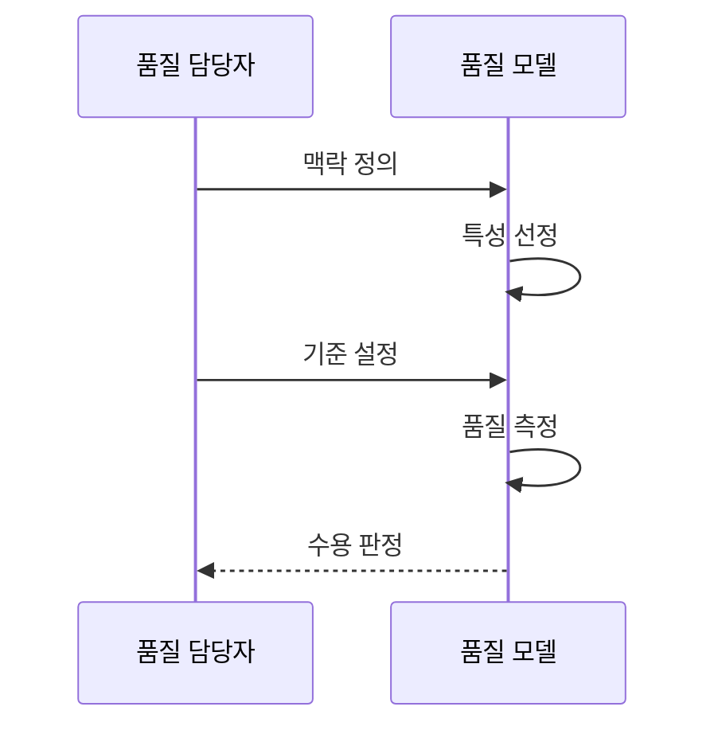

---
sidebar:
  order: 69
  label: "069. ISO/IEC 25010 소프트웨어 제품 품질 모델 (Software Product Quality Model)"
  badge:
    text: "기출 · 70%"
    variant: note
title: "ISO/IEC 25010 소프트웨어 제품 품질 모델 (Software Product Quality Model)"
date: "2026-07-25T18:01:00+09:00"
tags:
  - "notes-software"
weight: 69
extra:
  question_no: "069"
  source_status: "기출"
  source_history: "120회, 128회"
  priority: 70
  priority_note: "120·128회 반복, 품질 특성 상위 모델"
---

## 미리 알고가기

- **국제표준화기구(International Organization for Standardization, ISO)**: 여러 산업의 국제 표준을 제정하며 제품 품질 모델의 공동 발행 주체
- **국제전기기술위원회(International Electrotechnical Commission, IEC)**: 전기·전자·정보기술 국제 표준을 제정하며 ISO와 25010을 공동 발행한 기구
- **정보통신기술(Information and Communication Technology, ICT)**: 정보를 처리·저장·전송하는 기술과 제품으로 2023년판 품질 모델의 적용 대상
- **ISO/IEC 25010:2023(아이에스오 슬래시 아이이씨 이오공일공 이천이십삼)**: 슬래시는 ISO와 IEC의 공동 표준임을, 콜론 뒤 숫자는 발행 연도를 나타내며 ICT 제품 품질을 아홉 특성으로 분류한 제2판
- **제품 품질(Product Quality)**: 제품 자체의 정적·동적 속성이 명시된 요구를 충족하는 정도
- **품질 특성(Quality Characteristic)**: 제품 품질을 기능 적합성·성능 효율성처럼 측정 관점별로 나눈 상위 분류
- **아홉 제품 품질 특성(Nine Product Quality Characteristics)**: 기능 적합성·성능 효율성·호환성·상호작용 역량·신뢰성·보안성·유지보수성·유연성·안전성으로 2023년판의 요구·평가 관점을 구성
- **부특성(Subcharacteristic)**: 상위 품질 특성을 구체적인 요구와 검증 단위로 세분한 하위 분류
- **사용 맥락(Context of Use)**: 사용자·업무·장비·환경과 실패 영향을 묶어 어떤 품질 특성을 우선할지 정하는 조건
- **품질 측정값(Quality Measure)**: 품질 속성의 검증 결과를 수치나 판정값으로 표현해 수용 기준과 대조하는 값
- **수용 기준(Acceptance Criteria)**: 품질 측정값이 제품 인수에 충분한지 판단하도록 이해관계자가 합의한 임계조건
- **ISO/IEC 25010:2011**: 사용 품질 다섯 특성과 제품 품질 여덟 특성을 함께 정의한 제1판으로 기존 계약의 기준

## Ⅰ. 개요

- **정의/개념**: ICT 제품 품질을 특성·부특성으로 분류한 표준
- **배경/필요성**: 품질 해석 차이로 공통 특성 모델 필요

### 쉽게 이해하기 (학습용)

- 막연히 좋다고 말하는 대신 공통 항목으로 나누고 합격선을 정하는 기준표임

## Ⅱ. 특징

- 제품 품질을 아홉 특성과 부특성으로 계층화한다.
- 같은 분류로 품질 요구·측정값·수용 기준을 추적한다.
- 요구 정의부터 운영 평가까지 공통 용어를 제공한다.
- 임계값은 업무 위험·사용 맥락에 맞춰 별도로 정한다.

### 쉽게 이해하기 (학습용)

- 검진 항목 이름을 통일하고 위험 수치는 상황에 맞게 정하는 것과 같음

## Ⅲ. 아키텍처 및 구성요소

| 설계 요소 | 설명 |
|:---|:---|
| 사용 맥락 | 사용자·업무·환경·실패 영향 |
| 품질 특성 | 제품 품질을 아홉 관점으로 분류 |
| 부특성 | 상위 특성을 요구·검증 단위로 세분 |
| 품질 측정값 | 검증 결과를 수치·판정값으로 표현 |
| 수용 기준 | 측정값의 임계조건 충족 판정 |

> 요약: 사용 맥락을 품질 특성·측정·수용 기준화

### 쉽게 이해하기 (학습용)

- 품질 특성에 측정값과 합격선을 붙여 같은 기준으로 검증함

## Ⅳ. 원리 및 절차 흐름도

| 절차 | 설명 |
|:---|:---|
| 맥락 정의 | 사용자·업무·환경 실패 영향 분석 |
| 특성 선정 | 위험별 품질 특성·부특성 선정 |
| 기준 설정 | 측정 조건·수용 임계값 정의 |
| 품질 측정 | 같은 조건에서 품질 지표 측정 |
| 수용 판정 | 기준 충족·설계 조정 여부 판정 |

> 요약: 업무 위험을 측정 기준으로 바꿔 품질 수용을 판정함

### 쉽게 이해하기 (학습용)

- 중요한 특성의 합격선을 정해 같은 조건으로 측정함

## Ⅴ. 종류 및 비교

| 판단 기준 | ISO/IEC 25010:2011 | ISO/IEC 25010:2023 |
|:---|:---|:---|
| 핵심 특징 | 제품 품질·사용 품질 모델 | ICT 제품 품질 중심의 개정 모델 |
| 최상위 구조 | 제품 품질 여덟 특성 | 안전성을 포함한 아홉 특성 |
| 적용 기준 | 기존 계약이 2011판을 명시할 때 | 신규 제품의 품질 요구를 정할 때 |
| 주요 위험 | 최신 품질 특성 누락 | 특성 중복·측정 기준 모호 |

> 요약: 기존 계약은 이전 판, 신규 요구는 개정판 적용

### 쉽게 이해하기 (학습용)

- 기존 계약은 2011판, 새 사업은 2023판을 적용함

## Ⅵ. 실무 사례

1. 결제 서비스는 응답시간·처리량 임계값 설정
2. 의료기기는 위험 동작과 안전성 검증 결과 추적

### 쉽게 이해하기 (학습용)

- 결제는 응답·복구시간 합격선을 관리함
- 의료기기는 위험 동작·검증 결과를 추적함

## Ⅶ. 결론

- 업무 위험별 특성·측정값·수용 임계값 결정

### 쉽게 이해하기 (학습용)

- 공통 품질 항목을 암기하지 않고 서비스 실패를 막는 측정값으로 바꿔야 함
