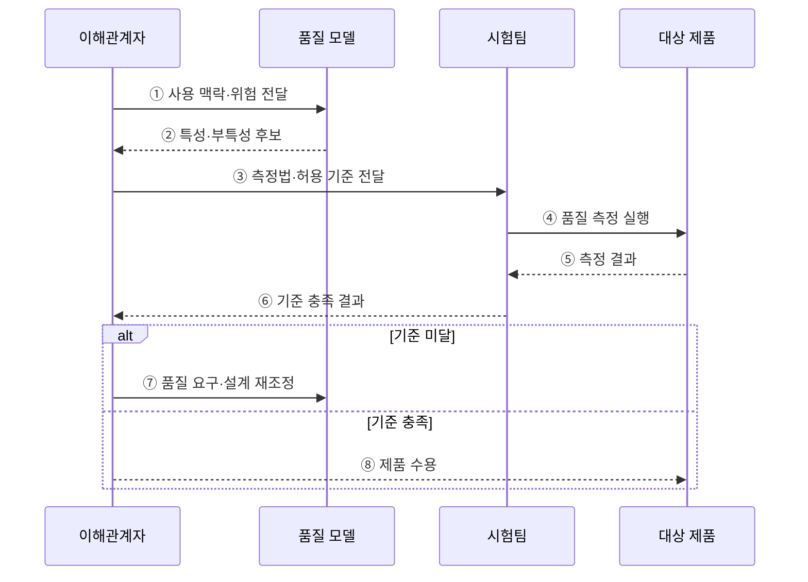

---
sidebar:
  order: 69
  label: "069. ISO/IEC 25010 소프트웨어 제품 품질 모델 (Software Product Quality Model)"
  badge:
    text: "기출 · 70%"
    variant: note
title: "ISO/IEC 25010 소프트웨어 제품 품질 모델 (Software Product Quality Model)"
date: "2026-07-27T23:59:59+09:00"
tags:
  - "notes-software"
weight: 69
extra:
  question_no: "069"
  source_status: "기출"
  source_history: "120회, 128회"
  priority: 70
  priority_note: "120·128회 반복, 품질 특성 상위 모델"
---

## 미리 알고가기

- **ISO(International Organization for Standardization)**: 산업 전반의 국제표준을 제정하는 국제표준화기구
- **IEC(International Electrotechnical Commission)**: 전기·전자 분야의 국제표준을 제정하는 국제전기기술위원회
- **ISO/IEC 25010:2023**: ICT·소프트웨어 제품 품질을 9개 특성과 부특성으로 정의한 현행 국제표준
- **ISO/IEC 25010:2011**: 제품 품질 8개 특성과 사용 품질 5개 특성을 함께 정의했으나 2023판 발행 후 폐지된 이전 판
- **ISO/IEC 25019:2023**: 제품을 특정 맥락에서 사용한 결과를 3개 특성으로 평가하는 현행 사용 품질 모델
- **ICT(Information and Communication Technology)**: 정보의 처리·저장·전송에 필요한 정보통신기술
- **품질 특성(Quality Characteristic)**: 제품 품질을 평가 관점별로 나눈 상위 분류
- **부특성(Subcharacteristic)**: 상위 품질 특성을 측정 가능한 요구 단위로 세분한 분류
- **품질 측정값(Quality Measure)**: 품질 특성의 충족 정도를 수치나 판정값으로 표현한 결과
- **사용 맥락(Context of Use)**: 사용자·업무·장비·환경·실패 영향을 묶은 품질 판단 조건

## Ⅰ. 개요

- 정의/개념: ICT 제품 품질을 **9개 특성·부특성으로 분류**한 국제표준
- 기존 한계: 이해관계자별 품질 해석 차이로 **공통 평가 기준 부재**

### 쉽게 이해하기 (학습용)

- 막연히 좋은 제품이라고 말하지 않고 공통 품질 항목과 합격 기준으로 바꾸는 표준이다.

## Ⅱ. 특징

- 제품 품질을 **계층형 특성·부특성**으로 구조화
- 요구·설계·시험에 **공통 품질 어휘** 제공
- 사용 맥락에 따라 **측정값·허용 기준** 별도 설정

### 쉽게 이해하기 (학습용)

- 같은 품질 이름을 쓰되 서비스 위험과 사용 환경에 맞춰 숫자 기준은 따로 정한다.

## Ⅲ. 아키텍처 및 구성요소

**도표안 A — 구조도**

**도표안 B — sequenceDiagram**

| 구성요소 | 책임 |
|:---|:---|
| 사용 맥락 | 사용자·업무·실패 영향 정의 |
| 품질 특성 | 제품 품질의 상위 관점 분류 |
| 부특성 | 특성을 검증 단위로 세분 |
| 품질 측정값 | 검증 결과를 수치·판정값으로 표현 |
| 허용 기준 | 측정값의 합격 임계값 정의 |

**동작 원리**

- ① 이해관계자가 사용자·업무·환경과 실패 영향을 품질 모델에 전달한다.
- ② 품질 모델에서 위험과 관련된 특성·부특성 후보를 선정한다.
- ③ 이해관계자가 각 요구의 측정법·조건·허용 임계값을 합의한다.
- ④ 시험팀이 정의한 조건에서 대상 제품의 품질을 측정한다.
- ⑤ 대상 제품의 수치·판정값과 시험 증거를 수집한다.
- ⑥ 시험팀이 측정값을 허용 기준과 대조해 결과를 제출한다.
- ⑦ 기준 미달이면 품질 요구·설계·구현을 조정하고 다시 측정한다.
- ⑧ 기준을 충족하면 합의한 사용 맥락의 제품을 수용한다.

> 요약: 사용 맥락의 위험을 측정 가능한 품질 요구로 바꿔 제품 수용을 판정한다.

### 쉽게 이해하기 (학습용)

- 중요한 품질을 고르고 합격선을 정한 뒤 같은 조건에서 재어 통과 여부를 판단한다.

## Ⅳ. 종류 및 비교

| 제품 품질 모델 | ISO/IEC 25010:2011 | ISO/IEC 25010:2023 |
|:---|:---|:---|
| 표준 상태 | 폐지된 이전 판 | 현행 국제표준 |
| 핵심 특징 | 제품 품질 **8개 특성** | 안전성 포함 **9개 특성** |
| 적용 기준 | 기존 계약이 2011판을 명시한 경우 | 신규 ICT·소프트웨어 제품 품질 요구 |
| 전환 고려 | 사용 품질 모델을 함께 포함 | 사용 품질은 ISO/IEC 25019:2023으로 분리 |

> 요약: 신규 제품은 2023판을 적용하고 이전 계약은 특성·측정값을 명시적으로 매핑한다.

### 쉽게 이해하기 (학습용)

- 계약이 특정 판을 요구하면 그 판을 따르고 신규 제품은 최신 품질 특성을 기준으로 삼는다.

## Ⅴ. 실무 고려사항 및 대책

| 고려사항 | 문제점 | 대책 |
|:---|:---|:---|
| 특성 나열 | 모든 특성을 적지만 측정·판정할 수 없음 | 사용 맥락과 실패 위험으로 우선 특성 선정 |
| 모호한 품질 요구 | “빠름·안전함”처럼 합격 여부가 불명확 | 측정법·조건·단위·허용 임계값을 함께 정의 |
| 특성 간 절충 | 보안 강화가 성능·사용성을 낮출 수 있음 | 이해관계자와 우선순위·허용 손실을 합의 |
| 판본 혼용 | 2011·2023 특성명과 범위가 뒤섞임 | 계약에 판본을 명시하고 전환 매핑 관리 |
| 시험 환경 편차 | 운영 맥락과 다른 측정값으로 오판 | 사용자·장비·부하·실패 조건을 시험에 재현 |

> 적용 사례: 결제 서비스는 성능 효율성과 신뢰성을 응답시간·복구시간 기준으로 측정한다.

### 쉽게 이해하기 (학습용)

- 결제 서비스는 성능과 신뢰성을 응답시간과 복구시간으로 측정한다.

## Ⅵ. 결론

- ISO/IEC 25010:2023은 제품 품질 요구·설계·시험에 공통 특성 체계를 제공한다.
- 사용 맥락의 실패 위험이 큰 특성부터 측정값과 허용 기준을 구체화한다.

### 쉽게 이해하기 (학습용)

- 표준의 모든 항목을 똑같이 쓰지 않고 제품의 실패 위험에 중요한 품질부터 측정한다.
