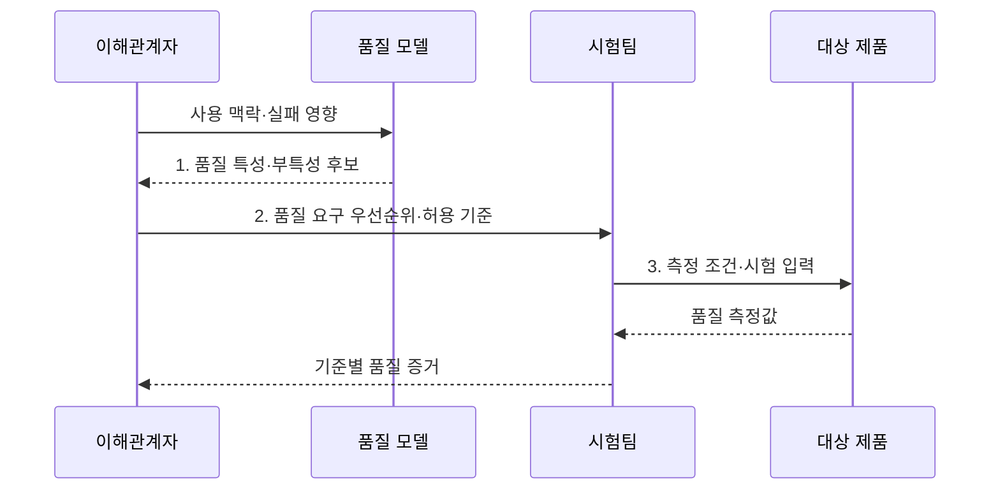

---
sidebar:
  order: 69
  label: "069. ISO/IEC 25010 소프트웨어 제품 품질 모델 (Software Product Quality Model)"
  badge:
    text: "기출 · 70%"
    variant: note
title: "ISO/IEC 25010 소프트웨어 제품 품질 모델 (Software Product Quality Model)"
date: "2026-07-30T23:19:50+09:00"
tags:
  - "notes-software"
weight: 69
extra:
  question_no: "069"
  source_status: "기출"
  source_history: "120회, 128회"
  priority: 70
  priority_note: "120·128회 반복, 품질 특성 상위 모델"
---

## 미리 알고가기

- **ISO(International Organization for Standardization)**: 산업 전반의 국제표준을 제정하는 국제표준화기구
- **IEC(International Electrotechnical Commission)**: 전기·전자 분야의 국제표준을 제정하는 국제전기기술위원회
- **ISO/IEC 25010:2023**: ICT·소프트웨어 제품 품질을 9개 특성과 부특성으로 정의한 현행 국제표준
- **ISO/IEC 25010:2011**: 제품 품질 8개 특성과 사용 품질 5개 특성을 함께 정의했으나 2023판 발행 후 폐지된 이전 판
- **ISO/IEC 25019:2023**: 제품을 특정 맥락에서 사용한 결과를 3개 특성으로 평가하는 현행 사용 품질 모델
- **ICT(Information and Communication Technology)**: 정보의 처리·저장·전송에 필요한 정보통신기술
- **품질 특성(Quality Characteristic)**: 제품 품질을 평가 관점별로 나눈 상위 분류
- **부특성(Subcharacteristic)**: 상위 품질 특성을 측정 가능한 요구 단위로 세분한 분류
- **품질 측정값(Quality Measure)**: 품질 특성의 충족 정도를 수치나 판정값으로 표현한 결과
- **사용 맥락(Context of Use)**: 사용자·업무·장비·환경·실패 영향을 묶은 품질 판단 조건
- **허용 기준(Acceptance Threshold)**: 품질 측정값의 합격·불합격을 가르는 임계값
- **기능 적합성(Functional Suitability)**: 기능이 명시·암묵적 요구를 충족하는 정도
- **성능 효율성(Performance Efficiency)**: 사용 자원 대비 시간·처리 성능을 충족하는 정도
- **호환성(Compatibility)**: 다른 제품과 자원·정보를 공유하며 함께 동작하는 정도
- **상호작용 능력(Interaction Capability)**: 사용자가 제품과 상호작용해 목표를 달성하는 정도
- **신뢰성(Reliability)**: 정해진 조건과 시간 동안 기능을 지속하는 정도
- **보안성(Security)**: 정보와 기능을 비인가 접근·변조로부터 보호하는 정도
- **유지보수성(Maintainability)**: 제품을 분석·수정·시험하기 쉬운 정도
- **유연성(Flexibility)**: 환경·요구 변화에 제품을 적응시키기 쉬운 정도
- **안전성(Safety)**: 제품 동작이 사람·재산·환경에 위해를 주지 않는 정도
- **품질 절충(Quality Trade-off)**: 한 품질 개선이 다른 품질 저하를 유발해 우선순위 합의가 필요한 관계
- **대표 부특성(Subcharacteristics)**: 공존성·상호운용성은 함께 동작하는 능력, 사용자 오류 방지는 실수 예방, 결함 허용은 장애 중 기능 유지, 책임 추적은 행위 주체 확인, 시험 용이성은 검증 편의, 교체 용이성은 구성 교환 편의, 위해 회피는 위험 상태 방지를 뜻한다.

## Ⅰ. 개요

- 정의/개념: ICT 품질을 **9개 특성으로 분류**한 표준
- 배경/필요성: 조직별 품질 용어·기준 차이로 **제품 비교·수용 판정 불일치**

### 쉽게 이해하기 (학습용)

- 막연히 좋은 제품이라고 말하지 않고 공통 품질 항목과 합격 기준으로 바꾸는 표준이다.

## Ⅱ. 특징

- 제품 품질을 **계층형 특성·부특성**으로 구조화
- 요구·설계·시험에 **공통 품질 어휘** 제공
- 사용 맥락에 따라 **측정값·허용 기준** 별도 설정

### 쉽게 이해하기 (학습용)

- 같은 품질 이름을 쓰되 서비스 위험과 사용 환경에 맞춰 숫자 기준은 따로 정한다.

## Ⅲ. 구조 및 구성요소

| 구성요소 | 책임 |
|:---|:---|
| 사용 맥락 | **사용자·업무·환경·실패 영향** 정의 |
| 품질 특성 | 제품 품질의 **9개 상위 관점** 분류 |
| 부특성 | 품질 특성을 **검증 요구 단위**로 세분 |
| 품질 측정값 | 결과를 **수치·판정값**으로 표현 |
| 허용 기준 | 측정값의 **합격 임계값** 정의 |

| 품질 관점 | 품질 특성 | 평가 초점 |
|:---|:---|:---|
| 기능 | **기능 적합성** | 요구 기능의 **완전성·정확성** |
| 자원 | **성능 효율성** | 시간·처리량·**자원 사용량** |
| 공존 | **호환성** | **공존성·상호운용성** |
| 사용자 | **상호작용 능력** | 학습·조작·**사용자 오류 방지** |
| 지속 | **신뢰성** | 가용·복구·**결함 허용** |
| 보호 | **보안성** | 기밀·무결·**책임 추적** |
| 변경 | **유지보수성** | 분석·수정·**시험 용이성** |
| 적응 | **유연성** | 적응·확장·**교체 용이성** |
| 위해 | **안전성** | 위험 식별·**위해 회피** |

### 쉽게 이해하기 (학습용)

- 사용 환경의 위험을 품질 항목과 측정값, 합격선으로 구체화한다.

## Ⅳ. 흐름도

**동작 원리**

- **1. 품질 특성·부특성 후보**: 사용 맥락의 실패 영향에 대응하는 항목 도출
- **2. 품질 요구 우선순위·허용 기준**: 측정법·조건·합격선 합의
- **3. 측정 조건·시험 입력**: 제품에서 품질 측정값과 시험 증거 수집

> 요약: 사용 맥락의 위험을 측정 가능한 품질 요구로 바꿔 제품 수용 판정

### 쉽게 이해하기 (학습용)

- 중요한 품질을 고르고 합격선을 정한 뒤 같은 조건에서 재어 통과 여부를 판단한다.

## Ⅴ. 종류 및 비교

| 제품 품질 모델 | ISO/IEC 25010:2011 | ISO/IEC 25010:2023 |
|:---|:---|:---|
| 적용 기준 | 기존 계약이 **2011판**을 명시한 경우 | 신규 ICT·소프트웨어의 **제품 품질 요구** |
| 핵심 특징 | 제품 품질 **8개 특성** | 안전성 포함 **9개 특성** |
| 한계 | **폐지 판·사용 품질 포함** | 사용 품질은 **ISO/IEC 25019** 적용 |

> 요약: 신규 제품은 2023판을 적용하고 이전 계약은 특성·측정값을 명시적으로 매핑

### 쉽게 이해하기 (학습용)

- 계약이 특정 판을 요구하면 그 판을 따르고 신규 제품은 최신 품질 특성을 기준으로 삼는다.

## Ⅵ. 실무 고려사항 및 대책

| 고려사항 | 대책 | 효과 |
|:---|:---|:---|
| 모든 특성을 나열해 핵심 실패 위험이 희석 | **사용 맥락·실패 위험**으로 우선 선정 | **핵심 측정 대상** 집중 |
| 품질 요구가 정성적이라 합격 여부가 상충 | **측정법·조건·단위·임계값** 정의 | **합격 여부 명확성** 확보 |
| 성능 향상이 안전·보안 저하를 유발 | **품질 우선순위·허용 손실** 합의 | **품질 절충 충돌** 통제 |
| 계약과 시험에 다른 판본을 써 특성 범위 혼선 | **계약 판본·전환 매핑** 관리 | **특성명·범위 혼선** 방지 |
| 장비·부하·실패 조건 차이로 운영 품질 오판 | **운영 조건 재현** 시험 | **운영 품질 오판** 감소 |

> 적용 사례: 결제 서비스는 성능 효율성과 신뢰성을 응답시간·복구시간 기준으로 측정

### 쉽게 이해하기 (학습용)

- 결제 서비스는 성능과 신뢰성을 응답시간과 복구시간으로 측정한다.

## Ⅶ. 결론

- **사용 맥락·실패 위험·측정 가능성**으로 **품질 요구 우선순위** 결정

### 쉽게 이해하기 (학습용)

- 표준의 모든 항목을 똑같이 쓰지 않고 제품의 실패 위험에 중요한 품질부터 측정한다.
