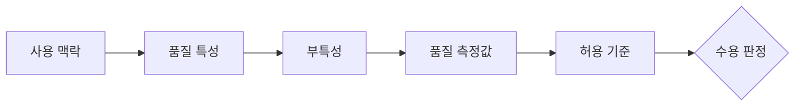
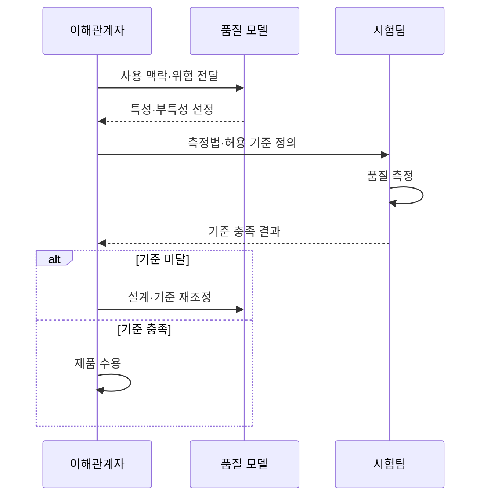

---
sidebar:
  order: 69
  label: "069. ISO/IEC 25010 소프트웨어 제품 품질 모델 (Software Product Quality Model)"
  badge:
    text: "기출 · 70%"
    variant: note
title: "ISO/IEC 25010 소프트웨어 제품 품질 모델 (Software Product Quality Model)"
date: "2026-07-27T23:59:59+09:00"
tags:
  - "notes-software"
weight: 69
extra:
  question_no: "069"
  source_status: "기출"
  source_history: "120회, 128회"
  priority: 70
  priority_note: "120·128회 반복, 품질 특성 상위 모델"
---

## 미리 알고가기

- **ISO(International Organization for Standardization)**: ‘아이에스오’로 읽고 영문 명칭을 나타내는 국제 표준화 기구 표기이며, 산업 전반의 국제표준을 제정
- **IEC(International Electrotechnical Commission)**: ‘아이이씨’로 읽고 영문 머리글자를 딴 약어이며, 전기·전자 분야 국제표준을 제정
- **ISO/IEC 25010**: ‘아이에스오 아이이씨 이오공일공’으로 읽으며, 두 기구의 공동표준 번호로 제품 품질 모델을 정의
- **ICT(Information and Communication Technology)**: ‘아이시티’로 읽고 영문 머리글자를 딴 약어이며, 정보의 처리·저장·전송 기술을 통칭
- **품질 특성(Quality Characteristic)**: 제품 품질을 평가 관점별로 나눈 상위 분류
- **부특성(Subcharacteristic)**: 상위 품질 특성을 측정 가능한 요구 단위로 세분한 분류
- **품질 측정값(Quality Measure)**: 품질 특성의 충족 정도를 수치나 판정값으로 표현한 결과
- **사용 맥락(Context of Use)**: 사용자·업무·장비·환경·실패 영향을 묶은 품질 판단 조건

## Ⅰ. 개요

- 정의/개념: ICT 제품 품질을 **특성·부특성으로 분류**한 국제표준
- 기존 한계: 이해관계자별 품질 해석 차이로 **공통 평가 기준 부재**

### 쉽게 이해하기 (학습용)

- 막연히 좋은 제품이라고 말하지 않고 공통 품질 항목과 합격 기준으로 바꾸는 표준이다.

## Ⅱ. 특징

- 제품 품질을 **계층형 특성·부특성**으로 구조화
- 요구·설계·시험에 **공통 품질 어휘** 제공
- 사용 맥락에 따라 **측정값·허용 기준** 별도 설정

### 쉽게 이해하기 (학습용)

- 같은 품질 이름을 쓰되 서비스 위험과 사용 환경에 맞춰 숫자 기준은 따로 정한다.

## Ⅲ. 아키텍처 및 구성요소

| 구성요소 | 책임 |
|:---|:---|
| 사용 맥락 | 사용자·업무·**실패 영향 정의** |
| 품질 특성 | 제품 품질의 **상위 관점 분류** |
| 부특성 | 특성을 **검증 단위로 세분** |
| 품질 측정값 | 검증 결과를 **수치·판정값 표현** |
| 허용 기준 | 측정값의 **합격 임계값 정의** |

> 요약: 사용 맥락을 품질 특성·측정값·허용 기준으로 변환

### 쉽게 이해하기 (학습용)

- 제품이 쓰이는 상황을 품질 항목으로 나누고 각 항목에 숫자와 합격선을 붙인다.

## Ⅳ. 원리 및 절차 흐름도

| 절차 | 설명 |
|:---|:---|
| 맥락 정의 | 사용자·업무와 **실패 영향 분석** |
| 특성 선정 | 위험 관련 **특성·부특성 선택** |
| 기준 정의 | 측정법과 **허용 임계값 합의** |
| 품질 측정 | 동일 조건에서 **측정값 수집** |
| 수용 판정 | 기준 충족 시 수용, 미달 시 **개선** |

> 요약: 품질 요구를 측정 가능한 기준으로 바꿔 수용 판정

### 쉽게 이해하기 (학습용)

- 중요한 품질을 고르고 합격선을 정한 뒤 같은 조건에서 재어 통과 여부를 판단한다.

## Ⅴ. 종류 및 비교

| 제품 품질 모델 | ISO/IEC 25010:2011 | ISO/IEC 25010:2023 |
|:---|:---|:---|
| 적용 기준 | 기존 계약·**2011판 명시** | 신규 ICT 제품·**최신 요구** |
| 핵심 특징 | 제품 품질 **8개 특성** | 안전성 포함 **9개 특성** |
| 한계 | 최신 안전·유연성 **반영 부족** | 기존 기준과 **매핑·전환 비용** |

### 쉽게 이해하기 (학습용)

- 계약이 특정 판을 요구하면 그 판을 따르고 신규 제품은 최신 품질 특성을 기준으로 삼는다.

## Ⅵ. 실무 사례

1. 결제 서비스에 **응답시간·복구시간 기준** 설정

### 쉽게 이해하기 (학습용)

- 결제 서비스는 성능과 신뢰성을 응답시간과 복구시간으로 측정한다.

## Ⅶ. 결론

- 제품 품질을 객관적으로 설계·평가하기 위해 **업무 위험·ISO 25010 품질 특성·측정값·허용 기준**을 검토하고, 위험도가 높은 특성에 품질 목표와 검증을 집중한다

### 쉽게 이해하기 (학습용)

- 표준의 모든 항목을 똑같이 쓰지 않고 제품의 실패 위험에 중요한 품질부터 측정한다.
