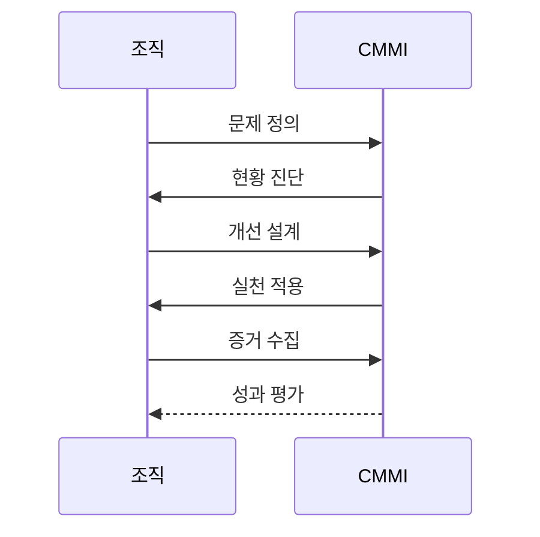

---
sidebar:
  order: 70
  label: "070. CMMI 성숙도 모델 (Capability Maturity Model Integration)"
  badge:
    text: "기출 · 50%"
    variant: note
title: "CMMI 성숙도 모델 (Capability Maturity Model Integration)"
date: "2026-07-25T18:02:00+09:00"
tags:
  - "notes-software"
weight: 70
extra:
  question_no: "070"
  source_status: "기출"
  source_history: "122회, 125회"
  priority: 50
  priority_note: "122·125회 반복, 프로세스 성숙도 평가"
---

## 미리 알고가기

- **능력 성숙도 모델 통합(Capability Maturity Model Integration, CMMI)**: 사업 목표에 필요한 실천을 적용하고 객관적 증거로 조직의 능력·성과 개선 수준을 평가하는 모델
- **프로세스(Process)**: 역할·활동·입출력·산출물을 정해 업무를 반복 수행하는 방식
- **실천 영역(Practice Area)**: 구성 관리·측정처럼 특정 능력을 달성하는 관련 실천을 묶은 모델 영역
- **성숙도 수준(Maturity Level)**: 조직 전체의 미리 정한 실천 영역 집합을 불완전 0부터 최적화 5까지 나타낸 단계
- **능력도 수준(Capability Level)**: 개별 실천 영역의 수행 완전성과 조직 표준 활용을 불완전 0부터 정의 3까지 나타낸 단계
- **성숙도 0부터 5(Maturity Levels 0 through 5)**: 불완전·초기·관리·정의·정량적 관리·최적화 순으로 조직 전체의 성과 개선 체계를 구분
- **능력도 0부터 3(Capability Levels 0 through 3)**: 불완전·초기·관리·정의 순으로 개별 실천 영역의 수행 수준을 구분
- **평가(Appraisal)**: 실행 증거를 CMMI 실천과 대조해 구현 상태와 벤치마크 수준을 판정하는 공식 검토
- **객관적 증거(Objective Evidence)**: 측정값·문서·업무 기록처럼 제삼자가 실천 수행 여부를 확인할 수 있는 자료
- **벤치마크 수준(Benchmark Level)**: 공식 평가로 확인해 조직 간 성숙도 또는 능력도 성과를 비교하는 수준 결과
- **개발·운영 통합(Development and Operations, DevOps)**: 개발과 운영의 빌드·배포·피드백 활동을 연결하는 업무 방식으로 CMMI 실천의 적용 맥락
- **정보기술(Information Technology, IT)**: 정보 시스템을 개발·운영하는 기술과 업무 영역으로 CMMI 적용 대상

## Ⅰ. 개요

- **정의/개념**: 조직 실천·성과를 수준별로 개선·평가하는 모델
- **배경/필요성**: 프로세스 성과 편차로 단계별 개선 기준 필요

### 쉽게 이해하기 (학습용)

- 누구나 같은 절차와 증거로 성과를 내고 개선하는 조직으로 바꾸는 기준임

## Ⅱ. 특징

- 조직 전체는 성숙도 0부터 5까지 단계화한다.
- 개별 실천 영역은 능력도 0부터 3까지 단계화한다.
- 성과 목표와 객관적 증거로 실천 효과를 확인한다.
- 조직 규모·업무 방식에 맞춰 실천을 구현한다.

### 쉽게 이해하기 (학습용)

- 학교 전체 수준과 과목 수업 수준을 따로 보고 성적이 좋아졌는지 확인함

## Ⅲ. 아키텍처 및 구성요소

| 설계 요소 | 설명 |
|:---|:---|
| 사업 목표 | 비용·품질·납기·생산성 목표 |
| 적용 범위 | 조직 업무에 맞는 도메인·관점 |
| 실천 영역 | 필요한 능력과 구체적 실천 |
| 객관적 증거 | 측정값·문서·기록으로 수행 확인 |
| 수준 결과 | 구현 상태를 성숙도·능력도로 평가 |

> 요약: 사업 목표와 실천 영역을 객관적 증거로 평가함

### 쉽게 이해하기 (학습용)

- 목표에 맞는 실천을 수행하고 증거로 변화 수준을 확인함

## Ⅳ. 원리 및 절차 흐름도

| 절차 | 설명 |
|:---|:---|
| 문제 정의 | 개선할 사업 성과·목표값 정의 |
| 현황 진단 | 현재 성과·실천 구현 상태 진단 |
| 개선 설계 | 원인별 실천 영역·수준 설계 |
| 실천 적용 | 개선 실천을 실제 업무에 적용 |
| 증거 수집 | 성과 측정값·객관적 증거 수집 |
| 성과 평가 | 목표 개선·제도화 여부 평가 |

> 요약: 능력 격차에 실천을 적용하고 성과 증거로 평가함

### 쉽게 이해하기 (학습용)

- 성과 원인에 맞는 실천을 적용하고 개선 증거를 확인함

## Ⅴ. 종류 및 비교

| 판단 기준 | 성숙도 수준 (Maturity Level) | 능력도 수준 (Capability Level) |
|:---|:---|:---|
| 핵심 특징 | 조직 실천 영역 집합의 성숙도 | 개별 실천 영역의 능력도 |
| 수준 체계 | 불완전 0부터 최적화 5까지 | 불완전 0부터 정의 3까지 |
| 적용 기준 | 조직 통합 개선을 비교할 때 | 특정 성과 영역을 우선 개선할 때 |
| 주요 위험 | 등급 획득 중심의 형식화 | 국소 최적화·조직 연계 약화 |

> 요약: 조직 전체는 성숙도이고 개별 영역은 능력도로 평가함

### 쉽게 이해하기 (학습용)

- 개별 영역은 능력도로 평가하고 조직 전체는 성숙도로 평가함

## Ⅵ. 실무 사례

1. 소프트웨어 조직은 배포 실패 원인의 실천을 개선
2. IT 서비스 조직은 측정 실천의 증거로 수준 평가

### 쉽게 이해하기 (학습용)

- 배포 실패는 관련 실천을 바꿔 측정함
- 증거가 쌓인 뒤 구현 수준을 평가함

## Ⅶ. 결론

- 사업 성과의 능력 격차를 실천·증거로 개선

### 쉽게 이해하기 (학습용)

- 등급 획득이 아니라 조직의 성과 편차를 줄이도록 일하는 방식을 바꿈
