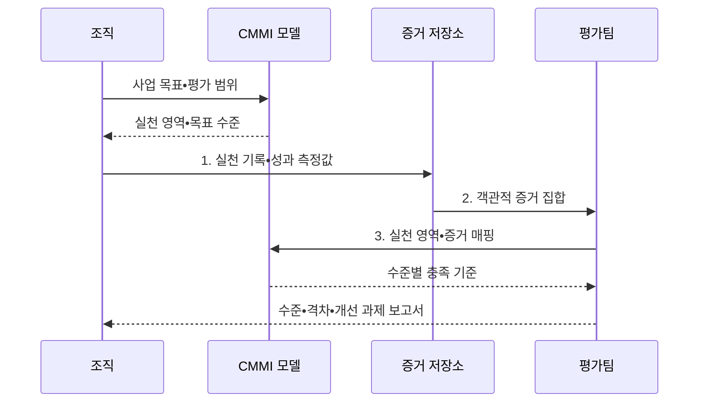

---
sidebar:
  order: 70
  label: "070. CMMI 성숙도 모델 (Capability Maturity Model Integration)"
  badge:
    text: "기출 • 50%"
    variant: note
title: "CMMI 성숙도 모델 (Capability Maturity Model Integration)"
date: "2026-08-05T04:00:00+09:00"
tags:
  - "notes-software"
weight: 70
extra:
  question_no: "070"
  source_status: "기출"
  source_history: "122회, 125회"
  priority: 50
  priority_note: "122•125회 반복, 프로세스 성숙도 평가"
---

## Ⅰ. 개요

<details>
<summary>핵심 용어</summary>

- **역량 진단(Capability Assessment)**: 조직 프로세스의 수행 수준을 증거로 판단하는 활동이다.
- **역량 개선(Capability Improvement)**: 현재 역량을 목표 수준까지 높이는 활동이다.
- **역량 성숙도 모델 통합(Capability Maturity Model Integration, CMMI)**: 개발•서비스 프로세스 역량을 실천 영역과 수준으로 평가하고 개선 방향을 제시하는 모델이다.
- **성과 편차(Performance Variation)**: 개인 의존 업무로 결과가 달라지는 문제다.
- **반복 재현 한계(Repeatability Limitation)**: 동일한 성공을 조직적으로 반복하기 어려운 문제다.

</details>

- 정의/개념: **CMMI 성숙도 모델** 은 조직의 개발•서비스 프로세스 역량을 수준별로 진단하고 제도화된 개선 방향을 제시하는 프로세스 개선 모델
- 배경/필요성: 개인 의존 업무는 담당자별 **성과 편차•반복 재현 한계**

#### 한줄 요약

- 잘하는 개인에게 기대지 않고 조직이 같은 방식으로 성과를 내도록 업무 체계를 단계별로 개선한다.

## Ⅱ. 특징

<details>
<summary>핵심 용어</summary>

- **수준 체계(Level Structure)**: 실천 영역과 조직의 개선 단계를 연결한 구조다.
- **객관적 증거(Objective Evidence)**: 측정값•문서•업무 기록처럼 실천 수행을 확인할 수 있는 자료이다.
- **사업 성과 개선**: 등급 획득이 아니라 품질•비용•납기 결과를 실제로 높이는 적용 목적이다.

</details>

- **실천 영역•수준 체계** 로 개선 경로 제시
- **객관적 증거** 로 실천 수행과 성과 평가
- 등급 획득보다 **사업 성과 개선** 이 적용 목적

#### 한줄 요약

- 문서만 만드는 것이 아니라 실제 업무 기록과 측정값으로 개선 효과를 확인한다.

## Ⅲ. 구조 및 구성요소

<details>
<summary>핵심 용어</summary>

- **실천 영역(Practice Area)**: 특정 역량을 달성하기 위한 관련 실천의 묶음이다.
- **평가(Appraisal)**: 객관적 증거를 CMMI 실천과 대조해 구현 상태를 판정하는 공식 활동이다.
- **수준 격차 원인(Level-gap Cause)**: 현재 수준과 목표 수준의 차이를 만든 이유다.
- **개선 조치(Improvement Action)**: 수준 격차를 줄일 후속 과제다.

</details>

```text
[사업 목표] -- [실천 영역]
                    |
              [객관적 증거] -- [평가] -- [개선 과제]
```

선의 의미: 사업 목표는 필요한 실천 영역을 정하고, 객관적 증거는 해당 실천의 수행 상태를 입증하며, 평가는 증거를 기준으로 개선 과제를 식별한다.

| 구성요소 | 책임 |
|:---|:---|
| 사업 목표 | **품질•비용•납기** 개선 목표 정의 |
| 실천 영역 | 목표 달성에 필요한 **관련 실천 묶음** 제공 |
| 객관적 증거 | 실천 수행의 **측정값•업무 기록** 제시 |
| 평가 | 증거와 실천의 **충족 여부** 판정 |
| 개선 과제 | **수준 격차 원인•조치** 관리 |

#### 한줄 요약

- 사업 목표에 필요한 실천을 적용하고 기록으로 수준과 과제를 판단한다.

## Ⅳ. 흐름도

<details>
<summary>핵심 용어</summary>

- **증거 저장소(Evidence Repository)**: 업무 기록•측정값•문서를 실천 영역과 연결해 보관하는 저장소이다.
- **증거 매핑(Evidence Mapping)**: 각 실천을 객관적 자료와 연결하는 작업이다.
- **평가 보고서(Appraisal Report)**: 실천 영역별 평가 결과를 정리한 산출물이다.
- **격차 보고서(Gap Report)**: 목표 대비 수준 차이를 정리한 산출물이다.
- **개선 과제 보고서(Action Report)**: 후속 개선 조치를 정리한 산출물이다.

</details>



**동작 원리**

- **1. 실천 기록•성과 측정값**: 조직 프로세스의 반복 실행과 효과 입증
- **2. 객관적 증거 집합**: 측정값•문서•업무 기록을 평가팀에 제공
- **3. 실천 영역•증거 매핑**: 모델 기준으로 충족도와 수준 격차 판정

> 요약: 사업 목표에 맞는 실천을 적용하고 객관적 증거로 평가해 반복 개선

#### 한줄 요약

- 목표와 현재 방식의 차이를 찾아 업무에 적용하고 결과 기록으로 다음 개선점을 정한다.

## Ⅴ. 종류 및 비교

<details>
<summary>핵심 용어</summary>

- **성숙도 수준(Maturity Level)**: 조직 전체의 실천 영역 집합을 0~5단계로 평가한 수준이다.
- **능력도 수준(Capability Level)**: 개별 실천 영역의 수행 완전성을 0~3단계로 평가한 수준이다.
- **정량 관리(Quantitatively Managed)**: 통계•정량 기법으로 프로세스 성과를 통제하는 성숙도 수준이다.
- **최적화(Optimizing)**: 정량 근거로 원인을 제거하고 지속 혁신하는 최고 성숙도 수준이다.

</details>

| CMMI 평가 수준 | 성숙도 수준 | 능력도 수준 |
|:---|:---|:---|
| 적용 기준 | 조직 전체의 **통합 개선•비교** | 개별 영역의 **선택적 개선** |
| 핵심 특징 | 실천 영역 집합의 **0~5단계** | 개별 실천 영역의 **0~3단계** |
| 한계 | 등급 중심의 **형식화 위험** | 영역 간 **통합 최적화 부족** |

| 수준 | 성숙도 수준 | 능력도 수준 |
|:---|:---|:---|
| 0 | **불완전** | **불완전** |
| 1 | **초기** | **초기** |
| 2 | **관리** | **관리** |
| 3 | **정의** | **정의** |
| 4 | **정량 관리** | 적용하지 않음 |
| 5 | **최적화** | 적용하지 않음 |

> 요약: 전사 개선은 성숙도 수준, 특정 실천 영역 개선은 능력도 수준으로 확인

#### 한줄 요약

- 성숙도는 조직 전체 성적표이고 능력도는 특정 업무 영역의 과목별 성적표다.

## Ⅵ. 실무 고려사항 및 대책

<details>
<summary>핵심 용어</summary>

- **사업 목표(Business Objective)**: 프로세스 개선으로 달성할 품질과 비용 및 납기 목표다.
- **실천 효과(Practice Effect)**: 개선 실천이 사업 성과에 기여한 결과다.
- **재단(Tailoring)**: 조직 표준 프로세스를 프로젝트의 규모•위험•업무 특성에 맞게 조정하는 활동이다.
- **종단 흐름(End-to-End Flow)**: 요청 시작부터 제품•서비스 전달까지 조직 경계를 잇는 전체 업무 흐름이다.
- **증거 자동 축적**: 업무 도구에서 발생한 승인•시험•변경•측정 기록을 실천 영역과 연결해 상시 보존하는 방식이다.
- **위험별 재단 기준(Risk-based Tailoring)**: 실패 영향에 따라 적용할 표준 절차를 정한 규칙이다.
- **규모별 재단 기준(Size-based Tailoring)**: 복잡도와 인원에 따라 절차를 조정하는 규칙이다.
- **조직 간 지표(Cross-organizational Metric)**: 인계 대기•종단 리드타임처럼 여러 조직의 연결 성과를 함께 측정하는 값이다.
- **목표 필요 수준(Target-required Level)**: 사업 목표와 위험을 달성하는 데 필요한 범위까지만 정한 성숙도•능력도 수준이다.

</details>

| 문제 | 대책 | 효과 |
|:---|:---|:---|
| 평가 등급 자체가 목표가 되어 성과 개선과 분리 | **사업 목표•실천 효과** 직접 연결 | **성과 중심 개선** 유지 |
| 평가 직전에 증거를 작성해 실제 수행과 불일치 | **업무 도구의 증거 자동 축적** | **실제 수행•기록 일치** |
| 모든 프로젝트에 같은 절차를 적용해 통제 과잉 | **위험•규모별 재단 기준** 정의 | **과도한 통제** 방지 |
| 단위 조직만 최적화해 인접 조직 병목 증가 | **종단 흐름•조직 간 지표** 검토 | **연결 조직 병목** 개선 |
| 최고 수준을 무조건 추구해 개선 투자 낭비 | **목표에 필요한 수준** 까지만 개선 | **고수준 과잉 투자** 방지 |

> 적용 사례: 반복되는 배포 실패에 품질보증 실천을 적용하고 실패율 변화를 측정

#### 한줄 요약

- 반복되는 배포 실패에 원인 분석과 검증 절차를 적용하고 실패율 변화를 측정한다.

## Ⅶ. 결론

<details>
<summary>핵심 용어</summary>


</details>

- 전사 통합 개선은 **성숙도**, 특정 영역 개선은 **능력도** 적용

#### 한줄 요약

- 평가 등급보다 사업 성과가 실제로 좋아지는지를 기준으로 개선 범위와 수준을 선택한다.
