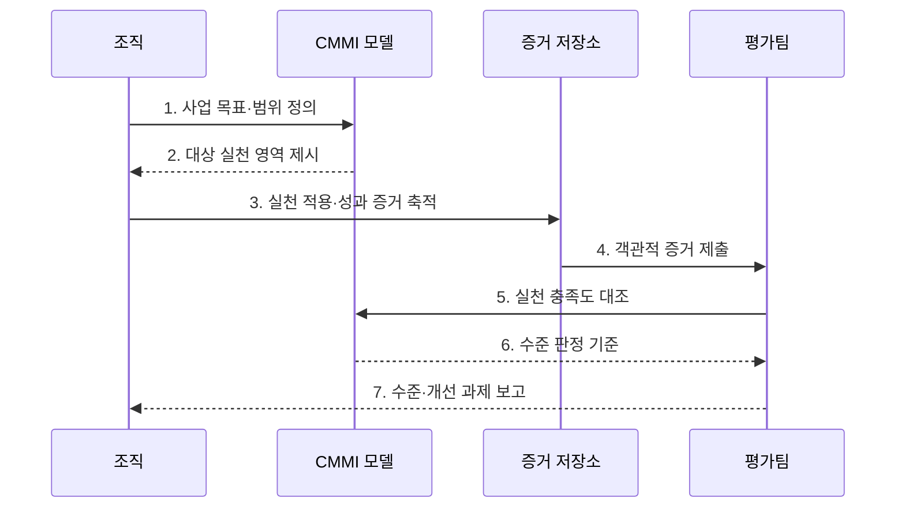

---
sidebar:
  order: 70
  label: "070. CMMI 성숙도 모델 (Capability Maturity Model Integration)"
  badge:
    text: "기출 · 50%"
    variant: note
title: "CMMI 성숙도 모델 (Capability Maturity Model Integration)"
date: "2026-07-27T23:59:59+09:00"
tags:
  - "notes-software"
weight: 70
extra:
  question_no: "070"
  source_status: "기출"
  source_history: "122회, 125회"
  priority: 50
  priority_note: "122·125회 반복, 프로세스 성숙도 평가"
---

## 미리 알고가기

- **CMMI V3.0(Capability Maturity Model Integration)**: 조직의 제품·서비스 프로세스 역량과 성과를 사업 목표에 맞춰 단계적으로 개선하는 현행 통합 모델
- **프로세스(Process)**: 활동·역할·입력·산출물을 정해 업무를 반복 수행하는 방식
- **실천 영역(Practice Area)**: 특정 역량을 달성하기 위한 관련 실천의 묶음
- **성숙도 수준(Maturity Level)**: 조직 전체의 실천 영역 집합을 0~5단계로 평가한 수준
- **능력도 수준(Capability Level)**: 개별 실천 영역의 수행 완전성을 0~3단계로 평가한 수준
- **평가(Appraisal)**: 객관적 증거를 CMMI 실천과 대조해 구현 상태를 판정하는 공식 활동
- **객관적 증거(Objective Evidence)**: 측정값·문서·업무 기록처럼 실천 수행을 확인할 수 있는 자료
- **벤치마크 평가(Benchmark Appraisal)**: 조직의 성숙도·능력도 수준을 공식 판정하는 평가
- **재단(Tailoring)**: 조직 표준 프로세스를 프로젝트의 규모·위험·업무 특성에 맞게 조정하는 활동

## Ⅰ. 개요

- 정의/개념: 조직 프로세스의 **역량을 진단·개선**하는 모델
- **배경/필요성**: 개인 의존 업무의 성과 편차와 재현성 개선

### 쉽게 이해하기 (학습용)

- 잘하는 개인에게 기대지 않고 조직이 같은 방식으로 성과를 내도록 업무 체계를 단계별로 개선한다.

## Ⅱ. 특징

- **실천 영역·수준 체계**로 개선 경로 제시
- **객관적 증거**로 실천 수행과 성과 평가
- 등급 획득보다 **사업 성과 개선**이 적용 목적

### 쉽게 이해하기 (학습용)

- 문서만 만드는 것이 아니라 실제 업무 기록과 측정값으로 개선 효과를 확인한다.

## Ⅲ. 구조 및 구성요소

| 구성요소 | 책임 |
|:---|:---|
| 사업 목표 | 품질·비용·납기의 개선 목표 정의 |
| 실천 영역 | 목표 달성에 필요한 실천 묶음 제공 |
| 객관적 증거 | 실천 수행의 측정값·기록 제시 |
| 평가 | 증거와 실천의 충족 여부 판정 |
| 개선 과제 | 수준 격차의 원인·조치 관리 |

### 쉽게 이해하기 (학습용)

- 사업 목표에 필요한 실천을 적용하고 기록으로 수준과 과제를 판단한다.

## Ⅳ. 흐름도

**동작 원리**

- **1. 사업 목표·범위 정의**: 개선 성과를 정한다.
- **2. 대상 실천 영역 제시**: 관련 영역과 수준을 고른다.
- **3. 실천 적용·성과 증거 축적**: 격차를 개선한다.
- **4. 객관적 증거 제출**: 측정값과 기록을 보낸다.
- **5. 실천 충족도 대조**: 모델 기준과 비교한다.
- **6. 수준 판정 기준**: 성숙도·능력도 기준을 제공한다.
- **7. 수준·개선 과제 보고**: 강점과 격차를 전달한다.

> 요약: 사업 목표에 맞는 실천을 적용하고 객관적 증거로 평가해 반복 개선한다.

### 쉽게 이해하기 (학습용)

- 목표와 현재 방식의 차이를 찾아 업무에 적용하고 결과 기록으로 다음 개선점을 정한다.

## Ⅴ. 종류 및 비교

| CMMI 평가 수준 | 성숙도 수준 | 능력도 수준 |
|:---|:---|:---|
| 적용 기준 | 조직 전체의 **통합 개선·비교** | 개별 영역의 **선택적 개선** |
| 핵심 특징 | 실천 영역 집합의 **0~5단계** | 개별 실천 영역의 **0~3단계** |
| 한계 | 등급 중심의 **형식화 위험** | 영역 간 **통합 최적화 부족** |

> 요약: 전사 개선은 성숙도 수준, 특정 실천 영역 개선은 능력도 수준으로 본다.

### 쉽게 이해하기 (학습용)

- 성숙도는 조직 전체 성적표이고 능력도는 특정 업무 영역의 과목별 성적표다.

## Ⅵ. 실무 고려사항 및 대책

| 고려사항 | 대책 | 효과 |
|:---|:---|:---|
| 등급 목표화 | 사업 목표와 실천 효과 직접 연결 | 형식보다 성과 중심 개선 |
| 증거 사후 작성 | 업무 도구에서 증거 자동 축적 | 실제 수행과 기록 일치 |
| 일률적 절차 | 위험·규모별 재단 기준 정의 | 과도한 통제 방지 |
| 범위 최적화 | 종단 흐름과 조직 간 지표 검토 | 연결 조직 병목 개선 |
| 수준 오해 | 목표에 필요한 수준까지만 개선 | 불필요한 고수준 투자 방지 |

> 적용 사례: 반복되는 배포 실패에 품질보증 실천을 적용하고 실패율 변화를 측정한다.

### 쉽게 이해하기 (학습용)

- 반복되는 배포 실패에 원인 분석과 검증 절차를 적용하고 실패율 변화를 측정한다.

## Ⅶ. 결론

- **사업 목표·개선 범위·증거 수준**에 따라 CMMI를 적용한다.

### 쉽게 이해하기 (학습용)

- 평가 등급보다 사업 성과가 실제로 좋아지는지를 기준으로 개선 범위와 수준을 선택한다.
