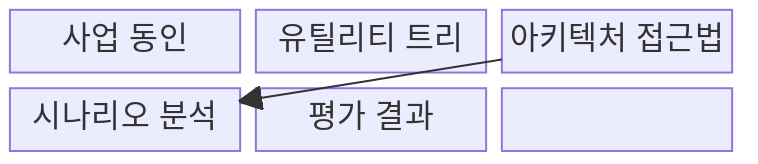
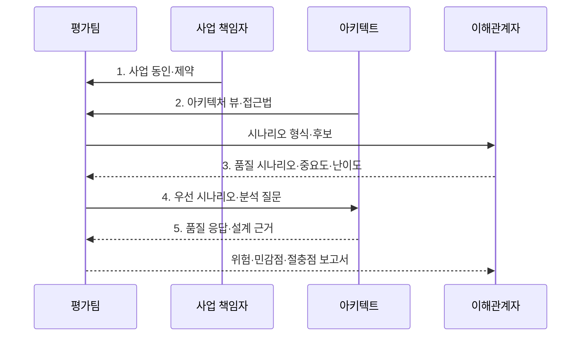

---
sidebar:
  order: 71
  label: "071. ATAM 아키텍처 트레이드오프 분석 방법 (Architecture Tradeoff Analysis Method)"
  badge:
    text: "기출 · 50%"
    variant: note
title: "ATAM 아키텍처 트레이드오프 분석 방법 (Architecture Tradeoff Analysis Method)"
date: "2026-08-02T23:11:00+09:00"
tags:
  - "notes-software"
weight: 71
extra:
  question_no: "071"
  source_status: "기출"
  source_history: "131회"
  priority: 50
  priority_note: "131회 기출, 품질속성 절충 분석 절차"
---

## Ⅰ. 개요

핵심 용어

- **아키텍처 트레이드오프 분석 방법(Architecture Tradeoff Analysis Method, ATAM)**: 품질 시나리오를 설계에 대입해 아키텍처의 위험·민감점·절충점을 찾는 평가 방법이다.
- **품질속성 충돌·영향 지점**: 하나의 설계 결정이 여러 품질에 상반된 결과를 만들거나 큰 영향을 주는 위치이다.

- 정의/개념: 품질속성 시나리오로 위험·민감점·절충점을 찾는 **아키텍처 평가 방법 ATAM**
- 배경/필요성: 단일 품질 중심 설계는 **품질속성 충돌·영향 지점 식별 불가**

#### 한줄 요약

- 건물을 짓기 전에 보안·속도·비용이 충돌하는 설계 지점을 실제 사용 상황으로 검토하는 방법이다.

## Ⅱ. 특징

핵심 용어

- **사업 동인·품질 시나리오**: 평가 우선순위를 정하는 사업 목표와 검증 가능한 품질 상황이다.
- **민감점·절충점·위험 주제**: 큰 품질 변화 지점, 품질 간 충돌 지점, 반복 위험의 공통 원인이다.

- **사업 동인·품질 시나리오**로 평가 우선순위 결정
- 이해관계자 참여로 **누락 요구·위험** 탐색
- **민감점·절충점·위험 주제**를 결과로 도출

#### 한줄 요약

- 중요한 사용 상황부터 설계에 대입해 작은 변화의 큰 영향과 품질 간 충돌을 찾는다.

## Ⅲ. 구조 및 구성요소

핵심 용어

- **유틸리티 트리(Utility Tree)**: 품질 목표를 시나리오로 세분하고 중요도·난이도로 순위화한 트리이다.
- **아키텍처 접근법(Architectural Approach)**: 품질 목표를 달성하기 위해 선택한 구조·전술과 근거이다.
- **품질 응답·측정값**: 자극에 대한 시스템 반응과 충족 여부를 판정하는 수치 기준이다.

| 구성요소 | 책임 |
|:---|:---|
| 사업 동인 | **목표·제약·품질 우선순위** 제시 |
| 유틸리티 트리 | 시나리오 **중요도·난이도** 순위화 |
| 아키텍처 접근법 | **구조·전술·설계 근거** 설명 |
| 시나리오 분석 | 접근법의 **품질 응답·측정값** 검토 |
| 평가 결과 | **민감점·절충점·위험 주제** 기록 |

#### 한줄 요약

- 사업 우선순위와 설계 접근법을 시나리오로 비교해 위험을 찾는다.

## Ⅳ. 흐름도

핵심 용어

- **품질 시나리오·중요도·난이도**: 분석할 상황과 사업 가치 및 구현·검증 어려움을 함께 나타낸 정보이다.
- **우선 시나리오·분석 질문**: 먼저 검토할 품질 상황과 설계 근거를 확인하는 질문이다.
- **품질 응답·설계 근거**: 설계가 품질 요구에 보이는 반응과 그 결과를 뒷받침하는 설명이다.

**동작 원리**

- **1. 사업 동인·제약**: 목표·제약·품질 우선순위를 평가팀에 제공
- **2. 아키텍처 뷰·접근법**: 구조·전술·설계 결정 근거 공유
- **3. 품질 시나리오·중요도·난이도**: 유틸리티 트리로 분석 대상 선택
- **4. 우선 시나리오·분석 질문**: 자극·환경·응답 측정값을 설계에 대입
- **5. 품질 응답·설계 근거**: 민감점·절충점과 반복 위험 도출

> 요약: 우선 품질 시나리오와 설계 접근법을 대조해 위험·민감점·절충점을 검색

#### 한줄 요약

- 중요한 상황을 먼저 검토하고 여러 상황에서 반복되는 위험을 묶어 개선 과제로 만든다.

## Ⅴ. 종류 및 비교

핵심 용어

- **ATAM(Architecture Tradeoff Analysis Method)**: 품질속성 시나리오로 아키텍처의 위험·민감점·절충점을 분석하는 방법이다.
- **동료 검토(Peer Review)**: 동료가 경험과 설계 근거로 국소 변경을 빠르게 검토하는 비정형 평가이다.

| 아키텍처 평가 방식 | ATAM | 비정형 아키텍처 검토 |
|:---|:---|:---|
| 적용 기준 | 품질속성 간 **절충 분석** | 국소 변경의 **빠른 동료 검토** |
| 핵심 특징 | 시나리오·접근법의 **근거 기반 평가** | 경험 중심의 **자유 형식 검토** |
| 한계 | 참여 비용·**정성 판단 편향** | 위험·절충점 **누락 가능성** |

> 요약: 품질 절충은 ATAM, 국소 변경은 동료 검토로 분석

#### 한줄 요약

- 여러 품질이 충돌하는 큰 결정은 ATAM으로 검토하고 작은 변경은 동료 검토로 빠르게 확인한다.

## Ⅵ. 실무 고려사항 및 대책

핵심 용어

- **시나리오 6요소·응답 측정값**: 자극원·자극·환경·대상·응답·측정값으로 품질 요구를 구체화한 형식이다.
- **독립 투표(Independent Voting)**: 다른 참여자의 선택을 보기 전에 각자 우선순위를 제출하는 방식이다.
- **책임자·기한·검증 조건**: 평가 위험을 실제 개선 과제로 실행하기 위한 백로그 관리 정보이다.

| 문제 | 대책 | 효과 |
|:---|:---|:---|
| 자극·환경·응답이 추상적이라 설계 충족 판정 불가 | **시나리오 6요소·응답 측정값** 구체화 | **설계 판정 가능성** 확보 |
| 특정 이해관계자 관점만 반영해 운영 위험 누락 | **사업·운영·보안·사용자** 균형 참여 | **관점별 위험 누락** 방지 |
| 구조·전술의 선택 근거가 없어 품질 영향 설명 불가 | **구조·전술·근거·가정** 준비 | **품질 영향 인과관계** 확인 |
| 발언권이 큰 참여자가 시나리오 우선순위 왜곡 | **독립 투표·판단 근거** 기록 | **우선순위 편향** 감소 |
| 평가 위험에 책임자·기한이 없어 조치 미이행 | **책임자·기한·검증 조건**을 백로그 연결 | **위험 조치 실행력** 확보 |

> 적용 사례: 금융 복제 구조에서 복제 수가 쓰기 성능과 가용성에 미치는 절충을 분석

#### 한줄 요약

- 복제 수를 늘릴 때 장애 대응은 좋아지지만 쓰기 지연이 커지는 지점을 분석한다.

## Ⅶ. 결론

핵심 용어

- **ATAM**: 품질 충돌과 위험 영향이 큰 아키텍처 결정을 시나리오로 평가하는 방법이다.
- **동료 검토**: 영향이 제한된 국소 변경을 동료의 경험과 근거로 확인하는 방법이다.

- 품질 충돌·위험 영향이 큰 결정은 **ATAM**, 국소 변경은 **동료 검토**

#### 한줄 요약

- 품질 간 충돌이 큰 설계일수록 이해관계자 시나리오로 위험과 절충 근거를 남긴다.
